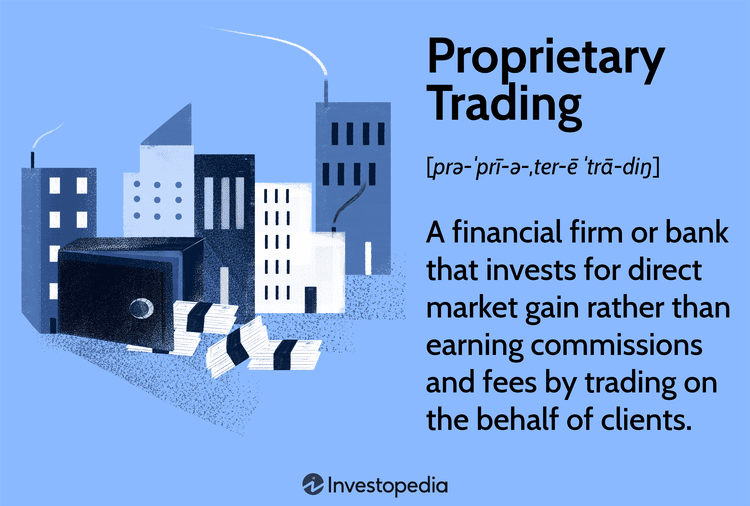

In financial markets, trading mechanisms have evolved significantly, with proprietary and algorithmic trading taking center stage. These innovative approaches have transformed how trading is conducted, capitalizing on technological advancements and the availability of vast amounts of data. Proprietary trading involves financial institutions using their own capital to trade, aiming for direct market gains rather than relying on client commissions. On the other hand, algorithmic trading uses computer algorithms to execute trades automatically based on pre-determined criteria, allowing for high-speed transactions across diverse markets with precision and minimal human error.

The synergies between proprietary and algorithmic trading have led to a new era where firms can enhance their trading efficiency and profitability. By leveraging these methods, trading firms are able to exploit fleeting market opportunities that may arise due to fluctuations and anomalies, often operating at speeds that are simply unattainable through human trading alone. The integration of algorithms within proprietary trading frameworks allows for sophisticated strategies that harness both quantitative analysis and technological precision, continuously scanning markets for optimal trading conditions and executing trades with unprecedented accuracy.



Understanding these trading mechanisms is crucial for financial institutions and individual traders aiming to optimize their investment strategies. As the financial landscape continues to evolve, keeping pace with these advancements is not only beneficial but necessary to maintain a competitive edge. The expertise gained from effectively employing proprietary and algorithmic trading can significantly enhance trading performance, offering increased efficiency, higher profitability, and better market positioning. As technological innovation continues to drive financial markets forward, the role of these trading strategies is set to grow in significance, making them indispensable tools for those seeking success in the market.

## Table of Contents

## Understanding Proprietary Trading

Proprietary trading, often referred to as prop trading, is a financial practice where institutions use their own capital to trade various financial instruments with the primary objective of generating direct profits from market movements. Unlike traditional trading, where firms act as intermediaries facilitating client transactions for a fee, prop trading focuses on achieving capital gains by taking positions in the market for the institution's benefit.

The core advantage of proprietary trading lies in the alignment of incentives: the financial institution retains 100% of the profits from successful trades. This contrasts with client-based trading, where earnings are predominantly from commissions, leading to potentially smaller margins. To optimize returns from prop trading, firms establish autonomous trading desks dedicated to implementing sophisticated strategies for market exploitation.

These prop trading desks employ a range of strategies, leveraging advanced mathematical models, quantitative analysis, and significant market insight. One common approach involves [statistical arbitrage](/wiki/statistical-arbitrage), where traders exploit price differentials among correlated securities. Another strategy is [market making](/wiki/market-making), wherein firms provide liquidity by quoting both buy and sell prices, thus benefiting from bid-ask spreads.

For a comprehensive understanding of prop trading, it is crucial to recognize the complexity and dynamism involved in these activities. Traders must constantly analyze market data and trends to identify profitable opportunities. Moreover, the adoption of technology is integral, enabling rapid analysis and execution to capitalize on fleeting market opportunities.

In operational terms, proprietary trading requires significant resources including robust infrastructure, access to capital, and skilled personnel capable of navigating volatile market conditions. By retaining a high degree of control over their trading activities, firms are well-positioned to respond to abrupt market fluctuations, adjust strategies accordingly, and optimize their risk-return profiles.

Overall, proprietary trading presents distinct advantages by allowing firms to directly capitalize on market movements while maintaining flexibility in financial strategy. These activities not only offer potential for higher profitability but also contribute positively to market dynamics by enhancing [liquidity](/wiki/liquidity-risk-premium) and efficiency.

## Benefits of Proprietary Trading

Proprietary trading allows financial firms to retain 100% of the profits generated from trades executed using the firm’s own capital. This distinct advantage is in contrast to trading on behalf of clients, where profits are typically derived from commissions or fees. By utilizing their own capital, firms can directly benefit from successful trades, thereby potentially increasing profitability.

One significant benefit of proprietary trading is the ability to build and maintain securities inventories. By holding inventories, firms can strategically position themselves to take advantage of market disruptions or sudden changes in asset prices. This capability allows firms to act swiftly to leverage short-term opportunities, such as [arbitrage](/wiki/arbitrage), and to manage risk more effectively.

Prop trading firms often function as market makers, which is another distinct advantage. By providing liquidity to the markets, they facilitate smoother transactions and help maintain price stability. This liquidity provision is beneficial not only for the firm itself by creating consistent trading opportunities but also for the market as a whole, by reducing bid-ask spreads and enhancing market efficiency.

The inherent flexibility in trading strategies and instruments enables proprietary trading firms to explore multiple avenues for profit generation. Unlike the constraints faced when handling client funds, proprietary traders can exploit diverse trading strategies including, but not limited to, option strategies, high-frequency trading, and [algorithmic trading](/wiki/algorithmic-trading). These strategies can be tailored to the firm's specific risk appetite and market outlook, allowing for a more dynamic approach to trading.

In summary, proprietary trading offers financial firms substantial benefits by allowing them to retain all trading profits, manage strategic inventories, contribute market liquidity, and utilize a broad spectrum of trading strategies. These advantages collectively provide a competitive edge in dynamic financial markets.

## Algorithmic Trading Explained

Algorithmic trading, or algo trading, leverages computer algorithms to execute trades automatically based on pre-defined criteria. This method of trading is instrumental in processing transactions at rapid speeds across various markets, thereby minimizing human error and bias. By implementing predetermined rules, algorithms can analyze market variables and execute buy or sell orders seamlessly, reacting almost instantaneously to market conditions.

The strategies employed in algorithmic trading are diverse, each tailored to exploit specific market patterns or discrepancies. One common strategy is [trend following](/wiki/trend-following), which identifies and capitalizes on long-term market trends. This strategy involves algorithms monitoring trends through indicators like moving averages and [momentum](/wiki/momentum) oscillators, automatically initiating trades as trends develop. 

Statistical arbitrage is another key strategy, exploiting price divergences between correlated securities. This involves advanced statistical models to identify temporary price inefficiencies and executing offsetting trades aiming for reversion to the mean. Mean reversion strategies operate on the principle that asset prices will revert to their historical average over time. When prices deviate significantly from the mean, algorithms trigger trades anticipating a return to average levels.

Quantitative analysis is the backbone of these sophisticated algorithms, employing complex mathematical models to predict and strategize trades. Techniques such as regression analysis and [machine learning](/wiki/machine-learning) enable the development of predictive models, taking into account historical price data, economic indicators, and trading volumes. Technical indicators such as the relative strength index (RSI), moving average convergence divergence (MACD), and Bollinger Bands are commonly integrated into algorithms to refine decision-making processes.

For instance, a simple moving average crossover strategy could be implemented in Python as follows:

```python
import pandas as pd

# Fetching historical data for a stock
data = pd.read_csv('stock_data.csv')
data['Short_MA'] = data['Close'].rolling(window=40).mean()
data['Long_MA'] = data['Close'].rolling(window=100).mean()

# Generating buy/sell signals
data['Signal'] = 0
data['Signal'][40:] = np.where(data['Short_MA'][40:] > data['Long_MA'][40:], 1, 0)
data['Position'] = data['Signal'].diff()

# Buy/Sell logic
buy_signals = data[data['Position'] == 1]
sell_signals = data[data['Position'] == -1]
```

This code examines a stock’s historical closing prices, calculates short-term and long-term moving averages, and generates buy or sell signals based on the crossover of these averages.

The core of algorithmic trading lies in its capability to operate free from human intervention, thereby ensuring consistency and precision in trades. By systematically integrating quantitative analysis and technical indicators, algorithmic trading provides a scalable and efficient approach to managing complex trading tasks, fostering a proactive response to the ever-evolving dynamics of financial markets.

## The Integration of Algorithmic and Proprietary Trading

Proprietary trading firms are increasingly integrating algorithmic trading strategies to augment their trading operations. This integration leverages the speed and precision of algorithms, which are crucial in capturing transient market opportunities. Algorithms can be designed to analyze vast amounts of data in real-time, execute trades automatically, and adjust trading strategies as market conditions change, thereby enhancing the overall trading performance of proprietary trading firms.

The automation provided by algorithmic trading allows trades to be executed at speeds and accuracies beyond human capabilities. For instance, high-frequency trading ([HFT](/wiki/high-frequency-trading-strategies)) algorithms can process trades in microseconds, capitalizing on very short-term market inefficiencies. This capability is vital for seizing fleeting opportunities that might be lost in the time it takes for manual execution. Moreover, algorithmic trading minimizes human error, which can be a significant [factor](/wiki/factor-investing) in fast-paced trading environments.

Incorporating algorithmic strategies also enhances risk management and compliance within proprietary trading. Algorithms can be programmed to adhere strictly to risk management protocols, such as position sizing and stop-loss orders, ensuring that trades remain within predefined risk parameters. Additionally, they can be updated to rapidly respond to new regulatory requirements, ensuring ongoing compliance in a complex legal landscape.

The integration of algorithmic trading within proprietary trading setups exemplifies a synergy of human expertise with technological precision. Human traders, with their market intuition and strategic thinking, collaborate with algorithms that provide data-driven insights and execution capabilities. This relationship can be structured around a feedback loop where humans set the strategic trading goals and the algorithms execute them, providing analytics that inform future human decision-making processes.

The integration of proprietary and algorithmic trading is not without challenges. Firms must invest in robust technological infrastructures to support high-speed trading and manage the vast amounts of data required by complex algorithms. Furthermore, maintaining an agile framework that combines algorithmic precision with human oversight is critical, preventing over-reliance on automated systems that might not adapt quickly to unforeseen market changes.

In summary, the convergence of proprietary and algorithmic trading offers a compelling approach to modern financial trading. By harnessing the speed and precision of algorithms alongside human strategic input, trading firms can achieve superior trading outcomes and remain competitive in the ever-evolving financial markets.

## Challenges in Proprietary and Algorithmic Trading

Proprietary and algorithmic trading are increasingly critical components of modern financial markets, yet they face several inherent challenges that necessitate careful management and strategic planning. A primary challenge is regulatory compliance, as financial institutions must navigate complex and evolving regulations that vary by jurisdiction. For instance, both the U.S. Securities and Exchange Commission (SEC) and the European Securities and Markets Authority (ESMA) have stringent rules aimed at ensuring market integrity and protecting investors. Firms engaged in proprietary trading must maintain compliance with these rules, which can involve significant time and resource expenditure.

Another significant challenge is the technological infrastructure required to support sophisticated trading strategies. High-frequency trading, in particular, demands state-of-the-art technology capable of executing trades in microseconds. Financial firms must invest in advanced computing systems, robust network infrastructure, and real-time data analytics to remain competitive. The cost and complexity of maintaining this infrastructure can be prohibitive, especially for smaller trading entities.

Market [volatility](/wiki/volatility-trading-strategies) presents additional difficulties, as both proprietary and algorithmic trading strategies must adapt quickly to fluctuating conditions. Algorithmic systems, while efficient, can sometimes fail to respond optimally to unforeseen events, leading to substantial financial risks. For instance, during flash crashes—sudden market downturns—algorithms might exacerbate sell-offs, amplifying volatility instead of mitigating it.

Over-reliance on algorithms can pose risks, as well. Algorithms are typically based on historical data and predefined parameters and may struggle with unprecedented market events that fall outside their programmed scope. Hence, human oversight remains crucial. Traders must continuously monitor algorithmic performance and intervene when anomalies occur, ensuring that decisions are not solely based on automated systems.

To manage these challenges, proprietary desks must strike a balance between leveraging algorithmic efficiency and preserving agile, informed human oversight. This balance is essential for sustainable and ethical trading practices. Traders and financial analysts must be adept at interpreting algorithmic outputs and adjusting strategies as market conditions evolve.

Addressing these issues requires a multidisciplinary approach that encompasses technological upgrades, continuous education and training for traders, and adherence to regulatory standards. By tackling these challenges head-on, trading firms can maintain robust, ethical operations while maximizing profitability in a tech-driven landscape.

## Conclusion

Proprietary and algorithmic trading offer substantial benefits to financial firms, primarily by enhancing efficiency and driving higher profitability. Proprietary trading, utilizing a firm's own capital, allows it to capture total profits from market engagements without dividing gains with clients, thus maximizing revenue. Similarly, algorithmic trading elevates market positioning by executing trades at rapid speeds and with superior accuracy, removing emotional biases and minimizing human errors.

As global financial markets continue to advance technologically, the importance of these trading mechanisms is expected to increase. The sophisticated use of data analytics and algorithm-based strategies fosters a more dynamic and adaptable trading environment. Firms that strategically integrate proprietary and algorithmic trading are more likely to seize fleeting market opportunities, leverage vast datasets for predictive insights, and navigate market fluctuations with resilient systems.

These dual trading strategies enable firms to maintain liquidity, act as effective market makers, and harness diverse financial instruments, thereby reinforcing their competitive edge. By mastering the intricate balance between automated processes and strategic human oversight, firms not only ensure compliance and risk management but also align with ethical trading practices.

In conclusion, proficiency in both proprietary and algorithmic trading translates into robust trading performance and lucrative investment outcomes. Financial entities that focus on understanding and refining these methods will bolster their market leadership, adapt to evolving market demands, and achieve sustained success in the competitive landscape of modern finance.

## References & Further Reading

[1]: Bergstra, J., Bardenet, R., Bengio, Y., & Kégl, B. (2011). ["Algorithms for Hyper-Parameter Optimization."](https://papers.nips.cc/paper/4443-algorithms-for-hyper-parameter-optimization) Advances in Neural Information Processing Systems 24.

[2]: ["Advances in Financial Machine Learning"](https://www.amazon.com/Advances-Financial-Machine-Learning-Marcos/dp/1119482089) by Marcos Lopez de Prado

[3]: ["Evidence-Based Technical Analysis: Applying the Scientific Method and Statistical Inference to Trading Signals"](https://www.amazon.com/Evidence-Based-Technical-Analysis-Scientific-Statistical/dp/0470008741) by David Aronson

[4]: ["Machine Learning for Algorithmic Trading"](https://github.com/stefan-jansen/machine-learning-for-trading) by Stefan Jansen

[5]: ["Quantitative Trading: How to Build Your Own Algorithmic Trading Business"](https://www.amazon.com/Quantitative-Trading-Build-Algorithmic-Business/dp/1119800064) by Ernest P. Chan