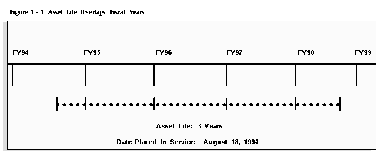

## Table of Contents

## What is proration and why is it important in accounting?

Proration is a way to divide costs or payments fairly over a period of time. Imagine you start a new job in the middle of the month. Instead of paying the full month's rent for your new apartment, you would only pay for the days you actually lived there. That's proration. It makes sure that people only pay for what they use or receive, which is fair.

In accounting, proration is important because it helps businesses keep their financial records accurate. If a company buys a yearly insurance policy halfway through the year, they would prorate the cost to reflect only the remaining months. This helps the company match expenses with the time period they relate to, which is crucial for understanding the true financial health of the business. Without proration, financial statements could be misleading, showing expenses in the wrong periods and making it hard to make good business decisions.

## How does proration affect the calculation of asset depreciation?

Proration affects the calculation of asset depreciation by spreading the cost of an asset over its useful life in a fair way. When a business buys an asset, like a machine, they can't just write off the entire cost right away. Instead, they have to spread that cost over the time they expect to use the machine. If they buy the machine partway through their financial year, proration helps them figure out how much depreciation to claim for that first year. They only claim depreciation for the months the machine was actually in use, making sure the expense matches the time it was used.

This is important because it keeps the financial statements accurate. If a company didn't use proration and just claimed a full year's worth of depreciation even though they only used the machine for half a year, their expenses would look higher than they really are. This could make the company look less profitable than it actually is. By using proration, the company can show a true picture of its financial health, which is crucial for making good business decisions and for keeping investors and creditors informed.

## What are the common methods used for prorating assets?

There are a few common ways to prorate assets, and they all aim to spread the cost of an asset over its useful life in a fair way. One method is the straight-line method. This is simple and straightforward. You take the total cost of the asset and divide it by the number of years you expect to use it. If you buy a machine for $12,000 and expect to use it for 4 years, you would claim $3,000 in depreciation each year. If you buy the machine halfway through the year, you would only claim $1,500 for that first year because you only used it for half the year.

Another method is the declining balance method. This method lets you claim more depreciation in the early years of the asset's life and less as it gets older. It's like saying the machine loses more value when it's new. You start with a fixed rate, like 20%, and apply it to the remaining value of the asset each year. If you buy a $12,000 machine and use a 20% rate, you would claim $2,400 in the first year. If you bought it halfway through the year, you would prorate that to $1,200 for the first year. This method can be more complex but might better match how some assets lose value over time.

The units of production method is another way to prorate assets. This method ties depreciation to how much you actually use the asset. If you have a machine that you expect to make 100,000 units over its life, and it cost $12,000, you would claim $0.12 in depreciation for each unit produced. If you produce 10,000 units in the first year, you would claim $1,200 in depreciation. If you start using the machine halfway through the year, you would prorate based on the units produced in that time. This method can be very fair because it directly links the cost to the use of the asset.

## Can you explain the straight-line method of depreciation and how proration applies to it?

The straight-line method of depreciation is a simple way to spread the cost of an asset over its useful life. Imagine you buy a machine for $12,000 and you expect to use it for 4 years. With the straight-line method, you would divide the total cost by the number of years. So, you would claim $3,000 in depreciation each year. It's like paying off the cost of the machine a little bit at a time, evenly over the years you use it.

Proration comes into play if you buy the machine partway through your financial year. Let's say you buy it halfway through the year. Instead of claiming the full $3,000 for that first year, you would only claim $1,500 because you only used the machine for half the year. This makes sure your expenses match the time you actually used the machine. By prorating the depreciation, you keep your financial statements accurate and fair.

## What is the difference between proration and amortization?

Proration and amortization are two different ways to spread costs over time, but they are used for different things. Proration is about dividing a cost fairly over a period of time. Imagine you start a new job halfway through the month. You would only pay rent for the days you actually lived in your new place, not the whole month. That's proration. It's used when you want to make sure you're only paying for what you use, like when you buy insurance or a subscription partway through the year.

Amortization, on the other hand, is used to spread the cost of something that doesn't wear out physically, like a patent or a loan. If you take out a loan, you pay it back a little bit at a time over the life of the loan. That's amortization. It helps you see how much of the loan you're paying off each month and how much interest you're paying. Amortization is important for things like intangible assets, where the value goes down over time but not because they're being used up like a machine would be.

## How do tax regulations influence the proration of assets?

Tax regulations can have a big say in how businesses prorate their assets. Different countries have different rules about how much you can claim for depreciation each year. For example, some places let you claim more in the early years of an asset's life, while others might want you to spread it out evenly. These rules are important because they can affect how much tax a business has to pay. If the tax laws say you can claim more depreciation in the first year, it means you can lower your taxable income more in that year, which could save you money on taxes.

Businesses have to follow these tax rules carefully. If they don't prorate their assets the right way, they could end up paying too much or too little in taxes, which could get them into trouble. Sometimes, tax laws might even let businesses use different methods for their tax returns than they do for their financial statements. This can make things a bit complicated, but it's all about following the rules to make sure everything is fair and legal.

## What are the implications of choosing different proration conventions like half-year or mid-quarter?

Choosing different proration conventions, like half-year or mid-quarter, can change how much depreciation a business can claim in a year. With the half-year convention, you treat an asset as if you bought it halfway through the year, no matter when you actually got it. This means you can only claim half a year's worth of depreciation in the first year. The mid-quarter convention is used when a lot of your assets are bought in the last three months of the year. It makes you prorate based on the exact quarter you bought the asset, which can be more accurate but also more complicated.

These conventions matter because they affect how much tax a business has to pay. If you use the half-year convention, you might have to wait longer to claim the full value of your asset, which means you might pay more taxes in the early years. On the other hand, the mid-quarter convention might let you claim more depreciation right away if you bought a lot of stuff near the end of the year, which could lower your taxes in that year. Businesses need to pick the right convention to make sure they're following the tax rules and managing their money well.

## How does proration impact financial reporting and what are the disclosure requirements?

Proration impacts financial reporting by making sure that expenses are spread out correctly over time. When a business buys something like a machine or pays for a service that lasts a while, they don't count the whole cost right away. Instead, they prorate it, which means they spread the cost over the time they use it. This makes their financial reports more accurate because it shows the real cost of running the business each period. If they didn't prorate, their expenses might look too high or too low in certain months or years, which could confuse people looking at their financial statements.

When it comes to disclosure requirements, businesses need to tell people how they prorate their costs. This means they have to explain in their financial reports which method they used, like straight-line or declining balance, and how they figured out the numbers. This is important because it helps investors, creditors, and others understand the financial health of the business. By being clear about how they prorate, businesses can show they are following the rules and being honest about their finances.

## Can you discuss the impact of proration on cash flow and budgeting within a business?

Proration affects cash flow and budgeting by making sure businesses only count the costs of things like machines or services when they actually use them. If a company buys a big machine halfway through the year, they don't have to pay for the whole year's use right away. Instead, they spread the cost over the time they use it. This helps them plan their cash flow better because they can see more clearly how much money they need each month. It makes budgeting easier because they can match their spending to their income more accurately.

For example, if a business knows they only need to account for half a year's worth of depreciation on a new machine, they can set aside less money for that expense in the first year. This can free up cash for other things like buying supplies or hiring more workers. By prorating costs, businesses can make sure they have enough money to cover their expenses without having too much sitting idle. It helps them keep their cash flow smooth and their budgets realistic, which is key to running a successful business.

## What are the advanced techniques for optimizing proration and depreciation strategies?

One advanced technique for optimizing proration and depreciation strategies is to use different methods for different types of assets. For example, a business might use the straight-line method for office furniture, which loses value evenly over time, but use the declining balance method for computers, which lose a lot of value quickly when they're new. By choosing the right method for each asset, a business can make sure their financial statements show the true value of their assets more accurately. This can help them save money on taxes by claiming more depreciation in the early years for assets that lose value fast, while spreading out the cost more evenly for assets that last longer.

Another technique is to use software to track and calculate depreciation. This can make the process a lot easier and less likely to have mistakes. Good software can handle different depreciation methods and proration conventions automatically, so businesses don't have to do it all by hand. It can also help them plan for the future by showing how their depreciation expenses will change over time. This can be really helpful for budgeting and making sure they have enough money to cover their costs. By using software, businesses can make smarter decisions about when to buy new assets and how to manage their money better.

## How do international accounting standards affect the proration and depreciation of assets?

International accounting standards, like those set by the International Accounting Standards Board (IASB), have rules that businesses must follow when they prorate and depreciate their assets. These rules make sure that companies all over the world do things the same way, so it's easier for people to understand and compare their financial statements. For example, the IASB's International Financial Reporting Standards (IFRS) say that businesses should spread the cost of an asset over its useful life in a way that shows how they use it. This means if a company buys a machine, they have to figure out how long they'll use it and then prorate the cost over that time. The standards also give rules on how to pick the right method for prorating, like straight-line or declining balance, based on what makes the most sense for each asset.

These international standards can affect how much tax a business has to pay because different countries might have different rules for taxes. If a business follows IFRS, they might be able to claim more depreciation in the early years of an asset's life, which could lower their taxes then. But they need to make sure they're following both the international standards and their local tax laws. This can be tricky because sometimes the rules don't match up perfectly. By following these standards, businesses can show that they're being fair and honest about their finances, which is important for keeping trust with investors and others who look at their financial reports.

## What software tools are available to assist with the calculation and management of proration and asset depreciation?

There are many software tools that can help businesses with proration and asset depreciation. One popular tool is QuickBooks. QuickBooks makes it easy to track the cost of assets and figure out how much to claim for depreciation each year. It can use different methods like straight-line or declining balance and can prorate costs based on when you bought the asset. Another tool is Sage Fixed Assets, which is good for managing a lot of assets. It can handle different depreciation methods and proration conventions, and it can also help with planning by showing how depreciation will affect your finances in the future.

Another useful software is Microsoft Dynamics 365. This tool is part of a bigger system that helps with all kinds of business tasks, including managing assets. It can track when you buy assets, how long you'll use them, and how much to claim for depreciation each year. It's great for big businesses that need to keep track of a lot of different things. Lastly, there's Xero, which is a cloud-based tool that's easy to use and good for small businesses. Xero can handle proration and depreciation, and because it's online, you can access it from anywhere and share it with your team or your accountant.

## What is Understanding Asset Depreciation?

Asset depreciation represents a systematic approach to allocating the cost of tangible assets over their useful life. This financial mechanism ensures that the expense of an asset is matched with the revenue it helps generate, reflecting a more accurate financial picture. The rationale behind depreciation is rooted in the concept of accrual accounting, which recognizes financial events in the periods in which they occur rather than when cash transactions happen. 

The allocation of an asset's cost is undertaken through several methods, each suited to different types of assets and usage patterns. These methods aim to reflect how an asset’s value and utility diminish over time, which can vary significantly depending on the nature and use of the asset. 

Straight-Line Depreciation, the most commonly used method, involves dividing the difference between the asset's original cost and its residual value equally over its useful life. This method assumes a constant rate of usage and thus distributes the depreciation evenly across periods. Mathematically, this can be expressed as:

$$
\text{Depreciation Expense} = \frac{\text{Cost} - \text{Residual Value}}{\text{Useful Life}}
$$

Different scenarios necessitate alternative methods, such as the Double Declining Balance method, which accelerates depreciation in the early years of an asset's life. This reflects the higher utility or productivity of assets in their initial years. On the other hand, the Sum of Years Digits method also accelerates depreciation but does so based on decreasing usage over time, dividing depreciation costs more heavily to earlier periods.

Moreover, for assets whose depreciation correlates more directly with usage, such as machinery or vehicles, the Units of Production method is applied. This ties the depreciation directly to the output or use level, offering a more precise allocation of costs. 

Expressed in Python, a simple calculation for straight-line depreciation might look like:

```python
def calculate_straight_line_depreciation(cost, residual_value, useful_life):
    return (cost - residual_value) / useful_life

# Example usage
cost = 10000
residual_value = 1000
useful_life = 5
depreciation_expense = calculate_straight_line_depreciation(cost, residual_value, useful_life)
print(depreciation_expense)
```

Depreciation not only helps in financial reporting and compliance but plays a crucial role in asset management, maintenance scheduling, and the strategic planning of asset acquisition and disposal. Understanding these various methods of depreciation is vital for aligning financial strategies with organizational goals, thereby influencing both accounting practices and investment decisions.

## What are the various depreciation methods?

Asset depreciation is a critical accounting concept used to allocate the cost of tangible assets over their useful life. Different methods of depreciation offer varied approaches to how this cost is allocated, reflecting differing usage patterns and expectations for asset utility. Understanding these methods is essential for aligning financial reporting with actual asset performance and for informing investment strategies, including [algorithmic trading](/wiki/algorithmic-trading) models.

The **Straight-Line Method** is the most straightforward and frequently used technique. It divides the asset's cost evenly across its useful life, assuming an equal benefit from the asset each year. The annual depreciation expense is calculated using the formula:

$$
\text{Annual Depreciation Expense} = \frac{\text{Cost of Asset} - \text{Salvage Value}}{\text{Useful Life of Asset}}
$$

For example, an asset costing $10,000 with a salvage value of $2,000 and a useful life of 8 years would have an annual depreciation expense of $1,000.

The **Double Declining Balance Method** is a form of accelerated depreciation, meaning it recognizes a higher expense in the earlier years of the asset's life. This method is beneficial for assets that lose value quickly after initial use. Depreciation is calculated by doubling the straight-line rate and then applying it to the book value at the beginning of each year:

$$
\text{Annual Depreciation Expense} = \left(\frac{2}{\text{Useful Life of Asset}}\right) \times \text{Book Value at Beginning of Year}
$$

This approach results in larger depreciation charges in the initial years and smaller charges as the asset ages.

The **Sum of Years Digits Method** is another accelerated depreciation technique that results in higher expenses earlier in the asset's life. It uses a fraction based on the sum of the years of the asset's useful life to multiply the depreciable amount. The formula involves calculating a fraction for each year:

$$
\text{Annual Depreciation Expense} = \frac{\text{Remaining Life}}{\text{Sum of the Years Digits}} \times (\text{Cost of Asset} - \text{Salvage Value})
$$

where the denominator, "Sum of the Years Digits", is calculated as:

$$
\text{Sum of the Years Digits} = n(n+1)/2
$$

Here $n$ represents the number of years in the asset's useful life.

The **Units of Production Method** ties depreciation to the actual usage or output of an asset, making it suitable for manufacturing equipment or vehicles. This method determines depreciation based on the asset's productive output, calculated as:

$$
\text{Depreciation Expense} = \left(\frac{\text{Cost of Asset} - \text{Salvage Value}}{\text{Total Estimated Production}}\right) \times \text{Units Produced in Period}
$$

This usage-based approach helps align the expense with the economic benefits derived from the asset in each accounting period.

These various methods allow companies to choose appropriate depreciation schedules that match their financial strategies and asset usage patterns. Each method has distinct impacts on financial statements and tax liabilities, making the choice of depreciation method an important strategic decision.

## What is Proration in Depreciation?

Proration in depreciation is a process used to allocate an appropriate portion of an asset's depreciation expense for a period shorter than a full year. This is particularly relevant when an asset is acquired or disposed of at any point other than the start or end of the fiscal year. Proration provides a more precise reflection of an asset's usage, ensuring that financial records accurately correspond to the period during which the asset was actually in service.

Complex calculations are often necessary for proration, especially during the initial and final years of an asset's life. When an asset is acquired partway through a fiscal year, its depreciation calculation needs to reflect only the months it was in use. For example, if a company purchases an asset in April, only nine months of depreciation should be recorded for that fiscal year.

### Example Calculation

Assume an asset was purchased on April 1 with a total cost of $10,000, a useful life of 10 years, and the company uses the straight-line method of depreciation. Normally, the annual depreciation expense would be:

$$
\text{Annual Depreciation} = \frac{\text{Cost of Asset}}{\text{Useful Life}} = \frac{10,000}{10} = 1,000
$$

However, since the asset was in use for only nine months of the first year, the prorated depreciation would be:

$$
\text{Prorated Depreciation} = \text{Annual Depreciation} \times \frac{\text{Number of Months in Use}}{12} = 1,000 \times \frac{9}{12} = 750
$$

This reflects the precise period the asset contributed to operations, thus aligning the expense with actual usage.

### Software Implementation

For larger datasets and numerous assets, calculating prorated depreciation can be efficiently managed using programming languages like Python. Below is a basic Python function for calculating prorated depreciation using the straight-line method:

```python
def calculate_prorated_depreciation(cost, useful_life, months_in_use):
    annual_depreciation = cost / useful_life
    prorated_depreciation = annual_depreciation * (months_in_use / 12)
    return prorated_depreciation

# Example usage
asset_cost = 10000
asset_life = 10
months_used = 9

prorated_depreciation = calculate_prorated_depreciation(asset_cost, asset_life, months_used)
print(f"Prorated Depreciation: ${prorated_depreciation}")
```

This approach not only simplifies complex manual calculations but also enhances the accuracy of financial reporting for companies with extensive asset bases. By ensuring that depreciation expenses match the period of asset utilization, proration supports more consistent and reliable financial analyses, critical for both accounting purposes and integration into algorithmic trading strategies.

## What are the real-world applications of depreciation methods?

In practical business settings, depreciation methods are employed based on the characteristics of the asset types and the strategic goals of an organization. Companies assess the pattern of economic benefits associated with their assets to select the most suitable depreciation method, ensuring that their financial reporting aligns with business objectives and provides internal management insights.

Consider a manufacturing firm that has acquired a piece of machinery with a significant upfront cost. The management may opt for the **Straight-Line method** for its simplicity and the predictable depreciation charges it provides annually. This method calculates depreciation by distributing the asset’s initial cost evenly over its useful life. The formula used is:

$$
\text{Depreciation Expense} = \frac{\text{Cost} - \text{Salvage Value}}{\text{Useful Life}}
$$

This method is advantageous when the machinery is expected to produce a consistent output over the years, ensuring that expenses are spread uniformly.

In contrast, a technology company investing in servers or computers might utilize the **Double Declining Balance method**. This approach accelerates depreciation, allowing more expense to be recognized in the initial years of the asset’s life, reflecting the rapid obsolescence typically associated with tech assets. The formula applied is:

$$
\text{Depreciation Expense} = 2 \times \frac{\text{Book Value at Beginning of Year}}{\text{Useful Life}}
$$

This accelerated depreciation approach can provide tax benefits by lowering taxable income in the early years, which may be crucial for companies aiming to reinvest savings back into innovation and development.

A transport company relying on vehicles could adopt the **Units of Production method**, which ties depreciation to actual usage—often measured in miles driven or hours operated. This method aligns the expense with how much the asset contributes to revenue, using the formula:

$$
\text{Depreciation Expense} = \left( \frac{\text{Number of Units Produced}}{\text{Total Estimated Production}} \right) \times (\text{Cost} - \text{Salvage Value})
$$

This calculation provides a more accurate representation of the asset’s wear and tear, aligning costs with benefits generated.

Each scenario underscores the importance of matching the depreciation method to the type of asset and its usage pattern. By selecting an appropriate method, businesses can ensure coherent financial statements that accurately reflect their operational realities and strategic imperatives. Moreover, tailoring depreciation approaches is crucial for managing cash flows, optimizing tax liabilities, and providing reliable data for stakeholders in financial decision-making processes.

## What is the impact of depreciation in algorithmic trading models according to the case study?

A quantitative [hedge fund](/wiki/hedge-fund-trading-strategies) recently optimized its algorithmic trading models by integrating detailed asset depreciation data. Recognizing that asset values decline over time, the fund adjusted its valuation models to account for depreciation, thereby enhancing the accuracy of financial predictions and risk assessments.

Automated trading systems relied on this enhanced data to inform trading decisions. For instance, by considering depreciation, these systems could better estimate the true value of assets such as machinery and equipment, whose utility and revenue-generating potential decrease over time. This adjustment is crucial in scenarios where asset obsolescence is frequent, such as in technology or manufacturing sectors.

By incorporating depreciation into their algorithms, the hedge fund was able to refine its investment strategies. Depreciation data enabled the systems to more accurately forecast market movements, adjusting asset allocation and trading parameters in response to perceived risks and opportunities. This predictive adjustment is quantitatively described in the following formula, used within the fund's algorithm:

$$
V_t = V_0 - (D \times t)
$$

where:
- $V_t$ is the asset's value at time $t$,
- $V_0$ is the initial value of the asset,
- $D$ is the annual depreciation expense,
- $t$ is the time in years.

Through continuous monitoring and real-time data processing, the hedge fund's systems dynamically adapted to fluctuations in asset valuations. The depreciation-adjusted models contributed to a demonstrable improvement in the fund's overall performance metrics, showcasing reduced portfolio volatility and increased return on investments. This underscores the importance of detailed financial data in modern investment strategies, demonstrating clear practical benefits.

## References & Further Reading

#