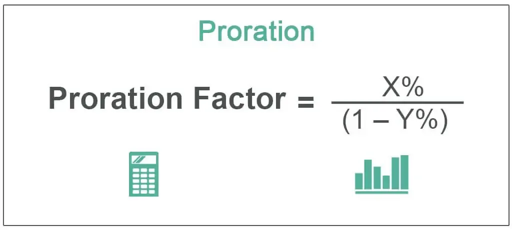

In today's rapidly evolving financial landscape, understanding key financial concepts is crucial for traders and investors. This article focuses on the significance of proration calculations in algorithmic trading, commonly known as algo trading. Proration refers to the proportional distribution of financial amounts, which is essential during various corporate actions such as mergers, acquisitions, and stock distributions. It ensures that all shareholders receive a fair and equitable distribution when the available resources are insufficient. By maintaining fairness, proration prevents favoritism among shareholders, which is critical in preserving market integrity.

Algorithmic trading, on the other hand, utilizes sophisticated computer algorithms to execute trades at speeds and efficiencies far beyond human capabilities. Algo trading has reshaped traditional trading methods by reducing human error and capitalizing on market efficiencies. The strategic integration of proration principles within algo trading systems can ensure precise resource allocation and capital distribution, thereby enhancing the equity and effectiveness of trading strategies.



Understanding the interplay between proration and algo trading can offer valuable insights into modern investment strategies and risk management techniques. By exploring the applications and implications of these concepts, investors and traders can make more informed decisions, ultimately leading to improved financial outcomes and mitigated risks. As financial technologies and markets continue to evolve, mastering these methodologies is vital for success in both personal and professional investment contexts.

## Table of Contents

## Understanding Proration

Proration is a financial mechanism employed during corporate actions to ensure a fair and equitable distribution of available shares or cash when resources are limited. It balances the interests of shareholders so that everyone receives an equitable share of the offered amount, reinforcing fairness in financial dealings.

In the context of mergers and acquisitions, proration plays a vital role when shareholders choose between different forms of compensation, such as cash or stock. A company might offer shareholders the option to receive either cash or shares for their holdings. If the number of shareholders opting for cash exceeds the cash available, proration governs the redistribution by ensuring each shareholder receives a proportional share. The formula typically used in these scenarios is:

$$
\text{Prorated Distribution} = \left( \frac{\text{Total Available Resource}}{\text{Total Resource Demanded}} \right) \times \text{Individual Resource Demanded}
$$

Proration is also observed in stock splits and special dividends. During a stock split, shares may be issued in proportions that maintain the existing equity structure, ensuring each shareholder's relative stake in the company remains unchanged. Similarly, when a special dividend is declared, and the available cash falls short of the expected payout, proration guarantees that each shareholder's payment corresponds proportionally to their shareholding.

The benefits of proration extend beyond merely maintaining fairness. It prevents favoritism among shareholders by adhering to predetermined rules that protect the interests of minority shareholders as well. By implementing proration, companies ensure compliance with regulatory requirements, thus enhancing shareholder confidence and fostering a transparent and equitable financial environment.

Overall, proration serves as a cornerstone in corporate finance, safeguarding the principles of equity and integrity. Its application in diverse scenarios upholds fairness and transparency, ensuring that all shareholders are treated justly, regardless of the financial situation or the corporate action involved.

## Examples of Proration

In corporate mergers, proration plays a critical role in ensuring that all shareholders receive a fair distribution of available resources. Consider a scenario where a company proposes a merger and offers shareholders the option to receive their payment in either cash or equity. If the demand for cash exceeds the available cash reserves allocated for the merger, proration mechanisms are employed to distribute the cash equitably among shareholders who opted for it.

For example, assume a company has $100 million in cash allocated for distribution and the total cash preference from shareholders amounts to $150 million. In this situation, proration will ensure that each shareholder receives a proportionate amount of cash relative to their initial request. The proration [factor](/wiki/factor-investing) can be calculated using the formula:

$$
\text{Proration Factor} = \frac{\text{Available Cash}}{\text{Total Cash Requested}} = \frac{100 \text{ million}}{150 \text{ million}} = \frac{2}{3}
$$

This proration factor of $\frac{2}{3}$ will be applied to each shareholder’s cash request. For instance, if a shareholder requested $15,000 in cash, they would receive:

$$
\text{Cash Received} = \text{Proration Factor} \times \text{Requested Cash} = \frac{2}{3} \times 15,000 = 10,000
$$

The remaining balance of $5,000 for this shareholder would typically be compensated with equity, allowing them to obtain a combination of cash and shares. This systematic allocation process ensures each shareholder receives a fair proportion of both cash and equity, reflecting the company's revised financial capability. It prevents any shareholder from gaining an unfair advantage and upholds the principles of fairness and equity in financial transactions.

## Pro Rata in Financial Calculations

The term 'pro rata', derived from Latin, generally translates to 'in proportion' and represents the method of distributing or allocating amounts based on a specific ratio. This calculation technique ensures fairness and equality by dividing a total sum into proportional parts based on an established criterion. Here, we explore the significance of pro rata calculations in financial operations such as dividend distributions, loan repayments, and investment allocations, highlighting their importance for accuracy and equity.

**Dividend Distributions:** In the context of shareholders receiving dividends, pro rata calculations occur when a company issues dividends that must be proportionally distributed among shareholders according to the number of shares each holds. For instance, if a company decides to issue a $10,000 dividend and there are 1,000 shares in total, a shareholder owning 100 shares would receive a dividend of:

$$
\text{Dividend per share} = \frac{\text{Total Dividend}}{\text{Total Shares}}
$$

$$
\text{Dividend per share} = \frac{\$10,000}{1,000} = \$10 \text{ per share}
$$

$$
\text{Shareholder's Dividend} = 100 \times \$10 = \$1,000
$$

**Loan Repayments:** Pro rata calculations are also common in the distribution of loan repayments. When multiple creditors are involved, payments are made in proportion to the outstanding loan balances of each creditor. For example, if there are two creditors with outstanding amounts of $30,000 and $20,000 respectively, and a payment of $5,000 is made, it would be divided as follows:

- Creditor A's share: $\frac{30,000}{30,000 + 20,000} \times 5,000 = \$3,000$
- Creditor B's share: $\frac{20,000}{30,000 + 20,000} \times 5,000 = \$2,000$

**Investment Allocations:** In investment portfolios, pro rata calculations are employed to allocate investments across various asset classes proportionally. If an investor intends to allocate $50,000 across two assets with a desired ratio of 60:40, the allocations would be:

- Asset A: $0.6 \times 50,000 = \$30,000$
- Asset B: $0.4 \times 50,000 = \$20,000$

The foundational principle of pro rata calculations is their capacity to maintain proportional integrity across different financial scenarios. By ensuring that distribution of financial resources mimics the predetermined ratios or stakes, these calculations play an essential role in sustaining fairness and precision in various financial sectors. Understanding these basics is crucial for involved parties to achieve methodical and equitable financial operations.

## Exploring Algorithmic Trading

Algorithmic trading, often referred to as algo trading, leverages sophisticated computer algorithms to execute trading strategies with minimal human intervention. This approach has become increasingly prevalent owing to its ability to exploit market efficiencies and dramatically reduce the margin for human error. By automating the trading process, algo trading allows for the rapid execution of complex strategies that are often beyond human capability given time constraints.

The hallmark of [algorithmic trading](/wiki/algorithmic-trading) is its speed and precision. These algorithms can analyze multiple market variables and execute orders in fractions of a second, reacting to market changes faster than any human trader. This speed is crucial for capitalizing on fleeting opportunities such as [arbitrage](/wiki/arbitrage), where minute price differences can be exploited across different markets. An example of a basic algorithm might involve programming a trading strategy that buys stocks when a specific short-term moving average surpasses a long-term moving average, a strategy known as the moving average crossover.

```python
def moving_average(prices, window_size):
    return [sum(prices[i:i+window_size]) / window_size for i in range(len(prices) - window_size + 1)]

short_term_window = 5
long_term_window = 20

def moving_average_crossover_strategy(prices, short_window, long_window):
    short_term_avg = moving_average(prices, short_window)
    long_term_avg = moving_average(prices, long_window)

    for i in range(1, len(short_term_avg)):
        if short_term_avg[i] > long_term_avg[i] and short_term_avg[i - 1] <= long_term_avg[i - 1]:
            print(f"Buy signal at index {i + long_window - 1}")

prices = [100, 102, 101, 105, 107, 111, 115, 117, 120, 122, 119, 118, 117, 116, 119, 120]
moving_average_crossover_strategy(prices, short_term_window, long_term_window)
```

In addition to speed, algorithmic trading supports the deployment of intricate trading strategies. These range from [statistical arbitrage](/wiki/statistical-arbitrage), which involves trading based on the statistical mispricing of one or more assets, to high-frequency trading ([HFT](/wiki/high-frequency-trading-strategies)), where numerous trades are executed in milliseconds. Strategies can be encoded to react to complex sets of conditions that would be challenging for human traders to monitor and act upon in real-time.

Algo trading has fundamentally reshaped the trading landscape, driving significant shifts in how trading is conducted across various financial markets. Its capacity to process vast amounts of data and execute trades at unprecedented speeds has made it an essential tool for modern traders seeking to gain a competitive edge. With continuous advancements in computing power and [machine learning](/wiki/machine-learning) techniques, the role of algorithmic trading is poised to expand further, integrating more sophisticated models and data sources into trading decisions. As such, understanding and employing algorithmic trading techniques will remain vital for achieving success in today's high-speed financial markets.

## Combining Proration and Algorithmic Trading

Integrating proration principles into algorithmic trading systems offers traders enhanced precision in resource allocation and capital distribution. Algorithmic trading, known for its speed and efficiency, can significantly benefit from the methodical and equitable approach of proration. By employing pro rata methods, algo trading ensures investments are allocated equitably in accordance with predetermined strategic objectives.

Pro rata calculations play a crucial role in dynamic portfolio rebalancing, a scenario where maintaining optimal asset proportions is essential despite market [volatility](/wiki/volatility-trading-strategies). For instance, suppose an investor aims to maintain a balanced portfolio consisting of 50% stocks and 50% bonds. Due to fluctuating market conditions, the value of stocks may increase, upsetting the equilibrium. A prorated adjustment would calculate the proportions needed to restore balance:

$$
\text{New Stock Allocation} = \frac{\text{Current Stock Value}}{\text{Total Portfolio Value}}
$$

$$
\text{New Bond Allocation} = \frac{\text{Current Bond Value}}{\text{Total Portfolio Value}}
$$

By applying these calculations, the algorithm can generate orders that rebalance the portfolio, thus aligning it back to the strategic allocation of 50:50. In practice, this could be automated using code:

```python
def rebalance_portfolio(portfolio, target_allocations):
    total_value = sum(portfolio.values())
    for asset, value in portfolio.items():
        target_value = total_value * target_allocations[asset] 
        if value != target_value:
            print(f"Adjust {asset} by {target_value - value} to maintain balance")

# Example usage
current_portfolio = {'stocks': 6000, 'bonds': 4000}  # Total = 10000
target_allocations = {'stocks': 0.5, 'bonds': 0.5}
rebalance_portfolio(current_portfolio, target_allocations)
```

This integration of proration in algorithmic trading not only maintains optimal asset proportions but also accommodates swift responses to market conditions. By doing so, the equity of investment among various portfolio assets is achieved methodically and efficiently, embodying both strategic foresight and technical precision in trading operations.

## Conclusion

Understanding proration and algorithmic trading presents a broad perspective on crucial elements within the modern financial landscape. These concepts are instrumental in executing strategically sound financial decisions and ensuring robust risk management. Proration ensures fair allocation of resources, addressing constraints in available capital or shares during corporate actions such as mergers or buybacks. This equitable distribution is vital for upholding fairness and impartiality among shareholders, especially when resources are limited.

Algorithmic trading, on the other hand, leverages computational power to optimize trading strategies with minimal human involvement. This approach allows for the handling of large volumes of transactions at high speeds, thereby minimizing errors and capitalizing on ephemeral market opportunities. The synergy of proration methods and algo trading enhances precision in financial decision-making, leading to more effective capital allocation aligned with strategic goals.

For both individual and professional investors, integrating these methodologies in investment operations can significantly enhance decision-making processes. Investors can maintain optimal portfolio allocations through techniques such as dynamic rebalancing, utilizing pro rata calculations to adjust asset proportions in response to market changes. This adaptability is crucial as financial markets and technologies continue to evolve.

Continual education and adaptation in proration and algorithmic trading remain essential as the financial landscape is rapidly transformed by technological advancements. By staying informed and agile, investors and financial professionals can harness these tools to navigate complex market dynamics, ultimately supporting both personal financial growth and broader economic stability.

## References & Further Reading

For those wishing to extend their understanding of financial algorithms and proration methods, a variety of scholarly articles and [books](/wiki/algo-trading-books) can provide valuable resources. Here are some recommendations to deepen your insights into these topics.

1. **Algorithmic Trading and DMA: An Introduction to Direct Access Trading Strategies** by Barry Johnson - This book is a comprehensive guide to the essentials of algorithmic trading, covering market microstructure, execution strategies, and the implementation of trading systems.

2. **Quantitative Trading: How to Build Your Own Algorithmic Trading Business** by Ernest P. Chan - Focused on the practical aspects of establishing and running an algorithmic trading business, this book addresses strategy development, backtesting, and risk management.

3. **Algorithmic and High-Frequency Trading** by Álvaro Cartea, Sebastián Jaimungal, and José Penalva - This text provides a rigorous introduction to the subjects of algorithmic and high-frequency trading, including mathematical models and practical algorithms for market makers.

4. **Financial Modelling with Excel and VBA** by Chandan Sengupta - This resource focuses on the implementation of financial models using Excel and VBA, which can be particularly useful for understanding quantitative financial concepts such as proration in real-world scenarios.

5. **Mathematics of Financial Markets** by Robert J. Elliott and P. Ekkehard Kopp - Offering a detailed examination of the mathematical underpinnings of financial market models, this book helps readers understand complex issues such as stochastic calculus and its applications in algorithmic trading.

6. **Python for Finance: Mastering Data-Driven Finance** by Yves Hilpisch - For a practical approach using Python, this book guides readers through financial analyses, time series modeling, and implementing trading strategies.

7. **Proration and Corporate Finance** - Consider searching for journal articles that explore proration within the context of corporate finance and its implications for shareholder rights and equitable resource allocation. Journals such as *The Journal of Finance* or *The Journal of Portfolio Management* are good starting points.

For further understanding and the most current developments, leveraging online databases such as JSTOR, IEEE Xplore, and Google Scholar can provide access to recent papers and studies in these fields. Additionally, financial blogs and forums like Quantocracy and Elite Trader house discussions and insights shared by professionals and enthusiasts alike. These platforms can offer both practical knowledge and someone else's perspective on financial algorithms and proration methods.

