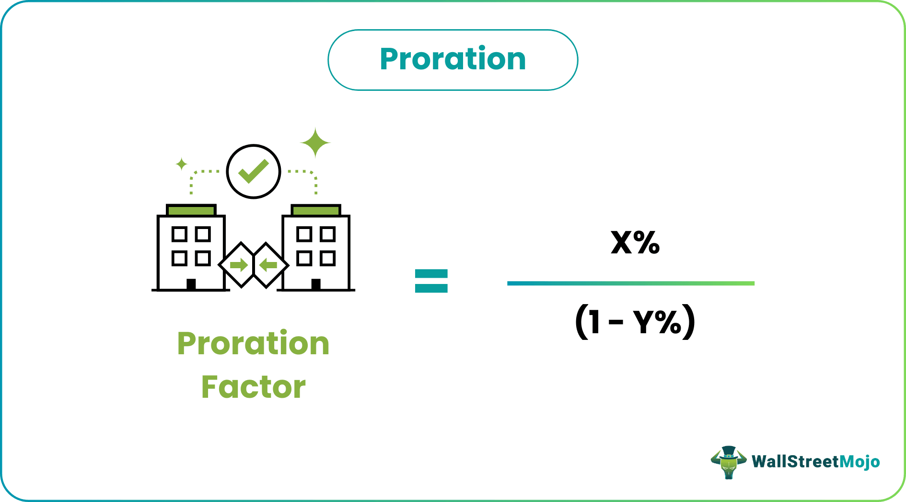

## Table of Contents

## What is proration?

Proration is a way to split a cost or payment fairly over a certain time or amount. It's often used when someone starts or stops a service partway through a billing period. For example, if you start a gym membership halfway through the month, you might only pay half the monthly fee for that month.

This method helps make sure people only pay for what they use. It's common in many areas like rent, subscriptions, and utilities. By using proration, businesses can charge customers more accurately based on their actual usage, which can make things fairer for everyone involved.

## Why is proration important in business and finance?

Proration is important in business and finance because it helps make billing fair and accurate. When someone starts or stops using a service partway through a billing period, proration makes sure they only pay for the time they actually used the service. This can build trust with customers because they feel they are being charged fairly. For example, if someone cancels a subscription halfway through the month, proration means they only pay for half the month, which is more reasonable than paying the full amount.

Additionally, proration can help businesses manage their finances better. By charging customers accurately, businesses can predict their revenue more reliably. This is important for budgeting and planning. If a business knows how much money is coming in each month, it can make better decisions about spending and investments. Overall, proration helps keep things fair for customers and helps businesses run more smoothly.

## How does proration work in the context of stock dividends?

Proration in the context of stock dividends happens when a company doesn't have enough money to pay full dividends to all shareholders. Instead of giving everyone the full amount, the company gives each shareholder a smaller, prorated amount. For example, if a company can only pay out half of what it promised, each shareholder gets half of their expected dividend.

This process makes sure that all shareholders get treated fairly, even if the company can't pay the full dividend. It's important because it keeps everyone on the same level, rather than some shareholders getting paid while others don't. Proration helps maintain trust between the company and its investors by showing that the company is trying to be fair, even in tough financial times.

## Can you explain proration with an example of utility billing?

Imagine you move into a new apartment on the 15th of the month. The electricity bill for the whole month is usually $100. But since you only lived there for half the month, the utility company uses proration to figure out your bill. They divide the full month's bill by the number of days in the month, then multiply that by the number of days you actually lived there. In this case, if there are 30 days in the month, the daily rate is about $3.33. Since you lived there for 15 days, your prorated bill would be around $50.

Proration makes sure you only pay for the electricity you used. This is fair to you and helps the utility company keep their billing accurate. If you didn't use proration, you might have to pay the full $100 even though you only lived there for half the month. By using proration, the utility company can charge you the right amount based on your actual usage, which makes things fairer for everyone.

## What are the common methods used to calculate proration?

One common method to calculate proration is the daily rate method. This is when you take the total cost for a full period, like a month, and divide it by the number of days in that period to find the daily rate. Then, you multiply the daily rate by the number of days the service was actually used. For example, if a monthly subscription costs $30 and you use it for 15 days, you would divide $30 by 30 days to get a daily rate of $1. Then, you multiply $1 by 15 days to get a prorated cost of $15.

Another method is the percentage method. This is used when you know what fraction of the full period you used the service. You take the total cost and multiply it by the fraction of the period you used. For example, if you use a service for half a month, you would multiply the full monthly cost by 50%. If the monthly cost is $60, then half of that, or 50%, would be $30. This method is simple and quick when you know the percentage of the period you used the service.

## How does proration affect employee benefits and compensation?

Proration can affect employee benefits and compensation when someone starts or leaves a job partway through a pay period or benefit year. For example, if an employee starts work halfway through the month, their first paycheck might be prorated to reflect only the days they worked. This means they get paid only for the time they were actually working, not for the whole month. This helps make sure the employee gets paid fairly for the time they worked, and it helps the company keep its payroll accurate.

Proration also applies to benefits like vacation time or health insurance. If an employee joins the company in the middle of the year, they might get a prorated amount of vacation days. For example, if the company gives 12 days of vacation a year and the employee starts halfway through the year, they might get 6 days of vacation for that year. This makes sure everyone gets benefits in a fair way, based on how long they've worked at the company. By using proration, companies can manage their resources better and make sure employees feel they are treated fairly.

## What is the difference between proration and pro rata?

Proration and pro rata are similar ideas, but they are used in slightly different ways. Proration is about dividing costs or payments fairly over a certain time or amount. It's often used when someone starts or stops using a service partway through a billing period. For example, if you move into an apartment on the 15th of the month, you might only pay half the rent for that month because you only lived there for half the month.

Pro rata, on the other hand, means dividing something based on a share or proportion. It's often used in business and finance to split things like dividends or insurance premiums. For example, if a company pays out dividends to shareholders, each shareholder gets a portion based on how many shares they own. So, if you own 10% of the company's shares, you get 10% of the dividends. While proration focuses more on time, pro rata focuses more on shares or proportions.

## In what scenarios is proration typically applied?

Proration is often used when someone starts or stops using a service partway through a billing period. For example, if you move into a new apartment on the 15th of the month, you might only pay half the rent for that month because you only lived there for half the month. This makes sure you pay only for the time you used the apartment. Proration is also common with subscriptions, like gym memberships or streaming services. If you sign up for a gym membership on the 20th of the month, you might only pay for the last 10 days of that month instead of the whole month.

Another common scenario for proration is in the workplace. If someone starts a new job halfway through the month, their first paycheck might be prorated to reflect only the days they worked. This means they get paid only for the time they were actually working, not for the whole month. Proration also applies to benefits like vacation time. If an employee joins the company in the middle of the year, they might get a prorated amount of vacation days. For example, if the company gives 12 days of vacation a year and the employee starts halfway through the year, they might get 6 days of vacation for that year.

## How can proration be used in subscription services?

Proration is really helpful for subscription services like streaming platforms or gym memberships. If you sign up for a service in the middle of the month, proration makes sure you only pay for the days you actually use the service. For example, if a streaming service costs $10 a month and you sign up on the 15th, you would only pay about $5 for that month because you only used it for half the month. This way, you don't have to pay the full amount even though you didn't use the service for the whole month.

Proration also comes into play when you cancel a subscription before the end of a billing period. If you decide to stop your gym membership on the 20th of the month, proration means you won't have to pay for the rest of the month. Instead, you'll only be charged for the 20 days you used the gym. This makes things fair for both you and the service provider, ensuring you only pay for what you used.

## What are the legal and regulatory considerations for proration?

When it comes to proration, there are some legal and regulatory things to think about. Different places might have different rules about how businesses can charge for services. For example, some places might have laws that say businesses have to use proration when someone starts or stops a service partway through a billing period. This is to make sure customers are treated fairly and only pay for what they use. If a business doesn't follow these rules, they could get in trouble with the law, like getting fines or having to pay back customers.

Also, companies need to be clear about how they use proration. They should explain it in their terms of service or billing policies so customers know what to expect. This helps avoid confusion and makes sure everyone understands how charges are calculated. If a company doesn't explain proration clearly, customers might feel cheated, which could lead to complaints or legal action. So, it's important for businesses to follow the rules and be open about how they use proration.

## How do companies implement proration in their accounting systems?

Companies use their accounting systems to handle proration by setting up rules that divide costs or payments fairly over time or usage. When someone starts or stops using a service partway through a billing period, the accounting software calculates how much the customer should pay based on the days they used the service. For example, if a monthly subscription costs $30 and someone signs up halfway through the month, the system will figure out the daily rate and then charge only for the days the service was used, maybe around $15.

To make this work smoothly, companies often use software that can automatically calculate proration based on set rules. This helps make sure the billing is accurate and fair. The system needs to keep track of when customers start and stop using the service, and then apply the proration rules correctly. By doing this, companies can make sure they are charging customers the right amount and following any legal rules about billing.

## What advanced strategies can businesses use to optimize proration for financial efficiency?

Businesses can use smart strategies to make proration work better for their money. One way is to use special software that can figure out proration quickly and correctly. This software can look at when customers start or stop using a service and then calculate the right amount to charge them. By doing this, businesses can make sure they are charging the right amount every time, which helps them keep their money in order and avoid mistakes. It also helps them follow any rules about how to charge customers, which can keep them out of trouble with the law.

Another strategy is to be really clear with customers about how proration works. When businesses explain proration well in their terms of service or on their website, customers understand their bills better. This can make customers happier and less likely to complain or leave. Happy customers are good for business because they might tell their friends or keep using the service longer. So, by being clear and using good software, businesses can make proration work better for their money and keep their customers happy.

## What is Understanding Proration?

Proration is a financial mechanism employed during corporate actions to ensure a fair and equitable distribution of available shares or cash when resources are limited. It balances the interests of shareholders so that everyone receives an equitable share of the offered amount, reinforcing fairness in financial dealings.

In the context of mergers and acquisitions, proration plays a vital role when shareholders choose between different forms of compensation, such as cash or stock. A company might offer shareholders the option to receive either cash or shares for their holdings. If the number of shareholders opting for cash exceeds the cash available, proration governs the redistribution by ensuring each shareholder receives a proportional share. The formula typically used in these scenarios is:

$$
\text{Prorated Distribution} = \left( \frac{\text{Total Available Resource}}{\text{Total Resource Demanded}} \right) \times \text{Individual Resource Demanded}
$$

Proration is also observed in stock splits and special dividends. During a stock split, shares may be issued in proportions that maintain the existing equity structure, ensuring each shareholder's relative stake in the company remains unchanged. Similarly, when a special dividend is declared, and the available cash falls short of the expected payout, proration guarantees that each shareholder's payment corresponds proportionally to their shareholding.

The benefits of proration extend beyond merely maintaining fairness. It prevents favoritism among shareholders by adhering to predetermined rules that protect the interests of minority shareholders as well. By implementing proration, companies ensure compliance with regulatory requirements, thus enhancing shareholder confidence and fostering a transparent and equitable financial environment.

Overall, proration serves as a cornerstone in corporate finance, safeguarding the principles of equity and integrity. Its application in diverse scenarios upholds fairness and transparency, ensuring that all shareholders are treated justly, regardless of the financial situation or the corporate action involved.

## What are examples of proration?

In corporate mergers, proration plays a critical role in ensuring that all shareholders receive a fair distribution of available resources. Consider a scenario where a company proposes a merger and offers shareholders the option to receive their payment in either cash or equity. If the demand for cash exceeds the available cash reserves allocated for the merger, proration mechanisms are employed to distribute the cash equitably among shareholders who opted for it.

For example, assume a company has $100 million in cash allocated for distribution and the total cash preference from shareholders amounts to $150 million. In this situation, proration will ensure that each shareholder receives a proportionate amount of cash relative to their initial request. The proration [factor](/wiki/factor-investing) can be calculated using the formula:

$$
\text{Proration Factor} = \frac{\text{Available Cash}}{\text{Total Cash Requested}} = \frac{100 \text{ million}}{150 \text{ million}} = \frac{2}{3}
$$

This proration factor of $\frac{2}{3}$ will be applied to each shareholder’s cash request. For instance, if a shareholder requested $15,000 in cash, they would receive:

$$
\text{Cash Received} = \text{Proration Factor} \times \text{Requested Cash} = \frac{2}{3} \times 15,000 = 10,000
$$

The remaining balance of $5,000 for this shareholder would typically be compensated with equity, allowing them to obtain a combination of cash and shares. This systematic allocation process ensures each shareholder receives a fair proportion of both cash and equity, reflecting the company's revised financial capability. It prevents any shareholder from gaining an unfair advantage and upholds the principles of fairness and equity in financial transactions.

## What is Pro Rata in Financial Calculations?

The term 'pro rata', derived from Latin, generally translates to 'in proportion' and represents the method of distributing or allocating amounts based on a specific ratio. This calculation technique ensures fairness and equality by dividing a total sum into proportional parts based on an established criterion. Here, we explore the significance of pro rata calculations in financial operations such as dividend distributions, loan repayments, and investment allocations, highlighting their importance for accuracy and equity.

**Dividend Distributions:** In the context of shareholders receiving dividends, pro rata calculations occur when a company issues dividends that must be proportionally distributed among shareholders according to the number of shares each holds. For instance, if a company decides to issue a $10,000 dividend and there are 1,000 shares in total, a shareholder owning 100 shares would receive a dividend of:

$$
\text{Dividend per share} = \frac{\text{Total Dividend}}{\text{Total Shares}}
$$

$$
\text{Dividend per share} = \frac{\$10,000}{1,000} = \$10 \text{ per share}
$$

$$
\text{Shareholder's Dividend} = 100 \times \$10 = \$1,000
$$

**Loan Repayments:** Pro rata calculations are also common in the distribution of loan repayments. When multiple creditors are involved, payments are made in proportion to the outstanding loan balances of each creditor. For example, if there are two creditors with outstanding amounts of $30,000 and $20,000 respectively, and a payment of $5,000 is made, it would be divided as follows:

- Creditor A's share: $\frac{30,000}{30,000 + 20,000} \times 5,000 = \$3,000$
- Creditor B's share: $\frac{20,000}{30,000 + 20,000} \times 5,000 = \$2,000$

**Investment Allocations:** In investment portfolios, pro rata calculations are employed to allocate investments across various asset classes proportionally. If an investor intends to allocate $50,000 across two assets with a desired ratio of 60:40, the allocations would be:

- Asset A: $0.6 \times 50,000 = \$30,000$
- Asset B: $0.4 \times 50,000 = \$20,000$

The foundational principle of pro rata calculations is their capacity to maintain proportional integrity across different financial scenarios. By ensuring that distribution of financial resources mimics the predetermined ratios or stakes, these calculations play an essential role in sustaining fairness and precision in various financial sectors. Understanding these basics is crucial for involved parties to achieve methodical and equitable financial operations.

## How can Proration be Combined with Algorithmic Trading?

Integrating proration principles into algorithmic trading systems offers traders enhanced precision in resource allocation and capital distribution. Algorithmic trading, known for its speed and efficiency, can significantly benefit from the methodical and equitable approach of proration. By employing pro rata methods, algo trading ensures investments are allocated equitably in accordance with predetermined strategic objectives.

Pro rata calculations play a crucial role in dynamic portfolio rebalancing, a scenario where maintaining optimal asset proportions is essential despite market [volatility](/wiki/volatility-trading-strategies). For instance, suppose an investor aims to maintain a balanced portfolio consisting of 50% stocks and 50% bonds. Due to fluctuating market conditions, the value of stocks may increase, upsetting the equilibrium. A prorated adjustment would calculate the proportions needed to restore balance:

$$
\text{New Stock Allocation} = \frac{\text{Current Stock Value}}{\text{Total Portfolio Value}}
$$

$$
\text{New Bond Allocation} = \frac{\text{Current Bond Value}}{\text{Total Portfolio Value}}
$$

By applying these calculations, the algorithm can generate orders that rebalance the portfolio, thus aligning it back to the strategic allocation of 50:50. In practice, this could be automated using code:

```python
def rebalance_portfolio(portfolio, target_allocations):
    total_value = sum(portfolio.values())
    for asset, value in portfolio.items():
        target_value = total_value * target_allocations[asset] 
        if value != target_value:
            print(f"Adjust {asset} by {target_value - value} to maintain balance")

# Example usage
current_portfolio = {'stocks': 6000, 'bonds': 4000}  # Total = 10000
target_allocations = {'stocks': 0.5, 'bonds': 0.5}
rebalance_portfolio(current_portfolio, target_allocations)
```

This integration of proration in algorithmic trading not only maintains optimal asset proportions but also accommodates swift responses to market conditions. By doing so, the equity of investment among various portfolio assets is achieved methodically and efficiently, embodying both strategic foresight and technical precision in trading operations.

## References & Further Reading

For those wishing to extend their understanding of financial algorithms and proration methods, a variety of scholarly articles and [books](/wiki/algo-trading-books) can provide valuable resources. Here are some recommendations to deepen your insights into these topics.

1. **Algorithmic Trading and DMA: An Introduction to Direct Access Trading Strategies** by Barry Johnson - This book is a comprehensive guide to the essentials of algorithmic trading, covering market microstructure, execution strategies, and the implementation of trading systems.

2. **Quantitative Trading: How to Build Your Own Algorithmic Trading Business** by Ernest P. Chan - Focused on the practical aspects of establishing and running an algorithmic trading business, this book addresses strategy development, backtesting, and risk management.

3. **Algorithmic and High-Frequency Trading** by Álvaro Cartea, Sebastián Jaimungal, and José Penalva - This text provides a rigorous introduction to the subjects of algorithmic and high-frequency trading, including mathematical models and practical algorithms for market makers.

4. **Financial Modelling with Excel and VBA** by Chandan Sengupta - This resource focuses on the implementation of financial models using Excel and VBA, which can be particularly useful for understanding quantitative financial concepts such as proration in real-world scenarios.

5. **Mathematics of Financial Markets** by Robert J. Elliott and P. Ekkehard Kopp - Offering a detailed examination of the mathematical underpinnings of financial market models, this book helps readers understand complex issues such as stochastic calculus and its applications in algorithmic trading.

6. **Python for Finance: Mastering Data-Driven Finance** by Yves Hilpisch - For a practical approach using Python, this book guides readers through financial analyses, time series modeling, and implementing trading strategies.

7. **Proration and Corporate Finance** - Consider searching for journal articles that explore proration within the context of corporate finance and its implications for shareholder rights and equitable resource allocation. Journals such as *The Journal of Finance* or *The Journal of Portfolio Management* are good starting points.

For further understanding and the most current developments, leveraging online databases such as JSTOR, IEEE Xplore, and Google Scholar can provide access to recent papers and studies in these fields. Additionally, financial blogs and forums like Quantocracy and Elite Trader house discussions and insights shared by professionals and enthusiasts alike. These platforms can offer both practical knowledge and someone else's perspective on financial algorithms and proration methods.

