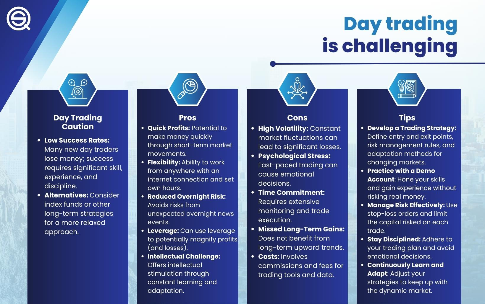

## Table of Contents

## What is day trading and how does it differ from other trading styles?

Day trading is a style of trading where a person buys and sells stocks or other financial products within the same day. The goal is to make quick profits from small price changes in the market. Day traders usually do not hold onto their investments overnight because they want to avoid the risk of big price changes that can happen when the market is closed.

Day trading is different from other trading styles like swing trading and position trading. Swing trading involves holding onto investments for a few days or weeks to take advantage of expected upward or downward movements in price. Position trading, on the other hand, involves holding investments for much longer periods, sometimes months or years, based on long-term trends. Unlike day trading, both swing and position trading are less about quick profits and more about waiting for bigger price movements over time.

## What are the basic requirements to start day trading?

To start day trading, you need a few basic things. First, you need a computer or a smartphone with a good internet connection. This is important because you need to be able to quickly buy and sell stocks or other financial products. You also need to open a brokerage account with a company that lets you trade. Some brokerages have special accounts just for day traders, and they might have different rules or fees.

Another important thing you need is enough money to start trading. Different brokerages have different rules about how much money you need to have in your account to day trade. It's usually a good idea to have more money than the minimum amount, so you can handle the ups and downs of the market. You also need to learn about the market and how to trade. There are many [books](/wiki/algo-trading-books), online courses, and other resources that can help you understand the basics of [day trading](/wiki/day-trading-spy).

Lastly, you need to have a plan and be ready to spend time watching the market. Day trading can take a lot of time and focus. You need to be able to make quick decisions and be okay with the risk of losing money. It's a good idea to start small and learn as you go, rather than jumping in with a lot of money right away.

## What are the potential financial benefits of day trading?

Day trading can offer the chance to make money quickly. If you buy and sell stocks at the right times, you can earn profits from small changes in their prices during the day. This can be exciting because you might see your money grow fast. Also, since you're not keeping your investments overnight, you don't have to worry about big price drops that can happen when the market is closed.

However, day trading isn't a sure way to get rich. It can be risky, and you might lose money if the market doesn't move the way you expect. But if you learn a lot about the market and get good at making quick decisions, day trading can be a way to earn extra money or even become a full-time job. Just remember, it takes time and practice to get good at it.

## What are the risks associated with day trading for beginners?

Day trading can be very risky for beginners. One big risk is losing money. When you're new to day trading, you might not know enough about the market to make good choices. You could buy stocks at the wrong time or sell them too late, and that can lead to losing more money than you planned. Also, day trading often uses a lot of borrowed money, which can make your losses even bigger if things go wrong.

Another risk is the stress and time it takes. Day trading means you have to watch the market all day and make quick decisions. This can be very tiring and stressful, especially if you're also trying to learn how to do it right. It can be hard to keep up with everything and still have time for other parts of your life.

Lastly, beginners might get too excited about the chance to make quick money and start taking big risks without understanding them fully. This can lead to big losses and even bigger problems. It's important for beginners to start small, learn a lot, and be ready for the ups and downs of day trading.

## How can day trading impact one's mental health and stress levels?

Day trading can make you feel very stressed and worried. When you trade every day, you have to watch the market all the time and make quick choices. This can be hard on your mind and body. If the market goes down and you lose money, it can make you feel sad or scared. This kind of stress can be bad for your mental health and might even make you feel sick if it goes on for a long time.

It's also important to know that day trading can make you feel really up and down. One day you might make money and feel happy, but the next day you might lose money and feel bad. These big changes in how you feel can be tough to handle. If you're new to day trading, it's a good idea to take care of your mental health by taking breaks, talking to someone about how you feel, and not letting trading take over your whole life.

## What are the tax implications of profits made from day trading?

When you make money from day trading, you have to pay taxes on those profits. In the United States, the money you make from day trading is usually considered short-term capital gains. This means you have to pay taxes on it at the same rate as your regular income. So, if you make a lot of money from day trading, you might end up paying a lot in taxes, depending on how much money you make in total.

It's important to keep good records of all your trades so you can report them correctly on your taxes. You need to know how much money you made and how much you lost, because you can use your losses to lower the amount of taxes you owe. If you're not sure about how to do your taxes, it's a good idea to talk to a tax professional who can help you figure it out and make sure you're doing everything right.

## How does the use of leverage in day trading affect potential gains and losses?

Using leverage in day trading can make your potential gains bigger. Leverage means borrowing money from your broker to trade more than you could with just your own money. If you make good choices and the market goes your way, you can make a lot more money than if you were just using your own money. For example, if you use leverage to buy more stocks and their price goes up, you can sell them for a bigger profit.

But leverage also makes your potential losses bigger. If the market goes against you, you can lose more money than you started with because you have to pay back the money you borrowed. This can be very risky, especially if you're new to day trading. It's important to understand how leverage works and use it carefully, because it can make your losses much worse if things don't go as planned.

## What are effective strategies for managing risk in day trading?

One good way to manage risk in day trading is to use stop-loss orders. A stop-loss order is like a safety net that automatically sells your stock if its price drops to a certain level. This helps you limit how much money you can lose on a single trade. Another way to manage risk is to only use a small part of your money for each trade. This way, even if you lose on a trade, you won't lose all your money at once. It's also smart to never use all your money to trade, so you have some left if things go wrong.

Another strategy is to always have a plan before you start trading. This means knowing when you will buy and sell, and how much you are willing to lose. Stick to your plan and don't let your feelings make you do things you didn't plan for. It's also important to keep learning about the market and how to trade better. The more you know, the better you can handle the risks of day trading.

Lastly, don't use too much leverage. Leverage can make your gains bigger, but it can also make your losses much worse. Use it carefully and only when you really understand how it works. By using these strategies, you can help keep your risks under control and trade more safely.

## How can advanced technical analysis tools enhance day trading performance?

Advanced technical analysis tools can help day traders make better decisions by giving them more information about the market. These tools can show patterns and trends that might be hard to see just by looking at stock prices. For example, tools like moving averages, Relative Strength Index (RSI), and Bollinger Bands can help traders see if a stock is going up or down, if it's overbought or oversold, and if it's likely to keep moving in the same direction or change. By using these tools, traders can find the best times to buy and sell stocks, which can lead to making more money.

These tools also help traders manage their risk better. For instance, setting up technical indicators can help traders know when to use stop-loss orders to limit their losses. If a stock's price moves in a way that the technical analysis says is risky, the trader can quickly get out of the trade before losing too much money. By using advanced technical analysis tools, day traders can make smarter choices, lower their risks, and hopefully make more profits from their trades.

## What role does market volatility play in day trading, and how can it be navigated?

Market [volatility](/wiki/volatility-trading-strategies) means how much prices go up and down in a short time. For day traders, this can be good because it gives more chances to make money from quick price changes. But it can also be bad because it makes trading riskier. When the market is very volatile, prices can move a lot in just a few minutes, which means you could make big profits or big losses. Day traders need to watch the market closely and be ready to act fast when prices change.

To navigate market volatility, day traders can use some strategies. One way is to set stop-loss orders to limit how much money they can lose if prices drop suddenly. Another way is to trade smaller amounts of money when the market is very volatile, so they don't risk too much at once. It's also important to stay calm and not let emotions make them do things they didn't plan for. By using these strategies and keeping a close eye on the market, day traders can handle volatility better and maybe even use it to their advantage.

## How do regulatory changes impact day trading practices and strategies?

Regulatory changes can have a big impact on day trading. When rules change, it can affect what day traders are allowed to do and how they do it. For example, if a new rule says that day traders need to have more money in their account to trade, it might mean that some people can't trade as much as before. Also, if there are new rules about how much a trader can use leverage, it can change how much risk they take and how they make their trading plans. Day traders need to keep up with these changes to make sure they are following the rules and adjusting their strategies to work within them.

These changes can also affect the markets that day traders use. If a new rule makes it harder for companies to list their stocks on a certain exchange, it might mean fewer stocks for day traders to trade. Or, if there are new rules about how fast trades can happen, it might change the way day traders use technology to make quick trades. Day traders need to be ready to change their strategies when the rules change, so they can keep trading safely and legally. Keeping up with regulatory news and understanding how new rules affect their trading is really important for success in day trading.

## What are the long-term career prospects and sustainability of day trading as a profession?

Day trading can be a full-time job for some people, but it's not easy to keep doing it for a long time. It takes a lot of hard work, learning, and being able to handle stress. Many people start day trading hoping to make a lot of money fast, but it's not that simple. Only a few people who start day trading end up making enough money to live on it for many years. Most people find that it's too hard to keep making profits all the time, and they might lose money or get too stressed out.

To have a good chance at making day trading a long-term career, you need to be really good at understanding the market and making quick decisions. You also need to keep learning and changing your strategies as the market and rules change. Some day traders become very successful and can keep doing it for a long time, but it's not common. It's important to have other ways to make money or save money, just in case day trading doesn't work out. Day trading can be exciting and rewarding, but it's also risky and not always sustainable as a long-term career.

## What are the basic skills required for day traders in algo trading?

To be successful in algo trading, day traders need to develop certain key skills that optimize their trading strategies and manage risks effectively:

1. **Risk Management**: Effective risk management is imperative in algorithmic trading. Traders should use stop-loss orders to automatically close a position at a predefined price, thereby limiting potential losses. Additionally, calculating appropriate position sizes for each trade ensures that no single position poses an undue risk to the trader's overall portfolio. For example, the Kelly Criterion can be used to determine the optimal size of a series of bets to maximize wealth over time:
$$
   f^* = \frac{bp - q}{b}

$$

   where $f^*$ is the fraction of the portfolio to wager, $b$ is the odds received on the wager, $p$ is the probability of winning, and $q$ is the probability of losing (i.e., $q = 1 - p$).

2. **Strategy Development**: Continuously refining trading strategies is crucial for success. Day traders must not only develop robust algorithms but also frequently test them using historical market data—a process known as backtesting. Backtesting helps in assessing the viability of a trading strategy before deploying it in live markets. Python offers several libraries like `pandas`, and `numpy`, and backtesting framework libraries like `Backtrader` that can aid in this.

   ```python
   import backtrader as bt

   class MyStrategy(bt.Strategy):
       def __init__(self):
           # Define indicators and signals
           self.sma = bt.indicators.SimpleMovingAverage(self.data, period=15)

       def next(self):
           if not self.position:
               if self.data.close > self.sma:
                   self.buy(size=10)
           elif self.data.close < self.sma:
               self.sell(size=10)

   ```

3. **Emotional Control**: Despite the automation aspect, maintaining emotional discipline is essential. Trading decisions should be based on data and predefined rules, rather than being swayed by emotional reactions. Fear and greed are two powerful emotions that can lead to impulsive trading decisions, contrary to the logical processes embedded in trading algorithms.

4. **Continuous Monitoring**: Although algorithmic trading is largely automated, continuous monitoring is necessary to ensure that the algorithms operate as intended. Market conditions can change rapidly, requiring real-time adjustments to trading algorithms. Additionally, monitoring is crucial for identifying and rectifying unexpected system or connectivity issues swiftly.

5. **Record-Keeping**: Maintaining a detailed trading journal is indispensable for post-trade analysis and improvement. A well-kept journal can help in evaluating the performance of trading strategies and identifying areas for refinement. Documenting each trade’s conditions, decisions, and outcomes forms a vital feedback loop for continuous enhancement of trading skills and strategies.

These fundamental skills lay the foundation for effective algo trading, enabling day traders to exploit the advantages of algorithmic systems while minimizing associated risks. By mastering these competencies, traders can better navigate the complexities of modern financial markets.

## References & Further Reading

[1]: Bergstra, J., Bardenet, R., Bengio, Y., & Kégl, B. (2011). ["Algorithms for Hyper-Parameter Optimization."](https://papers.nips.cc/paper/4443-algorithms-for-hyper-parameter-optimization) Advances in Neural Information Processing Systems 24.

[2]: ["Advances in Financial Machine Learning"](https://www.amazon.com/Advances-Financial-Machine-Learning-Marcos/dp/1119482089) by Marcos Lopez de Prado

[3]: ["Evidence-Based Technical Analysis: Applying the Scientific Method and Statistical Inference to Trading Signals"](https://www.amazon.com/Evidence-Based-Technical-Analysis-Scientific-Statistical/dp/0470008741) by David Aronson

[4]: ["Machine Learning for Algorithmic Trading"](https://github.com/stefan-jansen/machine-learning-for-trading) by Stefan Jansen

[5]: ["Quantitative Trading: How to Build Your Own Algorithmic Trading Business"](https://books.google.com/books/about/Quantitative_Trading.html?id=j70yEAAAQBAJ) by Ernest P. Chan