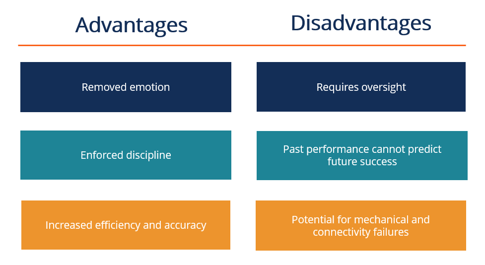

## Table of Contents

## What is an automated trading system?

An automated trading system is a computer program that buys and sells things like stocks, currencies, or other financial items without a person doing it manually. It uses special rules, called algorithms, to decide when to buy or sell. These rules are based on math and past information about how prices have moved. People set up these systems to work on their own, so they can trade even when the person is not watching.

These systems can be good because they can look at a lot of information very quickly and make decisions faster than a person can. They don't get tired or make mistakes because they are emotional. But, they can also be risky. If the rules are not set up right, the system might make bad trades. Also, the market can change in ways that the rules did not expect, which can lead to losses. So, it's important for people to keep an eye on these systems and make sure they are working well.

## How does an automated trading system work?

An automated trading system works by using a set of rules, called an algorithm, that tells the computer when to buy or sell things like stocks or currencies. These rules are based on math and look at things like price changes, how much something is being bought or sold, and other information from the market. When the computer sees that the rules are met, it will automatically make a trade without a person needing to do anything. This can happen very quickly, much faster than a person could do it.

These systems can be set up to work all the time, even when the person who set them up is not watching. They can keep an eye on the market and make trades based on the rules that were programmed into them. But, it's important for people to check on these systems sometimes to make sure they are still working right. The market can change, and if the rules don't match the new market, the system might make bad trades. So, while the system can work on its own, it still needs some watching to make sure it's doing a good job.

## What are the basic components of an automated trading system?

The basic components of an automated trading system include a computer program that runs the trading algorithm, a data feed that provides real-time market information, and a broker that actually makes the trades. The trading algorithm is like a set of instructions that tell the computer when to buy or sell. It uses math and past market data to make these decisions. The data feed is important because it gives the computer the latest information about prices and other market details. The broker is the one that carries out the trades when the algorithm decides it's time to buy or sell.

Another important component is the risk management system, which helps to limit losses. This part of the system can set rules like how much money to risk on each trade or when to stop trading if things are going badly. Finally, there's usually some kind of monitoring and reporting tool. This lets the person who set up the system see how it's doing and make changes if needed. All these parts work together to make the automated trading system run smoothly and make trades without needing a person to watch all the time.

## What are the advantages of using an automated trading system for beginners?

Automated trading systems can be really helpful for beginners because they take away a lot of the hard work. Instead of having to watch the market all the time and decide when to buy or sell, a beginner can just set up the system with some rules and let it do the work. This means they don't have to spend all day looking at charts and numbers. The system can also make trades much faster than a person can, which can be good in a fast-moving market.

Another big advantage is that these systems can help beginners learn. By using an automated trading system, a beginner can see how the market works and how different rules affect trading. They can try out different strategies without risking a lot of money. Plus, the system can help them avoid some common mistakes that beginners often make, like letting emotions get in the way of trading decisions. This can make the whole process of learning to trade a lot easier and less stressful.

## What are the potential risks and disadvantages of automated trading systems for beginners?

One big risk for beginners using automated trading systems is that they might not understand how the system works. If they don't know what the rules are or how the system makes decisions, they might lose money without knowing why. Also, if the system is not set up right, it could make bad trades. Beginners might not know how to fix these problems, which can lead to big losses.

Another disadvantage is that automated trading systems can be too complicated for beginners. They might not know how to change the rules or adjust the system when the market changes. This can make them feel stuck and unable to improve their trading. Plus, these systems can sometimes make trades too quickly, which can lead to more losses if the market moves in a way the system did not expect.

Lastly, beginners might rely too much on the system and not learn how to trade on their own. If the system stops working or they need to make a quick decision, they might not know what to do. This can be a big problem if they want to become better traders in the future. So, while automated trading systems can help, beginners need to be careful and keep learning about trading.

## How can an automated trading system improve trading efficiency?

An automated trading system can make trading a lot easier and faster. It uses a computer program to watch the market all the time and make trades based on rules that are set up. This means the system can see when prices change and make a trade right away, without a person having to do it. This can be really helpful because the market can move very quickly, and the system can react faster than a person can.

Another way an automated trading system helps is by taking away the need for a person to watch the market all day. Instead of sitting in front of a computer and looking at charts, a person can set up the system and let it do the work. This saves a lot of time and effort. Plus, the system can keep track of many different things at once, like different stocks or currencies, which would be hard for a person to do by themselves.

## What are the common strategies used in automated trading systems?

One common strategy in automated trading systems is called [trend following](/wiki/trend-following). This means the system looks at the market to see if prices are going up or down over time. If it sees that prices are going up, it will buy, hoping to sell later for a profit. If it sees prices going down, it might sell or even short sell, which means it sells something it doesn't own, hoping to buy it back later at a lower price. This strategy tries to make money by following the overall direction of the market.

Another strategy is called mean reversion. This is based on the idea that prices will go back to their average level over time. If the system sees that a price has gone too high, it might sell, expecting the price to come back down. If it sees a price that has gone too low, it might buy, expecting the price to go back up. This strategy tries to make money by betting that prices will return to normal after big moves.

A third strategy is called [arbitrage](/wiki/arbitrage). This involves buying something in one place and selling it in another place at the same time, but for a higher price. The system looks for small differences in prices between different markets or different types of the same thing. It tries to make money from these small differences, which can add up over time. This strategy works best in markets where there are a lot of different places to buy and sell the same thing.

## How do you evaluate the performance of an automated trading system?

To evaluate the performance of an automated trading system, you need to look at how much money it makes and how much risk it takes. You can start by checking the system's profit and loss over time. This means looking at how much money it has made or lost from all its trades. It's also important to see how consistent the system is. Does it make money most of the time, or does it have big wins and big losses? Another thing to look at is the win rate, which is the percentage of trades that make money. A high win rate is good, but it's also important to see how big the wins and losses are.

Another way to evaluate the system is by looking at risk management. This means checking if the system has rules to stop big losses, like setting a limit on how much money it can lose on one trade. You should also look at the drawdown, which is the biggest drop in the system's value from its highest point. A smaller drawdown is better because it means the system is not losing too much money at once. Finally, it's good to compare the system's performance to a simple benchmark, like a stock market index. If the system is doing better than the benchmark, it's a sign that it's working well.

## What are the advanced features of automated trading systems that experts might use?

Experts might use advanced features in automated trading systems to make their trading better and more precise. One of these features is [machine learning](/wiki/machine-learning), which lets the system learn from past trades and get better over time. Instead of just following set rules, the system can change its rules based on what it learns. This can help it make smarter trades. Another advanced feature is [backtesting](/wiki/backtesting), where the system tests its rules on old market data to see how well they would have worked in the past. This helps experts see if their strategies are good before using them in the real market.

Another feature experts might use is called multi-market analysis. This means the system can look at different markets at the same time, like stocks, currencies, and commodities, to find the best trading opportunities. It can also use something called sentiment analysis, which looks at news and social media to see how people feel about the market. This can help the system predict how the market might move based on what people are saying. These advanced features help experts make more informed and potentially more profitable trades.

## How can one mitigate the risks associated with automated trading systems?

One way to lower the risks with automated trading systems is by setting up good rules for managing risk. This means using stop-loss orders, which automatically stop a trade if it loses too much money. It's also smart to not put all your money into one trade. Instead, spread it out over many trades. This way, if one trade goes bad, it won't hurt too much. Another important thing is to keep an eye on the system and make sure it's doing what it's supposed to do. If something doesn't seem right, it's okay to turn off the system and check it out.

Another way to reduce risks is by always learning and testing. Before using a new trading rule in the real market, test it with old data to see how it would have worked. This is called backtesting. It can help you find problems before they cost you money. Also, keep learning about the market and how it changes. This way, you can update your trading rules to match the new market. By being careful and always checking and learning, you can make your automated trading system safer and more reliable.

## What are the regulatory considerations for using automated trading systems?

When using automated trading systems, it's important to know the rules set by the government and other groups that watch over trading. Different countries have different rules about who can use these systems and how they should be used. For example, some places might need you to get a special license or to register your system before you can start trading. Also, there are rules about how much you can trade and how fast you can do it. These rules are there to make sure the market stays fair and safe for everyone.

Another thing to think about is how these systems can affect the market. Some rules are made to stop too much trading from happening too quickly, which can cause big price changes. This is called market manipulation, and it's something that regulators want to stop. So, if you're using an automated trading system, you need to make sure it follows all these rules. It's a good idea to talk to a lawyer or someone who knows about these rules to make sure you're doing everything right.

## How do automated trading systems integrate with other financial technologies?

Automated trading systems work well with other financial technologies to make trading easier and better. They can connect with trading platforms, which are like big online markets where people buy and sell things like stocks and currencies. This connection lets the automated system send orders to buy or sell right away, without a person having to do it. The system can also use data from financial news services to make smarter trades. For example, if there's big news about a company, the system can quickly decide to buy or sell its stock based on that news.

Another way automated trading systems work with other technologies is through risk management tools. These tools help the system know when to stop trading if it's losing too much money. They can also connect with banking systems to move money around safely and quickly. This means the system can take money out of a bank account to buy something or put money back in when it sells something. By working together with these other technologies, automated trading systems can do their job better and help people trade more safely and efficiently.

## References & Further Reading

[1]: Bergstra, J., Bardenet, R., Bengio, Y., & Kégl, B. (2011). ["Algorithms for Hyper-Parameter Optimization."](https://proceedings.neurips.cc/paper/2011/file/86e8f7ab32cfd12577bc2619bc635690-Paper.pdf) Advances in Neural Information Processing Systems 24.

[2]: ["Advances in Financial Machine Learning"](https://www.amazon.com/Advances-Financial-Machine-Learning-Marcos/dp/1119482089) by Marcos Lopez de Prado

[3]: ["Evidence-Based Technical Analysis: Applying the Scientific Method and Statistical Inference to Trading Signals"](https://www.amazon.com/Evidence-Based-Technical-Analysis-Scientific-Statistical/dp/0470008741) by David Aronson

[4]: ["Machine Learning for Algorithmic Trading"](https://github.com/stefan-jansen/machine-learning-for-trading) by Stefan Jansen

[5]: ["Quantitative Trading: How to Build Your Own Algorithmic Trading Business"](https://github.com/LucindaYa/quant-resources/blob/master/Quantitative%20Trading%20How%20to%20Build%20Your%20Own%20Algorithmic%20Trading%20Business.pdf) by Ernest P. Chan