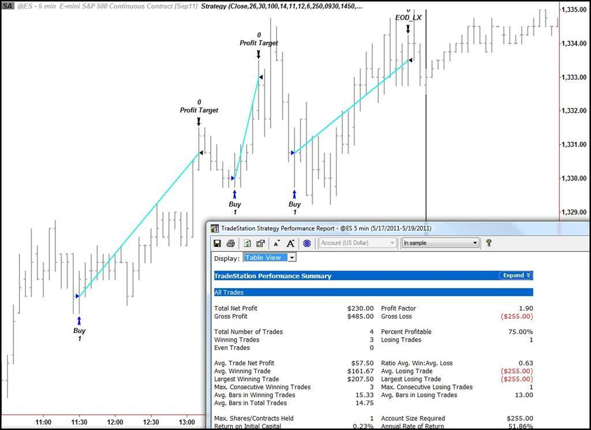

Automated trading, often referred to as algorithmic or algo trading, has significantly transformed the trading landscape by leveraging sophisticated computer algorithms to enable precise and efficient trading strategies. These systems allow traders to execute complex strategies with minimal human intervention, using pre-defined criteria encoded into trading software. As technology continues to advance, automated trading systems have become increasingly prevalent, allowing for swift and emotion-free trading decisions that enhance efficiency and reliability. 

Automated trading systems have the capability to handle significant volumes of transactions, thereby potentially representing a large percentage of activity on major stock exchanges. These systems are lauded for their ability to execute pre-programmed instructions for variables such as timing, price, and quantity, without the influence of human emotions, which can often negatively impact trading outcomes. The ability to backtest strategies on historical data offers additional assurance, allowing traders to refine their approaches before committing to live trades.



This article endeavors to explore the benefits and drawbacks of automated trading systems, offering insights into their operation and potential impact on trading success. Understanding these elements is essential for individuals contemplating the shift from manual to automated trading. Such knowledge is crucial for harnessing the power of automated systems while navigating challenges such as mechanical failures, over-optimization, and reliance on technology. As the financial markets increasingly adopt automated solutions, acquiring a comprehensive understanding of their potential and pitfalls becomes a vital step for traders aiming for sustained success.

## Table of Contents

## Understanding Automated Trading Systems

Automated trading systems are designed to execute trades automatically based on a set of predefined criteria embedded within their software. These rules can encompass various trading strategies, including but not limited to, technical indicators, chart patterns, or even more complex algorithms that require sophisticated data analysis.

The core functionality of these systems lies in their ability to operate independently, eliminating the need for human involvement in the trading process. Such autonomy allows for rapid order execution, enabling traders to respond swiftly to market conditions. In practice, automated trading systems account for a substantial portion of transactions conducted on modern stock exchanges, contributing significantly to overall market liquidity.

One of the primary advantages of automated trading systems is their capacity to strip human emotions from the trading equation. Emotional trading can lead to erratic decision-making, often resulting in financial losses. By relying on a systematic approach, automated systems can maintain consistency and precision, adhering strictly to the established parameters of the trading strategy without succumbing to fear or greed.

Moreover, automated trading systems can be programmed to handle a variety of scenarios and market conditions, thereby providing traders with the tools to manage risks effectively and optimize their strategies for better performance. As technology continues to evolve, the sophistication and efficiency of these systems are expected to enhance further, offering traders even greater potential to capitalize on market opportunities.

## Pros of Automated Trading Systems

Automated trading systems are designed to execute trades based on predefined rules and strategies without the need for human intervention. This technology offers several advantages that make it appealing to traders looking for efficiency and reduced emotional involvement.

### Minimizing Emotions

One of the primary benefits of automated trading is its ability to eliminate emotions from the trading process. Human traders often struggle with emotional responses such as fear and greed, leading to impulsive decisions that can negatively impact profitability. Automated systems strictly adhere to their programmed strategy, ensuring that trades are executed based on logic and data rather than emotional impulses. This consistent approach can lead to more disciplined trading practices and potentially better long-term results.

### Backtesting Capabilities

Backtesting is a crucial feature of automated trading systems. It allows traders to test their strategies against historical market data, providing insights into how the strategy would have performed in past market conditions. By simulating trades over a specified period, traders can assess the viability of their strategies before deploying them in live markets. This process helps identify any flaws or weaknesses, enabling traders to refine and optimize their strategies. In Python, for instance, libraries such as `pandas` and `[backtrader](/wiki/backtrader)` offer tools for conducting backtests, allowing traders to analyze performance metrics comprehensively.

### Consistency and Discipline

Automated trading systems ensure the execution of trades exactly as planned, providing a level of consistency and discipline that is often challenging to achieve manually. The precision of following a set algorithm means that strategies are not influenced by human errors or second-guessing. This consistency can be particularly beneficial in volatile markets, where quick reactions are necessary to capitalize on fleeting opportunities.

### Speed

The speed at which automated trading systems operate is another significant advantage. These systems can monitor market conditions and execute trades much faster than a human ever could. By entering and exiting trades swiftly, automated systems can take full advantage of even the smallest price movements. The high-frequency trading ([HFT](/wiki/high-frequency-trading-strategies)) aspect of automation is one area where speed is paramount. In such scenarios, trades are executed in fractions of a second, turning speed into a key competitive advantage.

### Diversification

Diversification is a strategy used to spread risk across multiple assets or markets, and automated trading systems make this easier to implement. By managing multiple accounts or strategies simultaneously, automated trading allows traders to spread their investments across different markets and asset classes automatically. This concurrent management can enhance risk-adjusted returns, as losses in one area may be offset by gains in another. Systems can be programmed to allocate resources dynamically based on market signals, allowing for a more comprehensive approach to risk management.

Overall, the implementation of automated trading systems can allow traders to capitalize on market opportunities while maintaining consistency and discipline in execution, ultimately enhancing overall trading performance and reducing potential errors attributable to human emotions.

## Cons of Automated Trading Systems

Automated trading systems offer numerous benefits, but they also come with certain drawbacks that traders must consider. One significant issue relates to mechanical failures, which are inherent risks associated with any technology-dependent process. Technical glitches, such as software bugs or hardware malfunctions, can lead to substantial financial losses if not promptly addressed. For instance, a malfunctioning algorithm might execute trades erroneously, resulting in unexpected market positions.

Additionally, automated trading systems require continuous monitoring to ensure optimal performance. Although these systems are designed to operate with minimal human intervention, they still need oversight to verify that they are functioning correctly. Market conditions can change rapidly, and an unmonitored system might not adapt to new market dynamics effectively, potentially leading to undesired outcomes.

Another concern is over-optimization, which occurs when a trading strategy is excessively fine-tuned to fit historical data. While [backtesting](/wiki/backtesting) strategies against past data is a crucial aspect of developing automated systems, over-optimization can result in a model that performs well on historical data but poorly in real-time trading. This phenomenon, known as "curve fitting," can give a false sense of security and lead to disappointing performance in live markets.

Finally, reliance on technology means that automated trading systems are susceptible to internet connectivity issues. An internet outage or a slowdown in data feeds can delay trade execution, negatively impacting profitability. In scenarios where timing is crucial, such delays can result in missed opportunities or exacerbated losses.

Overall, while automated trading systems streamline transactions and minimize emotional influences, they necessitate careful oversight and preparedness for technological issues. Traders must remain vigilant and ensure that adequate contingency plans are in place to address potential system failures and disruptions.

## Avoiding Scams in Automated Trading

Investing in automated trading systems requires diligence to avoid falling victim to scams, which are unfortunately prevalent in the trading industry. A critical first step is thorough research into any system you are considering. Legitimate systems usually have a track record that can be verified through reviews and feedback from other traders. Websites, forums, and reputable financial publications can be good sources of information regarding the reliability and legitimacy of a trading system. 

Prospective users should be cautious of offers that seem exceptionally promising or claim guaranteed returns, as these are often deceptive. The adage "if it sounds too good to be true, it probably is" applies well to these situations. Transparency about the underlying trading strategy and its historical performance is key to assessing potential systems.

It's also prudent to look for trading systems that offer a trial period or a demo account. These features allow you to test the system before committing significant funds, providing an opportunity to evaluate its practical workings and whether it aligns with your trading goals. Real user feedback, especially in independent reviews or comments on trusted forums, can provide insights into the user experience and the system's performance under different market conditions.

By establishing these precautionary measures, traders can significantly mitigate the risk of falling prey to fraudulent schemes and instead focus on selecting a reliable automated trading system that fits their needs.

## Server-Based Automation for Enhanced Reliability

Server-based automation in trading offers substantial advantages for reliability and speed, addressing concerns associated with local hardware and connectivity limitations. By utilizing server-based platforms, traders can mitigate risks related to personal computer malfunctions, such as power outages or internet disruptions. Server hosting services generally offer robust infrastructure, ensuring continuous and seamless operation of trading algorithms, which is paramount in markets where milliseconds can determine profitability.

The architecture of server-based trading systems typically involves colocating trading algorithms close to stock exchange servers. This proximity reduces latency, enhancing the speed at which trades are executed. The reduced latency is advantageous for high-frequency trading strategies, where the ability to act on fleeting market opportunities is crucial.

Server-based platforms often include sophisticated backup and recovery processes, increasing fault tolerance. If a primary server experiences an issue, system redundancy protocols ensure the swift transition to a backup server without interrupting trading activities. Additionally, server-based systems incorporate advanced security measures to protect sensitive trading data, employing encryption techniques and regular audits to safeguard against cyber threats.

Traders opting for server-based automation also benefit from scalable resources. As trading strategies grow in complexity or require more computational power, server resources can be adjusted accordingly without significant reconfiguration efforts. This scalability enables traders to implement more sophisticated algorithms and manage a larger [volume](/wiki/volume-trading-strategy) of trades efficiently.

Moreover, server-based solutions frequently provide comprehensive monitoring and reporting tools. These features allow traders to observe real-time system performance and receive alerts for any anomalies or potential issues. Continuous monitoring minimizes the need for manual oversight and ensures that trading operations remain smooth and aligned with the intended strategy.

In conclusion, server-based automation enhances the reliability and efficiency of automated trading systems by addressing connectivity and hardware concerns. This approach ensures that trading algorithms operate with minimal interruptions, maximizing speed and accuracy—key factors in the success of automated trading.

## Evaluating Whether to Automate

When considering whether to transition from manual to automated trading, assessing your experience level is crucial. Automated trading, while offering numerous benefits, is not ideal for beginners. New traders may lack the necessary understanding of market dynamics and strategies, which automated systems assume as a baseline for executing trades. 

Before embracing automation, it is important to evaluate whether manual or automated trading aligns better with your trading style and risk tolerance. Manual trading allows a personal touch in decision-making, often relying on intuition and real-time assessment, while automated trading removes emotion, offering precision and quicker execution. Determine your comfort level with letting algorithms make trading decisions and consider how well you manage risks and adapt to market changes.

Starting with simple strategies is advisable when moving to automated systems. Basic strategies may include moving average crossovers or simple [breakout](/wiki/breakout-trading) strategies, which are easier to understand and tweak. For instance, a simple moving average crossover strategy could be implemented in Python as follows:

```python
import pandas as pd

# Load trading data
data = pd.read_csv('historical_prices.csv')

# Calculate simple moving averages
data['SMA5'] = data['Close'].rolling(window=5).mean()
data['SMA20'] = data['Close'].rolling(window=20).mean()

# Generate trading signals
data['Signal'] = 0
data['Signal'][5:] = np.where(data['SMA5'][5:] > data['SMA20'][5:], 1, 0)

# Calculate strategy returns
data['Strategy'] = data['Signal'].shift(1) * (data['Close'].pct_change())

# Output the strategy performance
performance = data['Strategy'].cumsum().apply(np.exp)
print(performance.tail())
```

As you grow in proficiency, you can advance to more complex systems, incorporating additional indicators or programming sophisticated decision-making algorithms. It is crucial to continuously test these strategies within a risk-managed framework to ensure they perform effectively under various market conditions. 

In conclusion, evaluating whether to automate requires introspection into your trading aptitude, willingness to learn, and adaptability to leverage technology while maintaining control over your trading objectives.

## The Bottom Line

Automated trading systems present a compelling choice for traders seeking efficiency and precision in executing trades. These systems provide a significant edge by minimizing the emotional component that often clouds decision-making in manual trading. The rapid execution capabilities allow positions to be entered and exited at optimal times, potentially maximizing profitability.

However, successful utilization of automated trading requires a thorough understanding of trading principles and experience in the market. This knowledge enables traders to develop and implement effective strategies tailored to their objectives and risk tolerance. A comprehensive approach to risk management is also essential, as is regularly monitoring the system to ensure it performs as expected.

While automated trading can enhance strategy execution, it is not a foolproof solution. Traders must exercise diligence in designing and maintaining their algorithms, ensuring they remain adaptive to changing market conditions. Proper backtesting of strategies using historical data can help evaluate their potential effectiveness, yet it's crucial to recognize that past performance does not guarantee future results.

Incorporating a disciplined approach to [algorithmic trading](/wiki/algorithmic-trading), coupled with ongoing analysis and adjustments, positions traders to capitalize on market opportunities while mitigating risks. When strategically managed, automated trading systems can be a powerful tool for elevating trading efficiency and performance.

## References & Further Reading

[1]: Bergstra, J., Bardenet, R., Bengio, Y., & Kégl, B. (2011). ["Algorithms for Hyper-Parameter Optimization."](https://proceedings.neurips.cc/paper/2011/file/86e8f7ab32cfd12577bc2619bc635690-Paper.pdf) Advances in Neural Information Processing Systems 24.

[2]: ["Advances in Financial Machine Learning"](https://www.amazon.com/Advances-Financial-Machine-Learning-Marcos/dp/1119482089) by Marcos Lopez de Prado

[3]: ["Evidence-Based Technical Analysis: Applying the Scientific Method and Statistical Inference to Trading Signals"](https://www.amazon.com/Evidence-Based-Technical-Analysis-Scientific-Statistical/dp/0470008741) by David Aronson

[4]: ["Machine Learning for Algorithmic Trading"](https://github.com/stefan-jansen/machine-learning-for-trading) by Stefan Jansen

[5]: ["Quantitative Trading: How to Build Your Own Algorithmic Trading Business"](https://github.com/LucindaYa/quant-resources/blob/master/Quantitative%20Trading%20How%20to%20Build%20Your%20Own%20Algorithmic%20Trading%20Business.pdf) by Ernest P. Chan