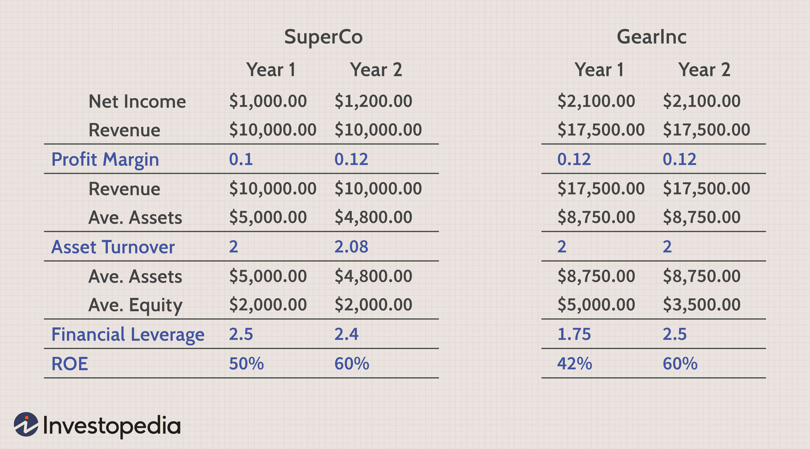

In finance, understanding a company's financial health is critical for investors, particularly in automated trading environments. A comprehensive evaluation of financial performance allows investors to make informed decisions, which is essential for minimizing risk and maximizing returns in the fast-paced market that characterizes algorithmic trading.

One of the preferred tools for conducting such an evaluation is the DuPont Analysis, which offers a detailed examination of Return on Equity (ROE). The traditional metric, ROE, is a crucial indicator of a company’s profitability relative to shareholders' equity, but its utility is notably enhanced when broken down into three fundamental components: profit margin, asset turnover, and financial leverage. This decomposition aids in understanding the underlying drivers of financial performance. 



The DuPont Analysis expresses ROE as:

$$

\text{ROE} = \text{Profit Margin} \times \text{Asset Turnover} \times \text{Equity Multiplier} 
$$

Each component in this equation provides valuable insights:
- **Profit Margin** measures how much profit a company makes for each dollar of sales and indicates cost control and pricing strategies.
- **Asset Turnover** assesses the efficiency with which a company uses its assets to generate sales.
- **Equity Multiplier** reflects the degree of financial leverage being utilized by the company.

By dissecting ROE into these elements, DuPont Analysis allows investors and analysts to pinpoint the exact areas driving a company’s performance. This analytical approach is particularly beneficial in automated trading, where models can be programmed to quickly process large datasets and react to insights drawn from these financial ratios.

This article will explore both the advantages and disadvantages of using DuPont Analysis for financial assessments while emphasizing its application in automated trading systems. By understanding the strengths and limitations of this tool, investors can enhance the rigor of their financial analysis and formulate more robust trading strategies.

## Table of Contents

## Understanding DuPont Analysis

Developed by the DuPont Corporation in the early 20th century, DuPont Analysis has established itself as a fundamental analytical tool in finance by offering a comprehensive method to evaluate a company's financial performance. At its core, the method deconstructs Return on Equity (ROE) into three distinct components: Net Profit Margin, Asset Turnover, and Equity Multiplier. This breakdown helps analysts identify and understand the specific factors contributing to a company's financial outcomes.

**Net Profit Margin** is the first component in DuPont Analysis and reflects the efficiency with which a company converts its revenues into actual profit. Essentially, it measures how much profit is generated from total sales, providing insight into cost management and pricing strategies. Mathematically, it can be expressed as:

$$
\text{Net Profit Margin} = \frac{\text{Net Income}}{\text{Revenue}}
$$

**Asset Turnover** examines how efficiently a company utilizes its assets to generate revenue, serving as a benchmark for operational efficiency. A higher asset turnover ratio indicates that the company is generating more revenue per dollar of assets, signaling effective use of company resources. The formula for this component is:

$$
\text{Asset Turnover} = \frac{\text{Revenue}}{\text{Average Total Assets}}
$$

**Equity Multiplier**, the third component, assesses the degree of financial leverage used by a company, highlighting how much of the assets are financed by shareholders’ equity as opposed to debt. This metric elucidates the extent to which a firm is using leverage to enhance return on equity. The formula is represented as:

$$
\text{Equity Multiplier} = \frac{\text{Average Total Assets}}{\text{Average Shareholders' Equity}}
$$

Combining these three components, DuPont Analysis provides a comprehensive formula for ROE as follows:

$$
\text{ROE} = \text{Net Profit Margin} \times \text{Asset Turnover} \times \text{Equity Multiplier}
$$

This formula allows analysts to examine a company's financial statement and isolate the specific drivers of its ROE. By evaluating each component individually, analysts can identify whether a company's performance is driven by profitability, efficiency, or leverage, thereby offering valuable insights for strategic financial planning and decision-making.

## Advantages of DuPont Analysis

DuPont Analysis offers several advantages in assessing a company's financial performance. One of its primary strengths lies in providing a comprehensive view that extends beyond standard financial metrics. By dissecting Return on Equity (ROE) into three fundamental components—Net Profit Margin, Asset Turnover, and Equity Multiplier—DuPont Analysis allows investors to gain deeper insights into what is driving a company's financial success.

A key advantage of this methodology is its ability to enable detailed comparative analysis within industries. By breaking down ROE, investors and analysts can establish performance benchmarks, making it easier to compare companies operating within the same sector. This comparative capability is crucial for identifying which firms are excelling in aspects like cost management or operational efficiency, which are not immediately apparent through basic financial statements.

For investors focused on identifying company strengths, the DuPont model is particularly valuable. It shines in highlighting operational efficiencies or unique cost management strategies that contribute to increased profit margins. For example, a company may have a high ROE due to an exceptional profit margin stemming from superior operational practices or rigorous cost controls. Alternatively, another company might achieve similar ROE through impressive asset turnover, indicating effective use of its assets to generate sales.

This multidimensional insight provided by DuPont Analysis makes it an essential tool for investors seeking to understand the underlying drivers of financial performance. By pinpointing specific strengths, investors can make more informed decisions based on a company's ability to manage costs and optimize operational efficiencies, thus achieving higher profitability.

## Disadvantages of DuPont Analysis

DuPont Analysis, while a powerful tool for dissecting the Return on Equity (ROE), has certain disadvantages that investors should be cognizant of. A fundamental limitation is its reliance on accurate and reliable accounting data. Financial statements must be precise, as even minor discrepancies can lead to significantly misleading insights into a company’s true financial health. For example, inaccuracies in reporting net income, total assets, or shareholder equity can skew the Net Profit Margin, Asset Turnover, and Equity Multiplier, respectively, all of which are critical components of the DuPont formula:

$$

\text{ROE} = \text{Net Profit Margin} \times \text{Asset Turnover} \times \text{Equity Multiplier}
$$

Moreover, the complexity of the DuPont Analysis model increases with the inclusion of additional variables such as taxes and interest, which can extend beyond the basic three-step model. This complexity necessitates more sophisticated adjustments and calculations. For instance, incorporating tax impacts requires understanding effective tax rates and their effects on net income. Similarly, interest payments can alter profitability and leverage assessments, thus requiring careful consideration and adjustment to ensure that the ROE representation remains intact and meaningful.

Another notable shortcoming of DuPont Analysis is its exclusion of non-financial factors and future-value metrics. The model focuses solely on historical financial data, overlooking qualitative aspects like management effectiveness, market conditions, or industry trends that might influence future performance. This limitation means that additional analyses are required to gain a holistic view. Investors often need to supplement DuPont Analysis with other financial evaluation tools and qualitative assessments to account for variables that don’t fit neatly into quantitative measures. This could involve incorporating financial forecasts, market analysis, and evaluations of strategic initiatives to understand the likely paths of future performance.

In conclusion, while DuPont Analysis has its set of advantages, the need for accurate data, consideration for additional variables, and the absence of non-quantifiable insights necessitate its use as part of a broader analytical framework to ensure well-rounded financial evaluations.

## DuPont Analysis in Algorithmic Trading

Combining DuPont Analysis with [algorithmic trading](/wiki/algorithmic-trading) strategies offers traders a sophisticated approach that elevates decision-making processes. DuPont Analysis effectively dissects Return on Equity (ROE) into three distinctive components: Net Profit Margin, Asset Turnover, and Equity Multiplier. Understanding these components allows traders to take a more granular view of a company's financial health, which is essential in creating precise algorithmic models for trading.

Algorithmic trading involves executing trading orders using pre-programmed, automated strategies. Integrating DuPont Analysis in this context means these strategies can be adjusted based on insights derived from financial ratios. For instance, an algorithm can be designed to select stocks with high asset turnover ratios combined with favorable profit margins, indicating operational efficiency and profitability. The formula for ROE as depicted by DuPont is:

$$
\text{ROE} = \frac{\text{Net Income}}{\text{Sales}} \times \frac{\text{Sales}}{\text{Total Assets}} \times \frac{\text{Total Assets}}{\text{Shareholder's Equity}}
$$

This integration creates a powerful tool for enhancing precision in trading decisions. High-frequency trading ([HFT](/wiki/high-frequency-trading-strategies)) benefits particularly from such methodologies, as it depends on swift assessments of stock performances to capture market opportunities. By automating the analysis of financial statements and translating this data into actionable algorithms, traders can exploit minor price discrepancies efficiently.

In practical terms, an example of implementing such a strategy could involve a Python script where real-time financial data feeds into an algorithm assessing stocks based on DuPont-derived criteria. The strategy could look like this:

```python
def select_stocks(data):
    # Assuming 'data' is a DataFrame with necessary columns
    data['ROE'] = (data['Net Income'] / data['Sales']) * (data['Sales'] / data['Total Assets']) * \
                  (data['Total Assets'] / data['Equity'])
    selected_stocks = data[(data['Net Profit Margin'] > 0.05) & 
                           (data['Asset Turnover'] > 1.0) & 
                           (data['Equity Multiplier'] < 3.0)]
    return selected_stocks

# Example use of select_stocks function
# stock_data = fetch_real_time_data()  # This function would get updated market data
# chosen_stocks = select_stocks(stock_data)
# execute_trade(chosen_stocks)  # This function would automate the trade execution
```

Such automation highlights the advantage of integrating DuPont Analysis into trading algorithms by ensuring strategies are not only based on historical data patterns but are also aligned with the fundamental financial health indicators of companies. This method supports traders in making informed and rapid decisions, aiding in securing positions that could maximize return while managing risk effectively.

## Case Studies: Practical Applications

DuPont Analysis has been utilized across various industries to discern financial health by dissecting Return on Equity (ROE) into its fundamental components: profit margin, asset turnover, and financial leverage. This approach allows for a granular comparison of companies with similar ROE but different financial structures.

**Retail Sector**: In the retail industry, two companies might achieve similar ROE levels through different means. For example, a company like Walmart might exhibit a high asset turnover ratio due to its efficient inventory management and rapid sales cycle, offsetting a narrower profit margin. Meanwhile, a niche retailer like Tiffany & Co. could maintain its ROE through a higher profit margin derived from premium pricing, despite having a lower asset turnover. This highlights strategic contrasts where Walmart focuses on scale and efficiency, while Tiffany & Co. prioritizes brand exclusivity and pricing power.

**Technology Sector**: Within the tech sector, companies such as Apple and Microsoft may use varying strategies to achieve comparable ROE figures. Apple's strategy often emphasizes high profit margins, stemming from premium product pricing and brand equity. Conversely, a company like Microsoft might lean more on asset turnover, particularly through its expansive software services and cloud solutions, which require investments in infrastructure and maintain a lower marginal cost over time. These variations underscore strategic focuses—Apple’s concentration on product differentiation and Microsoft’s diverse service and subscription-based models.

**Manufacturing Sector**: In manufacturing, firms such as General Motors (GM) and Tesla can achieve similar ROE figures through diverse paths. GM might leverage financial strategies with significant emphasis on the equity multiplier, utilizing debt to finance extensive operations globally, while maintaining moderate profit margins. On the other hand, Tesla could achieve its ROE through high profit margins supported by industry-leading innovation and brand perception, combined with operational efficiencies in production and distribution. These examples illustrate the focus on leveraging financial contracts versus innovation-driven profitability in manufacturing.

The differentiation in strategies highlights the DuPont Analysis' strength in identifying underlying operational priorities and strategic focuses across industries. Companies with similar ROE can pursue entirely different paths focusing either on maximizing revenue per asset, managing expenses to boost margin, or optimizing capital structure to amplify returns. This flexibility makes DuPont Analysis a versatile tool in financial assessments, enabling investors to understand the mechanics behind financial performance beyond surface-level metrics.

## Conclusion

DuPont Analysis serves as a powerful tool by distilling complex financial data into more understandable components, which is crucial for investors aiming to assess a company's financial integrity thoroughly. By dissecting the Return on Equity (ROE) into net profit margin, asset turnover, and financial leverage, DuPont Analysis provides clarity on which aspects of a company's operations are driving performance, thus enabling more comprehensive evaluations.

The integration of DuPont Analysis within algorithmic trading frameworks signifies a notable advancement in financial analysis. Algorithmic trading relies on precision and speed, and by employing a structured examination of a company's financial statements, investors can make more informed and timely decisions. This synthesis allows for improved algorithmic model accuracy, as trading strategies can be tailored to specific financial insights, leading to enhanced trading outcomes and more refined risk management.

However, the effective use of DuPont Analysis is contingent upon its limitations. For instance, it relies heavily on current financial data, which may not account for future potential or non-financial factors like market conditions and competitive positioning. Despite these constraints, its ability to provide a granular view of financial performance makes it an indispensable part of the modern investor's toolkit. It equips investors with a detailed understanding, aiding in the identification of operational strengths and strategic assets that contribute to a company’s ROE, thus optimizing investment decisions in today's fast-paced financial markets.

## References & Further Reading

### References & Further Reading

For individuals keen on mastering DuPont Analysis, the following resources offer valuable insights and academic depth:

1. **"Financial Statement Analysis" by Charles H. Gibson** - This book provides comprehensive coverage of financial statement analysis techniques, including a detailed discussion on DuPont Analysis and its implementation in evaluating company performance. Gibson's work is beneficial for both beginners and seasoned accountants interested in dissecting financial data.

2. **"Investment Valuation: Tools and Techniques for Determining the Value of Any Asset" by Aswath Damodaran** - Known for his expertise in valuation, Damodaran's text offers a perspective on various valuation methods, touching upon the importance of financial ratios derived from analyses like DuPont, especially within investment contexts.

3. **"The Art of Company Valuation and Financial Statement Analysis: A Value Investor’s Guide with Real-life Case Studies" by Nicolas Schmidlin** - This resource is particularly useful for value investors, providing real-world case studies that illustrate how DuPont Analysis can be used to derive actionable insights in financial evaluations.

4. **Journal Article: "Disaggregating the Return on Equity: The Use of Financial Statement Analysis for Managerial and Investment Decisions"** - Published in the *Journal of Financial Economics*, this article discusses the practical implications and benefits of decomposing ROE using DuPont Analysis, offering an academic perspective that enhances understanding of its utility in various financial decisions.

5. **"Algorithmic Trading & DMA: An introduction to direct access trading strategies" by Barry Johnson** - This book serves as a primer for integrating financial data analyses, like DuPont Analysis, into algorithmic trading strategies. It covers how ratios and financial health indicators inform trading algorithms, thus providing a real-world linkage between finance and technology.

6. **Python Libraries and Tools** - Utilizing programming tools like the `pandas` and `numpy` libraries in Python can greatly facilitate the automation of financial analyses, including DuPont Analysis. These tools help in processing financial data efficiently, allowing for real-time integration with trading applications.

For further exploration, readers are encouraged to engage with online financial courses and platforms like Coursera or edX, which frequently offer modules on financial analysis methods, including DuPont Analysis, often paired with practical data science applications. Engaging with financial forums, professional groups, or attending webinars will also enhance one's understanding and keep practitioners updated on the latest trends in financial analytics and algorithmic trading.