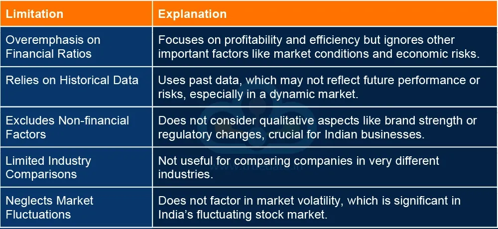

## Table of Contents

## What is DuPont Analysis?

DuPont Analysis is a way to understand how a company makes profits. It breaks down the return on equity (ROE) into three parts: profit margin, asset turnover, and financial leverage. This helps people see which parts of the business are doing well and which need improvement. By looking at these three parts, you can figure out if the company is good at making money from sales, using its assets efficiently, or using debt smartly.

The first part, profit margin, shows how much profit the company makes from each dollar of sales. A high profit margin means the company keeps more money from each sale. The second part, asset turnover, tells us how well the company uses its assets to make sales. If asset turnover is high, the company is using its assets efficiently. The last part, financial leverage, shows how much the company uses debt to boost its returns. More debt can increase returns but also increases risk. By understanding these three parts, you can get a clearer picture of a company's financial health.

## Who developed the DuPont Analysis and why?

The DuPont Analysis was developed by a company called DuPont Corporation in the 1920s. DuPont is a big company that makes chemicals and other products. They wanted a better way to understand how their business was doing and where they could improve. So, they came up with this method to break down their return on equity into simpler parts.

The reason DuPont developed this analysis was to help their managers see the different ways they could increase profits. By looking at profit margin, asset turnover, and financial leverage separately, they could figure out if they needed to focus on making more money from each sale, using their assets better, or managing their debt more wisely. This helped DuPont become more efficient and successful, and now many other companies use this method too.

## What are the three main components of DuPont Analysis?

The three main components of DuPont Analysis are profit margin, asset turnover, and financial leverage. Profit margin shows how much profit a company makes from each dollar of sales. It's like seeing how much money you keep after you pay for things to make your product. If your profit margin is high, it means you're good at making money from your sales.

Asset turnover tells you how well a company uses its things, like machines or buildings, to make sales. It's about how efficiently the company is using what it owns to bring in money. A high asset turnover means the company is using its assets well to make more sales. Financial leverage shows how much a company uses borrowed money to try to make more profit. It's like using a loan to buy something that can make you more money. More debt can help increase returns, but it also makes things riskier. By looking at these three parts, you can see what a company is doing well and where it might need to improve.

## How does DuPont Analysis help in understanding a company's financial performance?

DuPont Analysis helps you see how a company makes money by breaking down its return on equity into three simple parts: profit margin, asset turnover, and financial leverage. Think of it like looking at a puzzle. Each piece tells you something important about the company. Profit margin shows how much money the company keeps from each sale. If it's high, the company is good at making money from what it sells. Asset turnover tells you how well the company uses its stuff, like machines or buildings, to make sales. If it's high, the company is using what it owns well. Financial leverage shows how the company uses borrowed money to try to make more profit. Using more debt can help increase returns, but it also makes things riskier.

By looking at these three pieces together, you get a clear picture of where the company is doing well and where it needs to improve. For example, if the profit margin is low, the company might need to find ways to cut costs or raise prices. If asset turnover is low, it might mean the company needs to use its machines or buildings more efficiently. And if financial leverage is high, it might be using too much debt, which could be risky. DuPont Analysis makes it easier to understand the company's financial health and helps managers make better decisions to improve performance.

## What are the advantages of using DuPont Analysis for beginners?

DuPont Analysis is great for beginners because it breaks down how a company makes money into three easy-to-understand parts: profit margin, asset turnover, and financial leverage. This makes it simpler for someone new to finance to see what's going on with a company's money. Instead of looking at one big number like return on equity, you can see how the company is doing in three different areas. It's like looking at a puzzle and understanding each piece, which makes the whole picture clearer.

For someone just starting to learn about business, DuPont Analysis can help you see where a company is doing well and where it might need to improve. If the profit margin is high, it means the company is good at making money from sales. If asset turnover is high, it means the company is using its stuff, like machines or buildings, efficiently. And if financial leverage is high, it means the company is using debt to try to make more money, but this can also be risky. By understanding these three parts, beginners can get a better idea of a company's financial health and make smarter decisions about investing or managing a business.

## Can DuPont Analysis be applied to all types of businesses?

DuPont Analysis can be used for many types of businesses, but it works best for companies that have a lot of assets and use debt. It helps you see how well a company is making money from its sales, using its stuff like machines or buildings, and using borrowed money. If a business doesn't have a lot of assets or doesn't use much debt, DuPont Analysis might not be as helpful. For example, a small shop that doesn't own a lot of things or borrow money might not get much out of this analysis.

Even though DuPont Analysis is great for understanding big companies with lots of assets and debt, it can still be used for other businesses if you understand its limits. You just need to know that the three parts—profit margin, asset turnover, and financial leverage—might not be as important for every type of business. So, while it's a useful tool for many companies, it's not perfect for all of them.

## What are the limitations of DuPont Analysis for a novice user?

DuPont Analysis can be a bit tricky for someone new to finance. It breaks down how a company makes money into three parts: profit margin, asset turnover, and financial leverage. But understanding what each part means and how they work together might be hard for beginners. For example, figuring out why a low profit margin is bad or what a high asset turnover really tells you about the business can take some time to learn. Also, if a company doesn't have a lot of assets or doesn't use much debt, DuPont Analysis might not be very helpful. So, a novice might find it hard to see the full picture of the company's financial health just by using this method.

Another thing to keep in mind is that DuPont Analysis looks at the past. It tells you how the company did before, but it doesn't say much about what might happen in the future. This can be limiting for someone who wants to make decisions about investing or running a business. Plus, DuPont Analysis doesn't take into account things like the economy or what's happening in the industry, which can affect a company's performance. So, while it's a good tool to start with, beginners need to remember that it's just one piece of the puzzle and should be used along with other ways to look at a company's financial health.

## How can DuPont Analysis be integrated with other financial analysis tools?

DuPont Analysis can be used with other financial analysis tools to get a fuller picture of a company's health. One way to do this is by using it with ratio analysis. Ratio analysis looks at different numbers from a company's financial statements to see things like how well it's paying its bills or how much it's growing. When you use DuPont Analysis with ratio analysis, you can see not just how the company is making money, but also other important things like how quickly it's selling its stuff or how much debt it has compared to what it owns. This helps you understand the company better and make smarter decisions.

Another way to use DuPont Analysis with other tools is by looking at it alongside cash flow analysis. Cash flow analysis shows how money moves in and out of a company, which is important because a company can look good on paper but still have money problems. By combining DuPont Analysis with cash flow analysis, you can see if the company is good at making money and using its assets, but also if it has enough cash to keep going. This gives you a more complete view of the company's financial health and helps you see where it's doing well and where it might need to improve.

## What advanced techniques can be used to enhance the DuPont Analysis model?

To make DuPont Analysis even better, you can use something called the extended DuPont Analysis. This adds more parts to the basic model, like tax effects and how well the company is using its equity. By including these extra pieces, you get a more detailed look at what's affecting the company's return on equity. For example, you can see if taxes are eating into the company's profits or if the company isn't using its own money as well as it could. This helps you understand the business even better and find new ways to improve it.

Another advanced technique is to use DuPont Analysis over time, looking at trends. Instead of just looking at one year, you can see how the company's profit margin, asset turnover, and financial leverage change from year to year. This can show you if the company is getting better or worse at making money, using its stuff, or managing debt. By watching these trends, you can spot problems early and make smarter decisions about where to focus your efforts to help the company grow and succeed.

## How does DuPont Analysis compare to other financial ratio analysis methods?

DuPont Analysis is different from other financial ratio analysis methods because it breaks down the return on equity into three parts: profit margin, asset turnover, and financial leverage. This helps you see how a company makes money in a more detailed way. Other methods, like the current ratio or debt-to-equity ratio, focus on specific parts of the business, like how well a company can pay its bills or how much debt it has compared to what it owns. DuPont Analysis gives you a bigger picture of how the company is doing overall, which can be really helpful for understanding the whole business.

But DuPont Analysis isn't perfect for every situation. It's great for companies with a lot of assets and debt, but it might not be as useful for smaller businesses or ones that don't use much debt. Other ratio analysis methods can be better for looking at specific things, like how quickly a company sells its stuff or how much money it's making from its investments. By using DuPont Analysis along with other methods, you can get a fuller picture of a company's financial health. This helps you make better decisions about investing or managing the business.

## What are the potential pitfalls of relying solely on DuPont Analysis for financial decision-making?

Relying only on DuPont Analysis for making financial decisions can be risky because it doesn't tell you everything about a company. DuPont Analysis looks at how a company makes money by breaking down the return on equity into three parts: profit margin, asset turnover, and financial leverage. But it doesn't show you how the company is doing with other important things like paying its bills on time or how much cash it has. If you only use DuPont Analysis, you might miss out on seeing if the company has enough money to keep running or if it's growing fast enough. This can lead to bad decisions because you're not looking at the whole picture.

Another problem with using just DuPont Analysis is that it focuses on the past. It tells you how the company did before, but it doesn't say much about what might happen in the future. Things like changes in the economy or what's happening in the company's industry can affect how well it does, but DuPont Analysis doesn't take these things into account. So, if you make decisions based only on DuPont Analysis, you might not be ready for what's coming next. It's better to use DuPont Analysis along with other tools to get a full understanding of a company's financial health and make smarter choices.

## How can an expert use DuPont Analysis to forecast future financial performance?

An expert can use DuPont Analysis to forecast future financial performance by looking at trends over time. Instead of just looking at one year's numbers, the expert can study how the company's profit margin, asset turnover, and financial leverage have changed from year to year. By spotting patterns, the expert can make guesses about where these numbers might go in the future. For example, if the profit margin has been going up steadily, the expert might think it will keep going up, which could mean the company will make more money from its sales in the future.

But using DuPont Analysis to predict the future isn't perfect. It's based on past numbers, so it can't tell you everything about what might happen next. Things like changes in the economy, new laws, or what's happening in the company's industry can affect how well the company does, but DuPont Analysis doesn't take these things into account. So, an expert would use DuPont Analysis along with other tools, like looking at the company's plans for the future or what's happening in the world around it, to make a better guess about how the company will do in the future.

## What is DuPont Analysis and how can it be understood?

Developed by the DuPont Corporation in the early 20th century, DuPont Analysis has established itself as a fundamental analytical tool in finance by offering a comprehensive method to evaluate a company's financial performance. At its core, the method deconstructs Return on Equity (ROE) into three distinct components: Net Profit Margin, Asset Turnover, and Equity Multiplier. This breakdown helps analysts identify and understand the specific factors contributing to a company's financial outcomes.

**Net Profit Margin** is the first component in DuPont Analysis and reflects the efficiency with which a company converts its revenues into actual profit. Essentially, it measures how much profit is generated from total sales, providing insight into cost management and pricing strategies. Mathematically, it can be expressed as:

$$
\text{Net Profit Margin} = \frac{\text{Net Income}}{\text{Revenue}}
$$

**Asset Turnover** examines how efficiently a company utilizes its assets to generate revenue, serving as a benchmark for operational efficiency. A higher asset turnover ratio indicates that the company is generating more revenue per dollar of assets, signaling effective use of company resources. The formula for this component is:

$$
\text{Asset Turnover} = \frac{\text{Revenue}}{\text{Average Total Assets}}
$$

**Equity Multiplier**, the third component, assesses the degree of financial leverage used by a company, highlighting how much of the assets are financed by shareholders’ equity as opposed to debt. This metric elucidates the extent to which a firm is using leverage to enhance return on equity. The formula is represented as:

$$
\text{Equity Multiplier} = \frac{\text{Average Total Assets}}{\text{Average Shareholders' Equity}}
$$

Combining these three components, DuPont Analysis provides a comprehensive formula for ROE as follows:

$$
\text{ROE} = \text{Net Profit Margin} \times \text{Asset Turnover} \times \text{Equity Multiplier}
$$

This formula allows analysts to examine a company's financial statement and isolate the specific drivers of its ROE. By evaluating each component individually, analysts can identify whether a company's performance is driven by profitability, efficiency, or leverage, thereby offering valuable insights for strategic financial planning and decision-making.

## What are the disadvantages of DuPont Analysis?

DuPont Analysis, while a powerful tool for dissecting the Return on Equity (ROE), has certain disadvantages that investors should be cognizant of. A fundamental limitation is its reliance on accurate and reliable accounting data. Financial statements must be precise, as even minor discrepancies can lead to significantly misleading insights into a company’s true financial health. For example, inaccuracies in reporting net income, total assets, or shareholder equity can skew the Net Profit Margin, Asset Turnover, and Equity Multiplier, respectively, all of which are critical components of the DuPont formula:

$$

\text{ROE} = \text{Net Profit Margin} \times \text{Asset Turnover} \times \text{Equity Multiplier}
$$

Moreover, the complexity of the DuPont Analysis model increases with the inclusion of additional variables such as taxes and interest, which can extend beyond the basic three-step model. This complexity necessitates more sophisticated adjustments and calculations. For instance, incorporating tax impacts requires understanding effective tax rates and their effects on net income. Similarly, interest payments can alter profitability and leverage assessments, thus requiring careful consideration and adjustment to ensure that the ROE representation remains intact and meaningful.

Another notable shortcoming of DuPont Analysis is its exclusion of non-financial factors and future-value metrics. The model focuses solely on historical financial data, overlooking qualitative aspects like management effectiveness, market conditions, or industry trends that might influence future performance. This limitation means that additional analyses are required to gain a holistic view. Investors often need to supplement DuPont Analysis with other financial evaluation tools and qualitative assessments to account for variables that don’t fit neatly into quantitative measures. This could involve incorporating financial forecasts, market analysis, and evaluations of strategic initiatives to understand the likely paths of future performance.

In conclusion, while DuPont Analysis has its set of advantages, the need for accurate data, consideration for additional variables, and the absence of non-quantifiable insights necessitate its use as part of a broader analytical framework to ensure well-rounded financial evaluations.

## What is DuPont Analysis in Algorithmic Trading?

Combining DuPont Analysis with [algorithmic trading](/wiki/algorithmic-trading) strategies offers traders a sophisticated approach that elevates decision-making processes. DuPont Analysis effectively dissects Return on Equity (ROE) into three distinctive components: Net Profit Margin, Asset Turnover, and Equity Multiplier. Understanding these components allows traders to take a more granular view of a company's financial health, which is essential in creating precise algorithmic models for trading.

Algorithmic trading involves executing trading orders using pre-programmed, automated strategies. Integrating DuPont Analysis in this context means these strategies can be adjusted based on insights derived from financial ratios. For instance, an algorithm can be designed to select stocks with high asset turnover ratios combined with favorable profit margins, indicating operational efficiency and profitability. The formula for ROE as depicted by DuPont is:

$$
\text{ROE} = \frac{\text{Net Income}}{\text{Sales}} \times \frac{\text{Sales}}{\text{Total Assets}} \times \frac{\text{Total Assets}}{\text{Shareholder's Equity}}
$$

This integration creates a powerful tool for enhancing precision in trading decisions. High-frequency trading ([HFT](/wiki/high-frequency-trading-strategies)) benefits particularly from such methodologies, as it depends on swift assessments of stock performances to capture market opportunities. By automating the analysis of financial statements and translating this data into actionable algorithms, traders can exploit minor price discrepancies efficiently.

In practical terms, an example of implementing such a strategy could involve a Python script where real-time financial data feeds into an algorithm assessing stocks based on DuPont-derived criteria. The strategy could look like this:

```python
def select_stocks(data):
    # Assuming 'data' is a DataFrame with necessary columns
    data['ROE'] = (data['Net Income'] / data['Sales']) * (data['Sales'] / data['Total Assets']) * \
                  (data['Total Assets'] / data['Equity'])
    selected_stocks = data[(data['Net Profit Margin'] > 0.05) & 
                           (data['Asset Turnover'] > 1.0) & 
                           (data['Equity Multiplier'] < 3.0)]
    return selected_stocks

# Example use of select_stocks function
# stock_data = fetch_real_time_data()  # This function would get updated market data
# chosen_stocks = select_stocks(stock_data)
# execute_trade(chosen_stocks)  # This function would automate the trade execution
```

Such automation highlights the advantage of integrating DuPont Analysis into trading algorithms by ensuring strategies are not only based on historical data patterns but are also aligned with the fundamental financial health indicators of companies. This method supports traders in making informed and rapid decisions, aiding in securing positions that could maximize return while managing risk effectively.

## References & Further Reading

#