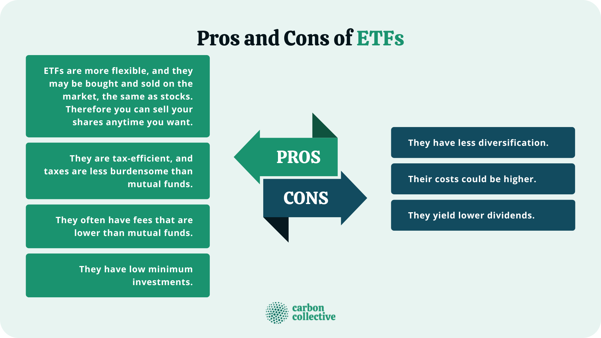

## Table of Contents

## What are exchange-traded funds (ETFs)?

Exchange-traded funds, or ETFs, are a type of investment that works a lot like a mutual fund but trades on a stock exchange like a stock. They are designed to track the performance of a specific index, like the S&P 500, a commodity, bonds, or a basket of assets. This means when you buy shares of an ETF, you're buying a small piece of everything that's in that index or basket.

ETFs are popular because they offer a way to diversify your investments easily and at a lower cost than buying all the individual stocks or assets yourself. They are also very flexible because you can buy and sell them throughout the trading day at market prices, unlike mutual funds which are only priced at the end of the day. This makes ETFs a handy tool for both new and experienced investors looking to build a varied investment portfolio.

## How do ETFs differ from mutual funds?

ETFs and mutual funds are both ways to invest in a bunch of different things at once, but they work a bit differently. ETFs are traded on stock exchanges, just like stocks. This means you can buy and sell them anytime during the trading day at the current market price. Mutual funds, on the other hand, are bought and sold at the end of the trading day at a price that's calculated once, based on the total value of all the investments in the fund.

Another big difference is how they're managed and what they cost. ETFs usually track an index, like the S&P 500, and they often have lower fees because they're not actively managed. Mutual funds can be actively managed, which means someone is picking and choosing what goes into the fund to try to beat the market. This active management can lead to higher fees for mutual funds. So, if you're looking for a cheaper, more hands-off way to invest, ETFs might be the way to go, but if you want someone to actively manage your investments, you might prefer a mutual fund.

## What are the main advantages of investing in ETFs for beginners?

Investing in ETFs can be a great choice for beginners because they are easy to understand and use. ETFs let you invest in a whole bunch of different things, like stocks or bonds, all at once. This is called diversification, and it helps spread out your risk. Instead of putting all your money into one company, you're investing in a whole group of them. This makes it less likely that you'll lose a lot of money if one company does badly.

Another big plus for beginners is that ETFs usually have lower fees than other types of investments like mutual funds. This means you get to keep more of your money. Also, ETFs are traded on stock exchanges, so you can buy and sell them whenever the market is open. This gives you more control over your investments. Plus, you can start with a small amount of money, making it easier for beginners to get started without needing a lot of cash upfront.

## Can you explain the concept of liquidity in relation to ETFs?

Liquidity is how easy it is to buy or sell something without affecting its price too much. For ETFs, liquidity is important because it means you can quickly turn your investment into cash if you need to. ETFs are usually very liquid because they trade on stock exchanges, just like stocks. This means you can buy or sell them anytime during the trading day at the current market price. The more people who want to buy and sell an ETF, the more liquid it is.

The liquidity of an ETF can also depend on the liquidity of the assets it holds. If an ETF tracks a very popular index like the S&P 500, it's likely to be more liquid because there are lots of buyers and sellers for those stocks. On the other hand, if an ETF holds less common or harder-to-sell assets, it might be less liquid. So, when you're choosing an ETF, it's a good idea to think about how easy it will be to buy and sell it when you need to.

## What are the typical costs associated with ETFs, such as expense ratios and trading fees?

When you invest in ETFs, you'll come across a few costs. One of the main costs is the expense ratio. This is a yearly fee that the ETF charges to cover its operating expenses, like management and administration. The expense ratio is shown as a percentage of your investment. For example, if an ETF has an expense ratio of 0.10%, you'll pay $10 a year for every $10,000 you have invested in that ETF. ETFs usually have lower expense ratios than mutual funds, which makes them a cheaper option for many investors.

Another cost to think about is trading fees. These are the fees your broker might charge every time you buy or sell an ETF. Not all brokers charge trading fees, especially with the rise of commission-free trading platforms. But if your broker does charge a fee, it could be a few dollars per trade. So, if you're planning to buy and sell ETFs often, these fees can add up. It's a good idea to check with your broker to see what their trading fees are and if there are any ways to avoid them.

## How do ETFs provide diversification benefits to an investment portfolio?

ETFs help spread out your investment risk by letting you own a little bit of a lot of different things all at once. When you buy an ETF, you're not just putting your money into one company or one type of investment. Instead, you're investing in a whole group of stocks, bonds, or other assets. This means if one company in the ETF does badly, it won't hurt your whole investment as much because you have other companies in there too. It's like not putting all your eggs in one basket.

This diversification can make your investment safer and more stable. If you only invest in one company and it does poorly, you could lose a lot of money. But with an ETF, the ups and downs of different companies can balance each other out. This can help smooth out the bumps in the market and make your overall investment less risky. So, ETFs are a great way for investors to get a varied portfolio without having to pick and choose a bunch of different investments themselves.

## What are the tax implications of investing in ETFs?

When you invest in ETFs, you need to think about taxes. One good thing about ETFs is that they often have lower taxes than mutual funds. This is because of how they are set up. ETFs usually don't have to sell their investments as often as mutual funds do, which means they don't create as many "capital gains" that you have to pay taxes on. When you sell your ETF shares, you might have to pay capital gains tax, but it depends on how long you held the ETF and how much money you made.

Another thing to know is that some ETFs, like those that track bonds or commodities, might give you regular payments called dividends or interest. These payments can be taxed too, but the tax rate can be different depending on what kind of income it is. It's a good idea to talk to a tax advisor to understand how your ETF investments will affect your taxes. They can help you figure out the best way to invest and keep your tax bill as low as possible.

## How can ETFs be used for different investment strategies, such as passive and active investing?

ETFs can be used for passive investing, which means you're trying to match the performance of a certain market or index without trying to beat it. This is a hands-off way to invest. You pick an ETF that tracks something like the S&P 500, and you hold onto it for a long time. The idea is that over time, the market will go up, and your investment will grow with it. Passive investing with ETFs is popular because it's easy and usually has lower fees. You don't need to spend a lot of time watching the market or making changes to your investments.

ETFs can also be used for active investing, where you're trying to do better than the market. This means you might buy and sell ETFs more often, trying to take advantage of short-term changes in the market. Some ETFs are even managed actively, which means there's a person or team making decisions about what to buy and sell within the ETF to try to beat the market. Active investing with ETFs can be more exciting and potentially more rewarding, but it also comes with more risk and often higher fees. It requires more time and attention to keep up with market trends and make the right moves at the right time.

## What are some common risks associated with ETFs, including market risk and sector-specific risk?

When you invest in ETFs, you need to be aware of market risk. This means the value of your ETF can go up and down because of what's happening in the whole market. If the market goes down, your ETF will likely go down too, even if it's a diversified one. This is because ETFs often track a specific index or a group of assets, and if that index or those assets do badly, your ETF will follow suit. So, even though ETFs can help spread out your risk, they can't protect you from big drops in the market.

Another risk to think about is sector-specific risk. Some ETFs focus on a particular industry or sector, like technology or healthcare. If something bad happens in that sector, like new laws or a big company going bankrupt, it can hurt the value of your ETF. For example, if you have an ETF that only invests in tech companies and the tech industry has a rough time, your ETF will probably lose value. So, it's important to understand what your ETF is invested in and how changes in that sector could affect your investment.

## How do leveraged and inverse ETFs work, and what are the potential dangers of investing in them?

Leveraged and inverse ETFs are special types of ETFs that can be a bit trickier to understand. Leveraged ETFs aim to give you bigger returns by using borrowed money to invest more than the amount you put in. For example, a 2x leveraged ETF tries to give you twice the daily return of the index it tracks. Inverse ETFs, on the other hand, are designed to go up when the market goes down. They're like betting against the market. If you think a certain index is going to drop, you might buy an inverse ETF that tracks that index, hoping to make money as the index falls.

The big danger with these ETFs is that they can be very risky. Because leveraged ETFs use borrowed money, any small move in the market can lead to big swings in the value of your investment. If the market goes against you, you could lose a lot of money very quickly. Inverse ETFs can also be risky because they're betting on the market going down, which is hard to predict. Plus, both types of ETFs are usually meant for short-term trading, not long-term investing. If you hold onto them for a long time, the daily adjustments they make can lead to losses even if the market moves in the direction you expected over time. So, it's important to really understand these ETFs and be ready for the extra risk before you decide to invest in them.

## What are the considerations for international ETFs, including currency risk and geopolitical factors?

International ETFs let you invest in companies from other countries, which can help spread out your investments even more. But there are some things to think about. One big thing is currency risk. When you invest in an international ETF, you're not just betting on the companies doing well, you're also betting on the value of their currency compared to your own. If the currency of the country you're investing in goes down compared to your home currency, it can make your investment worth less, even if the companies are doing okay. So, changes in currency values can add an extra layer of risk to your investment.

Another thing to consider is geopolitical risk. This means things like political changes, new laws, or even wars in the countries where the ETF invests can affect your investment. For example, if a country puts new rules on businesses or if there's a big political change, it can hurt the companies in your ETF. These risks can be hard to predict and can make your investment go up and down more than you expect. So, when you're thinking about investing in international ETFs, it's important to keep an eye on what's happening in those countries and understand how it might affect your money.

## How can advanced investors use ETFs for sophisticated strategies like hedging and asset allocation?

Advanced investors can use ETFs for hedging, which means protecting their investments from going down in value. For example, if an investor has a lot of money in tech stocks and they're worried about the tech industry having a bad time, they might buy an inverse ETF that goes up when tech stocks go down. This way, if the tech stocks do fall, the inverse ETF can help make up for some of the losses. It's like having an insurance policy for your investments. Hedging with ETFs can be a smart way to manage risk, but it's important to understand how it works and be ready for the extra costs and complexity that come with it.

ETFs are also great for asset allocation, which means deciding how to spread your money across different types of investments. Advanced investors might use ETFs to build a mix of stocks, bonds, commodities, and other assets that fit their goals and how much risk they're willing to take. For example, they might put some money in a broad market ETF, some in a bond ETF, and some in an international ETF to spread out their risk. By using ETFs, investors can easily adjust their asset allocation over time, moving money into different ETFs as their goals or the market changes. This flexibility makes ETFs a powerful tool for building and managing a well-rounded investment portfolio.

## References & Further Reading

[1]: ["Investing in ETFs For Dummies,"](https://www.etf.com/sections/etf-basics/best-etfs-beginners-complete-guide) by Russell Wild

[2]: ["The ETF Handbook: How to Value and Trade Exchange Traded Funds,"](https://www.amazon.com/ETF-Handbook-Exchange-Traded-Finance/dp/1119193907) by David J. Abner

[3]: ["Algorithmic Trading: Winning Strategies and Their Rationale,"](https://play.google.com/store/books/details/Algorithmic_Trading_Winning_Strategies_and_Their_R?id=CIwCTVqEj4oC&hl=en-US) by Ernest P. Chan

[4]: ["Advances in Financial Machine Learning"](https://www.quantresearch.org/Lectures.htm) by Marcos Lopez de Prado

[5]: ["The Complete Guide to ETFs and Index Funds: What They Are, How They Work, and Simple Strategies for Success,"](https://www.etf.com/sections/etf-basics/etfs-vs-index-funds-comparison-guide) by David Ryden

[6]: Aldridge, Irene. ["High-Frequency Trading: A Practical Guide to Algorithmic Strategies and Trading Systems,"](https://www.amazon.com/High-Frequency-Trading-Practical-Algorithmic-Strategies/dp/1118343506) Wiley Trading

[7]: Krasner, Jonathan. ["ETFs for the Long Run: What They Are, How They Work, and Simple Strategies,"](https://www.wiley.com/en-us/ETFs+for+the+Long+Run%3A+What+They+Are%2C+How+They+Work%2C+and+Simple+Strategies+for+Successful+Long-Term+Investing+-p-9780470399675) by Lawrence Carrel

[8]: Koller, Tim. "Valuation: Measuring and Managing the Value of Companies," McKinsey & Company Inc., https://www.amazon.com/Valuation-Measuring-Managing-Companies-McKinsey/dp/1119611862