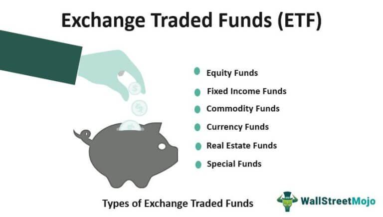

In today's fast-paced financial landscape, investors are continuously seeking new ways to enhance their investment strategies. Among the most prominent tools for modern investors are exchange-traded funds (ETFs), cutting-edge financial products, and algorithmic trading. ETFs are investment funds that are traded on stock exchanges much like stocks, offering investors a diversified portfolio with features such as liquidity and lower fees compared to traditional mutual funds. This article explores how ETFs and innovative financial products can be integral to achieving financial objectives.

Financial products are rapidly evolving to meet diverse investor needs. They encompass a broad spectrum, from structured products to alternative investments, each offering unique advantages and risks. Algorithmic trading, on the other hand, leverages automated and pre-programmed trading instructions, enhancing decision-making through speed and precision. By understanding these components, investors can better navigate the complexities of the investment world and optimize their portfolios.



For both seasoned investors and beginners, the integration of ETFs, innovative financial products, and algorithmic trading offers an opportunity to align investment decisions with financial goals. This guide aims to provide valuable insights into these tools, empowering investors to make informed choices and capitalize on market opportunities.

## Table of Contents

## Understanding Investment ETFs

Exchange-traded funds (ETFs) are investment funds that trade on stock exchanges, providing investors with the opportunity to invest in a diversified portfolio of assets through a single transaction. ETFs are similar to stocks in that they are bought and sold on an exchange throughout the trading day at market prices.

### Types of ETFs

There are several types of ETFs, each catering to different investment needs:

1. **Equity ETFs**: These funds invest in stocks and aim to replicate the performance of a specific stock index, such as the S&P 500 or the NASDAQ-100. They provide diversified exposure to the stock market.

2. **Bond ETFs**: These ETFs invest in bonds, offering exposure to different types of fixed-income assets like government, corporate, or municipal bonds. They are used to manage interest rate risk and provide steady income.

3. **Commodity ETFs**: These funds invest in physical commodities like gold, oil, or agricultural products. They offer investors a way to gain exposure to commodity price movements without directly purchasing the physical goods.

4. **Actively Managed ETFs**: Unlike traditional ETFs that track an index, actively managed ETFs are managed by portfolio managers who make investment decisions based on current market conditions and objectives.

### Advantages of ETFs

Investing in ETFs offers several benefits:

- **Diversification**: ETFs typically hold a wide range of securities, reducing the impact of a poor-performing stock or bond on the overall portfolio. This diversification helps in mitigating risk.

- **Liquidity**: ETFs are traded on exchanges, allowing investors to buy and sell shares throughout the trading day at market prices. This feature provides flexibility and convenience, akin to trading individual stocks.

- **Lower Fees**: Generally, ETFs have lower expense ratios compared to mutual funds due to their passive management style, particularly index-tracking ETFs. This cost-effectiveness can result in higher net returns for investors.

### Risks of ETFs

While ETFs offer numerous advantages, they also entail certain risks:

- **Market Risk**: Like all securities, ETFs are subject to market fluctuations. The value of an ETF can decline due to adverse movements in the market or specific conditions affecting the underlying assets.

- **Tracking Error**: This refers to the discrepancy between the performance of the ETF and the benchmark index it aims to replicate. Factors contributing to tracking error may include management fees, trading costs, and cash holdings.

### Selecting the Right ETFs

Choosing suitable ETFs involves evaluating several factors:

- **Investment Goals**: Investors should align their ETF selections with their investment objectives, whether they aim for growth, income, or preservation of capital.

- **Risk Tolerance**: Understanding one's risk tolerance is crucial. Equity ETFs might suit those with higher risk tolerance, while bond or commodity ETFs may be more appropriate for conservative investors.

- **Performance Tracking**: Investors should examine an ETF’s historical performance and its tracking error in relation to its benchmark to assess how effectively it delivers the intended exposure.

By carefully weighing these factors, investors can select ETFs that complement their investment strategies and contribute to achieving their financial goals.

## Exploring Innovative Financial Products

The financial market offers a wide array of innovative products catering to diverse investor requirements and preferences. These products often provide unique benefits and opportunities for those seeking alternatives beyond traditional investments.

**Structured Products**

Structured products are sophisticated investment vehicles that typically combine financial instruments like bonds and derivatives to offer tailored solutions for investors. These products can be customized to meet specific risk-return profiles, making them attractive for investors with bespoke needs. Structured products often provide features like capital protection, enhanced yields, or leverage, depending on the underlying assets and the structure's configuration.

For example, a structured product might offer capital protection by combining a zero-coupon bond, which provides a return of the principal at maturity, with a call option on an equity index. This configuration allows investors to participate in potential equity upside while securing their initial investment. However, it's crucial to be aware of the complexity and potential lack of [liquidity](/wiki/liquidity-risk-premium) associated with structured products, which can pose risks.

**Index-Linked Notes**

Index-linked notes are debt securities that provide returns linked to a specific index's performance, often offering a higher return potential than traditional bonds. Unlike conventional bonds, which usually pay a fixed interest, index-linked notes typically adjust their payoffs based on the associated index's performance, which may include an equity index, inflation index, or commodity index.

These notes provide advantages such as diversification, as they allow exposure to broader market trends without directly investing in the underlying assets. Furthermore, they may offer inflation protection if linked to indices accounting for inflationary changes. It's important to note that while index-linked notes can provide significant potential returns, they also come with inherent market risks tied to the index's performance.

**Alternative Investments**

Alternative investments encompass a diverse range of asset classes beyond standard stocks and bonds, offering unique investment opportunities. Real estate investment trusts (REITs) and hedge funds are popular forms of alternative investments.

REITs provide investors with the chance to invest in real estate portfolios through publicly traded entities. They offer advantages like income generation through dividends and portfolio diversification, as they generally have low correlation with traditional asset classes. Hedge funds, on the other hand, employ diverse strategies to achieve active returns for their investors, often using techniques such as leverage, derivatives, and [arbitrage](/wiki/arbitrage).

While alternative investments can diversify and potentially enhance a portfolio's performance, they often come with higher fees, lower liquidity, and more significant risk factors than traditional investments.

**Risk Management Tools**

Risk management tools such as options and futures play crucial roles in optimizing portfolio performance and mitigating risks. Options provide the right, but not the obligation, to buy or sell an asset at a predetermined price, offering versatility in hedging strategies or speculative plays. Futures contracts obligate the parties to transact an asset at a specified future date and price, often used in hedging to offset potential adverse price movements.

Both options and futures are invaluable for managing risks related to price [volatility](/wiki/volatility-trading-strategies), market fluctuations, and other external factors affecting assets. However, they require expertise to navigate effectively, and misuse or misunderstanding of these tools can lead to substantial losses.

In summary, the innovative financial products available today provide investors with a vast array of choices to enhance and diversify their portfolios. By understanding the intricacies and utilities of structured products, index-linked notes, alternative investments, and risk management tools, investors can better tailor their strategies to meet their financial objectives while managing potential risks.

## Algorithmic Trading: A Game Changer

Algorithmic trading leverages automated systems to execute trading instructions based on pre-set criteria. These systems aim to capitalize on market opportunities by using strategies that range from simple rules based on technical indicators to complex predictive models. Automated strategies, such as trend-following, arbitrage, and [market making](/wiki/market-making), are pivotal in enhancing trading efficiency.

Trend-following algorithms aim to capture gains through the [momentum](/wiki/momentum) of asset prices, implementing rules to buy when prices rise and sell when they fall. Python libraries like NumPy and pandas can facilitate the calculation of moving averages or momentum indicators. For example, a simple moving average crossover strategy can be implemented as follows:

```python
import pandas as pd

def moving_average_strategy(prices, short_window=40, long_window=100):
    signals = pd.DataFrame(index=prices.index)
    signals['signal'] = 0.0

    signals['short_mavg'] = prices['Close'].rolling(window=short_window, min_periods=1, center=False).mean()
    signals['long_mavg'] = prices['Close'].rolling(window=long_window, min_periods=1, center=False).mean()

    signals['signal'][short_window:] = \
        np.where(signals['short_mavg'][short_window:] > signals['long_mavg'][short_window:], 1.0, 0.0)

    signals['positions'] = signals['signal'].diff()

    return signals
```

Arbitrage algorithms exploit price discrepancies in different markets or forms. By simultaneously buying and selling an asset to profit from imbalances, these algorithms run at high frequencies to capture minute differentials before markets self-correct. Financial experts employ these strategies in currency markets, where even slight differences can lead to significant profits.

Market-making strategies provide liquidity by continuously quoting bid and ask prices. These algorithms strive to profit from the spread between buying and selling prices while maintaining minimal risk exposure.

The advantages of [algorithmic trading](/wiki/algorithmic-trading) are numerous. Speed and precision enable traders to execute thousands of trades in seconds, ensuring that they capitalize on fleeting opportunities. Algorithms can manage extensive datasets efficiently, a feat not achievable by human traders manually.

However, algorithmic trading is not devoid of challenges. Technological risks, including malfunctions or connectivity issues, can lead to undesirable trading activities with catastrophic financial impacts. Additionally, excessive reliance on algorithms may cause market disruptions, as witnessed during sudden market crashes or "flash crashes."

Regulatory environments continue to evolve to address these challenges. Authorities like the U.S. Securities and Exchange Commission (SEC) and the European Securities and Markets Authority (ESMA) impose stringent regulations to oversee algorithmic trading activities, focusing on ensuring transparency and reducing systemic risks. Ethical considerations are also paramount, with debates centered around market fairness and the potential for algorithms to exacerbate market volatility.

By understanding algorithmic trading's virtues and challenges, investors and traders can navigate the complex dynamics of modern financial markets with greater confidence and dexterity.

## Synergizing ETFs, Financial Products, and Algo Trading

Combining exchange-traded funds (ETFs), innovative financial products, and algorithmic trading presents an opportunity for investors to optimize their investment outcomes. The intersection of these three elements enables efficient portfolio management, strategic diversification, and the potential for enhanced returns.

Algorithmic trading can significantly impact [ETF](/wiki/etf-trading-strategies) portfolio management and execution. Algorithms facilitate high-speed, automated trading, allowing investment managers to execute large orders with minimal market disruption. This is particularly beneficial for ETFs, where maintaining liquidity and minimizing tracking error are crucial. By using sophisticated algorithms, investors can adapt swiftly to market conditions and rebalance their ETF holdings effectively.

Several case studies highlight the successful integration of ETFs, financial products, and algorithmic trading. For instance, the use of arbitrage strategies involving ETFs has been documented, where algorithms capitalize on price discrepancies between ETF shares and their underlying assets. This synergy helps in maintaining the efficiency and pricing accuracy of ETFs, thereby enhancing investor confidence and participation.

Tools and platforms are indispensable for aligning ETFs and financial products with algorithmic strategies. Advanced trading platforms provide access to a wide range of assets and allow for seamless execution of complex trades. These platforms often include features like real-time data analytics, risk management modules, and customizable algorithm development environments. For example, cloud-based platforms like QuantConnect and Alpaca offer robust infrastructure for [backtesting](/wiki/backtesting) and deploying algorithmic strategies across various asset classes, including ETFs.

Looking ahead, emerging trends and innovations are likely to further shape the synergy in financial markets. Developments in [artificial intelligence](/wiki/ai-artificial-intelligence) (AI) and [machine learning](/wiki/machine-learning) (ML) are poised to enhance algorithmic trading strategies by enabling more accurate predictive modeling and adaptive decision-making. Additionally, the growth of decentralized finance (DeFi) and blockchain technology offers potential new avenues for integrating ETFs and financial products, potentially leading to more transparent and efficient markets.

In summary, the integration of ETFs, innovative financial products, and algorithmic trading presents a comprehensive approach to modern investing. By leveraging these components, investors can enhance their portfolio performance, manage risks more effectively, and stay competitive in the ever-evolving financial landscape.

## Conclusion

Investment ETFs, innovative financial products, and algorithmic trading collectively offer a robust framework for modern investment strategies. These elements, when properly understood and integrated, enable investors to tailor their portfolios to meet individual financial objectives effectively. Investment ETFs contribute to diversification and cost efficiency, offering an accessible entry point to various market sectors. By utilizing a broad range of financial products, investors can access niche markets and bespoke investment opportunities, further enhancing their strategies.

Staying abreast of industry trends and technological advancements is crucial for making informed investment decisions. The rapid evolution of technology, especially in algorithmic trading, underscores the necessity for investors to be vigilant and flexible. Algorithms facilitate enhanced trade execution and data analysis, enabling investors to optimize their strategies with greater precision and speed. The integration of these advanced tools demands a proactive approach to learning, ensuring that investors remain competitive in a shifting financial landscape.

Investors must also evaluate their risk tolerance and investment horizon. These introspective assessments are foundational when incorporating ETFs, financial products, and algorithmic trading into an investment strategy. A clear understanding of individual risk appetite and long-term financial goals aids in selecting suitable investment mechanisms and in constructing a balanced portfolio.

Moreover, embracing continuous learning and adaptability is vital for capitalizing on new opportunities in the financial markets. As the environment changes, so too must the strategies and tools employed by investors. Flexibility in adapting to new information and methods can position investors advantageously, allowing them to navigate uncertainties and seize emerging prospects effectively. Thus, a commitment to ongoing education and skill enhancement is essential for sustained success in modern investing.

## References & Further Reading

[1]: ["Investing in ETFs For Dummies,"](https://www.etf.com/sections/etf-basics/best-etfs-beginners-complete-guide) by Russell Wild

[2]: ["The ETF Handbook: How to Value and Trade Exchange Traded Funds,"](https://www.amazon.com/ETF-Handbook-Exchange-Traded-Finance/dp/1119193907) by David J. Abner

[3]: ["Algorithmic Trading: Winning Strategies and Their Rationale,"](https://play.google.com/store/books/details/Algorithmic_Trading_Winning_Strategies_and_Their_R?id=CIwCTVqEj4oC&hl=en-US) by Ernest P. Chan

[4]: ["Advances in Financial Machine Learning"](https://www.quantresearch.org/Lectures.htm) by Marcos Lopez de Prado

[5]: ["The Complete Guide to ETFs and Index Funds: What They Are, How They Work, and Simple Strategies for Success,"](https://www.etf.com/sections/etf-basics/etfs-vs-index-funds-comparison-guide) by David Ryden

[6]: Aldridge, Irene. ["High-Frequency Trading: A Practical Guide to Algorithmic Strategies and Trading Systems,"](https://www.amazon.com/High-Frequency-Trading-Practical-Algorithmic-Strategies/dp/1118343506) Wiley Trading

[7]: Krasner, Jonathan. ["ETFs for the Long Run: What They Are, How They Work, and Simple Strategies,"](https://www.wiley.com/en-us/ETFs+for+the+Long+Run%3A+What+They+Are%2C+How+They+Work%2C+and+Simple+Strategies+for+Successful+Long-Term+Investing+-p-9780470399675) by Lawrence Carrel

[8]: Koller, Tim. "Valuation: Measuring and Managing the Value of Companies," McKinsey & Company Inc., https://www.amazon.com/Valuation-Measuring-Managing-Companies-McKinsey/dp/1119611862