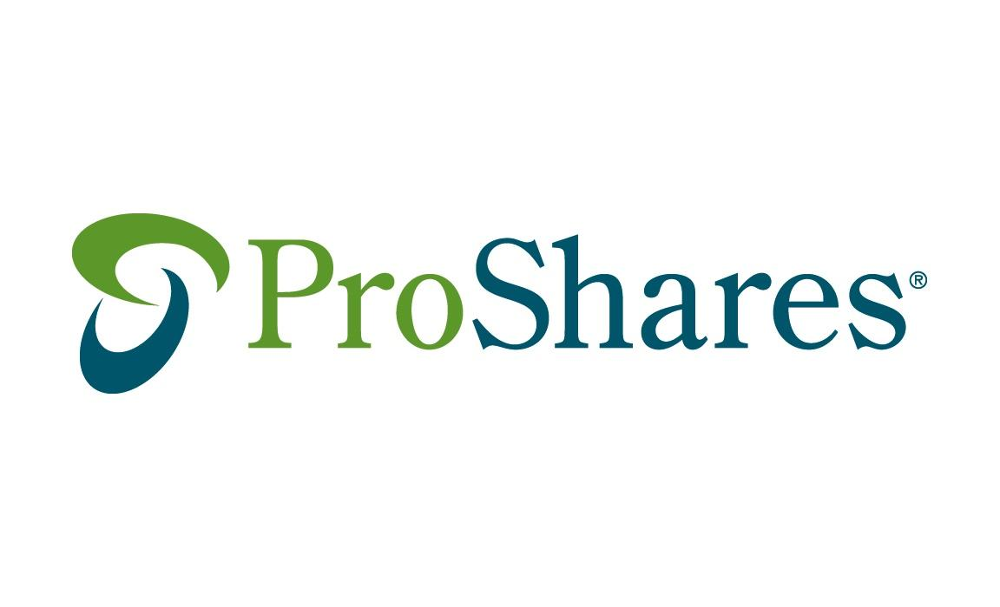

## Table of Contents

## What is ProShares?

ProShares is a company that makes and manages a type of investment called exchange-traded funds (ETFs). ETFs are like baskets of stocks or other investments that you can buy and sell on the stock market, just like individual stocks. ProShares offers many different ETFs, and some of them are designed to give investors a way to make money when the market goes down, not just when it goes up. This can be helpful for people who want to protect their money from market downturns.

Some ProShares ETFs are called "leveraged" or "inverse" ETFs. Leveraged ETFs try to give you bigger gains (or losses) than the market itself, often aiming for two or three times the daily performance of an index. Inverse ETFs, on the other hand, aim to move in the opposite direction of the market. So, if the market goes down, an inverse ETF might go up. These types of ETFs can be useful for experienced investors looking to take advantage of short-term market movements, but they can also be riskier and more complex than regular ETFs.

## What types of investment products does ProShares offer?

ProShares offers a variety of investment products called exchange-traded funds (ETFs). These ETFs are like baskets of stocks or other investments that you can buy and sell on the stock market, just like individual stocks. ProShares has ETFs that track different parts of the market, like stocks, bonds, and commodities. This means you can invest in a wide range of areas with just one ETF.

Some ProShares ETFs are special because they are designed to help investors make money even when the market goes down. These are called inverse ETFs. They aim to move in the opposite direction of the market, so if the market drops, the ETF might go up. ProShares also offers leveraged ETFs, which try to give you bigger gains (or losses) than the market itself. These can be two or three times the daily performance of an index. These types of ETFs can be useful for experienced investors but can also be riskier.

Overall, ProShares provides a range of ETFs that can help investors achieve different goals, whether they want to grow their money, protect it from market downturns, or take advantage of short-term market movements. It's important for investors to understand the risks and rewards of each type of ETF before investing.

## How does ProShares differ from traditional mutual funds?

ProShares and traditional mutual funds are both investment options, but they work a bit differently. ProShares offers exchange-traded funds (ETFs), which you can buy and sell on the stock market just like individual stocks. This means you can trade ProShares ETFs throughout the day at the current market price. On the other hand, traditional mutual funds are usually bought or sold at the end of the trading day at a price that is calculated once a day, based on the value of all the investments inside the fund.

Another big difference is the types of ETFs that ProShares offers. ProShares has special ETFs called inverse and leveraged ETFs. Inverse ETFs aim to move in the opposite direction of the market, so if the market goes down, the ETF might go up. Leveraged ETFs try to give you bigger gains (or losses) than the market itself, often aiming for two or three times the daily performance of an index. Traditional mutual funds usually don't offer these kinds of options. They focus more on long-term growth and might be less risky but also less flexible for short-term trading strategies.

## What are the benefits of investing in ProShares ETFs?

Investing in ProShares ETFs can give you a lot of flexibility. You can buy and sell them throughout the day, just like stocks. This means you can quickly react to changes in the market. ProShares also offers a wide range of ETFs that track different parts of the market, like stocks, bonds, and commodities. So, you can easily diversify your investments and spread out your risk.

Another big benefit is that ProShares has special ETFs called inverse and leveraged ETFs. Inverse ETFs can help you make money even when the market goes down. This can be really useful if you want to protect your money during a market downturn. Leveraged ETFs can give you bigger gains if you think the market will go up quickly. These types of ETFs can be great for experienced investors who want to take advantage of short-term market movements, but they can also be riskier.

## What are the risks associated with ProShares leveraged and inverse ETFs?

Investing in ProShares leveraged and inverse ETFs can be riskier than regular ETFs. These ETFs are designed to give you bigger gains or losses than the market itself, which means they can go up or down a lot more in a short time. If you're wrong about which way the market will go, you could lose money quickly. Also, these ETFs are meant for short-term trading, so if you hold them for a long time, their performance might not match what you expect. This can happen because of something called "compounding," where daily ups and downs can add up over time and affect the ETF's value in unexpected ways.

Another risk is that these ETFs can be more complicated to understand than regular ETFs. They use things like derivatives and borrowing to try to get their bigger gains or losses, which can make them harder to predict. If you're not an experienced investor, it can be tricky to know when to buy or sell these ETFs. Plus, because they can be more volatile, they might not be the best choice if you're saving for a long-term goal like retirement. It's important to think carefully about these risks before you decide to invest in ProShares leveraged and inverse ETFs.

## How can beginners start investing in ProShares?

If you're a beginner and want to start investing in ProShares, the first thing you should do is learn about ETFs and how they work. ProShares offers a variety of ETFs, including some that can help you make money even when the market goes down. Start by reading up on their website or other reliable sources to understand the different types of ETFs they offer, like regular, inverse, and leveraged ETFs. It's important to know what you're getting into before you start investing.

Once you feel comfortable with the basics, you can open a brokerage account with a company that lets you buy and sell ETFs. Many online brokers allow you to trade ProShares ETFs easily. After setting up your account, you can start by investing in a regular ProShares ETF that tracks a broad part of the market, like stocks or bonds. This can be a good way to get started because these ETFs are less risky than the inverse and leveraged ones. As you gain more experience, you might want to try out the more advanced ETFs, but always remember to think about the risks and maybe talk to a financial advisor if you're not sure.

## What are some popular ProShares ETFs and their objectives?

ProShares offers many ETFs, and some of the popular ones are the ProShares S&P 500 ETF (SSO) and the ProShares UltraPro QQQ (TQQQ). The ProShares S&P 500 ETF (SSO) aims to give you two times the daily performance of the S&P 500 index. This means if the S&P 500 goes up by 1% in a day, the SSO should go up by about 2%. It's designed for investors who want to take advantage of short-term movements in the stock market. The ProShares UltraPro QQQ (TQQQ) tries to give you three times the daily performance of the Nasdaq-100 index. So, if the Nasdaq-100 goes up by 1% in a day, the TQQQ should go up by about 3%. This ETF is popular among investors who want to make bigger gains from the tech sector.

Another well-known ProShares ETF is the ProShares Short S&P 500 ETF (SH). This ETF is an inverse ETF, which means it aims to move in the opposite direction of the S&P 500. If the S&P 500 goes down by 1% in a day, the SH should go up by about 1%. It's useful for investors who want to protect their money during a market downturn or make money when the market goes down. These ETFs are popular because they give investors different ways to invest in the market, but they can also be riskier than regular ETFs. It's important for investors to understand these risks before they start investing.

## How do ProShares ETFs track their underlying indexes?

ProShares ETFs track their underlying indexes by using a strategy that involves buying stocks or other investments that are part of the index they want to follow. For example, if an ETF is meant to track the S&P 500, it will hold a basket of stocks that match the S&P 500 index. This way, when the S&P 500 goes up or down, the ETF should go up or down in a similar way. ProShares also uses financial tools like derivatives to help the ETF move in line with the index more closely. Derivatives are like agreements to buy or sell something in the future, and they can help the ETF match the performance of the index even better.

For leveraged and inverse ETFs, ProShares uses more advanced strategies. Leveraged ETFs try to give you bigger gains or losses than the index by using borrowing and derivatives. For example, if an ETF aims to give you two times the daily performance of the S&P 500, it might borrow money or use derivatives to make the ETF move twice as much as the index. Inverse ETFs work differently. They use derivatives and other financial tools to move in the opposite direction of the index. So, if the index goes down, the ETF should go up. These strategies can make the ETFs more complicated but also help them track their underlying indexes in unique ways.

## What is the impact of daily rebalancing on ProShares leveraged and inverse ETFs?

Daily rebalancing means that ProShares leveraged and inverse ETFs adjust their holdings every day to make sure they keep tracking their index the right way. For leveraged ETFs, this means they try to give you two or three times the daily performance of the index. For inverse ETFs, they try to move in the opposite direction of the index. This daily adjustment can make these ETFs work well for short-term trading, but it can also cause problems if you hold them for a long time. 

The reason is something called "compounding." Because the ETFs are rebalanced every day, the ups and downs can add up over time in ways that might not match what you expect. If the market goes up and down a lot, the ETF might not give you the returns you were hoping for, especially over longer periods. This is why it's important to understand that these ETFs are best for short-term trading and might not be the best choice if you're saving for something like retirement.

## How does ProShares manage tax implications for its ETFs?

ProShares tries to manage the tax implications of its ETFs by using strategies that help keep taxes low for investors. One way they do this is by being careful about when they buy and sell the stocks or other investments inside the ETF. They try to do this in a way that creates fewer taxable events, which means investors might not have to pay as much in taxes. ProShares also uses a method called "in-kind" transactions, where they trade stocks or other assets instead of selling them for cash. This can help reduce the capital gains taxes that investors might have to pay.

Another thing ProShares does is to keep an eye on the tax laws and rules that apply to ETFs. They work to make sure their ETFs follow these rules in a way that can help investors save on taxes. But even with all these efforts, the tax situation for each investor can be different. It's a good idea for investors to talk to a tax advisor to understand how investing in ProShares ETFs might affect their own taxes.

## What are the long-term performance considerations for ProShares ETFs?

When you think about investing in ProShares ETFs for a long time, it's important to understand that their performance over many years can be different from what you might expect. This is especially true for the leveraged and inverse ETFs. These ETFs are designed to give you bigger gains or losses than the market each day. But because they rebalance every day, the ups and downs can add up over time in a way that might not match the long-term performance of the index they track. This can make them riskier if you plan to hold them for a long time.

For example, if the market goes up and down a lot, the daily adjustments of a leveraged ETF can lead to bigger losses over time than you might think. Inverse ETFs can also be tricky because they are meant to go up when the market goes down, but over many years, this can be hard to predict. So, if you're thinking about saving for something like retirement, you might want to be careful about using these ETFs. Regular ProShares ETFs that track the market without leverage or inverse strategies might be a better choice for long-term goals because they are less risky and more likely to match the performance of their index over time.

## How does ProShares ensure compliance with regulatory requirements?

ProShares makes sure it follows the rules by keeping a close eye on the laws and rules that apply to ETFs. They have a team of people who know a lot about these rules and make sure that all of ProShares' ETFs are doing things the right way. This includes making sure they are clear about what their ETFs do and how they work, and that they follow the rules about how they can invest the money people put into their ETFs.

They also work with other companies, like lawyers and accountants, to make sure they are doing everything correctly. ProShares reports to the government and other groups that watch over the investment world, like the Securities and Exchange Commission (SEC). This helps them stay in line with all the rules and keep their investors safe.

## What are ProShares Investment Funds and how can they be understood?

ProShares is a prominent division of ProFunds, recognized for its significant assets under management (AUM) and commitment to offering a wide range of investment solutions tailored to diverse investor needs. As an innovator in the field, ProShares specializes in the creation and management of exchange-traded funds (ETFs), with particular emphasis on leveraged and inverse ETFs. These financial instruments are designed to amplify or inverse the performance of market indices on a daily basis, catering primarily to those with speculative investment strategies who are comfortable with a higher level of risk and seeking tactical trading opportunities.

Leveraged ETFs offered by ProShares aim to deliver multiples of the performance of the underlying index. For example, a 2x leveraged ETF seeks to achieve daily returns equivalent to twice the daily percentage change of the index it tracks. Conversely, inverse ETFs are structured to move in the opposite direction of the market index they are linked with, which can be especially useful for investors looking to hedge against market downturns. The formula for calculating the leveraged daily return can be expressed as:

$$
R_{\text{leveraged}} = L \times R_{\text{index}}
$$

where $R_{\text{leveraged}}$ is the return of the leveraged ETF, $L$ is the leverage factor (e.g., 2 for 2x leverage), and $R_{\text{index}}$ is the return of the underlying index.

Since their inception in 2006, ProShares has been at the cutting edge of the [ETF](/wiki/etf-trading-strategies) market. They have responded to the growing demand from investors by expanding their offerings and refining their strategies to meet evolving market dynamics. Through continual innovation, ProShares has established a reputation for delivering products that not only meet investor expectations but also enhance the breadth of investment opportunities available to both individual and institutional investors. By utilizing sophisticated financial models and techniques, ProShares ensures that their ETF offerings remain relevant and effective, thus maintaining a robust presence in the competitive ETF landscape.

## References & Further Reading

[1]: ["Advances in Financial Machine Learning"](https://www.amazon.com/Advances-Financial-Machine-Learning-Marcos/dp/1119482089) by Marcos Lopez de Prado

[2]: ["Evidence-Based Technical Analysis: Applying the Scientific Method and Statistical Inference to Trading Signals"](https://books.google.com/books/about/Evidence_Based_Technical_Analysis.html?id=MeoJAQAAMAAJ) by David Aronson

[3]: ["Machine Learning for Algorithmic Trading"](https://github.com/stefan-jansen/machine-learning-for-trading) by Stefan Jansen

[4]: ["Quantitative Trading: How to Build Your Own Algorithmic Trading Business"](https://www.amazon.com/Quantitative-Trading-Build-Algorithmic-Business/dp/1119800064) by Ernest P. Chan

[5]: Bergstra, J., Bardenet, R., Bengio, Y., & Kégl, B. (2011). ["Algorithms for Hyper-Parameter Optimization."](https://dl.acm.org/doi/10.5555/2986459.2986743) Advances in Neural Information Processing Systems 24.