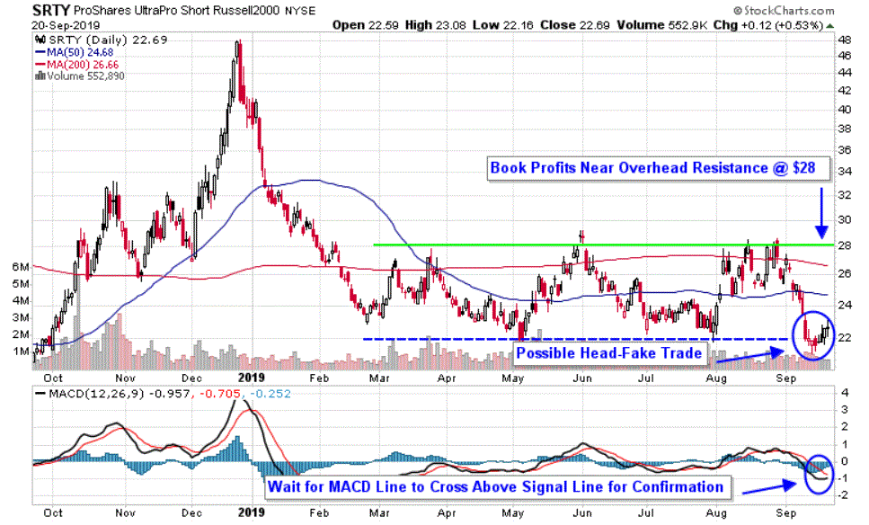

In the ever-evolving landscape of financial investments, ProShares stands out as a prominent player with its variety of financial products. Specializing in exchange-traded funds (ETFs), ProShares offers products that cover a wide range of asset classes and investment strategies. ETFs are investment funds traded on stock exchanges, much like stocks, and have become popular due to their tax efficiency, transparency, and ability to track various indices. ProShares capitalizes on these advantages to meet the diverse needs of investors.

ProShares' array of ETF offerings is designed to cater to different investment strategies and objectives, ranging from equities and fixed income to alternative assets. This diverse lineup allows investors to select products that align with their specific goals, whether they're seeking growth, income, or risk management. By focusing on innovation, ProShares continuously develops new financial products to reflect changing market conditions and investor preferences.



The incorporation of algorithmic trading into investment strategies is another way ProShares enhances its financial products. Algorithmic trading employs complex algorithms and automated systems to execute transactions at high speed, optimizing trade execution and minimizing costs. This technological approach not only increases efficiency but also ensures that investors can capitalize on precise and timely investment opportunities, thus maximizing potential returns.

This article explores ProShares’ unique investment funds, financial products, and the role of algorithmic trading in enhancing investment strategies. By examining ProShares' offerings in ETFs and their innovative approach to investment, combined with the strategic use of algorithmic trading, we gain insights into how sophisticated techniques can add value to modern investment practices.

## Table of Contents

## Understanding ProShares Investment Funds

ProShares is a prominent division of ProFunds, recognized for its significant assets under management (AUM) and commitment to offering a wide range of investment solutions tailored to diverse investor needs. As an innovator in the field, ProShares specializes in the creation and management of exchange-traded funds (ETFs), with particular emphasis on leveraged and inverse ETFs. These financial instruments are designed to amplify or inverse the performance of market indices on a daily basis, catering primarily to those with speculative investment strategies who are comfortable with a higher level of risk and seeking tactical trading opportunities.

Leveraged ETFs offered by ProShares aim to deliver multiples of the performance of the underlying index. For example, a 2x leveraged ETF seeks to achieve daily returns equivalent to twice the daily percentage change of the index it tracks. Conversely, inverse ETFs are structured to move in the opposite direction of the market index they are linked with, which can be especially useful for investors looking to hedge against market downturns. The formula for calculating the leveraged daily return can be expressed as:

$$
R_{\text{leveraged}} = L \times R_{\text{index}}
$$

where $R_{\text{leveraged}}$ is the return of the leveraged ETF, $L$ is the leverage factor (e.g., 2 for 2x leverage), and $R_{\text{index}}$ is the return of the underlying index.

Since their inception in 2006, ProShares has been at the cutting edge of the [ETF](/wiki/etf-trading-strategies) market. They have responded to the growing demand from investors by expanding their offerings and refining their strategies to meet evolving market dynamics. Through continual innovation, ProShares has established a reputation for delivering products that not only meet investor expectations but also enhance the breadth of investment opportunities available to both individual and institutional investors. By utilizing sophisticated financial models and techniques, ProShares ensures that their ETF offerings remain relevant and effective, thus maintaining a robust presence in the competitive ETF landscape.

## ProShares Financial Products

ProShares offers over 140 financial products, with exchange-traded funds (ETFs) being a significant component due to their tax efficiency and capacity to track various benchmarks at minimal fees. ETFs are structured to provide investors with exposure to a wide range of asset classes, sectors, and markets, allowing for diversified investment strategies. ProShares' ETF offerings encompass equity, fixed income, and alternative investments, enabling investors to select products that align with their risk tolerance and investment goals.

Equity ETFs focus on stock market indices, providing exposure to U.S. and international equities. Fixed income ETFs track bonds and other interest-generating securities, offering an opportunity to earn regular income while maintaining a relatively lower risk profile compared to equities. Alternatively, ProShares' innovative ETFs provide exposure to non-traditional asset classes, including commodities, real estate, and currencies, adding a strategic layer to investment portfolios.

A key feature of ProShares' product lineup is the incorporation of smart beta strategies. These strategies blend elements of both active and passive management, aiming to deliver superior risk-adjusted returns. By utilizing rule-based investment approaches, smart beta ETFs seek to exploit inefficiencies in the marketplace, thereby enhancing return potential. For instance, a smart beta strategy might focus on quality factors—such as earnings consistency or low [volatility](/wiki/volatility-trading-strategies)—rather than merely tracking market capitalization.

ProShares' financial products are designed to cater to a diverse range of investor needs, providing tools for both capital appreciation and risk management. Whether through index-tracking or strategic investment methodologies, ProShares enables investors to efficiently reach their desired exposure across different financial landscapes.

## The Role of Algorithmic Trading in ProShares

Algorithmic trading, commonly known as algo trading, is an essential component of ProShares' trading strategy, as it offers a technological edge in handling trades efficiently and swiftly. This method leverages complex computational algorithms to automate trading, enabling ProShares to manage large orders accurately and reduce the associated market impact and costs.

By employing advanced algorithms, ProShares can seamlessly execute high volumes of trades within milliseconds, significantly enhancing [liquidity](/wiki/liquidity-risk-premium) management. This capability ensures that investors face minimal slippage—the difference between expected and actual execution prices—while maintaining optimal transaction timing. The inherent speed and precision of [algorithmic trading](/wiki/algorithmic-trading) afford ProShares the advantage of executing trades at the most favorable conditions, a critical [factor](/wiki/factor-investing) in today's fast-paced financial markets.

These algorithms are designed to analyze vast datasets, identify market trends, and react to conditions that offer [arbitrage](/wiki/arbitrage) opportunities or minimal risks. ProShares uses a variety of strategies, including [statistical arbitrage](/wiki/statistical-arbitrage), [momentum](/wiki/momentum) trading, and [market making](/wiki/market-making), all of which are underpinned by algorithmic methodologies. For example, in statistical arbitrage, the algorithms identify and capitalize on price discrepancies between related financial instruments, executing trades that take advantage of statistical correlations and patterns.

Furthermore, algorithmic trading supports the integration of [machine learning](/wiki/machine-learning) models that predict market behavior based on historical data, enhancing ProShares' ability to offer precise and time-sensitive investment opportunities. Machine learning systems learn and adapt their strategies over time, increasing the effectiveness and accuracy of trading decisions as they ingest more data.

Here is a simple Python pseudocode snippet that represents a basic algorithmic trading strategy:

```python
import numpy as np

class AlgorithmicTrader:
    def __init__(self, data):
        self.data = data
        self.position = 0

    def moving_average(self, period):
        return np.convolve(self.data, np.ones(period)/period, mode='valid')

    def trade(self):
        short_ma = self.moving_average(20)
        long_ma = self.moving_average(50)

        for i in range(len(short_ma)):
            if short_ma[i] > long_ma[i] and self.position <= 0:
                self.position = 1  # Buy signal
                print("Buy at index", i)
            elif short_ma[i] < long_ma[i] and self.position >= 0:
                self.position = -1  # Sell signal
                print("Sell at index", i)

data = np.random.normal(size=100)  # Simulating price data
trader = AlgorithmicTrader(data)
trader.trade()
```

In this pseudocode, a trader makes buy or sell decisions based on a 20-period and a 50-period moving average. While simplistic, this example demonstrates how algorithms can make data-driven decisions to execute trades based on predefined criteria, akin to the methods ProShares employs with more complexity and sophistication.

Ultimately, the adoption of algorithmic trading enables ProShares to maintain a competitive advantage by ensuring that its trading strategies remain agile, precise, and aligned with market dynamics, ultimately optimizing performance for myriad investment portfolios.

## Exploring ProShares' Strategic Offerings

ProShares distinguishes itself in the investment industry through its strategic offerings, particularly with products such as the Ultra S&P 500 ETF. This ETF is specifically designed to deliver twice the daily return of the S&P 500 index. By employing leverage, the ETF aims to amplify market movements, providing investors with the potential for enhanced short-term gains. Such products attract investors who are prepared to accept increased risk for the possibility of higher rewards, making them suited for those with a robust understanding of market dynamics.

In addition to the Ultra S&P 500 ETF, ProShares offers a range of inverse and leveraged ETFs. These financial instruments are crucial for risk management, allowing investors to protect against market fluctuations. Inverse ETFs, in particular, are designed to move in the opposite direction of specific indexes or sectors. This unique feature enables investors to hedge against downturns, offering an opportunity to profit from declining markets without resorting to complex short selling.

The strategic use of these ETFs reflects ProShares' innovative approach to catering to the needs of sophisticated investors. By providing tools that offer both leverage and risk mitigation, ProShares allows investors to adopt tactical strategies that can navigate various market conditions. For example, during periods of market uncertainty or volatility, investors might employ inverse ETFs to safeguard their portfolios, while leverage products like the Ultra S&P 500 ETF could be used to capitalize on anticipated market rallies.

This approach underscores ProShares' commitment to innovation and risk management, offering investment solutions that balance potential returns with strategic risk considerations. By facilitating both offensive and defensive investment strategies, ProShares empowers its clients to maneuver through the complexities of modern financial markets.

## Conclusion

ProShares has established itself as a significant entity in the financial investment sector by offering a diverse portfolio of innovative and strategically crafted financial products. The company's emphasis on Exchange Traded Funds (ETFs) highlights its commitment to providing flexible, efficient investment options catering to a broad spectrum of investor needs. ProShares' adept integration of algorithmic trading technology enhances its competitive edge, allowing for faster, more precise transactions that benefit investors seeking timely and cost-effective investment solutions.

The firm's adaptability to technological advancements underscores its proactive approach to evolving financial markets. By aligning its strategies with emerging trends and innovations, ProShares is effectively equipped to serve the dynamic requirements of today's investors. This strategic foresight and commitment to innovation solidify ProShares' position as a leader in financial investment strategies, offering tools that empower investors in an ever-changing market landscape.

## References & Further Reading

[1]: ["Advances in Financial Machine Learning"](https://www.amazon.com/Advances-Financial-Machine-Learning-Marcos/dp/1119482089) by Marcos Lopez de Prado

[2]: ["Evidence-Based Technical Analysis: Applying the Scientific Method and Statistical Inference to Trading Signals"](https://books.google.com/books/about/Evidence_Based_Technical_Analysis.html?id=MeoJAQAAMAAJ) by David Aronson

[3]: ["Machine Learning for Algorithmic Trading"](https://github.com/stefan-jansen/machine-learning-for-trading) by Stefan Jansen

[4]: ["Quantitative Trading: How to Build Your Own Algorithmic Trading Business"](https://www.amazon.com/Quantitative-Trading-Build-Algorithmic-Business/dp/1119800064) by Ernest P. Chan

[5]: Bergstra, J., Bardenet, R., Bengio, Y., & Kégl, B. (2011). ["Algorithms for Hyper-Parameter Optimization."](https://dl.acm.org/doi/10.5555/2986459.2986743) Advances in Neural Information Processing Systems 24.