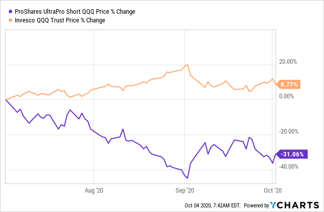

## Table of Contents

## What is the ProShares UltraPro Short QQQ ETF (SQQQ)?

The ProShares UltraPro Short QQQ ETF, or SQQQ, is a type of investment fund that aims to give investors returns that are three times the opposite of the daily performance of the Nasdaq-100 Index. This means if the Nasdaq-100 goes down by 1% in a day, the SQQQ should go up by about 3%. It's designed for people who want to bet against the market, thinking that the tech-heavy Nasdaq-100 will decrease in value.

However, investing in SQQQ can be risky. Because it seeks to deliver three times the inverse performance, small movements in the Nasdaq-100 can lead to big swings in the value of SQQQ. This makes it more suitable for experienced investors who understand the risks and are prepared to monitor their investments closely. It's not usually recommended for long-term investing because of the potential for significant losses over time.

## How does SQQQ aim to achieve its investment objective?

SQQQ tries to achieve its goal by using financial tools like swaps, futures, and other derivatives. These tools help the fund move in the opposite direction of the Nasdaq-100 Index, but three times as much. So, if the Nasdaq-100 goes down a little bit, SQQQ goes up a lot. The fund's managers keep a close eye on these tools to make sure SQQQ stays on track with its goal.

This method can be tricky because it relies on daily adjustments. If the Nasdaq-100 has big ups and downs, SQQQ might not match the opposite performance perfectly over longer periods. That's why it's important for people investing in SQQQ to check their investments often and understand that it's meant for short-term trading, not for keeping money in for a long time.

## What is the underlying index that SQQQ tracks?

The SQQQ tracks the Nasdaq-100 Index, which is a big list of the 100 biggest non-financial companies on the Nasdaq stock market. This index includes a lot of technology and internet companies, like Apple, Microsoft, and Amazon. It's meant to show how well these big tech companies are doing.

SQQQ aims to do the opposite of what the Nasdaq-100 does, but three times as much. So, if the Nasdaq-100 goes down, SQQQ goes up a lot. This can be good for people who think the tech companies will not do well, but it's also risky because the value of SQQQ can change a lot very quickly.

## Who might consider investing in SQQQ?

People who might consider investing in SQQQ are usually those who believe that the big tech companies in the Nasdaq-100 Index will lose value soon. They might think that the market is going to go down, and they want to make money when that happens. SQQQ is a way for them to bet against the market because it goes up when the Nasdaq-100 goes down, but three times as much.

These investors need to be ready for big changes in the value of their investment because SQQQ can move a lot in a short time. It's not for everyone. Only people who know a lot about investing and are willing to watch their investments closely should think about using SQQQ. It's meant for short-term trading, not for keeping money in for a long time.

## What are the risks associated with investing in SQQQ?

Investing in SQQQ can be risky because it tries to move three times in the opposite direction of the Nasdaq-100 Index. This means small changes in the Nasdaq-100 can cause big swings in the value of SQQQ. If you're not ready for that, you could lose a lot of money quickly. Also, because SQQQ uses financial tools like swaps and futures to achieve its goal, there's a chance these tools might not work perfectly, which can add to the risk.

Another big risk is that SQQQ is meant for short-term trading, not for keeping your money in for a long time. Over longer periods, the daily adjustments can make the performance of SQQQ different from what you might expect. If the market goes up and down a lot, you might end up losing money even if you were right about the market going down in the long run. It's important to keep an eye on your investment and be ready to make quick decisions.

Lastly, SQQQ is a complex product that's not suitable for everyone. It's meant for experienced investors who understand how these kinds of funds work and are willing to take on the risks. If you're new to investing or don't like the idea of your money moving a lot, SQQQ might not be the right choice for you.

## How does the leverage of SQQQ work, and what are its implications?

SQQQ uses leverage to try to move three times in the opposite direction of the Nasdaq-100 Index every day. This means if the Nasdaq-100 goes down by 1%, SQQQ tries to go up by 3%. To do this, SQQQ uses financial tools like swaps and futures. These tools help the fund make bigger moves than the index, but they also make the fund more risky because small changes in the Nasdaq-100 can cause big changes in SQQQ.

The leverage in SQQQ can be good if you think the Nasdaq-100 is going to go down soon and you want to make more money from that. But it's also very risky. If you're wrong about the market going down, you could lose a lot of money quickly. Also, because SQQQ is designed for daily moves, holding it for a long time can be risky. The daily adjustments can make the fund's performance different over time, so it's not good for long-term investing.

## What is the expense ratio of SQQQ, and how does it impact returns?

The expense ratio of SQQQ is 0.95%. This means for every $100 you invest in SQQQ, you pay about 95 cents each year to cover the costs of running the fund. This fee is taken out of the fund's assets, so it reduces the returns you get from your investment.

Because SQQQ uses a lot of leverage and tries to move three times in the opposite direction of the Nasdaq-100 every day, the expense ratio can have a bigger impact on your returns. If the fund's value goes up and down a lot, the 0.95% fee can eat into your profits more than it would with a less volatile investment. So, it's important to think about this cost when deciding if SQQQ is right for you.

## How does SQQQ perform in different market conditions?

SQQQ is designed to do well when the Nasdaq-100 goes down. If the tech-heavy index drops, SQQQ tries to go up three times as much. So, in a bear market, where the Nasdaq-100 is losing value, SQQQ can make a lot of money for investors who bet against the market. But, it's risky because if the market only goes down a little bit, SQQQ can still make big moves, and you need to be ready for that.

In a bull market, where the Nasdaq-100 is going up, SQQQ will lose money because it moves in the opposite direction. The more the index goes up, the more SQQQ goes down, and because it's three times the opposite, those losses can be big. That's why SQQQ is not a good choice for long-term investing, no matter what the market is doing, because the daily adjustments can make the performance over time different from what you might expect.

## What are the historical performance trends of SQQQ?

SQQQ has had big ups and downs because it tries to move three times in the opposite direction of the Nasdaq-100 every day. When the tech-heavy index goes down, SQQQ goes up a lot, which can be good for people who bet against the market. For example, during times when there's a lot of worry about the economy or tech companies, like during the early days of the COVID-19 pandemic in 2020, SQQQ did really well because the Nasdaq-100 dropped a lot. But, it's not always like that. If the market goes up and down a lot, even if it ends up going down over time, SQQQ might not do as well as you'd think because of the daily adjustments.

On the other hand, when the Nasdaq-100 goes up, like during a bull market, SQQQ loses money. This happened a lot in the years leading up to 2020 and again after the initial drop in 2020 when the market started to recover. Because SQQQ moves three times in the opposite direction, those losses can be big. Over longer periods, like a year or more, holding onto SQQQ can be risky because the daily changes can add up in ways that make it hard to predict how it will do. That's why it's usually better for short-term trading, not for keeping your money in for a long time.

## How should SQQQ be used in a diversified investment portfolio?

SQQQ is a special kind of investment that can be used in a diversified portfolio, but it's important to use it carefully. It's meant to go up three times as much when the Nasdaq-100 goes down, so it can be a way to protect your money if you think the tech market will drop soon. But, because it's so risky and can lose a lot of money if you're wrong, it's best to use SQQQ as a small part of your overall investments. You might want to use it for short periods of time, like a few days or weeks, to try to make money when the market goes down.

Using SQQQ in your portfolio also means you need to keep a close eye on it. Since it's designed for daily moves, it can be hard to predict how it will do over longer times. If you're using SQQQ, you should be ready to check it often and make quick decisions. It's not something you should put your money in and forget about. Instead, it's a tool for experienced investors who understand the risks and are looking to make short-term bets against the market.

## What are the tax implications of trading SQQQ?

Trading SQQQ can have tax consequences because it's treated as a regular investment in the eyes of the tax authorities. When you sell SQQQ at a profit, you'll have to pay capital gains tax on that profit. If you hold SQQQ for less than a year before selling, the profit is considered a short-term capital gain, which is taxed at your regular income tax rate. If you hold it for more than a year, it's a long-term capital gain, which usually has a lower tax rate.

Also, because SQQQ is an [ETF](/wiki/etf-trading-strategies) that uses a lot of financial tools like swaps and futures, it might generate what's called "unrelated business taxable income" (UBTI). If you hold SQQQ in a tax-advantaged account like an IRA, any UBTI over a certain amount could mean you have to pay taxes on that income, even though it's in a retirement account. It's a good idea to talk to a tax professional to understand all the tax rules that might apply to your situation when trading SQQQ.

## How can technical analysis be applied to trading SQQQ?

Technical analysis can help people trading SQQQ by looking at charts and patterns to guess where the price might go next. Because SQQQ moves a lot every day, trying to be three times the opposite of the Nasdaq-100, traders often use tools like moving averages, support and resistance levels, and chart patterns to find good times to buy or sell. For example, if the price of SQQQ gets close to a strong support level, a trader might think it's a good time to buy because the price might bounce back up. Or, if it breaks through a resistance level, that could be a sign to sell or stay away because the price might keep going down.

Using technical analysis for SQQQ means you need to watch the market closely and be ready to act fast. Because SQQQ is so volatile, what the charts show can change quickly. Traders might use shorter time frames, like hourly or daily charts, to make decisions. They also need to be careful because even if the technical signals look good, the big moves in SQQQ can lead to quick losses if the market doesn't go the way they expect. So, it's important to have a clear plan and know when to get out if things don't go as planned.

## References & Further Reading

[1]: Bergstra, J., Bardenet, R., Bengio, Y., & Kégl, B. (2011). ["Algorithms for Hyper-Parameter Optimization."](https://papers.nips.cc/paper/4443-algorithms-for-hyper-parameter-optimization) Advances in Neural Information Processing Systems 24.

[2]: ["Advances in Financial Machine Learning"](https://www.amazon.com/Advances-Financial-Machine-Learning-Marcos/dp/1119482089) by Marcos Lopez de Prado

[3]: ["Evidence-Based Technical Analysis: Applying the Scientific Method and Statistical Inference to Trading Signals"](https://www.amazon.com/Evidence-Based-Technical-Analysis-Scientific-Statistical/dp/0470008741) by David Aronson

[4]: ["Machine Learning for Algorithmic Trading"](https://github.com/stefan-jansen/machine-learning-for-trading) by Stefan Jansen

[5]: ["Quantitative Trading: How to Build Your Own Algorithmic Trading Business"](https://www.amazon.com/Quantitative-Trading-Build-Algorithmic-Business/dp/1119800064) by Ernest P. Chan