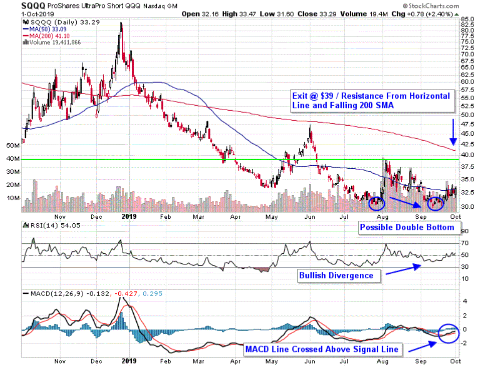

Exchange-Traded Funds (ETFs) such as ProShares' SQQQ have emerged as significant tools in the trading and investment landscape, catering to diverse strategies like hedging and speculative trading. SQQQ is specifically structured as a 3x leveraged inverse ETF, designed to deliver triple the opposite of the daily performance of the Nasdaq-100 Index. This characteristic makes SQQQ particularly appealing for traders looking to capitalize on anticipated declines in the market.

SQQQ’s inverse relationship with the Nasdaq-100 index offers investors potential returns when the market trends downward. The Nasdaq-100 comprises the largest non-financial companies listed on Nasdaq, with significant representation from the technology and telecommunications sectors. SQQQ's movement against this index allows traders to strategically exploit bearish market conditions.



This article aims to address SQQQ hybrid trading strategies, with a focus on algorithmic trading methods. Algorithmic trading, by utilizing computer algorithms to execute trades at high speeds and efficiencies, can significantly alter how investors approach trading with ETFs like SQQQ. By automating the trading process, algorithms provide a systematic way to manage trades, potentially reducing human biases and improving execution times.

Understanding the intricacies of SQQQ, its operational dynamics, benefits, and risks, along with the application of automated trading systems, can substantially refine an investor’s strategy. Whether one possesses extensive trading experience or is just beginning, mastering these concepts can contribute to more informed and effective investment decisions.

## Table of Contents

## Understanding SQQQ: An Overview

Launched in 2010 by ProShares, the ProShares UltraPro Short QQQ (SQQQ) is designed to provide investors with a tool to benefit from market downturns. Specifically, SQQQ seeks to deliver three times the inverse (-3x) of the daily performance of the Nasdaq-100 Index. This means that if the Nasdaq-100 decreases by 1% on a given day, the SQQQ is expected to increase by approximately 3%, excluding fees and expenses.

The Nasdaq-100 Index, tracked by SQQQ, includes 100 of the largest non-financial companies listed on the Nasdaq Stock Market. The index is characterized by its heavy weighting in sectors such as technology and telecommunications, featuring prominent firms like Apple, Amazon, and Microsoft. Due to its sector composition, the Nasdaq-100 is often more volatile compared to broader market indices, presenting opportunities for inverse products like SQQQ during market declines.

SQQQ is primarily designed for short-term trading, not long-term investment. This is primarily due to its daily rebalancing mechanism, which can lead to a compounding effect that diminishes returns over extended periods. The rebalancing process is necessary to maintain the fund’s 3x inverse target daily, but the nature of this process can cause a decay in value, termed as "[volatility](/wiki/volatility-trading-strategies) decay" or "beta slippage," particularly when held beyond single-day horizons.

Investors typically employ SQQQ for short-term strategies to leverage anticipated downturns in the technology-heavy Nasdaq-100. This fund is particularly attractive to traders aiming to hedge against short-term declines in their portfolios or to profit from anticipated bearish market conditions. Given its potential for significant daily price movements, SQQQ demands careful monitoring and understanding of market dynamics to be deployed effectively in an investment strategy.

## Algorithmic Trading and SQQQ

Algorithmic trading, or algo-trading, involves using computer algorithms to execute trades at high speeds and is particularly suitable for Exchange-Traded Funds (ETFs) like ProShares' SQQQ. SQQQ, a 3x leveraged inverse [ETF](/wiki/etf-trading-strategies), offers opportunities for traders aiming to profit from the Nasdaq-100 Index's daily downturns. The automated nature of [algorithmic trading](/wiki/algorithmic-trading) enhances its appeal, allowing systems to be programmed to monitor market trends, execute trades, and respond to predefined criteria.

One significant advantage of algorithmic trading with SQQQ is the minimization of emotional decision-making. Traders often make impulsive decisions that can lead to unplanned losses. Algo-trading eliminates human emotion, basing trade execution completely on logical parameters and algorithms. This results in more disciplined trading practices and can be particularly beneficial in volatile markets where rapid decision-making is crucial.

Algo-trading systems also boost trading efficiency, executing orders at optimal times and prices. This efficiency is tied to the algorithms' ability to process large volumes of data quickly, identifying trading opportunities that may be obscured by slower, manual processes. Such efficiency is vital when trading SQQQ, as its 3x leverage can amplify both profits and losses depending on the timing and execution of trades.

Another critical benefit is the ability to backtest trading strategies against historical data. Backtesting involves simulating a trading strategy using past market data to evaluate its effectiveness. Through rigorous [backtesting](/wiki/backtesting), traders can refine their algorithms, ensuring that strategies are robust and optimized before deploying them in live markets. This process is essential for traders using SQQQ, where understanding past market behaviors and responses to similar conditions can inform strategy adjustments.

Algorithmic trading exploits SQQQ's inherent volatility, as it is designed to respond strongly to daily market fluctuations. Traders can program algorithms to identify specific volatility patterns or thresholds, initiating trades that capitalize on SQQQ's leveraged response to these conditions. By doing so, algo-trading systems can open and close positions more quickly than traditional manual trading, taking advantage of fleeting opportunities in the market.

In summary, algorithmic trading offers substantial advantages for handling leveraged inverse ETFs like SQQQ. By improving decision-making, boosting efficiency through rapid data processing, and enabling strategy optimization via backtesting, algo-trading allows traders to better exploit short-term market opportunities while managing associated risks.

## Advantages of Trading SQQQ

SQQQ, a 3x leveraged inverse ETF by ProShares, offers distinct advantages for traders, particularly those adept at short-term and volatile market movements. One of the primary advantages of trading SQQQ is its [liquidity](/wiki/liquidity-risk-premium). The ETF is highly liquid, allowing traders to quickly enter and [exit](/wiki/exit-strategy) positions. This liquidity reduces the likelihood of slippage, where trades execute at prices different from expected due to low market activity, thus providing more precise control over trade executions.

Additionally, SQQQ serves as an effective hedge against falling markets. For investors with portfolios heavily weighted in Nasdaq stocks, SQQQ provides an opportunity to offset potential losses during market downturns. By inversely tracking the Nasdaq-100 index, SQQQ gains value as the market declines, presenting a protective measure for those concerned about short-term negative movements in their existing holdings.

For experienced traders, leveraging inverse ETFs like SQQQ can significantly enhance returns, especially in volatile markets. The leveraged nature of SQQQ allows traders to amplify their gains from anticipated declines in the Nasdaq-100, provided they utilize strategic risk management and precise timing. However, the effective use of such leverage requires a deep understanding of market dynamics and disciplined entry and exit strategies to mitigate the inherent risks of substantial losses due to market volatility.

Overall, the liquidity, hedging capabilities, and potential for enhanced returns make SQQQ a compelling option for sophisticated traders working within fast-paced and unpredictable market environments.

## Disadvantages and Risks of SQQQ

Holding SQQQ for extended periods can result in negative returns primarily due to its design as a 3x leveraged inverse ETF, which seeks to deliver three times the inverse daily performance of the Nasdaq-100 Index. One pivotal [factor](/wiki/factor-investing) contributing to this outcome is the daily rebalancing mechanism. Each day, SQQQ adjusts its portfolio to maintain its target leverage. However, over longer time frames, this daily reset can cause value decay, particularly in volatile or oscillating markets. This effect is often referred to as "beta slippage" or "volatility decay," whereby daily volatility compounds against the ETF, eroding its value over time.

The risk associated with investing in leveraged inverse products like SQQQ is notably high. These products are designed to capitalize on short-term price movements, but if the market trends upward for an extended period, they can lead to substantial losses. The inherent leverage amplifies losses in the same way it can amplify gains, making it crucial for investors to monitor positions carefully and potentially use stop-loss strategies to mitigate risk.

Moreover, SQQQ's performance can deviate from its intended target, particularly in volatile markets. This deviation arises because the fund's aim is tied to daily returns, not long-term outcomes. When markets are volatile, the daily rebalancing can lead to a cumulative performance that may not align with expected long-term inverse results. This mismatch is further exacerbated in circumstances where the market's direction changes frequently, reducing the effectiveness of the ETF in achieving its stated investment goal.

Ultimately, the risks associated with SQQQ necessitate a thorough understanding of its mechanics and a cautious approach to its usage. Investors should be aware of the potential for significant losses and the difficulty in achieving long-term returns that mirror anticipated short-position strategies.

## Algorithmic Trading Strategies for SQQQ

Algorithmic trading strategies for SQQQ offer various methods for traders to exploit market dynamics efficiently. One popular approach is [momentum](/wiki/momentum) trading, where algorithms are designed to identify and capitalize on trends within the Nasdaq-100. By monitoring indicators such as moving averages and the Relative Strength Index (RSI), algorithms can execute trades when a shift in momentum is detected, aligning with the ETF's movement opposite to the market's direction.

Mean reversion strategies involve the identification of temporary price anomalies. These strategies assume that prices will revert to their historical average over time. In the context of SQQQ, which tracks the inverse performance of the Nasdaq-100, mean reversion can be particularly effective for intraday trading. Algorithms are programmed to buy or sell when prices deviate significantly from the mean, anticipating a correction.

Volatility strategies leverage the inherent volatility in SQQQ, as it responds to market fluctuations. Algorithms can be configured to execute trades based on volatility indicators such as the Bollinger Bands or Average True Range (ATR). This approach allows traders to take advantage of rapid market movements, positioning themselves to benefit when the market experiences sharp downturns. 

These strategies can be implemented using programming languages like Python. For instance, a simple momentum strategy might use the following pseudocode:

```python
if rsi < 30:
    execute_buy_order()
elif rsi > 70:
    execute_sell_order()
```

Such automated systems offer precision and speed, crucial in the fast-paced environment of leveraged ETFs like SQQQ.

## Implementing an Automated Trading System

Selecting the right platform is crucial for implementing an effective automated trading system. Traders should seek platforms that support algorithmic trading, providing extensive data feeds and efficient execution capabilities. Such platforms often offer APIs for customization, allowing traders to integrate bespoke algorithms that align with their strategy.

Developing a robust algorithm requires careful consideration of several factors, including trading rules, market analysis, and risk management. The algorithm should be designed to automate buying and selling decisions based on pre-defined criteria. For instance, a Python-based algorithm may use libraries like `pandas` for data manipulation and `numpy` for numerical computations, ensuring that trades are executed precisely when conditions are met.

```python
import pandas as pd
import numpy as np

# Example strategy: Simple Moving Average Crossover
def moving_average_crossover(data, short_window=50, long_window=200):
    signals = pd.DataFrame(index=data.index)
    signals['price'] = data['price']
    signals['short_mavg'] = data['price'].rolling(window=short_window, min_periods=1).mean()
    signals['long_mavg'] = data['price'].rolling(window=long_window, min_periods=1).mean()
    signals['signal'] = 0.0
    signals['signal'][short_window:] = np.where(signals['short_mavg'][short_window:] > signals['long_mavg'][short_window:], 1.0, 0.0)
    signals['positions'] = signals['signal'].diff()
    return signals
```

Backtesting the algorithm with historical data is essential to evaluate its performance before live trading. This process helps identify any potential flaws and allows for optimization by simulating how the strategy would have performed in past market conditions. Iterative testing and adjustments can improve the algorithm's profitability and risk management capabilities.

Once the system is implemented, continuous monitoring is needed to assess its performance in real-time market scenarios. Parameters may require adjustment as market conditions evolve, ensuring the system remains aligned with the current trading environment. This adaptability can help to sustain the strategy's effectiveness over time, allowing traders to respond promptly to market dynamics.

## Conclusion

SQQQ offers a distinct opportunity for traders who are skilled in managing short-term market fluctuations. Its nature as a 3x leveraged inverse ETF tracking the Nasdaq-100 index allows investors to harness downward market movements effectively. This capacity becomes even more potent when combined with algorithmic trading techniques. Automated systems can be calibrated to respond swiftly to market changes, thus amplifying the effectiveness of short-position strategies during bearish trends.

Algorithmic trading tools can streamline processes by eliminating emotional biases, ensuring precision, and enabling rapid execution. By leveraging these systems, traders can fine-tune their strategies to capitalize on the inherent volatility associated with SQQQ, potentially maximizing returns. However, it remains crucial to acknowledge the potential benefits alongside the significant risks involved. In particular, the risks associated with daily rebalancing and the possibility of significant losses in non-favorable conditions should be thoroughly comprehended and managed.

Ultimately, successful implementation of these advanced trading strategies requires a balance of innovative technology and fundamental market understanding. By carefully navigating these elements, traders can effectively enhance their investment methods with SQQQ, making informed decisions that align with their financial objectives.

## References & Further Reading

[1]: Bergstra, J., Bardenet, R., Bengio, Y., & Kégl, B. (2011). ["Algorithms for Hyper-Parameter Optimization."](https://papers.nips.cc/paper/4443-algorithms-for-hyper-parameter-optimization) Advances in Neural Information Processing Systems 24.

[2]: ["Advances in Financial Machine Learning"](https://www.amazon.com/Advances-Financial-Machine-Learning-Marcos/dp/1119482089) by Marcos Lopez de Prado

[3]: ["Evidence-Based Technical Analysis: Applying the Scientific Method and Statistical Inference to Trading Signals"](https://www.amazon.com/Evidence-Based-Technical-Analysis-Scientific-Statistical/dp/0470008741) by David Aronson

[4]: ["Machine Learning for Algorithmic Trading"](https://github.com/stefan-jansen/machine-learning-for-trading) by Stefan Jansen

[5]: ["Quantitative Trading: How to Build Your Own Algorithmic Trading Business"](https://www.amazon.com/Quantitative-Trading-Build-Algorithmic-Business/dp/1119800064) by Ernest P. Chan