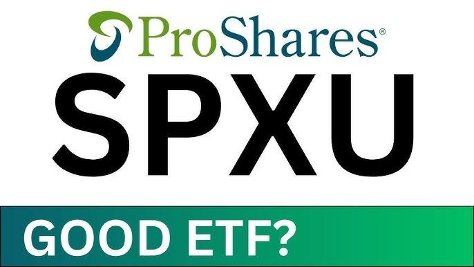

UltraPro ProShares ETF is a financial instrument crafted for investors aiming to exploit the shifts in the S&P 500 index. This exchange-traded fund (ETF) employs leverage to magnify the daily performance of its underlying benchmark, the S&P 500. By targeting three times (3x) the daily return of the index, it offers a vehicle for aggressive investors to potentially amplify their returns. Understanding the complexities of such an investment is crucial, given its inherent risks and the advanced strategies it accommodates.

In this article, we will investigate various aspects of the UltraPro ProShares ETF, including its investment aims and the unique risks associated with leveraged products. Leveraged ETFs are known for their higher risk-reward profiles, leading to volatility that can be both an opportunity and a challenge for investors. 



A significant focus will be on the application of algorithmic trading strategies with UltraPro ProShares ETF. Algorithmic trading, also known as algo trading, utilizes computer algorithms to execute trades based on predefined criteria. The high volatility and momentum-driven characteristics of leveraged ETFs make them appealing candidates for algorithm-powered trading models. These strategies can automate trades to quickly react to market changes, capitalizing on short-term price movements while attempting to manage risk.

Key to successful investment in such products is a thorough comprehension of how these ETFs work, alongside carefully considering one’s investment objectives and risk tolerance. For tech-savvy investors, particularly those utilizing algorithmic trading, UltraPro ProShares ETF may offer substantial potential, provided that adequate protective measures are in place against the substantial risks of leverage and market volatility.

## Table of Contents

## What is UltraPro ProShares ETF?

The UltraPro ProShares ETF is specifically designed to amplify the daily performance of the S&P 500 index by a factor of three (3x). This form of leveraged exposure is achieved through financial instruments like swaps and futures, rather than merely holding the stocks in the index. Leveraged ETFs, such as UltraPro ProShares, are built to provide investors with opportunities to gain magnified returns on their investment if the market moves in their favor.

The design of such an ETF involves a sophisticated structure where the fund manager utilizes derivatives to achieve the targeted daily return. Swaps, which are agreements to exchange cash flows or returns on an asset, are commonly used in these ETFs. The UltraPro ProShares ETF uses these swaps to try to match three times the return of the underlying S&P 500 index on a daily basis. Additionally, futures contracts, which are standardized agreements to buy or sell an asset at a predetermined future date and price, may be employed to facilitate the leverage effect.

However, this leverage comes with significant risks. The daily reset feature of leverage can lead to compounding effects, where returns over a longer period can be vastly different from the expected multiple of the index's performance due to market [volatility](/wiki/volatility-trading-strategies). This makes the [ETF](/wiki/etf-trading-strategies) highly volatile and more suitable for short-term trading rather than long-term holding.

To better understand how these components work together, consider the formula for calculating the leveraged return:

$$
\text{Leveraged Return} = 3 \times \text{Daily Return of S\&P 500 Index}
$$

This calculation is done daily and can result in significant deviations from 3x the index return over longer periods, especially in volatile markets. Therefore, while UltraPro ProShares ETF presents the potential for significant short-term gains for aggressive investors, it necessitates a well-rounded understanding of the intricate financial mechanisms at play and an evaluation of one's risk tolerance.

## Using Algorithmic Trading with UltraPro ProShares ETF

Algorithmic trading, often referred to as algo trading, involves the use of computer programs to facilitate trading decisions based on predetermined criteria. This approach leverages the power of technology to execute trades at speeds and frequencies not feasible for human traders, thereby optimizing the opportunity for capitalizing on market movements.

The UltraPro ProShares ETF's design, aiming to deliver three times (3x) the daily performance of the S&P 500, makes it a compelling instrument for [algorithmic trading](/wiki/algorithmic-trading). The inherent high volatility and the leveraged nature of this ETF present unique opportunities and challenges for traders utilizing algorithmic strategies.

**Advantages of Using UltraPro ProShares ETF in Algorithmic Trading:**

1. **Volatility Exploitation:** The leveraged structure of UltraPro ProShares ETF results in significant price movements even with minor shifts in the S&P 500 index. This high level of volatility can be advantageous for algorithms designed to capture short-term price fluctuations, potentially leading to enhanced returns.

2. **Efficiency of Execution:** Algorithms can execute large volumes of trades swiftly and without emotional bias, which can be particularly beneficial in the fast-paced environment associated with leveraged ETFs like UltraPro ProShares. The automated nature of algo trading helps in executing predefined strategies consistently and efficiently.

3. **Risk Management:** While the amplified exposure can lead to considerable gains, it also poses a risk of substantial losses. Algorithmic trading platforms often incorporate advanced risk management tools that can automatically adjust trading strategies based on market conditions. Features such as stop-loss orders and dynamic rebalancing can help in managing the elevated risks associated with leveraged ETFs.

The following is a simplified example of how an algorithm might be structured in Python to execute trades based on moving average crossovers, a common strategy used in algorithmic trading:

```python
import yfinance as yf  # For more datasets, visit: https://paperswithbacktest.com/datasets
import numpy as np

# Load data
ticker = 'UPRO'
data = yf.download(ticker, start='2022-01-01', end='2023-01-01')

# Calculate moving averages
data['SMA50'] = data['Close'].rolling(window=50).mean()
data['SMA200'] = data['Close'].rolling(window=200).mean()

# Define trading signals
data['Signal'] = np.where(data['SMA50'] > data['SMA200'], 1, 0)
data['Position'] = data['Signal'].diff()

# Print the head of the data with signals and positions
print(data[['Close', 'SMA50', 'SMA200', 'Signal', 'Position']].head())
```

This simple strategy indicates a "buy" when the short-term moving average crosses above the long-term moving average and a "sell" when it crosses below, a method particularly suitable for volatile and leveraged instruments like UltraPro ProShares ETF.

**Considerations for Algorithmic Traders:**

Traders employing algorithms must consider the intricacies of the ETF's performance, including its compounding effects and potential tracking errors. These factors can impact the ETF's returns over extended periods, emphasizing the need for strategies attuned to the ETF’s short-term movements. Active monitoring and continual adjustment of parameters are necessary to adapt to ever-changing market dynamics and maintain the effectiveness of algo trading strategies.

The application of algorithmic trading to UltraPro ProShares ETF offers promising prospects for tech-savvy investors, provided they maintain a rigorous approach to strategy development and risk control.

## Performance and Historical Context

UltraPro ProShares ETF, like many leveraged exchange-traded funds (ETFs), has shown variable performance since its inception, underscoring the dual nature of its investment profile—high potential gains with equally substantial risks. The ETF is designed to achieve three times the daily performance of the S&P 500 Index. This leverage means that small daily movements in the S&P 500 can result in large percentage changes in the ETF's value. Consequently, the fund's performance can be significantly amplified, whether positive or negative.

Examining historical performance data, the UltraPro ProShares ETF has demonstrated periods of impressive returns during bullish market phases. In times when the S&P 500 has trended upwards consistently, the ETF's leveraged structure has allowed it to outpace standard investments mimicking the index. For example, a 1% increase in the S&P 500 on a given day theoretically results in a 3% increase in the UltraPro ProShares ETF, subject to tracking errors and fees.

However, the reverse holds true in bearish conditions, where the leveraged exposure can magnify losses. For instance, a decline of 1% in the S&P 500 might cause a 3% decline in the ETF's value. Extended hold periods can further exacerbate these effects due to daily compounding, which can lead to significant discrepancies from the expected performance based on simple multiplication of index returns.

The mathematical aspect of this dynamic is embodied in the formula that calculates the ETF's return based on daily compounding: 

$$
V_t = V_0 \times (1 + 3r_1) \times (1 + 3r_2) \times \ldots \times (1 + 3r_n)
$$

where $V_t$ is the value of the ETF at time t, $V_0$ is the initial value, and $r_1, r_2, \ldots, r_n$ are the daily returns of the S&P 500. The cumulative effect of daily leveraged returns introduces variability that can diverge from investor expectations, especially over longer holding periods.

The ETF's historical performance underscores the necessity for investors to align trading strategies with both current market conditions and their own risk tolerance. The volatility that provides opportunity in short-term trading can become a liability in long-term investments if not carefully monitored and adjusted. Investors adopting this instrument into their portfolios often employ strategies such as regular rebalancing and strict risk management techniques to navigate its complex risk-return landscape effectively.

In conclusion, while the UltraPro ProShares ETF offers significant upside in rising markets, its performance history illustrates the critical need for a nuanced approach to leverage, market timing, and risk management.

## Risks and Considerations

Leveraged ETFs such as UltraPro ProShares are designed to deliver a multiple of the performance of their respective benchmark indices over a single day. This characteristic introduces specific risks that investors must consider carefully. One primary risk is the compounding effect, which can significantly impact returns when ETFs are held for more than one trading session. Due to the daily resetting nature of leveraged ETFs, returns over periods longer than one day can deviate substantially from the intended leverage [factor](/wiki/factor-investing) times the index return. This deviation becomes more pronounced in volatile markets, where large price fluctuations can erode value even if the index ends up at a point that initially seemed favorable for investors.

Counterparty risk is another critical consideration for UltraPro ProShares ETF investors due to the frequent use of derivatives like swaps to achieve leverage. Swaps involve agreements with financial counterparties, which can fail in situations of market stress, leaving investors exposed to potential losses. This risk emphasizes the importance of evaluating the creditworthiness of the counterparties involved when investing in such financial instruments.

Market volatility itself poses significant risks to leveraged ETFs, especially in the context of the S&P 500. Unpredictable and rapid changes in the index can result in amplified gains, but they equally amplify losses, potentially affecting investors' portfolios adversely. For instance, in a scenario where market prices oscillate widely, the repeated daily reset of leveraged ETFs results in returns that neither align with the annual index movement nor with the anticipated multiplied return, leading sometimes to investor confusion and portfolio underperformance.

Investors are advised to conduct careful monitoring of their leveraged ETF positions, adjusting strategies regularly to address prevailing market conditions. A dynamic and disciplined approach to managing these investments may include setting stop-loss orders or employing hedging techniques to protect against downside risks. Periodic strategy reviews can help mitigate some of the inherent risks associated with leveraged products and ensure alignment with evolving market trends and investor risk tolerance.

Understanding and navigating these risks require a well-informed approach to investing, incorporating both quantitative analysis and ongoing market assessment to optimize the potential benefits of leveraged ETFs while minimizing exposure to their drawbacks.

## Conclusion

UltraPro ProShares ETF represents an advanced financial tool for sophisticated investors and algorithmic traders seeking amplified exposure to the S&P 500. This leveraged investment vehicle allows traders to pursue significantly higher returns by offering three times the daily performance of the index it tracks. However, with such potential for high returns, it is imperative for investors to thoroughly understand the associated risks and align them with their investment goals.

One of the primary risks involved with the UltraPro ProShares ETF is its leveraged nature, which can lead to large losses if the market moves against the investor's position. The compounding effects inherent in leveraged ETFs can erode returns over time, particularly in volatile markets or during periods of prolonged market downturns. Investors should be cautious of these dynamics and recognize that the ETF's performance can diverge significantly from the intended multiple over longer periods.

Another important consideration is the risk associated with derivative instruments used to achieve leverage, such as swaps and futures contracts. These instruments [carry](/wiki/carry-trading) counterparty risks and can introduce additional complexities in managing the investment. Investors need to be diligent in their assessment of both market and instrument-specific risks before engaging with this ETF.

To successfully utilize UltraPro ProShares ETF, expertise and a well-considered strategy are essential. Investors should employ robust risk management techniques, including setting stop-loss orders and determining position sizes that reflect their risk tolerance. Algorithmic trading strategies, which automate decision-making processes, can be particularly advantageous in this context, enabling traders to efficiently capitalize on short-term market movements.

Ultimately, while UltraPro ProShares ETF can be a valuable component of a sophisticated investment strategy, it requires a nuanced understanding of leverage, risk, and market dynamics. Investors are urged to continuously monitor their investments and adapt their strategies in response to changing market conditions to optimize returns while minimizing potential losses.

## References & Further Reading

[1]: ["Advances in Financial Machine Learning"](https://www.amazon.com/Advances-Financial-Machine-Learning-Marcos/dp/1119482089) by Marcos Lopez de Prado

[2]: ["Quantitative Trading: How to Build Your Own Algorithmic Trading Business"](https://github.com/LucindaYa/quant-resources/blob/master/Quantitative%20Trading%20How%20to%20Build%20Your%20Own%20Algorithmic%20Trading%20Business.pdf) by Ernest P. Chan

[3]: ["Evidence-Based Technical Analysis: Applying the Scientific Method and Statistical Inference to Trading Signals"](https://www.amazon.com/Evidence-Based-Technical-Analysis-Scientific-Statistical/dp/0470008741) by David Aronson

[4]: ["Machine Learning for Algorithmic Trading"](https://github.com/stefan-jansen/machine-learning-for-trading) by Stefan Jansen

[5]: Engle, R. F., & Rangel, J. G. (2008). ["The S&P 500 Implied Volatility and Methodology of the CBOE Volatility Index."](https://www.jstor.org/stable/40056848) Journal of Financial Markets.

[6]: Bhattacharya, R., & Majumdar, M. (2007). ["Random Dynamical Systems and Their Applications in Economics and Finance."](https://www.amazon.com/Random-Dynamical-Systems-Theory-Applications/dp/B007MXH53S) Chapman and Hall/CRC.

[7]: ["Leveraged Exchange-Traded Funds: Mechanics and Investment Guidance"](https://link.springer.com/book/10.1007/978-3-319-29094-2) by State Street Global Advisors