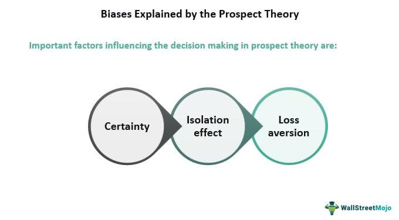

## Table of Contents

## What is Prospect Theory?

Prospect Theory is a theory in behavioral economics that explains how people make decisions when they are unsure about the outcomes. It was developed by psychologists Daniel Kahneman and Amos Tversky. The theory suggests that people value gains and losses differently, and this affects their choices. Instead of looking at the final outcome, people focus on the potential gains or losses from their current situation. This means that people are often more worried about losing something than they are excited about gaining something of equal value.

For example, if you were offered a choice between getting $50 for sure or a 50% chance of getting $100, you might choose the sure $50 even though the expected value of the gamble is the same. This is because the pain of losing feels stronger than the joy of gaining. Prospect Theory also talks about how people view probabilities. People tend to overestimate small probabilities and underestimate large ones. This can lead to behaviors like buying lottery tickets or avoiding certain risks even when the chances are low. Overall, Prospect Theory helps us understand why people sometimes make choices that seem irrational when looked at through traditional economic models.

## Who developed Prospect Theory and when?

Prospect Theory was developed by two psychologists named Daniel Kahneman and Amos Tversky. They worked together to create this theory in the late 1970s. Kahneman and Tversky wanted to understand why people make certain choices when they are not sure about what will happen.

They published their main ideas about Prospect Theory in a paper in 1979. This paper explained how people think about gains and losses differently, and how this affects their decisions. Their work has been very important in the field of behavioral economics, helping people understand why we sometimes make choices that seem strange or not logical.

## How does Prospect Theory differ from Expected Utility Theory?

Prospect Theory and Expected Utility Theory are two different ways to understand how people make choices when they're not sure what will happen. Expected Utility Theory says that people make choices based on the total happiness or satisfaction they expect to get from different options. It assumes that people think about all possible outcomes, how likely they are, and how happy each outcome would make them. They then choose the option that gives them the highest expected happiness.

Prospect Theory, on the other hand, says that people don't just look at the final happiness or satisfaction. Instead, they focus on changes from their current situation, like gains and losses. People feel the pain of losing something more strongly than the joy of gaining something of the same value. Also, Prospect Theory says that people don't always see probabilities the way they really are. They might think a small chance of something happening is bigger than it actually is, or they might think a big chance is smaller. This makes people's choices different from what Expected Utility Theory would predict.

## What are the key components of Prospect Theory?

Prospect Theory has a few main parts that help explain how people make choices when they're unsure about what will happen. One key part is the idea of "value function." This means people don't just look at the final outcome of a choice. Instead, they focus on whether the choice will make them gain or lose something compared to where they are now. People feel the pain of losing something more than the happiness of gaining the same amount. So, if someone might lose $100, it feels worse than the joy of gaining $100.

Another important part of Prospect Theory is how people see the chances of things happening. This is called "probability weighting." People don't always see the real chances correctly. They might think a small chance is bigger than it really is, like when people buy lottery tickets. And they might think a big chance is smaller than it really is. This can make people act in ways that seem strange if you just look at the real numbers. Together, these parts of Prospect Theory help us understand why people sometimes make choices that don't seem to make sense when you think about them in a simple way.

## Can you explain the concept of 'value function' in Prospect Theory?

The value function in Prospect Theory is a way to explain how people feel about gains and losses. Instead of looking at the final amount of money or happiness they might get, people focus on how much they gain or lose from where they are right now. This means if someone is offered a choice between gaining $50 or losing $50, the feeling of losing $50 will be much stronger than the feeling of gaining $50. People feel the pain of losing something more than the joy of gaining the same amount. This is why the value function in Prospect Theory shows that losses hurt more than gains feel good.

This idea is shown on a graph where the value function curves differently for gains and losses. For gains, the curve goes up but gets flatter as the gains get bigger. This means that the more you gain, the less exciting each extra dollar feels. For losses, the curve goes down sharply and keeps going down steeply. This shows that the more you lose, the worse each extra dollar lost feels. So, the value function helps explain why people are often more worried about losing something than they are excited about gaining something, even if the amounts are the same.

## How does the 'probability weighting function' work in Prospect Theory?

The 'probability weighting function' in Prospect Theory helps explain how people think about the chances of things happening. It shows that people don't always see probabilities the way they really are. For example, if there's a small chance of something happening, like winning the lottery, people might think that chance is bigger than it actually is. On the other hand, if there's a big chance of something happening, people might think that chance is smaller than it really is. This means that people might make choices based on what they think the chances are, rather than what the real chances are.

This idea is shown on a graph where the probability weighting function curves differently for small and large probabilities. For small probabilities, the curve goes up quickly, showing that people think those small chances are bigger than they really are. For large probabilities, the curve flattens out, showing that people think those big chances are smaller than they really are. This can lead to behaviors like buying lottery tickets, where the actual chance of winning is very small but people think it's bigger, or avoiding certain risks even when the chances of something bad happening are low.

## What is loss aversion and how does it relate to Prospect Theory?

Loss aversion is a big part of Prospect Theory. It means that people feel the pain of losing something more than the happiness of gaining something of the same value. Imagine you find $100 on the street, you'd be happy. But if you lost $100, you'd feel a lot worse. This is because losing something hurts more than gaining something feels good. In Prospect Theory, this idea helps explain why people often make choices to avoid losing, even if it means missing out on a chance to gain something.

Loss aversion is shown in the value function of Prospect Theory. The value function is a way to see how people feel about gains and losses. On a graph, the part for losses goes down steeper than the part for gains goes up. This shows that the feeling of losing is stronger than the feeling of gaining. Because of loss aversion, people might choose to keep what they have instead of taking a risk that could lead to a bigger gain, but also a possible loss. This helps explain why people sometimes make choices that seem strange if you just look at the numbers.

## How does framing affect decision-making according to Prospect Theory?

Framing is all about how choices are presented to people. It can change how people make decisions. In Prospect Theory, the way a choice is framed can make a big difference. If you tell someone they have a 90% chance of winning, they might feel good about it. But if you say they have a 10% chance of losing, they might feel worried even though it's the same chance. This is because people feel the pain of losing more than the joy of gaining. So, the way you frame a choice can make people see it differently and choose differently.

For example, imagine a doctor telling you about a surgery. If the doctor says there's a 90% chance of surviving, you might feel okay about it. But if the doctor says there's a 10% chance of dying, you might feel scared even though it's the same chance. This shows how framing can change how risky a choice seems. In Prospect Theory, this happens because people focus on gains and losses from where they are now. So, the way a choice is framed can push people towards one option over another, even if the choices are the same when you look at the numbers.

## Can you provide examples of how Prospect Theory applies to real-world decision-making?

Prospect Theory helps explain why people sometimes make choices that don't seem to make sense. Imagine you're at a store, and there's a sale on something you like. If the store says you can save $50, you might feel good about buying it. But if the store says you'll lose out on $50 if you don't buy it, you might feel more pressure to buy it even though it's the same deal. This is because losing feels worse than gaining, so how the store frames the sale can change your decision.

Another example is insurance. People often buy insurance even when the chance of something bad happening is small. This is because the fear of losing a lot of money if something bad happens feels stronger than the cost of the insurance. Prospect Theory explains this by saying people think small chances are bigger than they really are and they want to avoid losses. So, even if the insurance might not be the best choice when you look at the numbers, people buy it to feel safer.

## What are some criticisms or limitations of Prospect Theory?

Prospect Theory has been very helpful in understanding how people make choices, but it also has some problems. One big problem is that it can be hard to use in real life. The theory talks about how people see gains and losses and how they think about chances, but it can be tough to measure these things exactly. This makes it hard for businesses or governments to use Prospect Theory to predict what people will do. Also, the theory was made based on experiments with small groups of people, so it might not work the same way for everyone everywhere.

Another issue with Prospect Theory is that it doesn't explain everything about how people make choices. For example, it doesn't talk about how emotions or social pressures can change what people decide. People might make different choices if they're feeling happy or sad, or if they want to fit in with their friends. Also, Prospect Theory focuses a lot on money and simple choices, but it might not work as well for more complicated decisions, like choosing a job or a house. So, while Prospect Theory is a good start, it's not a complete answer to understanding all of people's choices.

## How has Prospect Theory been tested and validated in experimental settings?

Prospect Theory has been tested and checked in many experiments to see if it really works. Daniel Kahneman and Amos Tversky, who made the theory, did a lot of these tests. They asked people to make choices in different situations and saw how they reacted. For example, they might ask people if they would take a sure gain of $50 or a 50% chance to win $100. They found that people often chose the sure $50, even though the expected value was the same. This showed that people feel the pain of losing more than the joy of gaining, which is a big part of Prospect Theory.

Other researchers have also done experiments to test Prospect Theory. They've used different kinds of choices and different groups of people to see if the theory works in different situations. For example, some experiments have looked at how people make choices about health, like choosing between different treatments. These experiments have shown that Prospect Theory can help explain why people make certain choices, even when those choices seem strange if you just look at the numbers. Overall, these experiments have helped show that Prospect Theory is a good way to understand how people make decisions when they're not sure what will happen.

## What are the advanced applications of Prospect Theory in fields like economics, finance, and behavioral science?

In economics, Prospect Theory helps explain why people sometimes make choices that don't seem to make sense if you just look at the numbers. For example, during a financial crisis, people might hold onto losing investments because they're afraid of realizing a loss. This behavior can be explained by loss aversion, a key part of Prospect Theory. Economists use this theory to understand how people react to economic policies and market changes. They can predict how people might save, spend, or invest based on how they see gains and losses. This helps in designing better economic policies that take into account people's real behavior, not just what traditional models say they should do.

In finance, Prospect Theory is used to understand how investors make decisions. It explains why investors might be more upset about losing money than they are happy about making money. This can lead to behaviors like selling winning investments too soon and holding onto losing ones too long. Financial advisors and firms use Prospect Theory to help design investment strategies that fit with how people actually make choices. They might create investment options that are framed to seem less risky or more rewarding, which can help investors feel more comfortable with their choices. This understanding also helps in creating financial products that people are more likely to use, like insurance policies that are framed to highlight the protection against loss.

In behavioral science, Prospect Theory is used to study how people make choices in different areas of life, not just money. Researchers look at how framing and loss aversion affect decisions in health, like choosing between different treatments, or in everyday life, like deciding whether to take a risk. By understanding these patterns, behavioral scientists can help design better programs and interventions. For example, they might frame health messages to focus on the benefits of action rather than the risks of inaction, or they might design programs that help people overcome their fear of loss to make better decisions. This broad application shows how Prospect Theory can help improve many parts of our lives by understanding how we really think and choose.

## What is Exploring Prospect Theory?

Prospect theory, formulated by Daniel Kahneman and Amos Tversky in 1979, fundamentally altered the comprehension of decision-making under risk by demonstrating that individuals do not always act rationally, as traditional economic models like expected utility theory suggest. Instead, individuals evaluate potential losses and gains using a subjective value system rather than objective probabilities or outcomes.

The cornerstone of prospect theory is the concept of 'loss aversion.' This principle posits that losses cause a more pronounced emotional response compared to equivalent gains. Mathematically, this can be expressed by a value function that is steeper in the domain of losses than in gains. This function is typically concave for gains and convex for losses, reflecting diminished sensitivity to changes in wealth levels as they rise or fall. The typical formulation is given as:

$$
V(x) = 
  \begin{cases} 
   x^\alpha & \text{if } x \ge 0 \\
   -\lambda (-x)^\beta & \text{if } x < 0 
  \end{cases}
$$

Here, $\lambda > 1$ indicates loss aversion, and $\alpha, \beta$ describe the diminishing sensitivity to gains and losses.

This asymmetry implies that people often engage in risk-seeking behavior to avoid losses and risk-averse behavior to secure gains. For instance, individuals might gamble to avert a loss rather than accept a certain smaller loss, while they are likely to accept a sure gain rather than gamble for a larger win. Such behavioral tendencies significantly influence financial decision-making.

Understanding and incorporating prospect theory into trading algorithms can enhance their predictive capability. By aligning algorithms with risk preferences and biases observed in human behavior, more accurate modeling of market reactions can be achieved. For instance, trading strategies can incorporate risk-adjusted metrics that mirror the degree of loss aversion found in investor behavior, potentially leading to improved market entry and [exit](/wiki/exit-strategy) points.

Furthermore, incorporating such insights into [algorithmic trading](/wiki/algorithmic-trading) can refine strategies to account for behavioral biases, helping to anticipate market movements influenced by collective investor psychology. This opens up avenues for more sophisticated prediction models, ultimately enhancing trading strategies with a deeper understanding of human-driven market dynamics.

## References & Further Reading

[1]: Kahneman, D., & Tversky, A. (1979). ["Prospect Theory: An Analysis of Decision under Risk."](http://web.mit.edu/curhan/www/docs/Articles/15341_Readings/Behavioral_Decision_Theory/Kahneman_Tversky_1979_Prospect_theory.pdf) Econometrica, 47(2), 263-291.

[2]: Thaler, R. H. (1994). ["Advances in Behavioral Finance."](https://archive.org/details/advancesinbehavi0000unse_a6k4) Russell Sage Foundation.

[3]: Lo, A. W. (2012). ["Adaptive Markets: Financial Evolution at the Speed of Thought."](https://www.jstor.org/stable/j.ctvc77k3n) Princeton University Press.

[4]: Barberis, N., & Thaler, R. (2003). ["A Survey of Behavioral Finance."](https://www.nber.org/papers/w9222) In G. M. Constantinides, M. Harris & R. M. Stulz (Eds.), Handbook of the Economics of Finance, Volume 1, Part 2, Elsevier.

[5]: Jansen, S. (2018). ["Machine Learning for Algorithmic Trading: Predictive Models to Extract Signals From Market and Alternative Data for Systematic Trading Strategies with Python."](https://www.amazon.com/Machine-Learning-Algorithmic-Trading-alternative/dp/1839217715) Packt Publishing.