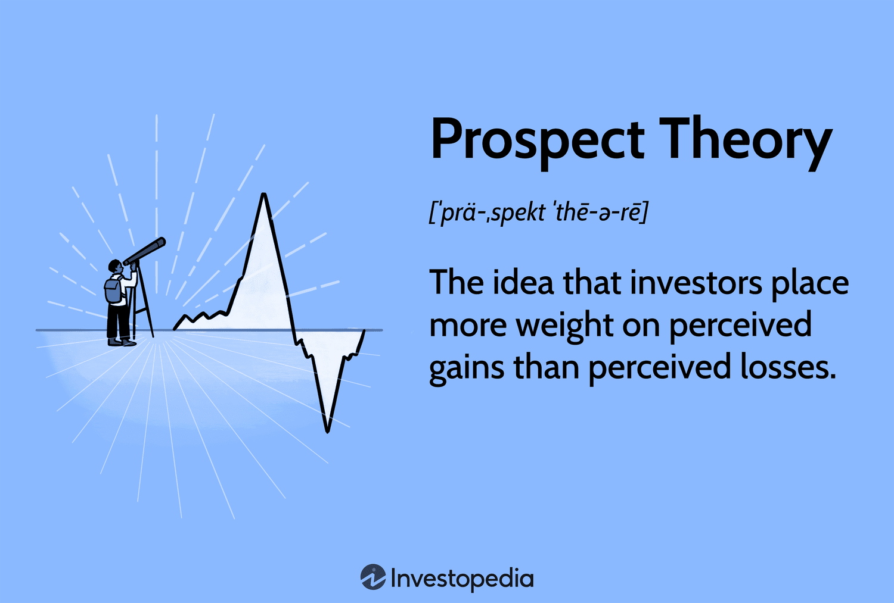

Behavioral economics challenges the traditional economic paradigm that humans are entirely rational agents. It reveals that cognitive biases, emotions, and social influences frequently lead individuals to make decisions that deviate from rationality. One of the seminal contributions to this field is prospect theory, developed by Daniel Kahneman and Amos Tversky, which revolutionized understanding by emphasizing how people perceive and decide under risk. Unlike classical utility theory, which assumes individuals evaluate outcomes based solely on final states, prospect theory suggests that losses and gains are perceived relative to a reference point, typically the status quo, and that losses generally have a more significant impact than equivalent gains. This concept of "loss aversion" explains why people may take greater risks to avoid losses than to secure gains, thus providing a nuanced insight into human decision-making.

Algorithmic trading, on the other hand, leverages advances in technology to perform high-speed, precise trading based on pre-set criteria. Through the utilization of algorithms, trading can occur at a pace and accuracy that surpasses human capabilities, often exploiting small market inefficiencies. These algorithms can be programmed to execute a wide range of trading strategies, from market making to arbitrage, and can react instantaneously to market conditions, potentially leading to improved market liquidity and reduced transaction costs.



The intersection of behavioral economics and algorithmic trading suggests promising enhancements in trading strategies. By incorporating insights from prospect theory and behavioral biases, trading algorithms can be designed to better predict and navigate scenarios dominated by irrational market behaviors. Understanding these psychological patterns allows for refined algorithms that can manage risk more effectively and anticipate shifts in market sentiment. This convergence brings the possibility of more adaptive and resilient financial systems, showcasing how human psychology can inform the development of AI-driven financial markets.

## Table of Contents

## Understanding Behavioral Economics

Behavioral economics is a field that diverges from the classical economic assumption of rational behavior, broadening the understanding of economic decision-making through the incorporation of psychological insights. At the heart of behavioral economics are concepts such as heuristics, biases, and framing effects, which provide a more nuanced perspective of individual decision-making processes.

Heuristics refer to mental shortcuts or rules of thumb that individuals use to simplify decision-making. While these shortcuts can aid efficient decision-making under uncertainty, they often lead to systematic biases. Notable biases include overconfidence, anchoring, and availability bias. For example, overconfidence can cause traders to underestimate risks, leading to suboptimal financial decisions.

Framing effects highlight how the presentation of information can significantly alter decision outcomes. An individual's choice can be influenced by how a scenario is presented, such as framing a situation in terms of potential losses versus potential gains. This phenomenon demonstrates that decision-making is context-dependent, contradicting the assumption of invariant rationality.

Pioneering figures in behavioral economics, such as Daniel Kahneman and Amos Tversky, introduced key theories that challenge the traditional expected utility theory. Their work laid the foundation for understanding how real-world decisions deviate from classical economic predictions. For instance, the prospect theory, developed by Kahneman and Tversky, provides a model for understanding how people evaluate uncertain outcomes, giving weight to potential losses more than equivalent gains.

Real-world applications of behavioral economics span a wide range of fields, from enhancing marketing strategies to informing policy decisions. By understanding consumer behavior through a lens of psychological phenomena, companies can design marketing campaigns that effectively influence purchasing choices. In policy-making, behavioral insights can inform interventions that nudge individuals towards better health and financial decisions.

In finance, behavioral insights can explain why investors often display risk-seeking behavior, even when less risky options are available. This tendency is particularly relevant in the context of [algorithmic trading](/wiki/algorithmic-trading), where understanding human psychology can be leveraged to improve financial algorithms. By incorporating psychological models into trading strategies, financial systems can be designed to predict and adapt to irrational market behaviors, potentially enhancing market efficiency.

In summary, behavioral economics provides a critical complement to traditional economic theories by elucidating the psychological underpinnings of decision-making. Through its application, both individuals and organizations can better anticipate and react to the complex and often irrational nature of human behavior in financial markets. This interplay of psychology and economics not only enriches theoretical understanding but also offers practical tools for improving algorithmic trading strategies in today's dynamic financial landscapes.

## Exploring Prospect Theory

Prospect theory, formulated by Daniel Kahneman and Amos Tversky in 1979, fundamentally altered the comprehension of decision-making under risk by demonstrating that individuals do not always act rationally, as traditional economic models like expected utility theory suggest. Instead, individuals evaluate potential losses and gains using a subjective value system rather than objective probabilities or outcomes.

The cornerstone of prospect theory is the concept of 'loss aversion.' This principle posits that losses cause a more pronounced emotional response compared to equivalent gains. Mathematically, this can be expressed by a value function that is steeper in the domain of losses than in gains. This function is typically concave for gains and convex for losses, reflecting diminished sensitivity to changes in wealth levels as they rise or fall. The typical formulation is given as:

$$
V(x) = 
  \begin{cases} 
   x^\alpha & \text{if } x \ge 0 \\
   -\lambda (-x)^\beta & \text{if } x < 0 
  \end{cases}
$$

Here, $\lambda > 1$ indicates loss aversion, and $\alpha, \beta$ describe the diminishing sensitivity to gains and losses.

This asymmetry implies that people often engage in risk-seeking behavior to avoid losses and risk-averse behavior to secure gains. For instance, individuals might gamble to avert a loss rather than accept a certain smaller loss, while they are likely to accept a sure gain rather than gamble for a larger win. Such behavioral tendencies significantly influence financial decision-making.

Understanding and incorporating prospect theory into trading algorithms can enhance their predictive capability. By aligning algorithms with risk preferences and biases observed in human behavior, more accurate modeling of market reactions can be achieved. For instance, trading strategies can incorporate risk-adjusted metrics that mirror the degree of loss aversion found in investor behavior, potentially leading to improved market entry and [exit](/wiki/exit-strategy) points.

Furthermore, incorporating such insights into algorithmic trading can refine strategies to account for behavioral biases, helping to anticipate market movements influenced by collective investor psychology. This opens up avenues for more sophisticated prediction models, ultimately enhancing trading strategies with a deeper understanding of human-driven market dynamics.

## Algorithmic Trading: A Brief Overview

Algorithmic trading involves the use of computer programs to execute trading decisions based on a predefined set of rules and parameters. This system has transformed financial markets by contributing significantly to trading volumes, delivering speed and precision unattainable by human traders. The adoption of algorithmic trading has seen rapid growth due to these advantages, making it a critical component in modern financial markets.

Traders employ various strategies within algorithmic trading, with some of the most popular being trend-following, [arbitrage](/wiki/arbitrage), and [market making](/wiki/market-making). These strategies rely extensively on complex algorithms to process vast amounts of data and identify optimal trading opportunities. 

1. **Trend-Following**: This strategy capitalizes on the momentum of asset price movements. Algorithms analyze historical price data to predict future price trends, executing trades that align with these projected movements.

2. **Arbitrage**: Here, algorithms are programmed to exploit price discrepancies of the same asset in different markets or forms. This requires high-speed execution to capitalize on fleeting opportunities before they are corrected by the market.

3. **Market Making**: This involves providing liquidity by continuously quoting buy and sell prices for securities, earning profits from the bid-ask spread while managing inventory risk.

The integration of behavioral insights into these algorithms represents a frontier in enhancing their predictive capabilities by considering human psychological factors. By understanding how emotions and cognitive biases affect market behavior, algorithms can be adjusted to better predict and respond to market fluctuations driven by investor sentiment.

Algorithmic trading is an ever-evolving field, benefiting immensely from advancements in technology and data analysis. These advancements not only increase effectiveness but also broaden the reach of algorithmic strategies. Techniques such as [machine learning](/wiki/machine-learning) and [artificial intelligence](/wiki/ai-artificial-intelligence) are continually incorporated, allowing algorithms to adapt to new data patterns and dynamics in financial markets. For instance, Python's libraries like pandas for data manipulation and scikit-learn for machine learning offer powerful tools for developing sophisticated trading algorithms.

In conclusion, algorithmic trading has revolutionized financial markets through its ability to process data with unprecedented speed and accuracy. As technology continues to advance, the potential for integrating behavioral insights into algorithmic models promises even greater levels of efficiency and market understanding.

## The Intersection of Behavioral Economics and Algorithmic Trading

The integration of behavioral economics into algorithmic trading represents a significant advancement in creating predictive models that more accurately reflect market realities influenced by human irrationality. Traditional economic models often assumed that individuals make rational decisions, yet behavioral economics highlights numerous psychological biases, such as overconfidence, loss aversion, and herd behavior. By incorporating these insights, algorithmic trading strategies can improve their ability to predict price movements and manage risks.

Prospect theory, developed by Daniel Kahneman and Amos Tversky, provides valuable insights into how people perceive potential losses and gains asymmetrically. In the context of trading, this theory suggests that traders may react disproportionately to losses compared to equivalent gains, a concept known as loss aversion. By integrating these behavioral tendencies into trading algorithms, developers can create systems that anticipate and adjust to fluctuations caused by emotional decision-making. This can be particularly useful during times of market stress or [volatility](/wiki/volatility-trading-strategies) when irrational behavior is more likely to influence trading decisions.

For instance, consider a situation where an algorithm must decide whether to hold or sell a stock based on recent market trends. If the algorithm incorporates loss aversion, it may [factor](/wiki/factor-investing) in the likelihood that other market participants might irrationally sell off their holdings after a minor loss, thus predicting a potential market downturn. A simple Python model might implement this consideration as follows:

```python
def decision_making(stock_price, threshold_loss, recent_trend):
    if recent_trend < 0 and stock_price < threshold_loss:
        action = "sell"
    else:
        action = "hold"
    return action

stock_price = 95
threshold_loss = 100
recent_trend = -5

decision = decision_making(stock_price, threshold_loss, recent_trend)
print(f"The algorithm decides to: {decision}")
```

Such enhanced predictive capabilities are complemented by improved risk management approaches. By aligning algorithms with human biases like risk aversion, developers can create trading models that adapt dynamically to market conditions. For instance, an algorithm might employ a more conservative strategy during periods of high volatility to mitigate potential losses reflecting widespread risk aversion among traders.

Additionally, examining historical market data through a psychological lens can assist in refining these algorithms. Recognizing past responses to psychological triggers such as major geopolitical events, economic announcements, or even social media trends allows algorithms to predict and adapt to similar future scenarios.

The shift towards integrating behavioral insights has not gone unnoticed in the industry. Developers are increasingly adopting these principles, recognizing that incorporating human factors can lead to more robust and adaptable trading strategies. This blending of behavioral economics with algorithmic methods continues to enrich the landscape of financial markets, paving the way for more nuanced and effective trading systems that capitalize on a deeper understanding of market participants' psychology.

## Challenges and Considerations

Integrating behavioral economics into algorithmic trading presents several challenges and considerations that necessitate advanced models and data analysis techniques. The primary complexity lies in quantifying psychological factors, which are inherently qualitative, within [quantitative trading](/wiki/quantitative-trading) frameworks. These factors include cognitive biases, heuristics, and emotional responses that influence human decision-making processes. Capturing these nuances demands sophisticated modeling approaches, such as those incorporating machine learning techniques that can identify patterns in historical data reflective of human behavior.

One potential approach involves augmenting conventional financial models with psychological parameters or adjusting existing models to account for behavioral factors. However, this integration must be approached cautiously to avoid oversimplification of psychological dynamics, which could lead to unreliable predictions.

Algorithmic biases present another significant challenge. Behavioral algorithms, influenced by the biases inherent in their data and design, may inadvertently perpetuate systemic issues within financial markets. For example, overfitting a model to historical market anomalies caused by behavioral biases could result in strategies that fail under new conditions. This underscores the importance of maintaining a balance between behavioral insights and market fundamentals in algorithm design.

Ensuring these algorithms remain adaptive is critical as both market structures and human psychology are dynamic. Markets evolve due to technological advancements, regulatory changes, and shifts in investor sentiment, all of which can alter market behavior. Similarly, human psychology can be influenced by new information, broader economic conditions, and societal trends. Algorithms must be designed to account for such changes, potentially through continuous learning mechanisms.

A viable solution is implementing a feedback loop where algorithms are regularly updated with new data and behavioral insights. This could involve retraining models at specified intervals or employing [reinforcement learning](/wiki/reinforcement-learning) techniques, which allow algorithms to learn and adapt based on interactions with a continually changing environment. For example, a Python script using libraries like TensorFlow or Scikit-learn could be used to update a machine learning model:

```python
from sklearn.model_selection import train_test_split
from sklearn.ensemble import RandomForestClassifier
import numpy as np

# Example data preparation
X, y = np.array([...]), np.array([...])  # Feature matrix X and target variable y
X_train, X_test, y_train, y_test = train_test_split(X, y, test_size=0.2, random_state=42)

# Initial model training
model = RandomForestClassifier(n_estimators=100, random_state=42)
model.fit(X_train, y_train)

# Model update example
latest_data = np.array([...])
latest_labels = np.array([...])
model.partial_fit(latest_data, latest_labels)
```

Continuous monitoring and model updates are thus essential to sustain the relevance and efficacy of trading algorithms. This process ensures that algorithms not only respond to current market conditions but also adapt to emerging patterns and shifts in investor behavior, ultimately contributing to more stable and efficient financial systems.

## Future Directions and Conclusion

The integration of behavioral economics with algorithmic trading remains in its nascent stages, yet it holds substantial potential for innovation in future financial systems. Emerging technologies, particularly artificial intelligence (AI) and machine learning, stand to significantly enhance this integration by improving decision-making processes. These technologies offer the ability to process vast amounts of data and identify patterns that reflect human psychological biases, thus enabling the development of more nuanced trading strategies.

Future research will likely focus on advancing the understanding of psychological factors within trading contexts. This includes the development of algorithms that can model and predict the influence of cognitive biases such as confirmation bias, overconfidence, and herding behavior in market scenarios. For instance, enhancing algorithms with machine learning techniques can enable them to dynamically adjust to shifts in market sentiment, informed by real-time analysis of social media and news patterns.

As financial markets continue to evolve, there will be an increased demand for sophisticated models that integrate both behavioral economics insights and algorithmic approaches. These models must be capable of adapting to the complex interplay of market variables and psychological factors, which may require novel computational techniques and interdisciplinary collaboration. The incorporation of these insights into algorithmic trading strategies could potentially mitigate risks associated with human irrationality and volatility in financial markets.

Looking forward, the fusion of behavioral economics with algorithmic trading is poised to transform trading practices, leading to more robust, informed, and adaptive financial systems. This transformation offers the possibility of creating a more resilient financial ecosystem, where trading strategies are not only driven by quantitative data but are also responsive to qualitative human factors. As a result, market participants can anticipate more stable market behavior and potentially uncover new avenues for investment, informed by a comprehensive understanding of market psychology.

## References & Further Reading

[1]: Kahneman, D., & Tversky, A. (1979). ["Prospect Theory: An Analysis of Decision under Risk."](http://web.mit.edu/curhan/www/docs/Articles/15341_Readings/Behavioral_Decision_Theory/Kahneman_Tversky_1979_Prospect_theory.pdf) Econometrica, 47(2), 263-291.

[2]: Thaler, R. H. (1994). ["Advances in Behavioral Finance."](https://archive.org/details/advancesinbehavi0000unse_a6k4) Russell Sage Foundation.

[3]: Lo, A. W. (2012). ["Adaptive Markets: Financial Evolution at the Speed of Thought."](https://www.jstor.org/stable/j.ctvc77k3n) Princeton University Press.

[4]: Barberis, N., & Thaler, R. (2003). ["A Survey of Behavioral Finance."](https://www.nber.org/papers/w9222) In G. M. Constantinides, M. Harris & R. M. Stulz (Eds.), Handbook of the Economics of Finance, Volume 1, Part 2, Elsevier.

[5]: Jansen, S. (2018). ["Machine Learning for Algorithmic Trading: Predictive Models to Extract Signals From Market and Alternative Data for Systematic Trading Strategies with Python."](https://www.amazon.com/Machine-Learning-Algorithmic-Trading-alternative/dp/1839217715) Packt Publishing.