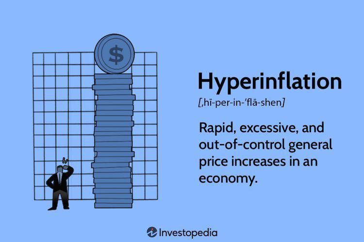

The global economic landscape is characterized by its dynamic nature, continuously shaped by various factors including geopolitical events, technological advancements, and shifting consumer behaviors. At the core of understanding this complex ecosystem are economic indicators like inflation and hyperinflation, which serve as barometers for economic health and stability. Inflation refers to the rate at which the general level of prices for goods and services increases, subsequently eroding purchasing power. When this rate spirals out of control, exceeding 1,000% per year, it transcends into hyperinflation, often resulting in dire economic consequences.

To navigate these economic challenges, algorithmic trading has emerged as a powerful instrument, offering unprecedented precision and speed. By leveraging sophisticated algorithms, traders and economists can analyze vast datasets in real-time, enabling more accurate forecasting and decision-making. This technological innovation transcends traditional methodologies, offering a strategic advantage in identifying market trends and mitigating risks associated with inflationary pressures.



In this article, we'll discuss current inflationary trends, the looming threat of hyperinflation, and the integral role of algorithmic trading in economic forecasting. Through this exploration, we aim to elucidate how modern tools are transforming the way we understand and manage economic phenomena, ensuring better preparedness for potential financial upheavals.

## Table of Contents

## Understanding Inflation and Hyperinflation

Inflation is the rate at which the general level of prices for goods and services increases, leading to a decrease in purchasing power. It is a critical economic indicator that affects both individual and national financial health. The complexity of inflation results from its multifaceted causes, including excess money supply, demand-pull effects, and geopolitical events.

Excess money supply is one of the primary factors driving inflation. When a central bank prints money indiscriminately, the overall money supply in the economy increases, often without a corresponding increase in the production of goods and services. This surplus of currency can lead to a general rise in prices. The classic equation that outlines this relationship is the quantity theory of money:

$$
MV = PQ
$$

where $M$ is the money supply, $V$ is the velocity of money, $P$ is the price level, and $Q$ is the quantity of goods and services produced. An increase in $M$ without a change in $Q$ generally results in an increase in $P$, assuming $V$ remains constant.

Demand-pull inflation occurs when demand for goods and services exceeds supply. This situation is often seen in thriving economies where consumers and businesses have more disposable income, leading to increased spending and competition for limited resources. Consequently, prices rise. 

Geopolitical events can also significantly influence inflation. Disruptions to supply chains caused by conflicts or trade barriers can restrict the availability of goods, pushing prices upward. Moreover, geopolitical instability can lead to speculative investments in commodities such as oil and food, further contributing to price increases.

Hyperinflation is an extreme and unsustainable form of inflation, characterized by price increases that exceed 1,000% per year. It is usually a result of catastrophic failures in economic policy and governance. Countries experiencing hyperinflation often see rapid declines in the value of their currency, making it effectively worthless. For instance, the hyperinflation experienced by Zimbabwe in the late 2000s was primarily due to excessive money printing without economic growth to back it, combined with political instability and poor fiscal management.

In conclusion, understanding the mechanisms of inflation and hyperinflation is crucial for economic planning and stability. While inflation at manageable levels is often considered a normal part of economic growth, hyperinflation poses severe risks to economic stability and requires vigilant policy measures to prevent its occurrence.

## Current Economic Indicators and Forecasts

As of 2024, global inflation rates have drawn significant attention from economists and policymakers. These concerns stem from various factors influencing the economic landscape. Key among them is the persistence of inflationary pressures in specific sectors, complicated further by geopolitical tensions, supply chain disruptions, and post-pandemic recovery dynamics.

The International Monetary Fund (IMF) and other financial institutions have actively engaged in monitoring these inflationary trends, highlighting areas where inflationary pressures are most evident. Commodities, including energy and food, have been particular focal points, experiencing significant price [volatility](/wiki/volatility-trading-strategies) due to both demand fluctuations and supply chain bottlenecks. The ongoing conflict in Eastern Europe has exacerbated these issues, leading to energy supply concerns that contribute significantly to inflation.

Policymakers are challenged in formulating effective monetary policies due to these persistent pressures. Central banks, such as the Federal Reserve in the United States and the European Central Bank, have been contemplating [interest rate](/wiki/interest-rate-trading-strategies) adjustments as a tool to temper inflation. However, the delicate balance between curbing inflation and ensuring economic growth presents a formidable challenge. Increasing interest rates can dampen consumer spending and investment, potentially stalling economic recovery efforts.

Quantitative tightening is another measure being considered, aimed at reducing money supply in the economy. However, the risk of triggering a recession through aggressive policy measures is a significant concern. Economists suggest that a judicious mix of monetary policies, coupled with fiscal measures aimed at boosting productivity and supply chain resilience, may offer a more balanced approach to managing inflationary trends.

The landscape remains fluid with new data continually emerging, necessitating adaptive strategies. Financial modeling and economic forecasting tools play crucial roles in understanding potential future scenarios. These tools assist policymakers in simulating the impacts of different policy measures, facilitating more informed decision-making processes. As such, global authorities remain vigilant, closely analyzing economic indicators to anticipate potential shifts and implement timely interventions.

## Algorithmic Trading and its Role in Economic Forecasting

Algorithmic trading has revolutionized the landscape of financial markets, capitalizing on the rapid processing power of today's computing systems. This trading strategy involves using pre-programmed instructions—algorithms—to execute trading orders, which allows traders to harness efficiency and accuracy that far exceed human capabilities. At its core, [algorithmic trading](/wiki/algorithmic-trading) leverages complex mathematical models and formulas to make trading decisions in nanoseconds. 

In the context of economic forecasting, particularly regarding inflation and hyperinflation, algorithmic trading holds significant potential. By analyzing vast datasets that humans alone could not efficiently process, these algorithms can anticipate economic shifts with an unprecedented level of precision. Inflation trends, for instance, can be extrapolated from various economic indicators such as consumer price indices (CPI), producer price indices (PPI), and commodity prices. Incorporating such data, algorithms can quantify inflationary pressures and project future possible economic scenarios.

An essential advantage of algorithmic trading is its ability to process and interpret 'big data'. Traditional methods of economic forecasting often rely on smaller, sampled datasets due to time and resource constraints. However, algorithmic trading systems are capable of handling and analyzing comprehensive datasets, thereby improving the granularity and accuracy of economic forecasts. For instance, using historical data, algorithms can recognize patterns that signal rising inflation rates or potential hyperinflation conditions. This information is crucial for traders and policymakers who need to adjust their strategies in real-time to control or leverage these economic phenomena.

From a technical perspective, algorithmic trading systems employ various quantitative techniques. These include statistical [arbitrage](/wiki/arbitrage), time-series analysis, and [machine learning](/wiki/machine-learning) methods. A common approach used is the autoregressive integrated moving average (ARIMA) model, which helps in forecasting complex time series data, such as inflation rates. Python's `statsmodels` library provides tools for implementing ARIMA models efficiently, as shown in the following example:

```python
import pandas as pd
from statsmodels.tsa.arima.model import ARIMA

# Assuming 'data' is a pandas DataFrame with a 'CPI' column representing the consumer price index
data = pd.read_csv('cpi_data.csv')
model = ARIMA(data['CPI'], order=(5, 1, 0))
model_fit = model.fit()
forecast = model_fit.forecast(steps=12)
print(forecast)
```

This code illustrates how an ARIMA model can be applied to CPI data to forecast future inflation rates, providing insights into potential economic shifts.

In conclusion, algorithmic trading equips financial actors with powerful tools to predict economic outcomes effectively. By integrating complex datasets and advanced statistical methods, algorithmic trading systems are fundamental in making informed decisions, particularly concerning inflation and hyperinflation. As computing power continues to grow and algorithms become increasingly sophisticated, their role in economic forecasting is set to expand, offering even more precise insights into global economic trends.

## Inflation Trends Analysis with Algorithmic Tools

Algorithmic trading has emerged as a powerful instrument for analyzing inflation trends by leveraging its ability to process extensive datasets quickly and identify underlying patterns. This advanced trading technique employs statistical models and machine learning algorithms to sift through historical price data, economic indicators, and market trends. By employing these tools, traders and economists can glean insights that inform future economic forecasts and market strategies.

One of the key strengths of algorithmic tools in inflation trend analysis is their capacity to analyze vast quantities of historical data. By assessing past inflation rates, commodity prices, consumer behavior, and macroeconomic indicators, algorithms can recognize patterns that may indicate the trajectory of inflationary pressures. For instance, consider an algorithm designed to predict inflation changes using the Consumer Price Index (CPI), unemployment rates, and historical inflation data. This could involve building a machine learning model, such as a linear regression or a more sophisticated recurrent [neural network](/wiki/neural-network) (RNN), to anticipate future inflation rates.

```python
import numpy as np
from sklearn.linear_model import LinearRegression

# Sample historical data for CPI, unemployment, and inflation rates
data = {
    'CPI': np.array([100, 102, 104, 103, 107]),
    'Unemployment': np.array([5.0, 4.7, 4.9, 4.8, 4.6]),
    'Inflation': np.array([2.0, 2.2, 1.9, 2.5, 2.8])
}

# Feature matrix and target variable
X = np.column_stack((data['CPI'], data['Unemployment']))
y = data['Inflation']

# Train linear regression model
model = LinearRegression().fit(X, y)

# Predict future inflation using future CPI and unemployment data
future_CPI = np.array([110, 112])
future_Unemployment = np.array([4.4, 4.3])
future_X = np.column_stack((future_CPI, future_Unemployment))
predicted_inflation = model.predict(future_X)

predicted_inflation
```

In the code example above, a linear regression model is trained on historical data to predict inflation rates based on CPI and unemployment figures. This model can then project future inflation trends, aiding in portfolio adjustment and risk mitigation strategies.

Algorithmic trading also facilitates quick and precise adjustments to portfolios in response to inflation forecasts. By identifying probable inflationary periods, traders can shift asset allocations to hedge against inflation, such as by investing in commodities, Treasury Inflation-Protected Securities (TIPS), or real estate - assets generally considered as inflation hedges.

Moreover, by continuously monitoring real-time data streams and updating predictions, algorithmic tools enable ongoing adaptation in fast-changing economic conditions. This aspect is particularly crucial in environments subject to volatile inflation rates, allowing for proactive rather than reactive strategies.

In sum, algorithmic trading equips traders and economists with a comprehensive toolkit for deciphering inflation trends. By harnessing historical data, recognizing patterns, and adjusting strategies accordingly, these tools play a crucial role in mitigating risks associated with inflationary pressures. As financial technology continues to evolve, its impact on inflation analysis and economic forecasting is poised to grow even further.

## Potential Impacts of Hyperinflation and Future Outlook

Hyperinflation, though a rare event in modern economies, can lead to a rapid deterioration of economic stability, resulting in the collapse of monetary systems and severe reductions in living standards. Historical cases, such as those in Zimbabwe and the Weimar Republic of post-World War I Germany, exemplify how hyperinflation spirals can obliterate savings, undermine trust in currency, and create extensive economic and social distress. Typically, hyperinflation occurs when there is an excessive increase in the money supply without a corresponding increase in goods and services, often caused by ineffective monetary policies or severe political instability.

In hyperinflationary scenarios, prices can increase explosively—often by more than 1,000% per year. This erodes the purchasing power of the population almost immediately, forcing individuals to trade in foreign currencies or resort to bartering to sustain daily life. Businesses face extreme challenges in planning and inventory management, and investments can become exceedingly risky due to unpredictable financial environments.

Economists agree that hyperinflation is unlikely to affect stable economies with strong institutional frameworks and credible central banks. However, vigilance is crucial. Effective monetary policies, including measures to control the money supply and maintain fiscal discipline, are essential to preventing situations where hyperinflation could arise. Furthermore, political stability and sound governance play critical roles in averting economic conditions conducive to hyperinflation.

Future outlooks suggest that while the likelihood of hyperinflation in established markets remains low, emerging economies might be at higher risk due to potential vulnerabilities in their financial systems. Consequently, continued monitoring and proactive policy-making are imperative to mitigate the risk of hyperinflation, ensuring sustainable economic growth and stability. As global economic dynamics evolve, so should the strategies to counteract inflationary threats and bolster long-term economic resilience.

## Concluding Thoughts

Inflation, especially when escalating to hyperinflation, poses a formidable challenge to economic stability by eroding purchasing power and potentially leading to severe societal and financial disruptions. However, the advent of algorithmic trading offers a beacon of hope in analyzing and responding to these economic changes effectively. Algorithmic trading capitalizes on sophisticated mathematical models and large-scale computing power to interpret vast datasets, enabling stakeholders to anticipate economic shifts with unprecedented accuracy. This capability allows for informed decision-making, facilitating timely interventions that can mitigate the adverse effects of inflationary pressures.

As financial technology continues to advance, it plays an increasingly vital role in refining our understanding and management of economic trends. Innovation in this field enhances the precision and scope of economic forecasting, enabling more resilient economic planning and policy-making. By leveraging advancements in algorithmic trading, economies can better prepare for and adapt to inflationary dynamics, potentially preventing the escalation to hyperinflation. This fusion of technology and economics not only aids in navigating current challenges but also in laying the groundwork for more robust economic frameworks in the future. As such, continued research and development in this domain are crucial for maintaining economic stability and fostering growth in an ever-evolving global economy.

## References & Further Reading

[1]: ["The Economics of Inflation: A Study of Currency Depreciation in Post-War Germany"](https://mises.org/library/book/economics-inflation-study-currency-depreciation-post-war-germany) by Costantino Bresciani-Turroni

[2]: ["Inflation: Causes and Effects"](https://www.mckinsey.com/featured-insights/mckinsey-explainers/what-is-inflation) by Robert E. Hall

[3]: ["When Money Dies: The Nightmare of Deficit Spending, Devaluation, and Hyperinflation in Weimar Germany"](https://www.amazon.com/When-Money-Dies-Devaluation-Hyperinflation/dp/1586489941) by Adam Fergusson

[4]: ["Adaptation of Backpropagation Neural Network: Algorithmic Trading of Financial Markets"](https://github.com/stefan-jansen/machine-learning-for-trading) by Omar Cherif Eliectrach et al.

[5]: ["Global Inflation Dynamics and Inflation Expectations"](https://www.sciencedirect.com/science/article/pii/S1059056018310062) by Klaus Adam and Henning Weber

[6]: ["Quantitative Finance for Dummies"](https://www.wiley.com/en-us/Quantitative+Finance+For+Dummies-p-9781118769461) by Steve Bell

[7]: ["The Role of Neural Networks in Predicting Economic Economic Indicators"](https://link.springer.com/chapter/10.1007/978-1-4615-5029-7_7) by Goran Markovic and Ann Marie Moynihan