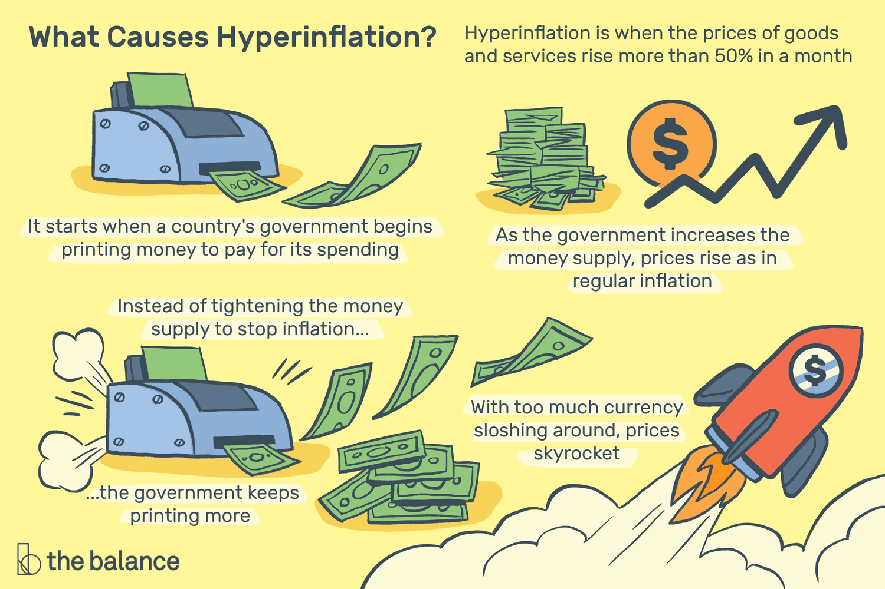

## Table of Contents

## What is hyperinflation?

Hyperinflation is when the prices of things go up really fast, and money loses its value quickly. It happens when a country's government prints too much money or when there are big problems with the economy. When this happens, people need more and more money to buy the same things they used to buy with less money.

This can make life very hard for people. Their savings become worth less, and it's hard to plan for the future because prices keep changing so quickly. Sometimes, people might even use things like cigarettes or other goods as money because the official money is not trusted anymore. Hyperinflation is rare, but when it happens, it can cause a lot of problems for everyone in the country.

## What are the causes of hyperinflation?

Hyperinflation often starts when a government prints too much money. This can happen when a country is in a lot of debt or when it's trying to pay for big expenses like wars or social programs. When there's too much money around, each piece of money becomes less valuable, and prices start to go up quickly. This is because there's more money chasing the same amount of goods and services.

Another cause of hyperinflation can be a big drop in the supply of goods. This might happen if a country can't import things it needs because of sanctions or if there's a big problem with producing goods at home. When there are fewer goods available, but the same amount of money trying to buy them, prices will go up. This can start a cycle where people expect prices to keep rising, so they spend their money quickly before it loses even more value, which makes the problem worse.

Sometimes, a loss of confidence in the government or the economy can also lead to hyperinflation. If people don't trust that their money will be worth anything in the future, they might start using other things as money, like foreign currencies or goods. This can make the official money even less valuable and cause prices to spiral out of control.

## Can you provide historical examples of hyperinflation?

One famous example of hyperinflation happened in Germany in the early 1920s. After World War I, Germany had to pay a lot of money to other countries because they lost the war. To pay these bills, the German government printed more money, which made the German mark worth less and less. Prices went up so fast that people needed wheelbarrows full of money to buy simple things like bread. This made life very hard for people and helped cause big problems in the country.

Another example is Zimbabwe in the late 2000s. The government there printed a lot of money to pay for things and to try to help the economy. But this made the Zimbabwean dollar almost worthless. At one point, prices were doubling every day. People had to [carry](/wiki/carry-trading) bags of money to buy basic things, and many started using foreign money like the US dollar instead. This hyperinflation made life very difficult for people in Zimbabwe and hurt the country's economy a lot.

Hungary also had hyperinflation after World War II, in 1946. It is known as one of the worst cases of hyperinflation ever. Prices were going up so fast that the government had to keep printing new, bigger banknotes. At its worst, prices were doubling every 15 hours. People would get paid and rush to spend their money before it lost even more value. This made life very hard and caused a lot of problems for the country.

## What are the economic impacts of hyperinflation on a country?

Hyperinflation can make life very hard for people in a country. When prices go up so fast, money loses its value quickly. This means that people's savings become worth less and less. It's hard to plan for the future because you never know how much things will cost tomorrow. People might have to spend all their money as soon as they get it, just to buy the things they need. This can make it tough for businesses too, because they don't know how much to charge for their products or how much they'll have to pay for supplies.

The economy as a whole can also be hurt by hyperinflation. When people don't trust their money anymore, they might start using other things, like foreign money or goods, to buy things. This can make the official money even less valuable and cause more problems. The government might have a hard time collecting taxes because the money they get is worth less. It can be tough for the country to trade with other countries too, because no one wants to use a money that's losing value so fast. All these things can make the economy weaker and make it harder for the country to recover.

## How does hyperinflation affect everyday citizens?

Hyperinflation makes life very hard for everyday people. When prices go up fast, the money people have saved up becomes worth less and less. This means they can't buy as much with their savings as they used to. It's also hard to plan for the future because you never know how much things will cost tomorrow. People might have to spend all their money right away, just to buy the things they need for today. This can be really stressful and make it tough to take care of their families.

People's jobs and businesses can also be affected by hyperinflation. Workers might find that their wages don't keep up with the rising prices, so they can't afford to buy the same things they used to. Businesses have a hard time too, because they don't know how much to charge for their products or how much they'll have to pay for supplies. This can make it hard for them to stay open. When people don't trust their money anymore, they might start using other things, like foreign money or goods, to buy things. This can make life even more confusing and difficult for everyone.

## What are the social and political consequences of hyperinflation?

Hyperinflation can cause big problems in society. When money loses its value fast, people get upset and worried. They might start to not trust the government because it can't keep the money stable. This can lead to protests and even violence as people demand change. Families might struggle a lot, and this can make people feel hopeless and angry. Sometimes, crime can go up because people feel they have no other way to get what they need.

Politically, hyperinflation can be a big problem for leaders. When people are unhappy because their money is worth less and less, they might vote for new leaders who promise to fix things. This can make the government unstable, with leaders coming and going quickly. In some cases, hyperinflation can even help lead to bigger political changes, like revolutions or the rise of new political groups. It's a tough situation that can shake up a whole country.

## What measures can governments take to prevent hyperinflation?

Governments can take steps to stop hyperinflation from happening. One big thing they can do is to be careful about how much money they print. If they print too much money, it can make money worth less and cause prices to go up fast. So, they need to keep an eye on how much money is out there and make sure it matches what the economy needs. Another thing they can do is to keep the budget in check. This means not spending more money than they have and finding ways to pay for things without just printing more money.

Another important step is to keep the economy strong and stable. This can mean making sure there are enough goods and services for people to buy. If there's a shortage, prices can go up, which can lead to hyperinflation. Governments can also work to keep people's trust by being open about what they're doing with the money and by making smart economic plans. If people trust the government and the money, it's less likely that hyperinflation will happen. By doing these things, governments can help keep the economy on track and prevent the big problems that come with hyperinflation.

## How can individuals protect their finances during periods of hyperinflation?

During hyperinflation, one way individuals can protect their finances is by keeping their money in things that will keep their value better than cash. This can mean buying things like gold, silver, or even foreign money that is more stable. These things usually don't lose their value as fast as the local money does during hyperinflation. Another way is to invest in things that make money, like businesses or real estate, because these can help keep up with the rising prices.

It's also important for people to spend their money quickly instead of saving it. When prices are going up fast, it's better to buy things you need right away before they get even more expensive. This might mean buying food, clothes, or other essentials as soon as you can. People can also try to earn more money by working extra jobs or finding new ways to make money, which can help them keep up with the rising costs of living.

## What role do central banks play in managing hyperinflation?

Central banks are really important when it comes to managing hyperinflation. They are the ones who control how much money is in the economy. If there's too much money, it can make prices go up fast. So, the central bank can try to stop hyperinflation by not printing too much money. They can also raise interest rates, which makes it more expensive to borrow money. This can slow down spending and help stop prices from going up so fast.

Central banks can also use other tools to help. They can sell government bonds to take money out of the economy. This makes there less money around, which can help keep prices from going up too fast. It's all about finding the right balance so that there's enough money for people to buy things, but not so much that it makes prices go crazy. By doing these things, central banks can help keep the economy stable and stop hyperinflation from happening.

## What are the long-term effects of hyperinflation on an economy?

Hyperinflation can cause big problems for a country's economy in the long run. When money loses its value fast, people lose trust in it. They might start using other things like foreign money or goods to buy things. This can make it hard for businesses to plan and grow because they don't know what money will be worth next. It can also make it hard for the country to trade with other countries because no one wants to use money that's losing value so fast. All these things can make the economy weaker and slower to recover.

Over time, hyperinflation can also make people's lives harder. Their savings become worth less, so they can't buy the things they need. This can make people feel hopeless and angry, which can lead to social and political problems. The government might have a hard time collecting taxes because the money they get is worth less. It can be tough to fix the economy after hyperinflation because people might not trust the government or the money anymore. So, the country needs to work hard to rebuild trust and make the economy strong again.

## How do international markets and trade respond to hyperinflation in a country?

When a country has hyperinflation, it can make it hard for that country to trade with other countries. People in other countries might not want to use the money from the country with hyperinflation because it's losing value so fast. This can make it tough for the country to buy things it needs from other places. It can also make it hard for the country to sell its own goods because other countries might not want to pay with money that's becoming worth less and less. This can hurt the country's businesses and make the economy weaker.

Over time, hyperinflation can make other countries less interested in trading with the country that's having problems. They might start to look for other places to buy and sell things because they don't want to deal with the risks of using money that's losing value so fast. This can make it even harder for the country with hyperinflation to get back on its feet. It might need to find new ways to trade or use different kinds of money to keep doing business with other countries.

## What are the latest theories and models used to predict and analyze hyperinflation?

The latest theories and models for predicting and analyzing hyperinflation often focus on understanding the money supply and how it affects prices. One common approach is to use the quantity theory of money, which says that if the amount of money in an economy grows faster than the goods and services available, prices will go up. Researchers use this idea to build models that look at how much money a government is printing and how fast prices are rising. These models can help predict when hyperinflation might happen by watching for big changes in the money supply.

Another important theory is about how people's expectations can make hyperinflation worse. If people think prices will keep going up, they might spend their money quickly before it loses more value, which can push prices up even faster. Economists use models that include these expectations to better understand and predict hyperinflation. These models look at things like how people react to price changes and how their behavior can make the problem worse. By combining these theories and models, experts can get a better picture of what's happening and what might happen next with hyperinflation.

## What is the difference between inflation and hyperinflation?

Inflation is the rate at which the general level of prices for goods and services increases, leading to a decrease in purchasing power. It is a critical economic indicator that affects both individual and national financial health. The complexity of inflation results from its multifaceted causes, including excess money supply, demand-pull effects, and geopolitical events.

Excess money supply is one of the primary factors driving inflation. When a central bank prints money indiscriminately, the overall money supply in the economy increases, often without a corresponding increase in the production of goods and services. This surplus of currency can lead to a general rise in prices. The classic equation that outlines this relationship is the quantity theory of money:

$$
MV = PQ
$$

where $M$ is the money supply, $V$ is the velocity of money, $P$ is the price level, and $Q$ is the quantity of goods and services produced. An increase in $M$ without a change in $Q$ generally results in an increase in $P$, assuming $V$ remains constant.

Demand-pull inflation occurs when demand for goods and services exceeds supply. This situation is often seen in thriving economies where consumers and businesses have more disposable income, leading to increased spending and competition for limited resources. Consequently, prices rise. 

Geopolitical events can also significantly influence inflation. Disruptions to supply chains caused by conflicts or trade barriers can restrict the availability of goods, pushing prices upward. Moreover, geopolitical instability can lead to speculative investments in commodities such as oil and food, further contributing to price increases.

Hyperinflation is an extreme and unsustainable form of inflation, characterized by price increases that exceed 1,000% per year. It is usually a result of catastrophic failures in economic policy and governance. Countries experiencing hyperinflation often see rapid declines in the value of their currency, making it effectively worthless. For instance, the hyperinflation experienced by Zimbabwe in the late 2000s was primarily due to excessive money printing without economic growth to back it, combined with political instability and poor fiscal management.

In conclusion, understanding the mechanisms of inflation and hyperinflation is crucial for economic planning and stability. While inflation at manageable levels is often considered a normal part of economic growth, hyperinflation poses severe risks to economic stability and requires vigilant policy measures to prevent its occurrence.

## References & Further Reading

[1]: ["The Economics of Inflation: A Study of Currency Depreciation in Post-War Germany"](https://mises.org/library/book/economics-inflation-study-currency-depreciation-post-war-germany) by Costantino Bresciani-Turroni

[2]: ["Inflation: Causes and Effects"](https://www.mckinsey.com/featured-insights/mckinsey-explainers/what-is-inflation) by Robert E. Hall

[3]: ["When Money Dies: The Nightmare of Deficit Spending, Devaluation, and Hyperinflation in Weimar Germany"](https://www.amazon.com/When-Money-Dies-Devaluation-Hyperinflation/dp/1586489941) by Adam Fergusson

[4]: ["Adaptation of Backpropagation Neural Network: Algorithmic Trading of Financial Markets"](https://github.com/stefan-jansen/machine-learning-for-trading) by Omar Cherif Eliectrach et al.

[5]: ["Global Inflation Dynamics and Inflation Expectations"](https://www.sciencedirect.com/science/article/pii/S1059056018310062) by Klaus Adam and Henning Weber

[6]: ["Quantitative Finance for Dummies"](https://www.wiley.com/en-us/Quantitative+Finance+For+Dummies-p-9781118769461) by Steve Bell

[7]: ["The Role of Neural Networks in Predicting Economic Economic Indicators"](https://link.springer.com/chapter/10.1007/978-1-4615-5029-7_7) by Goran Markovic and Ann Marie Moynihan