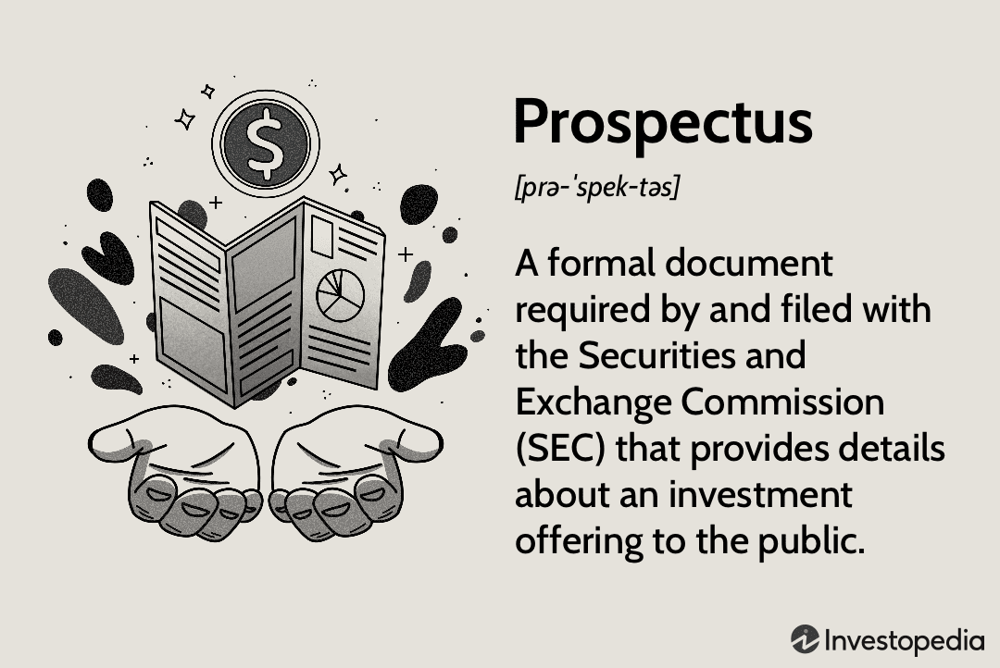

The rapidly evolving world of finance is characterized by its dynamic interplay between various critical components, notably prospectus investments, financial documents, and algorithmic trading. Grasping these elements is indispensable for anyone involved in the financial markets. At the heart of investment decisions lies the prospectus—a fundamental legal document that provides comprehensive details about an investment offering. This transparency is vital for potential investors in assessing offerings ranging from mutual funds to stocks and bonds.

Financial documents such as balance sheets, income statements, and cash flow statements are equally vital. These documents offer a snapshot of a company's financial health, facilitating informed decision-making by providing insights into risk assessment, valuation, and future performance forecasts. In analyzing these documents, investors get equipped with the knowledge necessary to formulate robust investment strategies.

The advent of algorithmic trading marks a significant evolution in market dynamics. Applying computer algorithms to execute trades with precision and speed, algorithmic trading enhances market efficiency, reduces transaction costs, and bolsters liquidity. The strategies employed within this realm stretch from market making to high-frequency trading, illustrating the technology's diverse applicability and profound impact on global financial markets.

This guide aims to unravel the intricacies of these pivotal elements, illustrating not only their individual significance but also their interconnectedness within today's investment landscape. Whether you are an experienced investor or just beginning, understanding these components will empower you to navigate the nuances of the financial world seamlessly.

## Table of Contents

## Understanding Prospectus in Investments

A prospectus is a vital document in the sphere of investment, serving as a comprehensive disclosure required for public offerings of securities. Mandated by securities commissions such as the U.S. Securities and Exchange Commission (SEC), a prospectus provides potential investors with essential details regarding an investment product. These are typically mutual funds, stocks, bonds, or other securities.

The typical information included in a prospectus encompasses a myriad of critical data points. Generally, it describes the company’s operations, historical financial information, and future projections. It details the terms of the security, management credentials, legal standing, and any risks associated with the investment. For example, a stock prospectus will outline the number of shares being offered, the pricing, and the intended use of the proceeds. The inclusion of these elements is crucial for investors as it allows them to make informed decisions based on the company's past performance and future outlook.

Navigating a prospectus effectively requires a keen attention to detail and a clear understanding of the financial data presented. Investors should focus on key sections such as the investment objectives, risks, and financial highlights. For example, in mutual funds, scrutinizing the fund’s investment strategy and fees can reveal how aligned a fund is with an investor’s personal risk tolerance and financial goals.

Moreover, a prospectus plays a critical role in safeguarding investors and ensuring market transparency. By delivering full disclosure, it mitigates information asymmetry between the company and its potential investors, thereby reducing the potential for fraud or misleading claims. It ensures that all relevant information is publicly available, allowing investors to compare different investment opportunities through a standardized lens.

In this way, a prospectus not only acts as an informational tool but also as a protective measure, ensuring that investors have a clear picture of what they are buying into. For anyone engaging in security investments, comprehending and utilizing the information in a prospectus is an indispensable skill that fosters more strategic, informed investment choices.

## Key Financial Documents in Investment

Financial documents are essential tools for investors aiming to make informed decisions. Among these, balance sheets, income statements, and cash flow statements are fundamental in providing a comprehensive snapshot of a company's financial health.

### Balance Sheet

The balance sheet offers a detailed summary of a company's financial position at a specific point in time. It is divided into three main components: assets, liabilities, and shareholders' equity. The relationship is expressed through the accounting equation:

$$
\text{Assets} = \text{Liabilities} + \text{Shareholders' Equity}
$$

This equation ensures that what a company owns is financed either by borrowing money (liabilities) or by money invested by shareholders (equity). Analyzing the balance sheet allows investors to assess a company's [liquidity](/wiki/liquidity-risk-premium), operational efficiency, and financial leverage, thereby helping in evaluating the risk associated with the company's financial standing.

### Income Statement

The income statement, also known as the profit and loss statement, summarizes the company's performance over a specific period, typically a quarter or a year. It presents revenue, expenses, and profit, providing insight into the company's profitability and operational efficiency. Key metrics derived from the income statement include:

- **Gross Profit**: Revenue minus the cost of goods sold (COGS).
- **Operating Income**: Gross profit minus operating expenses such as wages and rent.
- **Net Income**: Operating income minus interest, taxes, and any other non-operating costs.

These metrics help investors understand the source of profits and the efficiency in managing expenses relative to revenue generation.

### Cash Flow Statement

The cash flow statement outlines the inflow and outflow of cash within a company, segmented into operating, investing, and financing activities. This statement is crucial for understanding how well a company generates cash to pay its debt obligations and fund its operating expenses. 

Key components of cash flow include:

- **Operating Activities**: Cash generated from primary business activities.
- **Investing Activities**: Cash used for investing in capital assets or securities.
- **Financing Activities**: Cash flows related to debt and equity financing.

Investors use the cash flow statement to assess a company's liquidity and financial flexibility. The statement provides insights into a company's ability to generate cash, cover expenses, and sustain growth without external financing.

### Application in Investment Strategies

By analyzing these financial documents, investors can assess a company's risk profile, valuation, and growth potential. The data allows for the calculation of key financial ratios such as:

- **Current Ratio**: $\frac{\text{Current Assets}}{\text{Current Liabilities}}$, evaluating liquidity.
- **Debt-to-Equity Ratio**: $\frac{\text{Total Liabilities}}{\text{Shareholders’ Equity}}$, indicating financial leverage.
- **Price-to-Earnings Ratio (P/E)**: $\frac{\text{Market Price per Share}}{\text{Earnings per Share}}$, used for company's valuation.

Understanding these financial statements is essential not only for assessing the current financial status of a company but also for predicting future performance. This [fundamental analysis](/wiki/fundamental-analysis) helps investors construct robust investment strategies tailored to individual risk appetites and investment goals. Tools like Python can further enhance analysis by automating the calculation of financial ratios and trend analysis, facilitating a more comprehensive understanding of the company's financial trajectory.

## The Rise of Algorithmic Trading

Algorithmic trading, or algo trading, represents a paradigm shift in the execution of trades, driven by the power of computer algorithms. These algorithms are designed to operate at speeds and precision levels that surpass human capabilities, optimizing financial strategies and trading outcomes. The evolution of [algorithmic trading](/wiki/algorithmic-trading) is rooted in the technological advancements of the late 20th century, with significant strides made in the 1980s and 1990s, when exchanges began to adopt electronic trading platforms.

Historically, algorithmic trading emerged as a solution to address the inefficiencies and human limitations in traditional trading practices. By leveraging complex mathematical models and statistical analyses, these algorithms can identify and exploit market inefficiencies, execute orders at optimal prices, and manage large volumes of transactions with minimal market impact. The integration of high-frequency trading ([HFT](/wiki/high-frequency-trading-strategies)) in the mix further revolutionized market dynamics, allowing for thousands of trades to be executed within fractions of a second.

Different types of algorithmic trading strategies cater to various financial objectives. Market making, for instance, involves continuously quoting buy and sell prices with the goal of profiting from the spread between them. This strategy enhances market liquidity and ensures tighter spreads, benefiting both traders and the market as a whole. Statistical [arbitrage](/wiki/arbitrage), on the other hand, relies on complex statistical models to identify pricing discrepancies between related securities. By executing trades to exploit these discrepancies, traders can achieve consistent returns while maintaining market neutrality.

High-frequency trading (HFT) epitomizes the cutting-edge of algorithmic trading, where sophisticated algorithms conduct rapid-fire transactions. The primary objective of HFT is to capitalize on millisecond-level opportunities that arise due to temporary imbalances or mispricing in the market. Despite the controversies surrounding HFT, its benefits include increased market efficiency and liquidity, as well as reduced transaction costs for participants willing to engage at the speed of light.

The advantages of algorithmic trading are considerable. By reducing human intervention, automated systems minimize the risks associated with emotional decision-making and human error. Moreover, the speed and efficiency of algo trading significantly cut down transaction costs, allowing for more cost-effective execution. Enhanced market liquidity is another notable benefit, as algos continually provide price quotes and execute trades that contribute to a more fluid and accessible market environment.

In conclusion, algorithmic trading has fundamentally transformed global financial markets by introducing efficiency, speed, and precision into trade execution. As technology continues to advance, the role of algorithmic trading will undoubtedly expand, challenging market participants to adapt and innovate in the face of a digital future.

## Connecting the Dots: How Prospectus, Financial Documents, and Algo Trading Interact

In the modern financial landscape, the integration of prospectuses, financial documents, and algorithmic trading plays a critical role in developing effective investment strategies. Each of these elements contributes uniquely to the decision-making process, providing comprehensive insights and enhancing the efficacy of trading algorithms.

Prospectuses serve as an invaluable resource for investors, offering detailed information about investment offerings. They contain essential data on the objectives, risks, and financial aspects of securities, which are crucial for developing algorithmic trading strategies. By analyzing the information presented in prospectuses, traders can align their algorithms to match investment goals and risk appetites, thus optimizing trading performance.

Financial documents, including balance sheets, income statements, and cash flow statements, further enrich this analytical framework. These documents provide quantitative insights into a company's financial health, enabling the creation of data-driven trading models. Algorithms utilize metrics such as revenue growth, profit margins, and debt ratios to execute trades based on predefined parameters. For example, an algorithm might be programmed to purchase stocks only when a company's debt to equity ratio falls below a specified threshold, indicating financial stability.

The interaction between prospectuses and financial documents with algo trading is exemplified in the development of trading strategies such as [statistical arbitrage](/wiki/statistical-arbitrage) and [market making](/wiki/market-making). Statistical arbitrage relies on historical price data and financial indicators to exploit short-term market inefficiencies. By incorporating information from financial documents, these algorithms enhance their predictive capabilities, leading to higher profitability.

In a case study of a fund utilizing algorithmic trading for equities, the integration of prospectus information and financial statement analysis led to a notable improvement in trading outcomes. By prioritizing investments in companies with robust financial health as indicated by their financial documents and outlined in their prospectuses, the fund achieved a significant increase in its average return on investment.

However, the complexity of combining these analytical tools necessitates rigorous due diligence. Algorithms must be continually evaluated to ensure their underlying data is accurate and representative of current market conditions. Regular updates to trading models based on the latest financial information and prospectus updates are essential to maintain their relevance and effectiveness.

Effective implementation of these elements demands a solid foundation in quantitative analysis, seamless integration of diverse data sources, and a disciplined approach to risk management. While algorithmic trading offers enhanced efficiency and precision, it is the thorough evaluation of prospectuses and financial documents that grounds these strategies in solid, reliable data. This synergy forms the cornerstone of informed, strategic investment decisions.

## Challenges and Considerations in Modern Investment Practices

The integration of prospectus documents, financial analysis, and algorithmic trading in modern investment practices, while advantageous, also brings about several challenges that stakeholders must navigate. One of the primary issues concerns the regulatory landscape. Each component of these practice areas is subject to distinct regulatory frameworks, which prompts the need for compliance with multiple provisions. For instance, prospectus documents are governed by securities commissions, which mandate rigorous disclosure requirements to protect investors from misleading information. Algorithmic trading, on the other hand, is often scrutinized under regulations aimed at preventing market manipulation and ensuring fair trading practices. Traders need to remain compliant with laws such as the Markets in Financial Instruments Directive (MiFID II) in Europe and the Securities and Exchange Commission's (SEC) regulations in the United States, both of which aim to curtail malpractices in electronic trading.

Potential risks inherent in each of these areas include the possibility of inaccurate prospectus disclosures, the [volatility](/wiki/volatility-trading-strategies) of market conditions affecting algorithmic trades, and the financial risks associated with misinterpreted financial analyses. Ethical considerations also come into play, particularly with algo trading, which has been criticized for prioritizing speed and [volume](/wiki/volume-trading-strategy) over market stability and fairness. Ethical trading requires a balance, ensuring that algorithmic strategies do not contribute to flash crashes or other destabilizing market events.

Data privacy concerns are increasingly significant as the exchange of vast amounts of financial data forms the backbone of algorithmic trading. Transparency is crucial, not just for regulators but also for maintaining the trust of investors who rely on both prospectus information and financial analyses to make informed decisions. The evolving regulatory landscape, with new rules emerging to govern data usage and sharing, poses additional compliance challenges. For instance, regulations such as the General Data Protection Regulation (GDPR) impact how financial entities handle personal data, necessitating robust data management systems to ensure compliance.

To mitigate these risks and ensure compliance, several strategies can be adopted. One effective approach is the implementation of comprehensive risk management frameworks that account for the unique challenges presented by each component of modern investment practices. Ensuring robust auditing and verification processes for prospectus content can guard against inaccuracies and enhance investor confidence. Developing algorithms with built-in safeguards to monitor performance and adapt to unanticipated market conditions can reduce the risk of significant financial loss. Additionally, fostering a culture of transparency and ethical behavior within trading firms reinforces the importance of compliance and investor protection.

Adopting a proactive stance towards regulatory changes by keeping abreast of new compliance requirements and integrating them into existing practices early can also alleviate the burden of sudden regulatory shifts. Technology solutions, such as [machine learning](/wiki/machine-learning) models that predict regulatory changes and simulate their impact on current operations, can serve as a forward-looking measure to ensure preparedness. In conclusion, while integrating these components offers significant advantages, it necessitates continuous vigilance to navigate the complex mix of regulations, ethical considerations, and risk management requirements inherent in today’s dynamic financial markets.

## Conclusion

In navigating the intricate landscape of modern finance, mastering the essential tools such as prospectus documents, financial statements, and algorithmic trading strategies proves to be indispensable for investors. Each of these components plays a pivotal role in shaping informed investment decisions, paving the way for robust and resilient financial strategies.

Understanding prospectus documents remains crucial as they provide a comprehensive overview of investment offerings. By thoroughly analyzing the information presented, investors can make more informed choices, assessing the risks and potential returns of various securities. Moreover, financial statements offer a snapshot of a company's health, enabling investors to evaluate risk, value, and future performance accurately. These documents form the bedrock of financial analysis, guiding investment decisions with data-driven insights.

Algorithmic trading, with its remarkable speed and precision, has transformed trading practices. It enhances market efficiency and liquidity while reducing transaction costs. However, successful implementation depends on integrating thorough financial analysis and due diligence to ensure trading algorithms operate on sound and reliable data.

In the ever-evolving financial domain, continuous learning and adaptation are not optional but essential. The dynamic nature of markets requires investors to stay informed about the latest trends and technological advancements. Actively engaging with these financial tools not only refines investment strategies but also enhances decision-making effectiveness.

For those seeking to broaden their understanding and remain competitive, a wealth of resources is available. Financial news platforms, academic programs, and online courses offer valuable insights and knowledge about the latest trends and practices in finance. Engaging with these resources empowers investors to make informed decisions, optimizing their investment outcomes in the complex financial landscape.

## References & Further Reading

[1]: ["Algorithmic Trading: Winning Strategies and Their Rationale"](https://www.wiley.com/en-us/Algorithmic+Trading%3A+Winning+Strategies+and+Their+Rationale-p-9781118460146) by Ernie Chan

[2]: ["Financial Statement Analysis and Valuation"](https://courses.business.columbia.edu/B8009) by Peter D. Easton, Mary Lea McAnally, Gregory A. Sommers, and Xiao-Jun Zhang 

[3]: ["Prospectus Regulation: Enhancing Transparency and Investor Protection"](https://eur-lex.europa.eu/legal-content/EN/ALL/?uri=CELEX:32017R1129) - International Organization of Securities Commissions (IOSCO) 

[4]: Bouchaud, J-P., & Potters, M. (2009). ["Financial Applications of Random Matrix Theory: a short review"](https://arxiv.org/abs/0910.1205). Advances in Combinatorial Methods and Random Matrix Theory.

[5]: ["Market Microstructure In Practice"](https://www.amazon.com/Market-Microstructure-Practice-Charles-Albert-Lehalle/dp/9813231122) by Larry Harris