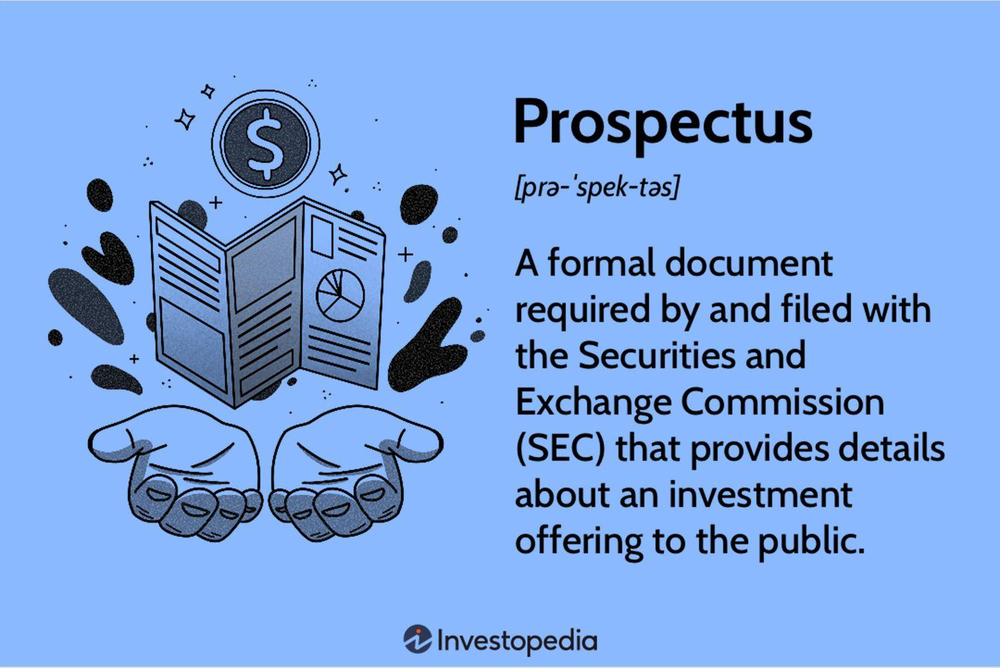

## Table of Contents

## What is a prospectus?

A prospectus is a document that companies use when they want to sell new stocks or bonds to the public. It gives important information about the company and the investment. The prospectus helps people decide if they want to invest their money. It includes details like the company's financial health, what the money will be used for, and the risks involved.

Reading a prospectus is important because it helps investors make smart choices. It tells them about the good and bad things that might happen with their investment. By law, companies must be honest in their prospectus. This way, people can trust the information and feel more confident about their investment decisions.

## What are the main components of a prospectus?

A prospectus has several important parts that help people understand the investment. The first part usually talks about the company itself. It tells you about what the company does, its history, and who runs it. This section also explains why the company is selling stocks or bonds and how it plans to use the money. It's like a story about the company that helps you see if it's a good fit for your investment goals.

The next part of the prospectus focuses on the financial details. This section shows the company's financial statements, like how much money it makes and spends. It also includes information about any debts the company has. This part is really important because it helps you see if the company is doing well financially. It also talks about the risks of investing in the company. These risks could be things like competition or changes in the market that might affect the company's success.

Finally, the prospectus includes the terms of the offering. This means it explains how the stocks or bonds will be sold, how much they cost, and when you can buy them. It also tells you about any special rules or conditions you need to know before you invest. This part is crucial because it lays out exactly what you're buying and what you need to do to get it. By understanding these components, you can make a smarter decision about whether to invest in the company.

## How is a prospectus used in the financial markets?

A prospectus is like a guidebook for people who want to invest in a company. When a company wants to sell new stocks or bonds, it creates a prospectus to tell everyone about the investment. This document is shared with the public and helps people decide if they want to buy the stocks or bonds. It's important because it gives clear information about the company, what the money will be used for, and the risks involved. This way, people can make smart choices about where to put their money.

In the financial markets, the prospectus plays a big role in keeping things fair and honest. It's required by law, so companies have to tell the truth about their financial situation and the risks of investing. This helps build trust between the company and the investors. When people feel they can trust the information, they are more likely to invest. So, the prospectus not only helps people make good investment decisions, but it also helps the whole market work better by making sure everyone has the same important information.

## Can you provide examples of different types of prospectuses?

One type of prospectus is called an initial public offering (IPO) prospectus. This is used when a company wants to sell its stocks to the public for the very first time. The IPO prospectus tells people about the company's business, its financial health, and why it's selling stocks. It's like a big introduction to the company, helping people decide if they want to buy the stocks.

Another type is a bond prospectus. This is used when a company or government wants to borrow money from the public by selling bonds. The bond prospectus explains how the bonds work, how much they cost, and when they will be paid back. It also tells about the risks of lending money to the company or government, so people can decide if it's a safe investment.

A third type is a mutual fund prospectus. This is used when someone wants to invest in a mutual fund, which is a type of investment that pools money from many people to buy a variety of stocks, bonds, or other assets. The mutual fund prospectus explains what the fund invests in, how it's managed, and the fees you have to pay. It helps people understand if the mutual fund matches their investment goals and if they're okay with the costs.

## What is the purpose of a prospectus for investors?

The purpose of a prospectus for investors is to give them important information about a company or investment. It tells them what the company does, how it's doing financially, and why it's selling stocks or bonds. This helps investors decide if they want to put their money into the company. The prospectus also explains the risks involved, so people know what could go wrong with their investment.

By reading the prospectus, investors can make smarter choices. It's like a guidebook that helps them understand if the investment matches their goals and if they're okay with the risks. The prospectus also helps keep things fair in the market because it makes sure everyone has the same important information. This way, investors can trust that they're making their decisions based on honest and complete details about the company.

## How should a beginner interpret the information in a prospectus?

When you're new to investing and you get a prospectus, think of it as a guidebook that tells you everything you need to know about a company or an investment. It explains what the company does, how well it's doing with money, and why it wants to sell stocks or bonds. This part helps you see if the company is doing things you like and if it's making enough money to be a good investment. The prospectus also talks about the risks, like if the company might not do well because of competition or other problems. Reading this helps you understand if you're okay with taking those risks with your money.

The next important thing in a prospectus is the financial details. This section shows numbers about how much money the company makes and spends. It can look hard to understand at first, but it's really important because it tells you if the company is healthy financially. Look for things like if the company is making more money than it's spending, and if it has a lot of debt. The prospectus also tells you about the stocks or bonds being sold, like how much they cost and when you can buy them. This helps you know exactly what you're buying and if it fits with your plans for investing. By taking your time to read and understand the prospectus, you can make a smarter choice about whether to invest in the company.

## What are the legal requirements for a prospectus?

A prospectus has to follow strict rules set by the government to make sure it's honest and clear. In the United States, the Securities and Exchange Commission (SEC) is in charge of these rules. The main rule is that the prospectus must tell the truth about the company and the investment. It can't leave out important information that people need to know to make a good decision. The company also has to update the prospectus if something important changes, so people always have the latest information.

Another important rule is that the prospectus has to be easy to understand. It should explain things in a way that regular people can get, not just experts. This means using clear language and avoiding too much complicated stuff. The prospectus also has to include certain sections, like a summary of the company, details about the financials, and a list of risks. By following these rules, the prospectus helps keep the investment market fair and helps people trust the information they're getting.

## How does a prospectus differ from other financial documents like a registration statement?

A prospectus and a registration statement are both important documents that companies use when they want to sell stocks or bonds to the public, but they have different purposes. A registration statement is what a company sends to the Securities and Exchange Commission (SEC) before it can sell its stocks or bonds. It's a big document that includes a lot of detailed information about the company, its finances, and the investment. The SEC looks at the registration statement to make sure everything is correct and honest before the company can move forward.

On the other hand, a prospectus is a part of the registration statement that the company shares with the public. It's like a summary that gives people the key information they need to decide if they want to invest. The prospectus is shorter and easier to read than the registration statement. It includes details about the company, how it's doing financially, what the money will be used for, and the risks involved. While the registration statement is more for the regulators, the prospectus is made for the investors to help them make smart choices.

## What advanced analysis techniques can be applied to the data in a prospectus?

When looking at the data in a prospectus, one advanced technique is financial ratio analysis. This means you take the numbers from the company's financial statements and use them to find ratios that tell you about the company's health. For example, you can look at the debt-to-equity ratio to see if the company has too much debt compared to its own money. Another useful ratio is the return on equity, which shows how well the company is using its money to make more money. By comparing these ratios to other companies in the same industry, you can see if the company is doing better or worse than its competitors.

Another technique is trend analysis, where you look at the company's financial data over time to see if things are getting better or worse. For example, you might look at the company's revenue and profit over the last few years to see if they are growing or shrinking. This can help you understand if the company is on a good path or if it might have problems in the future. You can also use forecasting models to predict how the company might do in the future based on past trends and other information in the prospectus.

Lastly, qualitative analysis is important too. This means looking at the non-number parts of the prospectus, like the company's business plan and the risks it talks about. You can use SWOT analysis, which stands for Strengths, Weaknesses, Opportunities, and Threats, to understand these parts better. By combining this with the financial data, you get a full picture of the company. This helps you see if the company's plans make sense and if the risks they talk about are something you're okay with.

## How can the effectiveness of a prospectus be measured?

The effectiveness of a prospectus can be measured by how well it helps people make smart investment choices. If the prospectus is clear and easy to understand, it's more likely to be effective. People should be able to read it and know what the company does, how it's doing financially, and what the risks are. If investors feel confident in the information they're getting, and if the prospectus helps them decide whether to invest, then it's doing its job well. Another way to measure effectiveness is by looking at how many people actually invest after reading the prospectus. If a lot of people choose to buy the stocks or bonds, it might mean the prospectus did a good job of explaining the investment.

Another important measure of a prospectus's effectiveness is how honest and complete the information is. If the prospectus follows the rules and tells the truth about the company and the investment, it helps build trust with investors. This trust is important because it makes people more likely to invest. The prospectus should also be updated if anything important changes, so people always have the latest information. If the prospectus does all these things well, it's more likely to be effective in helping people make good investment decisions.

## What are the common pitfalls to avoid when reading a prospectus?

When reading a prospectus, one common pitfall to avoid is getting overwhelmed by all the information. A prospectus can be long and full of numbers and complicated words, which might make it hard to understand. It's important to take your time and focus on the key parts like the company's business, its financial health, and the risks involved. Don't rush through it, and if something is hard to understand, try to break it down into simpler terms or look for explanations online.

Another pitfall is ignoring the risks. The prospectus will list the things that could go wrong with the investment, and it's easy to skip over this part if you're excited about the company. But understanding the risks is really important because it helps you know if you're okay with the chance that things might not go as planned. Make sure to read the risks carefully and think about how they might affect your decision to invest.

Lastly, don't just focus on the good parts of the prospectus. It's easy to get excited about the company's plans and how much money it's making, but you need to look at the whole picture. This means paying attention to the financial details, like how much debt the company has, and the terms of the offering, like how much the stocks or bonds cost. By looking at all the information, you can make a smarter choice about whether to invest.

## How do regulatory changes impact the content and structure of a prospectus?

Regulatory changes can make a big difference in what a prospectus looks like and what it says. When the rules change, companies have to update their prospectuses to follow the new laws. For example, if the government decides that companies need to share more information about their environmental impact, the prospectus will have to include that. This means the document might get longer or have new sections. The goal of these changes is to make sure that investors get all the important information they need to make good choices.

These changes can also affect how the prospectus is written. If the rules say that the language needs to be simpler and easier to understand, companies will have to rewrite parts of the prospectus to make it clearer. This helps more people understand what they're reading. Overall, regulatory changes are meant to keep the information in the prospectus honest and helpful for everyone who might want to invest.

## What are the key financial documents in investment?

Financial documents are essential tools for investors aiming to make informed decisions. Among these, balance sheets, income statements, and cash flow statements are fundamental in providing a comprehensive snapshot of a company's financial health.

### Balance Sheet

The balance sheet offers a detailed summary of a company's financial position at a specific point in time. It is divided into three main components: assets, liabilities, and shareholders' equity. The relationship is expressed through the accounting equation:

$$
\text{Assets} = \text{Liabilities} + \text{Shareholders' Equity}
$$

This equation ensures that what a company owns is financed either by borrowing money (liabilities) or by money invested by shareholders (equity). Analyzing the balance sheet allows investors to assess a company's [liquidity](/wiki/liquidity-risk-premium), operational efficiency, and financial leverage, thereby helping in evaluating the risk associated with the company's financial standing.

### Income Statement

The income statement, also known as the profit and loss statement, summarizes the company's performance over a specific period, typically a quarter or a year. It presents revenue, expenses, and profit, providing insight into the company's profitability and operational efficiency. Key metrics derived from the income statement include:

- **Gross Profit**: Revenue minus the cost of goods sold (COGS).
- **Operating Income**: Gross profit minus operating expenses such as wages and rent.
- **Net Income**: Operating income minus interest, taxes, and any other non-operating costs.

These metrics help investors understand the source of profits and the efficiency in managing expenses relative to revenue generation.

### Cash Flow Statement

The cash flow statement outlines the inflow and outflow of cash within a company, segmented into operating, investing, and financing activities. This statement is crucial for understanding how well a company generates cash to pay its debt obligations and fund its operating expenses. 

Key components of cash flow include:

- **Operating Activities**: Cash generated from primary business activities.
- **Investing Activities**: Cash used for investing in capital assets or securities.
- **Financing Activities**: Cash flows related to debt and equity financing.

Investors use the cash flow statement to assess a company's liquidity and financial flexibility. The statement provides insights into a company's ability to generate cash, cover expenses, and sustain growth without external financing.

### Application in Investment Strategies

By analyzing these financial documents, investors can assess a company's risk profile, valuation, and growth potential. The data allows for the calculation of key financial ratios such as:

- **Current Ratio**: $\frac{\text{Current Assets}}{\text{Current Liabilities}}$, evaluating liquidity.
- **Debt-to-Equity Ratio**: $\frac{\text{Total Liabilities}}{\text{Shareholders’ Equity}}$, indicating financial leverage.
- **Price-to-Earnings Ratio (P/E)**: $\frac{\text{Market Price per Share}}{\text{Earnings per Share}}$, used for company's valuation.

Understanding these financial statements is essential not only for assessing the current financial status of a company but also for predicting future performance. This [fundamental analysis](/wiki/fundamental-analysis) helps investors construct robust investment strategies tailored to individual risk appetites and investment goals. Tools like Python can further enhance analysis by automating the calculation of financial ratios and trend analysis, facilitating a more comprehensive understanding of the company's financial trajectory.

## References & Further Reading

[1]: ["Algorithmic Trading: Winning Strategies and Their Rationale"](https://www.wiley.com/en-us/Algorithmic+Trading%3A+Winning+Strategies+and+Their+Rationale-p-9781118460146) by Ernie Chan

[2]: ["Financial Statement Analysis and Valuation"](https://courses.business.columbia.edu/B8009) by Peter D. Easton, Mary Lea McAnally, Gregory A. Sommers, and Xiao-Jun Zhang 

[3]: ["Prospectus Regulation: Enhancing Transparency and Investor Protection"](https://eur-lex.europa.eu/legal-content/EN/ALL/?uri=CELEX:32017R1129) - International Organization of Securities Commissions (IOSCO) 

[4]: Bouchaud, J-P., & Potters, M. (2009). ["Financial Applications of Random Matrix Theory: a short review"](https://arxiv.org/abs/0910.1205). Advances in Combinatorial Methods and Random Matrix Theory.

[5]: ["Market Microstructure In Practice"](https://www.amazon.com/Market-Microstructure-Practice-Charles-Albert-Lehalle/dp/9813231122) by Larry Harris