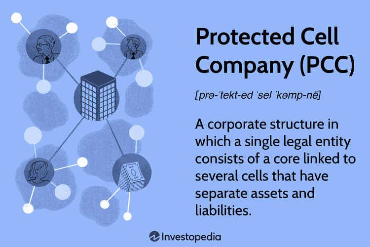

The business landscape is characterized by continuous evolution, developing various models to cater to distinct needs. Among these models is the Protected Cell Company (PCC), a sophisticated financial structure that has proven advantageous in sectors such as insurance and investment funds. The Protected Cell Company model allows for risk management and asset protection through its innovative architecture of segregated cells within a single legal entity. Each cell operates independently with its own assets and liabilities, providing a unique mechanism to isolate financial risks effectively.

This article examines the intersection of the PCC business model with algorithmic trading, a domain requiring advanced financial frameworks. Algorithmic trading leverages computational algorithms to execute financial transactions at high speed and volume, demanding robust risk management solutions. The PCC's structure of separate cells aligns well with the needs of algorithmic trading by enabling the isolation of different trading strategies and risk profiles. This isolation ensures that the risks and outcomes of one cell do not influence others, promoting stability and strategic management.



Understanding the intricacies of the PCC model and its relationship with algorithmic trading is essential for appreciating contemporary business solutions and their impact on risk mitigation strategies. By exploring these concepts, this article aims to offer insights into innovative approaches that enhance operational efficiency and secure assets in complex financial environments.

## Table of Contents

## What is a Protected Cell Company?

A Protected Cell Company (PCC) is an innovative legal entity designed to enable a core company to establish multiple separate cells, each with its own distinct assets and liabilities. This structure is particularly advantageous in industries where risk management is paramount, such as insurance and financial services. The PCC model provides a robust framework for isolating financial risks by ensuring that the liabilities of one cell do not affect the assets of another, nor those of the core company itself.

The framework of a PCC can be likened to a hub-and-spoke model. In this configuration, the central core company serves as the hub, connected to various independent units, or cells, each functioning as a distinct entity. This organizational structure allows for efficient management and operational flexibility. By maintaining separate financial records and regulatory compliance for each cell, companies can tailor risk management and asset allocation strategies to the specific needs of each cell.

This compartmentalization not only enhances the protection of assets within individual cells but also provides legal clarity and operational transparency. As each cell operates independently, stakeholders can precisely track the performance and risk profile of their investments or business activities within a particular cell, without being concerned about potential liabilities from other cells. This structure is complemented by the overarching governance mechanisms of the PCC, which ensures that each cell adheres to its specific objectives while aligning with the core company's strategic goals.

## Benefits and Advantages of PCCs

Protected Cell Companies (PCCs) present a compelling financial structure due to their ability to provide enhanced asset protection. By isolating liabilities within individual cells, PCCs ensure that financial exposures are confined to specific cells, resulting in minimal risk to the core company and other cells. This isolation mechanism is particularly advantageous in industries where the mitigation of risk is critical.

One notable aspect of PCCs is their ability to facilitate cost efficiency and operational flexibility. The structure allows for the streamlined management of resources, enabling companies to reduce administrative overheads and allocate resources more effectively. This efficiency is accomplished as each cell operates independently, allowing for distinct financial management practices and operational strategies suited to the specific needs of the cell.

In certain jurisdictions, PCCs offer notable tax advantages, which can lead to significant cost savings for businesses. These tax benefits arise because each cell is often treated as a separate entity for tax purposes, allowing companies to take advantage of favorable tax treatments applicable to specific cells. Consequently, companies can optimize their tax strategy and enhance overall financial performance.

Businesses operating in high-risk industries, such as insurance and finance, extensively use PCCs to manage diverse portfolios while maintaining compartmentalized risks. The segregation of assets and liabilities within cells ensures that adverse financial events affecting one cell do not impact the financial stability of others. This strategic risk management capability enables companies to explore innovative products and services without exposing the entire organization to undue risk.

## Financial Structure of a Protected Cell Company

A Protected Cell Company (PCC) operates under a single legal framework managed by a unified board of directors. This governing body is responsible for the overall strategic direction and management of the PCC, encompassing both the core and its individual cells. Despite the integration within a singular legal entity, each cell within the PCC maintains its own distinct financial accounts and operations.

The structure of a PCC is designed to facilitate separate financial reporting for each cell, ensuring clarity and transparency in financial management. Each cell's assets and liabilities are legally segregated from those of the core and other cells, a feature that is crucial in managing diverse financial strategies and obligations. This separation allows for tailored financial management strategies that can be customized to meet the specific needs and goals of each cell.

The compartmentalized approach of a PCC proves advantageous in optimizing asset allocation and risk management across the entire company. By isolating different business activities and their associated risks within individual cells, a PCC can mitigate the potential for financial contagion. In case one cell faces financial challenges, the impacts are contained and do not spill over, thereby protecting the financial health of the other cells and the core entity.

In practical terms, this separation of assets and liabilities can be illustrated by considering a PCC engaged in multiple lines of business, such as insurance, investment funds, and [algorithmic trading](/wiki/algorithmic-trading). For instance, one cell could focus on high-risk trading strategies, while another manages a conservative investment portfolio. The PCC's financial structure allows each cell to operate independently, with its own risk profile, governance protocols, and financial objectives, without compromising the stability of the whole entity.

This structural integrity is governed by meticulous accounting practices and robust risk management strategies that underline the financial operations within a PCC. Each cell must adhere to strict compliance and reporting standards as mandated by jurisdictional requirements, further ensuring the robustness of the PCC's financial management and operational integrity. Through such compartmentalization, PCCs provide a resilient platform for businesses aiming to effectively manage multiple, potentially high-risk financial endeavors simultaneously.

## Algorithmic Trading and the PCC Model

Algorithmic trading utilizes sophisticated algorithms to automate the implementation of financial trading strategies. These strategies rely heavily on computing power and data analysis to execute trades at speeds and frequencies beyond human capability. The nature of these operations inherently demands robust risk management frameworks, as the rapid execution can lead to significant financial exposure if not properly managed.

The Protected Cell Company (PCC) model aligns exceptionally well with the needs of algorithmic trading by enabling precise risk isolation within defined cells. Each cell within a PCC can be allocated a specific set of algorithms and trading strategies, allowing firms to manage distinct risk profiles and financial goals separately. This structure is particularly advantageous for high-frequency trading ([HFT](/wiki/high-frequency-trading-strategies)), where swift data processing and fast decision-making are critical. The cell-based segregation facilitates effective control over transaction-specific risk, preventing adverse impacts from one cell affecting the performance of others within the same PCC.

Moreover, the compartmentalization offered by a PCC means that losses or liabilities incurred within one cell do not jeopardize the assets held in other cells or the core capital of the company. For example, a trading operation structured as a PCC can place diverse algorithm-driven strategies into separate cells, thus enabling the testing and implementation of various trading models without risking cross-contamination of financial results.

A hypothetical setup in a PCC for algorithmic trading might be illustrated using a Python script to analyze risk levels or asset allocation efficiency. Here’s a simple illustration of a Python function to simulate risk assessment across different cells:

```python
def assess_risk(cell_data):
    risk_metrics = {}
    for cell, data in cell_data.items():
        risk = data['volatility'] * data['exposure']
        risk_metrics[cell] = risk
    return risk_metrics

# Example data for cells
cell_data = {
    'Cell_A': {'volatility': 0.05, 'exposure': 1000000},
    'Cell_B': {'volatility': 0.07, 'exposure': 1500000},
    'Cell_C': {'volatility': 0.02, 'exposure': 500000},
}

risk_assessment = assess_risk(cell_data)
print(risk_assessment)
```

This simulation calculates risk based on [volatility](/wiki/volatility-trading-strategies) and exposure, two fundamental parameters in trading strategies. The results help algorithmic traders decide on asset allocation and evaluate the effectiveness of risk management in each cell.

In summary, the PCC model offers substantial flexibility for firms engaged in algorithmic trading. By facilitating isolated environments for diverse trading strategies, it enhances risk management capabilities and optimizes operational efficiency. This synergy between compartmentalized cell structures and algorithm-driven methodologies positions PCCs as an attractive corporate structure for traders looking to innovate and safely expand their automated trading activities.

## Applications of PCCs in Financial Markets

Protected Cell Companies (PCCs) have become instrumental in the financial markets, significantly influencing sectors such as insurance, investment funds, and algorithmic trading. Each of these fields leverages the PCC structure to optimize risk management and operational efficiency.

Insurance companies have been early adopters of the PCC model, primarily to manage different lines of business without risk contamination. By segregating insurance lines into different cells, companies can isolate liabilities and assets, ensuring that the financial instability of one line does not affect others. This structure is particularly beneficial for multi-line insurers managing diverse policies, as it allows for distinct underwriting processes and reserves management for each cell.

Investment funds also find PCCs advantageous due to their capacity to create separate cells for varied investment strategies. Such a configuration provides a robust mechanism for asset protection and management efficiency. By isolating each investment strategy within its own cell, fund managers can tailor risk management tactics, achieve specific investment goals, and maintain transparency in financial reporting. This separation aids in meeting regulatory requirements and investor expectations.

Algorithmic trading firms benefit significantly from the PCC model by maintaining precise boundaries between differing algorithmic strategies. In algorithmic trading, managing risk and optimizing performance are critical. The PCC structure allows firms to allocate specific algorithms and trading strategies to distinct cells, minimizing the risk of systemic failures and enabling targeted performance analysis. Each cell can be customized according to risk appetite, market conditions, and strategic goals, facilitating high-frequency and specialized trading operations.

The use of PCCs in these financial sectors highlights the versatility and efficiency of this corporate structure, allowing firms to handle complex and high-risk activities without cross-contaminating risk exposure. As financial markets continue to evolve, the PCC model is likely to find broader applications, driven by its inherent flexibility and risk management strengths.

## Legal Considerations and Compliance

Jurisdictions vary significantly in how they regulate Protected Cell Companies (PCCs), necessitating a careful navigation through various legal and regulatory frameworks. The regulatory landscape for PCCs is shaped by national legislation, international financial regulations, and best practice standards, all of which aim to maintain financial stability and protect stakeholders' interests. 

Compliance begins with ensuring that a PCC meets the required capital adequacy standards specific to each jurisdiction. These standards are meant to ensure that each cell under the PCC structure maintains sufficient capital to cover its own liabilities, without jeopardizing the financial health of the core or other cells. Adhering to these requirements often entails complex calculations and continuous monitoring, especially in jurisdictions that impose stringent solvency regulations.

In addition to capital requirements, PCCs must adhere to rigorous reporting standards that vary by location. Reporting entails the transparent presentation of financial statements, where each cell’s finances are often required to be reported separately to enhance clarity and accountability. This comprehensive documentation helps in tracking the performance of each cell independently and ensures transparency to regulators, investors, and other stakeholders.

Proper governance structures are another cornerstone of compliance for PCCs. Governance within a PCC involves the establishment of a robust board of directors responsible for both the overarching entity and each individual cell. This board must ensure that policies are in place to manage risks, ensure compliance, and maintain ethical standards throughout the company’s operations. The governance framework should also include comprehensive internal controls and risk management practices tailored to the distinct operational realities of each cell, ensuring that strategies align with broader corporate objectives.

Legal advice is indispensable when setting up a PCC, especially given the varied and complex legal considerations across different jurisdictions. Legal advisors can assist in interpreting local laws, identifying potential legal risks, and drafting necessary documentation to comply with regulatory requirements. This often involves a nuanced understanding of jurisdiction-specific laws covering corporate formation, operational mandates, and closure procedures for cells and the core entity.

Ultimately, understanding the specific jurisdictional laws and their implications for a PCC is crucial for its successful establishment and operation. Without such knowledge, companies are at risk of falling foul of regulatory expectations, which can lead to financial penalties, operational restrictions, or reputational damage. Legal advisors thus play a pivotal role in guiding companies through this intricate terrain, ensuring that all legal and compliance requirements are met diligently.

## Conclusion

Protected Cell Companies (PCCs) represent a strategically advantageous structure for the modern business landscape, especially in sectors dealing with varied financial operations and inherent risks. These entities allow for an organized yet flexible way to guard assets while managing complex portfolios across distinct cells. This isolation of liabilities through separate cells not only provides robust legal protection but also enhances operational agility, crucial for sectors like insurance, finance, and investment that demand precision in risk management.

In the dynamic field of trading and investment, particularly algorithmic trading, PCCs stand out as an effective tool. Algorithmic trading often necessitates sophisticated financial strategies and rapid adaptation to market changes. The PCC model supports this by permitting individual trading strategies and risk profiles to be implemented and managed within dedicated cells. This setup ensures that each cell operates independently, reducing the risk of financial contagion across the entity. Additionally, this compartmentalization allows for tailored governance and financial reporting, aligning with the diverse goals and risk appetites of various trading strategies.

Ultimately, the PCC structure not only secures assets through legal means but also empowers businesses to innovate by offering a scalable approach to manage different financial activities. For algorithmic trading firms, the unique dual advantage of legal protection and operational flexibility is a compelling reason to adopt the PCC model. This strategic alignment allows businesses to optimize performance while minimizing exposure to potential risks, thus providing an astute solution for today's intricate financial challenges.

## References & Further Reading

[1]: Griffiths, N. (2019). ["The Impact of Protected Cell Companies on Innovation in Algorithmic Trading."](https://www.sciencedirect.com/science/article/pii/S2405844023011234) Journal of Financial Innovation.

[2]: Lane, M. (2003). ["The Regulation of Cell Companies in the European Union."](https://www.chegg.com/homework-help/questions-and-answers/2-lane-72-m-wide-single-carriageway-road-curve-radius-300-m-posted-speed-limit-70k-m-h--hi-q221676320) European Business Law Review.

[3]: Freeman, M. (2007). ["Protected Cell Companies: A Better Way to Manage Captives."](https://www.captive.com/news/a-primer-on-protected-cell-companies) Risk Management Magazine.

[4]: ["The Handbook of Insurance-Linked Securities"](https://onlinelibrary.wiley.com/doi/book/10.1002/9781119206545) by Andrew Hayward, Morton Lane.

[5]: Angermueller, C., Parnamaa, T., Parts, L., & Stegle, O. (2016). ["Deep Learning for Computational Biology."](https://pubmed.ncbi.nlm.nih.gov/27474269/) International Conference on Computational Intelligence in Bioinformatics and Computational Biology.