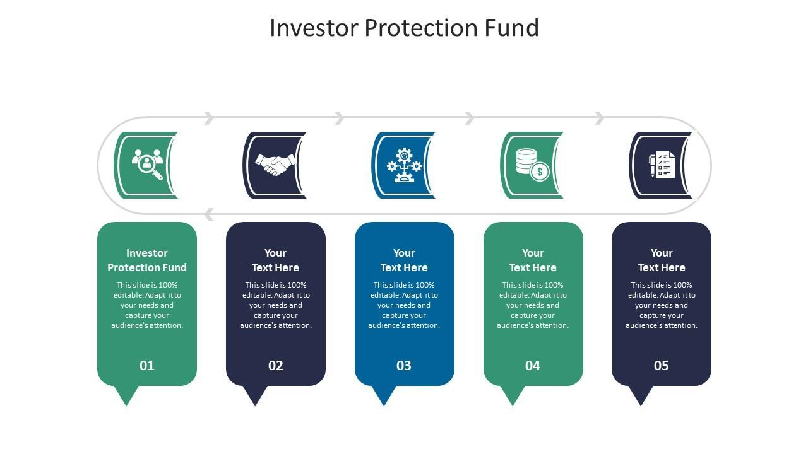

## Table of Contents

## What is a protected fund?

A protected fund is a type of investment where your money is kept safe from big losses. It's like having a safety net for your savings. If the market goes down, the fund has ways to make sure you don't lose too much money. This can be done by using special financial tools or by investing in safer options.

These funds are good for people who want to grow their money but are worried about losing it. They might not make as much money as riskier investments, but they offer peace of mind. Protected funds are often used by people who are close to retirement or those who can't afford to take big risks with their money.

## How does a protected fund work?

A protected fund works by using special strategies to keep your money safe. Imagine you put your money into a fund, and the fund manager uses part of it to buy safe investments like bonds. These bonds are like loans to the government or big companies that pay you back with interest. The rest of your money might be used to buy stocks or other investments that could grow more but are riskier. The safe part acts like a cushion, protecting your money if the riskier part doesn't do well.

The fund might also use something called options or other financial tools to limit losses. Options are like insurance for your investments. If the market goes down, these options can help make up for the losses. This way, even if the stock market has a bad day, your fund won't lose as much money. It's like having a safety net that catches you if you fall, making sure you don't hit the ground too hard.

## What are the main benefits of investing in a protected fund?

Investing in a protected fund has some big benefits. One of the main ones is that it keeps your money safe from big losses. If the stock market goes down, the fund has ways to make sure you don't lose too much. This is great for people who want to grow their money but are scared of losing it all. It's like having a safety net that catches you if you fall, so you can sleep better at night knowing your money is protected.

Another benefit is that protected funds can still help your money grow. Even though they are safer, they can still make money when the market does well. This means you get the best of both worlds: the chance to earn more money and the peace of mind that comes with knowing your money is safe. It's a good choice for people who are close to retiring or anyone who can't afford to take big risks with their savings.

## What are the potential risks associated with protected funds?

Protected funds are safer than many other investments, but they still have some risks. One risk is that they might not grow your money as much as riskier investments like stocks. If the market does really well, you might not make as much money because the fund is focused on keeping your money safe. This means you could miss out on bigger gains.

Another risk is that the protection isn't perfect. Even with safety measures like options or bonds, there's still a chance you could lose some money if the market drops a lot. The protection helps, but it doesn't guarantee you won't lose anything. It's important to understand that while protected funds are safer, they're not completely risk-free.

Lastly, protected funds can be more expensive. They often have higher fees because they need to pay for the tools and strategies that keep your money safe. These extra costs can eat into your returns, making it harder for your money to grow over time. So, while they offer more safety, you need to think about whether the extra cost is worth it for you.

## Who should consider investing in a protected fund?

People who are close to retiring should think about investing in a protected fund. When you're about to stop working, you don't want to lose your savings because you need that money to live on. A protected fund can help keep your money safe while still giving you a chance to grow it a little. It's like having a safety net that catches you if the market falls, so you can feel more secure about your future.

Also, if you're someone who gets nervous about losing money, a protected fund might be right for you. These funds are good for people who want to invest but are scared of big risks. They offer peace of mind because they use special tools to limit losses. Even though you might not make as much money as with riskier investments, knowing your money is safer can help you sleep better at night.

## How do protected funds differ from other types of investment funds?

Protected funds are different from other types of investment funds because they focus on keeping your money safe. Other funds, like stock funds or mutual funds, might try to make as much money as possible by taking bigger risks. But protected funds use special tools like options and bonds to limit how much money you can lose. This means if the market goes down, a protected fund won't lose as much as a regular stock fund. It's like having a safety net that catches you if you fall, making it a safer choice for people who don't want to lose their savings.

Another way protected funds differ is in their costs and potential returns. Because they use special tools to protect your money, protected funds often have higher fees than other types of funds. These extra costs can make it harder for your money to grow as much as it might in a cheaper fund. But on the flip side, protected funds can still help your money grow, just not as much as riskier investments like stocks. So, while they might not make you rich quickly, they offer peace of mind and a safer way to invest your money.

## What are the common strategies used by protected funds to safeguard investments?

Protected funds use a few main strategies to keep your money safe. One common way is by investing in bonds. Bonds are like loans to the government or big companies that pay you back with interest. They're safer than stocks because they don't go up and down as much. By putting some of your money into bonds, the fund creates a cushion that protects your investment if the stock market goes down.

Another strategy is using options. Options are like insurance for your investments. If the market drops, these options can help make up for the losses. It's like having a safety net that catches you if you fall, so you don't lose as much money. This way, even if the stock market has a bad day, the fund can still limit how much you lose.

Lastly, some protected funds use a mix of different investments to spread out the risk. This is called diversification. By investing in a variety of things like stocks, bonds, and other assets, the fund reduces the chance that all your money will be lost if one type of investment does poorly. It's like not putting all your eggs in one basket, which helps keep your money safer.

## Can you explain the role of insurance in protected funds?

Insurance plays a big role in protected funds by helping to limit how much money you can lose. Think of insurance like a safety net for your investments. If the stock market goes down, the insurance can help make up for the losses. This is often done using something called options, which are like insurance policies for your investments. If the market drops, the options kick in and help protect your money, so you don't lose as much as you would without them.

This insurance helps give you peace of mind. When you know your money is protected, you don't have to worry as much about big losses. It's especially helpful for people who are close to retiring or those who can't afford to take big risks with their savings. While the insurance might cost a bit more in fees, it's worth it for many people because it means they can sleep better at night knowing their money is safer.

## What are the fees and costs associated with protected funds?

Protected funds often have higher fees than other types of funds. This is because they use special tools like options and bonds to keep your money safe. These tools cost money, so the fund charges more to cover those costs. You might see these fees as a percentage of your investment, which can add up over time. It's important to look at the fee structure of a protected fund before you invest, so you know exactly how much it will cost you.

Even though the fees are higher, many people think they're worth it because protected funds offer more safety. The extra cost is like paying for insurance on your investments. If the market goes down, the fund's strategies can help limit how much money you lose. So, while you might not make as much money as with a cheaper fund, the peace of mind that comes with knowing your money is safer can be a big plus.

## How do regulatory frameworks impact protected funds?

Regulatory frameworks play a big role in how protected funds work. These rules are made by governments and financial watchdogs to make sure that funds are safe and fair for everyone. They set standards that protected funds have to follow, like how much money they need to keep in safe investments like bonds, and what kinds of tools they can use to limit losses. This helps keep your money safe and makes sure the fund managers are doing their job right.

These regulations can also affect the fees and costs of protected funds. Because the rules can be strict, it might cost more for the fund to follow them. This means the fees you pay could be higher than with other types of funds. But these rules are important because they help protect you from big losses and make sure the fund is run honestly. So, while they might make protected funds a bit more expensive, they're there to keep your money safer.

## What are some real-world examples of protected funds?

One example of a protected fund is the Capital Protected Fund offered by some banks. These funds promise to give you back at least the amount of money you put in at the end of a certain time, even if the market goes down. They do this by using a mix of investments, like stocks and bonds, and sometimes special tools like options to limit losses. This makes them a good choice for people who want to try to grow their money but are scared of losing it all.

Another example is the Guaranteed Investment Funds (GIFs) you can find at insurance companies. These funds work a bit like life insurance for your investments. They promise to give you back a certain amount of your money, no matter what happens in the market. They use a mix of safe investments and insurance-like tools to make sure your money is protected. This is great for people who are close to retiring and want to keep their savings safe.

## How can one evaluate the performance of a protected fund?

To evaluate the performance of a protected fund, you need to look at a few things. First, check how much money the fund has made over time. This is called the return. Even though protected funds focus on keeping your money safe, they can still grow a bit. Look at the fund's returns over different periods, like one year, three years, or five years, to see how well it's doing. Also, compare the fund's returns to other similar funds to see if it's doing better or worse.

Next, consider the risks the fund has taken to get those returns. Protected funds use special tools to limit losses, but they still have some risk. Look at how much the fund's value goes up and down, which is called volatility. A fund with less volatility is safer. Also, think about the fees you're paying. Higher fees can eat into your returns, so make sure the fund's performance is worth the cost. By looking at returns, risk, and fees, you can get a good idea of how well a protected fund is doing.

## References & Further Reading

[1]: Acar, E. (2019). ["Fixed Income and Interest Rate Derivative Analysis."](https://www.sciencedirect.com/book/9780750640121/fixed-income-and-interest-rate-derivative-analysis) Elsevier.

[2]: ["Advances in Financial Machine Learning"](https://www.amazon.com/Advances-Financial-Machine-Learning-Marcos/dp/1119482089) by Marcos Lopez de Prado.

[3]: Harris, L. (2002). ["Trading and Exchanges: Market Microstructure for Practitioners."](https://academic.oup.com/book/52292) Oxford University Press.

[4]: Hasbrouck, J. (2007). ["Empirical Market Microstructure: The Institutions, Economics, and Econometrics of Securities Trading."](https://academic.oup.com/book/52241) Oxford University Press.

[5]: ["An Introduction to Algorithmic Trading: Basic to Advanced Strategies"](https://archive.org/details/introductiontoal0000lesh) by Edward Leshik.

[6]: Kissell, R. (2013). ["The Science of Algorithmic Trading and Portfolio Management."](https://www.sciencedirect.com/book/9780124016897/the-science-of-algorithmic-trading-and-portfolio-management) Academic Press.