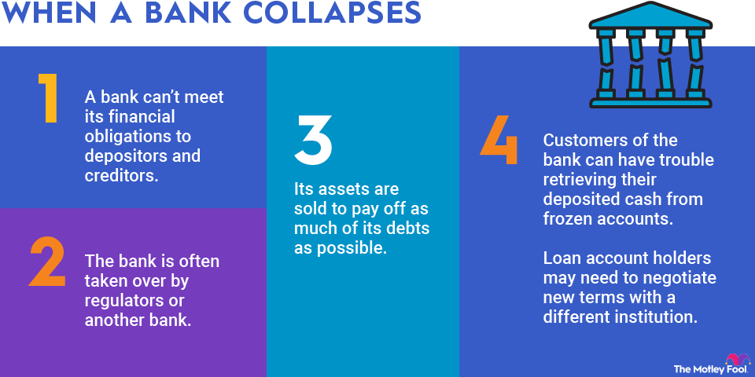

## Table of Contents

## What is a bank failure?

A bank failure happens when a bank can't pay back the money people put in it. This can happen if too many people want their money back at the same time, or if the bank made bad loans and can't get the money back. When a bank fails, it might have to close down.

When a bank fails, it can cause problems for the people who have money in the bank. But there are systems in place to help. In many countries, there is something called deposit insurance, which means if a bank fails, people can still get their money back up to a certain amount. This helps to keep people's money safe even if the bank has problems.

## How common are bank failures?

Bank failures are not very common, but they do happen sometimes. In the United States, for example, there are usually only a few bank failures each year. This is much less than in the past, like during the Great Depression when many banks failed.

The number of bank failures can change a lot depending on the health of the economy. When the economy is doing well, there are usually fewer bank failures. But when the economy is struggling, like during a recession, more banks might fail because people and businesses have a harder time paying back their loans.

## What are assets in the context of banking?

In banking, assets are things that the bank owns or has control over that have value. This can include money that people have put into the bank, loans that the bank has given out to people and businesses, and investments like stocks and bonds. These assets help the bank make money, because they can earn interest on loans and investments.

Assets are important for a bank because they show how much the bank is worth and how well it can handle its financial responsibilities. If a bank has a lot of good assets, it is usually seen as strong and stable. But if a bank has a lot of bad assets, like loans that people aren't paying back, it can be in trouble and might even fail.

## What protections are in place for depositors when a bank fails?

When a bank fails, there are systems to help protect the money that people have put into the bank. In many countries, there is something called deposit insurance. This means that if a bank fails, people can still get their money back up to a certain amount. In the United States, for example, the Federal Deposit Insurance Corporation (FDIC) insures deposits up to $250,000 per depositor, per bank, for each account ownership category. This helps make sure that people don't lose all their money if their bank fails.

Besides deposit insurance, there are other ways to help when a bank fails. Sometimes, another stronger bank might take over the failed bank. This can happen quickly, and it means that people can still use their money without much trouble. Government agencies also watch over banks to make sure they are safe and sound. They do this by checking the bank's financial health regularly and making rules that banks have to follow to protect depositors.

## What is the role of the FDIC in protecting assets during bank failures?

The FDIC, or Federal Deposit Insurance Corporation, plays a big role in protecting people's money when a bank fails. The FDIC insures deposits up to $250,000 per depositor, per bank, for each account ownership category. This means if your bank fails, you can still get your money back up to that amount. This helps people feel safe about keeping their money in banks because they know it's protected.

Besides insuring deposits, the FDIC also helps manage the process when a bank fails. They work to make sure that people can still access their money with as little trouble as possible. Sometimes, the FDIC will find another healthy bank to take over the failed bank. This can happen quickly, so people might not even notice much difference. The FDIC's work helps keep the banking system stable and makes sure that people's money is safe even if their bank has problems.

## How does deposit insurance work, and what are its limits?

Deposit insurance is like a safety net for your money in the bank. If the bank fails, you can still get your money back up to a certain amount. In the United States, the FDIC, or Federal Deposit Insurance Corporation, is the group that provides this insurance. They promise to give you back up to $250,000 for each account you have in a bank. This means if you have a savings account, a checking account, and a certificate of deposit at the same bank, each one can be insured up to $250,000.

The limits of deposit insurance are important to understand. The $250,000 limit applies to each account ownership category at each bank. So, if you have a joint account with someone else, that account can also be insured up to $250,000, separate from your individual accounts. But if you have more than $250,000 in one account at one bank, anything over that amount is not insured. To keep more of your money safe, you might need to spread it across different banks or use different account types.

## What steps should individuals take to protect their assets in the event of a bank failure?

To protect your money if a bank fails, it's important to know about deposit insurance. In the United States, the FDIC insures your money up to $250,000 per account at each bank. This means if you have a savings account, a checking account, and other types of accounts at the same bank, each one can be insured up to $250,000. If you have more money than that in one account, you might want to spread it out across different banks or use different account types to make sure more of your money is safe.

Another thing you can do is keep an eye on the health of your bank. You can check if your bank is doing well by looking at reports from the FDIC or other financial watchdogs. If you see that your bank is having problems, you might want to move some of your money to a different, healthier bank. Also, having a mix of different types of accounts, like savings, checking, and maybe even some investments, can help spread out your risk. This way, if one bank fails, not all your money will be in one place.

## How can businesses safeguard their funds against bank failures?

Businesses can protect their money from bank failures by using deposit insurance. In the United States, the FDIC insures money up to $250,000 per account at each bank. This means if a business has a checking account, a savings account, and other types of accounts at the same bank, each one can be insured up to $250,000. If a business has more money than that in one account, they should spread it out across different banks or use different account types to make sure more of their money is safe. This way, even if one bank fails, the business won't lose all its money.

Another way businesses can safeguard their funds is by keeping an eye on the health of their banks. They can check reports from the FDIC or other financial watchdogs to see if their bank is doing well. If a business sees that their bank is having problems, they might want to move some of their money to a different, healthier bank. Also, having a mix of different types of accounts, like savings, checking, and maybe even some investments, can help spread out the risk. This way, if one bank fails, not all the business's money will be in one place.

## What are the differences in asset protection between small banks and large banks?

When it comes to protecting your money, small banks and large banks both have the same level of deposit insurance from the FDIC in the United States. This means that whether you have an account at a small bank or a big bank, your money is insured up to $250,000 per account. So, if a bank fails, you can get your money back up to that amount, no matter the size of the bank.

However, there can be some differences in how safe your money feels in small versus large banks. Large banks often have more resources and can handle bigger financial problems better than small banks. They might also have more branches and services, which can make it easier for you to get your money if something goes wrong. On the other hand, small banks might be more focused on their local community and could offer more personalized service. But if a small bank fails, it might be harder for them to find another bank to take over quickly, which could affect how fast you get your money back.

## How do international banking regulations affect asset protection in bank failures?

International banking rules help protect your money if a bank fails. These rules are made by groups like the Basel Committee on Banking Supervision. They set standards that banks around the world should follow to stay safe and sound. These standards include having enough money set aside to cover losses and making sure banks don't take too many risks. When banks follow these rules, it makes them stronger and less likely to fail, which helps keep your money safe.

Even though these rules are important, how well they work can be different in each country. Some countries might have their own rules that are even stricter than the international ones. For example, the FDIC in the United States insures your money up to $250,000 if a bank fails. Other countries might have different amounts or different ways to protect your money. So, if you have money in banks in different countries, it's good to know the rules in each place to understand how safe your money is.

## What historical examples illustrate successful and failed asset protection during bank failures?

One good example of successful asset protection during a bank failure is the case of Washington Mutual (WaMu) in 2008. When WaMu failed, it was the biggest bank failure in U.S. history at the time. But because of the FDIC, people who had money in WaMu didn't lose it. The FDIC quickly found another bank, JPMorgan Chase, to take over WaMu. This meant that people could still get their money out of their accounts without any big problems. The FDIC's quick action and deposit insurance helped protect people's money.

On the other hand, a failed example of asset protection happened during the Great Depression in the 1930s. Back then, there was no FDIC or deposit insurance. When banks failed, people often lost all their money. One famous case was the Bank of United States, which failed in 1931. When it went under, people who had money in the bank lost everything. This made a lot of people scared to put their money in banks, which made the economic problems even worse. It wasn't until the FDIC was created in 1933 that people started to feel safer about keeping their money in banks.

## What advanced strategies can financial experts use to mitigate risks associated with bank failures?

Financial experts can use a few smart strategies to keep money safe if a bank fails. One way is to spread money across different banks. This is called diversification. If you have money in more than one bank, and one bank fails, you won't lose all your money because the other banks will still be okay. Another strategy is to keep an eye on how healthy a bank is. Experts can look at reports from groups like the FDIC to see if a bank is doing well or if it's having problems. If a bank looks risky, they can move money to a safer bank before it fails.

Another advanced strategy is to use different types of accounts. For example, having money in savings accounts, checking accounts, and even some investments can help spread out the risk. This way, if one type of account is affected by a bank failure, the others might be okay. Financial experts can also use something called a sweep account. This is a special account that automatically moves money over the FDIC insurance limit to another bank or investment, so more of the money stays safe. By using these strategies, financial experts can better protect money from bank failures.

## References & Further Reading

[1]: Federal Deposit Insurance Corporation (FDIC). ["Deposit Insurance."](https://www.fdic.gov/)

[2]: Dodd-Frank Wall Street Reform and Consumer Protection Act. ["Public Law 111–203."](https://www.congress.gov/111/plaws/publ203/PLAW-111publ203.pdf)

[3]: Markowitz, H. (1952). ["Portfolio Selection,"](https://onlinelibrary.wiley.com/doi/abs/10.1111/j.1540-6261.1952.tb01525.x) The Journal of Finance, 7(1), 77–91.

[4]: Securities Investor Protection Corporation (SIPC). ["An Overview of SIPC Protection."](https://www.sipc.org/)

[5]: CFA Institute. (2020). ["Algorithmic and High-Frequency Trading,"](https://rpc.cfainstitute.org/research/financial-analysts-journal/2021/0015198x-2020-1865694) Research Foundation Literature Reviews.

[6]: Lopez de Prado, M. (2018). ["Advances in Financial Machine Learning."](https://www.amazon.com/Advances-Financial-Machine-Learning-Marcos/dp/1119482089) Wiley.

[7]: European Central Bank. (2019). ["Algorithmic Trading: Impact on the EU Market Structure."](https://www.ecb.europa.eu/paym/groups/pdf/bmcg/191120/2019-11-20_-_BMCG_-_Item_3a_-_Algorithmic_trading_in_bond_markets_-_Citi.pdf) 

[8]: Chan, E. P. (2013). ["Algorithmic Trading: Winning Strategies and Their Rationale."](https://github.com/ftvision/quant_trading_echan_book) Wiley.

[9]: "Modern Portfolio Theory and Investment Analysis" by Edwin J. Elton, Martin J. Gruber, Stephen J. Brown, and William N. Goetzmann.