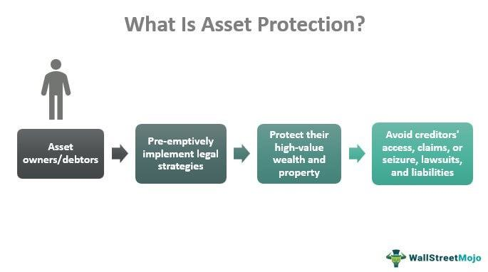

The modern financial landscape is marked by increasing complexity, driven by the interconnectedness of global markets, technological advancements, and evolving regulatory frameworks. One prominent challenge is the occurrence of bank failures. These failures underscore the importance of financial safety and effective asset protection strategies. When a bank becomes unable to meet its financial obligations to depositors and creditors, the resulting insolvency can have widespread implications, threatening the stability of entire financial systems. Regulatory bodies such as the Federal Deposit Insurance Corporation (FDIC) in the United States play a critical role in safeguarding deposits and maintaining public confidence in the banking system.

Simultaneously, the rise of algorithmic trading presents both opportunities and risks for financial markets. While algorithmic trading promises enhanced efficiency and faster execution of trades, it also introduces new risks. These include system failures and potential market manipulation, necessitating robust risk management frameworks to safeguard market integrity. The increasing reliance on computer algorithms powered by artificial intelligence has further amplified these risks, making it imperative for financial institutions to implement comprehensive control systems.

This article focuses on the key areas of financial safety measures, asset protection strategies, and best practices for managing the risks associated with algorithmic trading. By analyzing recent instances of bank failures, examining the role of regulatory bodies, and exploring the implications of advanced trading technologies, this article aims to provide a comprehensive overview of the challenges and solutions in navigating the modern financial landscape.

## Table of Contents

## Understanding Bank Failures

Bank failures occur when a bank is unable to meet its financial obligations to depositors and creditors, leading to insolvency and the potential collapse of the institution. Such a situation often arises from a combination of factors including poor management, inadequate capital reserves, excessive risk-taking, and economic downturns. When a bank fails, it disrupts not only its customers and stakeholders but also the broader financial system, posing risks to economic stability.

Regulatory bodies play a critical role in mitigating the impacts of bank failures. In the United States, the Federal Deposit Insurance Corporation (FDIC) provides deposit insurance, safeguarding depositor funds up to a certain limit, currently set at $250,000 per depositor, per insured bank. This insurance reassures depositors and helps prevent panic withdrawals that can exacerbate a bank's liquidity crisis. The FDIC also acts as a receiver or liquidator of failed banks, managing and eventually disposing of the bank's assets.

Similarly, the Securities Investor Protection Corporation (SIPC) offers limited protection to investors if a brokerage firm fails, ensuring that investors can recover certain assets held in their accounts. While SIPC coverage does not protect against market losses, it does play a crucial role in preserving investor confidence in the banking system by ensuring that the assets are returned to investors when brokers go bankrupt or encounter financial difficulties.

Analyzing recent bank failures provides valuable insights into the causative patterns and helps regulators and financial institutions enhance future safety mechanisms. For example, during the 2007-2008 financial crisis, several banks failed due to their exposure to subprime mortgage-backed securities and inadequate risk management practices. The lessons learned from these failures have led to more stringent regulatory requirements, such as the Dodd-Frank Wall Street Reform and Consumer Protection Act, which increased oversight and introduced stress testing for large banks to evaluate their ability to withstand economic shocks.

In conclusion, understanding and mitigating the risks associated with bank failures require a multifaceted approach involving robust regulatory frameworks, effective risk management strategies, and continuous monitoring of financial institutions' health. This ensures protection for depositors and creditors while maintaining the stability of the financial system. As financial landscapes evolve, these mechanisms must adapt to new challenges, ensuring resilience against future banking crises.

## Financial Safety and Asset Protection

Ensuring financial safety and asset protection is fundamental in the complex landscape of modern finance. Key strategies involve diversification, securing appropriate insurance, and understanding the protections afforded by organizations such as the Federal Deposit Insurance Corporation (FDIC) and the Securities Investor Protection Corporation (SIPC). These measures form the foundation of a robust financial safety strategy.

Diversification acts as a primary shield against financial risk by spreading investments across various asset classes, industries, and geographical locations. This reduces the impact of any single asset’s poor performance on the overall portfolio. Modern portfolio theory, introduced by Harry Markowitz in 1952, mathematically supports the benefits of diversification. The theory suggests constructing an 'efficient frontier'—a set of optimal portfolios offering the highest expected return for a defined level of risk.

Insurance is another crucial component, providing a safety net against unexpected financial losses. Different types of insurance, such as deposit insurance by the FDIC, protect depositors in member banks up to a limit of $250,000 per depositor, per insured bank, for each account ownership category. SIPC, on the other hand, protects investors in brokerage firms by covering against losses from the financial failure of a brokerage, although it does not protect against market losses.

Understanding the scope of these protections is vital. While the FDIC and SIPC offer significant protections, they have limitations. The FDIC does not insure securities, bonds, or mutual funds, nor does the SIPC cover losses arising from investment fraud or poor investment advice.

Asset protection strategies extend beyond diversification and insurance. Holding investments across different financial institutions can mitigate the risk of systemic failure within a single institution. Additionally, utilizing legal tools such as trusts, limited liability entities, and retirement accounts can provide tax advantages and protect assets from creditors.

Compliance with legal and regulatory frameworks further enhances asset protection. These frameworks provide guidelines to ensure the integrity and stability of financial operations. Awareness and adherence to regulations such as the Dodd-Frank Act or the Investment Company Act of 1940 can help in shielding assets from unforeseen legal challenges.

In conclusion, a comprehensive approach to financial safety and asset protection involves a multitude of strategies designed to mitigate risk and ensure stability. By leveraging diversification, insurance, institutional protections, and regulatory compliance, individuals and institutions can build a resilient financial foundation. Through these practices, they can navigate the uncertainties of the financial world more effectively.

## The Rise of Algorithmic Trading

Algorithmic trading, often referred to as algo-trading, utilizes computer algorithms to automate trading strategies. This method capitalizes on speed and efficiency, enabling traders to execute multiple transactions within milliseconds. The mechanism leverages pre-defined criteria related to timing, price, or a mathematical model, allowing executions that are impossible for human traders to achieve manually.

Recent advancements in [artificial intelligence](/wiki/ai-artificial-intelligence) (AI) have significantly bolstered the capabilities of [algorithmic trading](/wiki/algorithmic-trading) systems. Machine learning models, a subset of AI, enhance trade predictions by identifying patterns and trends in historical data, enabling dynamic strategy adjustments in real-time. For instance, [reinforcement learning](/wiki/reinforcement-learning), a type of [machine learning](/wiki/machine-learning), can adapt trading rules based on environmental feedback, optimizing strategies for specific market conditions.

Despite these advantages, algorithmic trading is fraught with risks. System failures present a significant concern, where technical glitches could disrupt market operations, leading to substantial financial losses. Additionally, the opacity in the functioning of these algorithms raises the potential for market manipulation. High-frequency trading ([HFT](/wiki/high-frequency-trading-strategies)), a subset of algorithmic trading, can amplify these risks by executing large volumes of trades in rapid succession, potentially destabilizing the market through practices like spoofing or front-running.

To mitigate these risks, the implementation of circuit breakers, which pause trading activities during extreme [volatility](/wiki/volatility-trading-strategies), can provide a buffer against automated sell-offs. Moreover, the codification of algorithms must include rigorous pre-trade and post-trade evaluations to ensure compliance with market regulations and ethical standards. These measures necessitate a collaborative approach among traders, technologists, and regulatory bodies to maintain the equilibrium and integrity of financial markets amidst the rising trend of algorithmic trading.

## Managing Risks in Algorithmic Trading

Effective risk management in algorithmic trading necessitates robust governance, rigorous oversight, and comprehensive control systems. Algorithmic trading, which relies on computer algorithms for automating trade execution, offers significant benefits in speed and efficiency but also introduces unique risks, including potential market manipulation and system failures.

Regulatory guidelines play a crucial role in ensuring ongoing monitoring and transparency within algorithmic trading operations. For instance, organizations are required to adopt best practices that emphasize continual oversight and strong governance frameworks. This includes the establishment of clear protocols to handle potential system malfunctions or aberrant trading behavior that might lead to financial instability.

To manage and mitigate these risks, algorithmic trading systems must implement several critical measures. Pre-trade checks are an essential component, serving as a first line of defense against erroneous trades. These checks validate the trades before execution, ensuring compliance with market regulations and internal risk parameters. For example, constraints related to maximum order size or price limits can be programmed into these systems to prevent erroneous trades that could affect market stability.

Kill switches represent another pivotal risk management tool. These are mechanisms designed to immediately halt trading operations in case of detecting unusual trading patterns or system anomalies. The instant cessation of trading allows time for human intervention to assess and address any underlying issues, mitigating potential market disruptions.

Regular validations of the algorithms themselves are vital to ensuring their ongoing effectiveness and accuracy. Ongoing testing of these trading algorithms under various market conditions—an approach supported by stress testing methodologies—helps in identifying vulnerabilities and ensuring that the algorithms behave as expected in both typical and atypical scenarios.

Overall, a comprehensive approach integrating these measures within a robust governance framework can significantly reduce the risks associated with algorithmic trading. By adhering to regulatory standards, conducting diligent oversight, and engaging in continuous validation and monitoring, organizations can enhance the resilience of their algorithmic trading operations while preserving market integrity.

## Best Practices for Financial Institutions

Institutions should prioritize the cultivation of a culture that emphasizes risk awareness and regulatory compliance. A key component of this culture is regular stress testing, a process that involves subjecting financial models to extreme conditions to assess their resilience. Stress testing helps institutions identify weak points in their financial systems and prepare for unforeseen market shocks. Scenario analysis complements this by allowing institutions to evaluate the impact of different hypothetical situations on their financial health. This process involves creating detailed narratives of potential economic conditions and evaluating how these scenarios might affect the institution's financial stability.

Contingency planning stands as another critical practice. It refers to the creation of predetermined action plans designed to address specific crises. This ensures that institutions can respond promptly and effectively during emergencies, maintaining operations and safeguarding assets.

Collaborating with regulatory bodies enhances the alignment of institutional strategies with prevailing financial safety regulations. Regular communication with these bodies helps institutions remain updated on regulatory changes and expectations, enabling them to adjust their strategies accordingly. This collaborative relationship is crucial, as non-compliance can lead to significant penalties and reputational damage. 

It is imperative for institutions to stay informed about the latest regulatory requirements and integrate them into their corporate strategies. Policies such as the Basel III framework exemplify the global regulations aimed at strengthening bank capital requirements and promoting overall financial stability. Adherence to such guidelines not only ensures compliance but also fortifies the institution's financial foundation. By fostering a comprehensive risk-aware culture and maintaining robust regulatory compliance, financial institutions can effectively navigate uncertainties and achieve long-term stability and growth.

## Conclusion

The evolving financial environment necessitates a proactive approach to managing bank failures, protecting assets, and governing algorithmic trading. Financial markets are undergoing rapid transformations, with new challenges and opportunities emerging. Consequently, financial institutions must take proactive measures to safeguard themselves against potential disruptions and vulnerabilities.

Financial safety, asset protection, and risk management must be interwoven into the fabric of institutional strategies. This integration ensures that institutions are not only prepared to handle existing threats but can also anticipate and mitigate unforeseen risks. A robust risk management framework that encompasses diversification, insurance, and legal compliance is essential to protect assets and minimize potential losses from events such as bank failures or volatile trading environments.

Algorithmic trading has brought about transformative changes in how transactions are executed, offering increased speed and efficiency. However, the intricacies of algorithmic processes and the potential for systemic risks require institutions to exercise diligence in their governance. Implementing strong oversight mechanisms, regulatory compliance checks, and contingency plans, such as pre-trade checks and kill switches, can help mitigate the risks associated with algorithmic trading.

By adopting comprehensive measures and staying informed, financial institutions can achieve resilience and stability in the face of uncertainties. Continuous education and training of personnel, coupled with collaborations with regulatory bodies, can help in aligning institutional strategies with the latest regulatory and market developments. In an ever-changing financial landscape, the ability of institutions to remain agile, informed, and prepared will be the cornerstone of their long-term success and sustainability.

## References & Further Reading

[1]: Federal Deposit Insurance Corporation (FDIC). ["Deposit Insurance."](https://www.fdic.gov/)

[2]: Dodd-Frank Wall Street Reform and Consumer Protection Act. ["Public Law 111–203."](https://www.congress.gov/111/plaws/publ203/PLAW-111publ203.pdf)

[3]: Markowitz, H. (1952). ["Portfolio Selection,"](https://onlinelibrary.wiley.com/doi/abs/10.1111/j.1540-6261.1952.tb01525.x) The Journal of Finance, 7(1), 77–91.

[4]: Securities Investor Protection Corporation (SIPC). ["An Overview of SIPC Protection."](https://www.sipc.org/)

[5]: CFA Institute. (2020). ["Algorithmic and High-Frequency Trading,"](https://rpc.cfainstitute.org/research/financial-analysts-journal/2021/0015198x-2020-1865694) Research Foundation Literature Reviews.

[6]: Lopez de Prado, M. (2018). ["Advances in Financial Machine Learning."](https://www.amazon.com/Advances-Financial-Machine-Learning-Marcos/dp/1119482089) Wiley.

[7]: European Central Bank. (2019). ["Algorithmic Trading: Impact on the EU Market Structure."](https://www.ecb.europa.eu/paym/groups/pdf/bmcg/191120/2019-11-20_-_BMCG_-_Item_3a_-_Algorithmic_trading_in_bond_markets_-_Citi.pdf) 

[8]: Chan, E. P. (2013). ["Algorithmic Trading: Winning Strategies and Their Rationale."](https://github.com/ftvision/quant_trading_echan_book) Wiley.

[9]: "Modern Portfolio Theory and Investment Analysis" by Edwin J. Elton, Martin J. Gruber, Stephen J. Brown, and William N. Goetzmann.