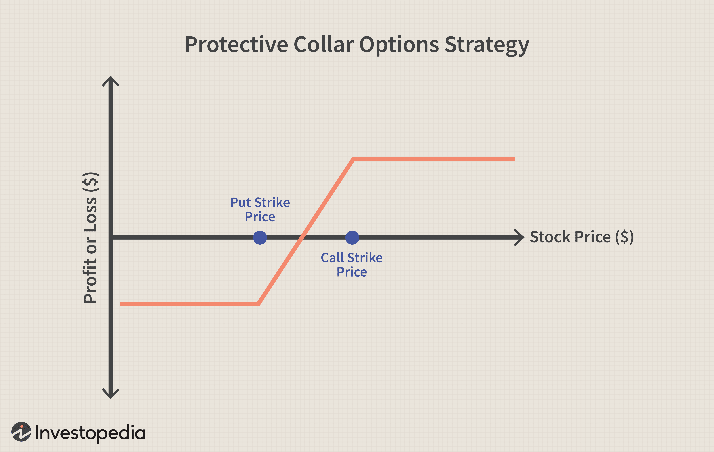

The stock market provides a wide array of strategies designed to help investors mitigate risk and optimize their returns. Among these strategies, the protective collar stands out for its ability to safeguard investment positions, particularly in volatile markets. In recent years, this strategy has gained traction with the increasing integration of algorithmic trading methods. These methods involve sophisticated computer algorithms that automate trading decisions and enhance the precision and efficiency of executing such strategies.

The protective collar strategy involves a combination of options trading techniques aimed at providing downside protection while allowing for limited upside potential. This article will cover the foundational aspects of the protective collar, its implementation in stock market investments, and how algorithmic trading can be leveraged to maximize the strategy’s effectiveness. By understanding these components, investors can gain a crucial tool for managing risk in their portfolios.



Beyond merely outlining its mechanics, we will also assess the advantages and potential disadvantages of utilizing a protective collar. This dual focus will help investors appreciate the strategy's role in achieving stability amid fluctuating market conditions and inform them of any limitations that might impact their overall investment goals.

## Table of Contents

## What is a Protective Collar?

A protective collar is a strategic options trading maneuver that provides investors shelter from significant declines in the price of an underlying asset while preserving the potential for capped gains. This tactic involves three main components: holding shares of an underlying stock, purchasing a put option, and selling a call option.

At the core of a protective collar is the ownership of a stock, which establishes the base investment. To guard against a decrease in the stock’s price, the investor buys a put option. This put option gives the holder the right, but not the obligation, to sell the underlying stock at a predetermined price (the strike price) before a specified expiration date. This mechanism ensures that the investor can offload their shares at the strike price, regardless of how much the market price might have fallen, thus providing downside protection.

Conversely, the call option is sold to help finance the cost of purchasing the put option. By selling a call option, the investor grants another party the right to buy the stock from them at a predetermined price within a specific timeframe. This action generates premium income, which offsets the put option's cost. However, this setup caps the potential gains, as the stock may need to be sold if the market price exceeds the call option's strike price.

The protective collar strategy is particularly advantageous in volatile markets where fluctuation risks are high. It suits medium to long-term investors who aim to maintain their stock holdings with an added hedge against market downturns. This approach provides investors with confidence, especially when navigating through uncertain financial landscapes. The interplay of put and call options within the protective collar framework allows investors to pursue their equity exposure with reduced risk, albeit with limited upside potential due to the cost of downside protection.

## The Mechanics of Implementing a Protective Collar

To set up a protective collar, the investor must first either hold or purchase the underlying stock, which forms the base of the strategy. The next step involves buying a put option that is "out-of-the-money" (OTM), meaning the strike price of the put option is below the current market price of the underlying stock. This put option provides a safety net against significant price drops, as it gives the holder the right to sell the stock at the specific strike price, effectively setting a floor for potential losses.

Concurrently, the investor sells an out-of-the-money call option. This call option has a strike price above the current market value of the stock, capping the potential upside. The premium received from selling the call option helps to offset the cost of purchasing the put option, making the strategy more cost-effective.

Selecting the appropriate strike prices for both the put and call options is essential. These strike prices should reflect the investor's risk tolerance and expectations of market behavior. For instance, a conservative investor might choose a put option with a strike price closer to the current stock price to minimize potential losses, while selecting a call option with a strike price not too far above the current price, striking a balance between protection and cost.

Additionally, certain practical considerations are vital when implementing a protective collar. The expiration dates of the options must align with the investor's time horizon for holding the stock. Shorter expiration dates might require more frequent adjustments to maintain the protective collar, potentially increasing transaction costs. Furthermore, the premiums for the options should be considered, as they impact the net cost or credit of establishing the collar.

Overall, the protective collar is a strategic approach that requires careful planning and consideration of various factors to optimize protection and financial efficiency.

## Algorithmic Trading and Protective Collars

Algorithmic trading, often abbreviated as algo trading, employs computer algorithms to automate trading decisions and execution, adhering to predefined criteria. This method is particularly advantageous in options strategies such as the protective collar. In the context of protective collars, algorithms provide a mechanism for efficiently selecting appropriate options while continuously monitoring market conditions.

The essence of a protective collar strategy lies in balancing downside protection with limited upside potential through a combination of holding the underlying stock, buying a put option, and selling a call option. Algorithms, with their capacity for rapid data processing and decision-making, enhance the precision of implementing this strategy. They can identify optimal strike prices and expiration dates, integral to matching an investor's risk tolerance and market outlook.

The timing of setting up a protective collar is critical, as market dynamics influence stock and options prices. Algorithms optimized for these tasks can dynamically adjust the position based on real-time market movements. This adaptability ensures that the protective collar remains aligned with the investor's objectives throughout its duration. For instance, if market conditions suggest increased [volatility](/wiki/volatility-trading-strategies), algorithms may adjust the strikes or roll the options to maintain the protective nature of the strategy.

By employing algorithms, investors can systematically manage the complexities of the protective collar, minimizing human error and capitalizing on market inefficiencies. The rise of [artificial intelligence](/wiki/ai-artificial-intelligence) and [machine learning](/wiki/machine-learning) further enhances these capabilities, allowing the development of more sophisticated algorithms. Machine learning models can predict market trends and volatility with greater accuracy, improving decision-making processes.

Below is a simple Python code snippet illustrating how an algorithm might monitor a stock's price and adjust a protective collar accordingly:

```python
import numpy as np

# Simulated stock and options prices
stock_price = np.random.normal(100, 2, 100)
put_strike = 95
call_strike = 105

def check_positions(stock_price):
    # Define the range for adjustments
    if stock_price < put_strike:
        return "Adjust Put Option"
    elif stock_price > call_strike:
        return "Adjust Call Option"
    else:
        return "Hold Positions"

# Monitor stock price and adjust collar
for price in stock_price:
    decision = check_positions(price)
    print(f"Stock Price: {price:.2f}, Decision: {decision}")
```

In the example above, the code simulates stock prices and employs a simple decision rule for adjusting the protective collar. If the stock price falls below the put strike price, the algorithm suggests adjusting the put option; if it rises above the call strike, the focus shifts to the call option.

Overall, [algorithmic trading](/wiki/algorithmic-trading) provides a modern edge to protective collars, facilitating a systematic approach to managing risks and capitalizing on market opportunities. This integration of technology ensures that investors can efficiently implement protective collars, aligning with their strategic goals amidst market volatility.

## Benefits and Drawbacks of Using a Protective Collar

One of the primary advantages of employing a protective collar strategy is its capability to shield investors from significant losses while still allowing some participation in market gains. By holding the underlying stock, purchasing a put option to guard against price drops, and selling a call option, investors can create a balanced framework that mitigates risk. 

The selling of a call option provides a financial benefit since the premium received can help offset the cost of purchasing the put option. Consequently, the protective collar offers a cost-effective hedging mechanism, safeguarding the portfolio against adverse movements without requiring substantial capital investment. 

However, the use of protective collars constrains the potential upside. The call option sold obligates the investor to part with the stock at the strike price if the market price exceeds this threshold. This means that if the asset appreciates significantly, the investor's gains are capped, missing out on potential profits beyond the call's strike price.

Investors must also consider external factors such as transaction costs and tax implications, which can affect the overall performance of the protective collar strategy. For instance, frequent adjustments to options positions will incur transaction fees, potentially eroding profits. Tax considerations might include the timing of gains and losses recognition, impacting net returns.

Furthermore, the protective collar may lead to missed opportunities. During bull markets or periods of unexpected rallies, the strategy's defined limits on gains might prevent investors from capitalizing on large market upswings. This is particularly relevant for investors aiming for high growth, as the collar's conservative nature may not align with such goals.

Despite these limitations, the protective collar remains a valuable approach for risk-averse investors seeking stability amid market volatility. Its ability to curtail losses, combined with the structured approach to risk management, makes it a viable choice for those prioritizing capital preservation and moderate growth.

## Conclusion

The protective collar strategy provides investors a carefully structured approach to risk management while maintaining exposure to the stock market. By combining the purchase of a put option with the sale of a call option on the same underlying asset, this strategy effectively brackets potential equity movements, thereby limiting losses and financing the protective measures through the premium received from the call option.

The integration of algorithmic trading enhances the protective collar's execution and efficiency. Algorithms can systematically monitor and react to market conditions, optimizing the timing and selection of option strikes. This automation reduces human error and increases precision, offering a technological advantage that aligns with modern trading practices. For instance, algorithms can be programmed to adjust positions dynamically in response to volatility changes, ensuring that the protective collar remains aligned with current market scenarios.

Investors equipped with an understanding of both protective collars and algo trading can more effectively manage market volatility. They can navigate through the complexities of setting optimal strike prices and expiry dates, leveraging technology to maintain a balanced risk-reward profile.

However, as with any investment strategy, it is crucial to weigh its benefits against potential drawbacks, such as capped gains and transaction costs. Each investor's unique risk tolerance and financial objectives should dictate the suitability of employing such a strategy. Through cautious and informed application, the protective collar, enhanced by algorithmic trading, offers a compelling option for prudent portfolio management, especially during periods of market uncertainty.

## References & Further Reading

[1]: Bergstra, J., Bardenet, R., Bengio, Y., & Kégl, B. (2011). ["Algorithms for Hyper-Parameter Optimization."](https://dl.acm.org/doi/10.5555/2986459.2986743) Advances in Neural Information Processing Systems 24.

[2]: ["Options as a Strategic Investment"](https://www.amazon.com/Options-Strategic-Investment-Lawrence-McMillan/dp/0735201978) by Lawrence G. McMillan

[3]: ["Advances in Financial Machine Learning"](https://www.amazon.com/Advances-Financial-Machine-Learning-Marcos/dp/1119482089) by Marcos Lopez de Prado

[4]: ["Option Volatility and Pricing: Advanced Trading Strategies and Techniques"](https://www.amazon.com/Option-Volatility-Pricing-Strategies-Techniques/dp/0071818774) by Sheldon Natenberg

[5]: ["Machine Learning for Algorithmic Trading"](https://github.com/PacktPublishing/Machine-Learning-for-Algorithmic-Trading-Second-Edition) by Stefan Jansen

[6]: ["Option Trading: Pricing and Volatility Strategies and Techniques"](https://www.amazon.com/Option-Trading-Volatility-Strategies-Techniques-ebook/dp/B003YJF07W) by Euan Sinclair