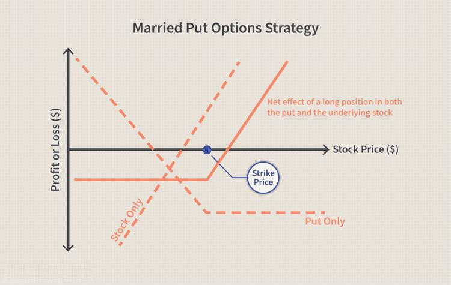

Protective put options are a fundamental financial instrument designed to serve as a risk management tool within trading strategies. Essentially, a protective put is an option strategy where an investor holds a long position in a stock and simultaneously buys a put option for the same stock. This approach provides a safety net, allowing the investor to safeguard against potential losses in the stock's value, while still retaining the ability to benefit from any upward movement in the stock price. Protective put options provide the benefit of limiting downside risk, thus offering a form of portfolio insurance.

In recent years, there has been a significant surge in the adoption of algorithmic trading, which uses computer algorithms to execute trades based on predetermined criteria. As traders increasingly rely on automation to enhance efficiency and minimize human error, protective puts are being seamlessly integrated into algorithmic investment strategies. Algorithms can automatically detect market volatility or predefined risk thresholds, dynamically implementing protective put strategies as part of a comprehensive risk management framework.



For investors, protective puts are particularly relevant as they offer a dual advantage: the ability to hedge against adverse market movements while allowing for the potential upside. This characteristic is crucial for investors seeking to manage risk without capping potential gains. By using protective puts, investors can establish a floor for their portfolio value—not completely eliminating risk, but significantly mitigating it while maintaining exposure to market rallies.

The strategic use of protective puts is becoming more pertinent in today's unpredictable markets, where volatility can present both challenges and opportunities. As the financial landscape continues to evolve, integrating such options into broader trading strategies becomes essential for traders and investors aiming to adeptly navigate market complexities.

## Table of Contents

## Understanding Protective Put Options

A protective put option is a financial derivative used by investors to hedge against potential losses in an asset they own. It involves buying a put option for an underlying asset in which the investor already holds a long position. By purchasing a put option, the investor secures the right, but not the obligation, to sell the underlying asset at a specified price, known as the strike price, before or on a predetermined expiration date.

### Key Components of Protective Put Options

1. **Underlying Asset**: The underlying asset in a protective put strategy is the financial instrument that the investor owns. This can be stocks, indices, or other asset classes. The protective put is set against this asset to prevent losses from potential declines in its market value.

2. **Strike Price**: The strike price is the predetermined price at which the investor can sell the underlying asset if they choose to exercise the put option. This price is crucial as it determines the level of protection. Generally, if the market price of the underlying asset falls below the strike price, the investor can exercise the option to sell at the higher strike price, thus limiting their loss.

3. **Expiration Date**: The expiration date is the deadline by which the investor must decide whether to exercise the put option. After this date, the option becomes invalid. The choice of expiration date can impact the cost of the option and the duration of protection.

4. **Premium**: The premium is the cost of purchasing the put option. It is a non-refundable fee paid upfront by the investor for the right to sell the underlying asset at the strike price. The premium is influenced by factors like the volatility of the underlying asset, the time remaining until expiration, and the difference between the current market price and the strike price.

### Benefits of Using Protective Puts as Portfolio Insurance

Protective puts serve as an effective form of portfolio insurance by providing several benefits:

- **Downside Protection**: The primary advantage of a protective put is its ability to limit potential losses in the underlying asset. If the asset's market price declines significantly, the protective put allows the investor to sell it at the strike price, effectively capping losses.

- **Retention of Upside Potential**: Unlike other hedging strategies that might cap potential gains, protective puts allow investors to retain the upside potential of their positions. If the asset's market price rises, the investor can benefit from the increase, while the put option provides security against downward movements.

- **Flexibility**: Protective puts offer flexibility in terms of choosing the level of protection (strike price) and time frame (expiration date) that best align with the investor's risk tolerance and market outlook.

By incorporating protective puts into their portfolios, investors can strategically mitigate risks while maintaining the opportunity to benefit from favorable market conditions. This strategy is particularly appealing for those seeking to preserve capital during volatile market periods without foregoing potential returns.

## The Role of Protective Puts in Investing Strategies

Protective put options are commonly employed by investors aiming to hedge their portfolios against potential downturns while maintaining exposure to upside potential. These financial instruments are particularly useful during periods of market [volatility](/wiki/volatility-trading-strategies) or around earnings announcements, when uncertainties and potential price swings are heightened.

In volatile markets, investors seek to manage risk without having to liquidate their holdings. Protective puts allow them to do this by providing a safety net if the market moves unfavorably. When an investor holds a stock and simultaneously buys a put option on the same stock, they effectively cap their downside risk at the strike price of the put, minus the cost of the premium. This ensures that the investor can limit potential losses if the stock's price falls sharply, while still reaping the benefits of gains if the stock price increases. For example, if an investor holds shares of a company trading at $100 and purchases a put option with a strike price of $90 for a premium of $5, the maximum loss is capped at $15 per share ($100 - $90 + $5).

During earnings announcements, stocks can experience significant price movements, either upwards or downwards, given the market's response to the earnings report. Protective puts are particularly useful in these scenarios, as they allow investors to protect against the risk of a disappointing earnings result that might lead to a temporary or prolonged decrease in stock price. By using protective puts, investors can remain invested in the stock to capitalize on any positive news that might drive the stock price higher.

Comparatively, protective puts offer several advantages over other hedging strategies. Unlike stop-loss orders, which might sell a stock automatically impacting actual ownership and portfolio structure, protective puts maintain the original position in the asset. Furthermore, unlike other hedging techniques such as covered calls, which may limit upside potential by obligating the sale of the underlying asset at a certain price, protective puts offer unlimited upside potential. This capacity to both cap downside risks and allow for unlimited upside makes protective puts a flexible and versatile risk management tool.

However, protective puts do possess certain drawbacks. The primary cost associated with protective puts is the premium paid for the option contract. These costs can increase based on factors like market conditions and volatility, affecting potential net returns. Despite these costs, the strategic value of having a predefined risk limit and the ability to weather adverse market conditions makes protective puts an attractive component of diversified investment strategies. This flexibility can be integrated effectively with [algorithmic trading](/wiki/algorithmic-trading) systems to extend risk management capabilities, further enhancing their utility in modern financial markets.

## Algorithmic Trading and Protective Puts

Algorithmic trading, also known as algo trading, employs computer programs to execute trades based on pre-set rules and algorithms. This method of trading has transformed financial markets by enhancing trade efficiency, reducing transaction costs, and enabling the handling of large volumes of trades with minimal human intervention. Algorithms can analyze market data at speeds and volumes impossible for human traders, making decisions in fractions of a second.

Integrating protective puts into algorithmic trading systems offers a sophisticated way to automate risk management. A protective put involves holding a long position in a stock while simultaneously buying a put option for the same asset. This strategy protects against downside risk while leaving room for upside potential. By coding these strategies into trading algorithms, investors can automatically execute hedging strategies in response to market conditions without manual input.

To construct such algorithms, traders utilize various technological tools and programming languages. Python, known for its simplicity and robust libraries, is widely used for developing algorithmic trading strategies. Libraries such as pandas and NumPy handle data manipulation and mathematical computations, while libraries like QuantLib and Backtrader facilitate the development of financial models and [backtesting](/wiki/backtesting) strategies.

A basic structure of a Python algorithm incorporating protective puts might look like this:

```python
import pandas as pd
import numpy as np

class ProtectivePutStrategy:
    def __init__(self, stock_data, put_option_data, strike_price, expiration_date):
        self.stock_data = stock_data
        self.put_option_data = put_option_data
        self.strike_price = strike_price
        self.expiration_date = expiration_date

    def execute_strategy(self):
        # Buying the stock
        stock_price = self.stock_data['Close'].iloc[-1]

        # Buying the put option
        put_premium = self.put_option_data['Premium'].iloc[-1]

        # Calculate the potential payoff

        payoff_protective_put = max(self.strike_price - stock_price, 0) - put_premium

        return {
            'Stock Price': stock_price,
            'Put Premium': put_premium,
            'Payoff': payoff_protective_put
        }

# Sample usage with hypothetical data
stock_data = pd.DataFrame({'Close': [100, 105, 102]})
put_option_data = pd.DataFrame({'Premium': [5, 6, 4]})

strategy = ProtectivePutStrategy(stock_data, put_option_data, strike_price=100, expiration_date='2023-12-31')
result = strategy.execute_strategy()
print(result)
```

Technological advancements have made it easier to implement such strategies. Trading platforms now offer APIs that provide real-time data, execution capabilities, and backtesting environments, allowing traders to test the efficacy of their strategies across historical data before applying them in live markets. Cloud computing also plays a role, providing scalable resources necessary for running complex algorithms that demand significant computational power.

The integration of protective puts into algorithmic systems underscores the growing importance of technology in financial risk management. By automating these processes, traders can effectively hedge portfolios against market downturns while maintaining the potential for gains, all with a systematic, low-touch approach.

## Real-World Example of Protective Puts

A protective put serves as an effective hedging tool for an investment portfolio by allowing investors to mitigate potential losses while retaining the opportunity for upside gains. To illustrate this, consider an investor who holds 100 shares of Company XYZ, currently trading at $50 per share. The investor is concerned about potential downside risk over the next three months but wishes to remain invested in the stock.

To hedge this risk, the investor can purchase a protective put option. Suppose the investor buys an at-the-money put option with a strike price of $50, expiring in three months, with a premium cost of $3 per share. Here's how the outcomes vary based on different market scenarios:

1. **Market Price at Expiration is Above $50**:  
    - If the stock price increases to $60 per share, the put option will expire worthless, as it is not profitable to sell at the lower $50 strike price. 
    - **Cost of Protective Put**: $3 * 100 shares = $300
    - **Profit from Stock**: ($60 - $50) * 100 shares = $1,000
    - **Net Profit**: $1,000 - $300 = $700

2. **Market Price at Expiration is Exactly $50**:  
    - If the stock price remains at $50, the put option also expires worthless. The situation yields no gain or loss from price movement.
    - **Cost of Protective Put**: $300
    - **Net Loss**: -$300 (the premium paid for the put option)

3. **Market Price at Expiration Falls Below $50**:  
    - If the stock price decreases to $40 per share, the protective put exercise allows selling the stock at the $50 strike price, shielding against a further decline.
    - **Cost of Protective Put**: $300
    - **Profit from Exercising Put**: ($50 - $40) * 100 shares = $1,000
    - **Net Gain/Loss**: $1,000 - $300 = $700 gain 

**Calculations Overview**: 
The protective put ensures that the maximum loss, excluding the premium paid, is the difference between the purchase price of the stock and the strike price. Thus, the investor caps the potential downside risk while maintaining the stock's upside potential.

```python
# Simplified Python Code for the Scenario

def protective_put_scenario(stock_price, strike_price, premium, num_shares):
    # Gain/loss if stock price is above or at strike price
    if stock_price >= strike_price:
        return (stock_price - strike_price) * num_shares - premium * num_shares
    # Gain/loss if stock price falls below strike price
    else:
        return (strike_price - stock_price) * num_shares - premium * num_shares

# Define conditions
stock_prices = [60, 50, 40]
premium = 3
strike_price = 50
num_shares = 100

# Calculate results
results = {price: protective_put_scenario(price, strike_price, premium, num_shares) for price in stock_prices}

results
```

This example demonstrates the protective put as an insurance mechanism, providing peace of mind to investors by limiting potential portfolio losses. It highlights the importance of understanding premiums and strike prices to maximize the strategy's effectiveness across different market conditions.

## Risks and Limitations of Protective Puts

Protective puts are a critical tool for risk management in investment portfolios, offering a way to hedge against potential losses. However, they come with inherent risks and limitations that investors must consider.

**Premium Costs and Timing Risks**

One of the primary drawbacks of using protective puts is the cost associated with purchasing the put options, known as the premium. This cost can be significant, particularly for volatile assets, where the risk of price movement is higher, leading to increased premium prices. Paying a high premium can reduce the overall return on investment, especially if the protective put is not utilized to protect against a downtrend.

Timing also poses a risk when using protective puts. The effectiveness of a protective put is dependent on choosing the correct expiration date. An option can expire worthless if the asset does not decline in value within the timeline of the put, causing the investor to lose the premium paid. Timing the market accurately to align the put's expiration with potential market downturns is challenging, and poor timing can result in unnecessary costs without providing the expected protective benefits.

**Alignment with Investment Goals and Market Conditions**

Investors must understand current and forecasted market conditions to ensure protective puts align with their investment objectives. Using protective puts during periods of low volatility may result in added costs without substantial benefits, as the likelihood of needing to execute the protective option is reduced. Thus, it is crucial for investors to have a clear understanding of their risk tolerance and investment horizon to utilize protective puts effectively.

For protective puts to be beneficial, they should support the broader portfolio strategy, ensuring that hedging does not contradict the investor's core investment philosophy. For example, a long-term investor focusing on gradual growth may not require frequent protective puts, while a short-term trader more concerned with sharp downturns might find them essential.

**Need for Ongoing Management and Expertise**

Implementing protective puts requires ongoing management and careful monitoring of both the market and the individual portfolio. Investors need to adjust the strike prices, expiration dates, and underlying assets of the puts as market conditions shift. This dynamic approach calls for expertise in options trading and a solid understanding of market trends.

Moreover, continuous evaluation and adjustments to the protective put strategy can help mitigate risks but also demand resources and time from investors or their financial advisors. Failing to effectively manage these options can lead to ineffective hedging, eroding potential gains while incurring unnecessary costs.

In conclusion, while protective puts offer significant benefits as a hedging strategy, they also involve substantial costs and risks. Investors must weigh these against their specific needs and market conditions, requiring careful planning, precise timing, and thorough understanding to effectively integrate protective puts into their overall risk management strategy.

## Conclusion

Protective put options play a critical role in risk management by providing a safety net for investors seeking to protect their portfolios against significant losses while still allowing for unlimited gains. This strategy, akin to purchasing insurance, involves buying a put option for an underlying asset already owned. If the market value of the asset falls below the strike price, the put option enables the investor to sell the asset at the predetermined price, thus capping potential losses.

Investors often employ protective puts as part of a diversified trading strategy, particularly in volatile markets or during uncertain economic periods. This approach serves as a hedge against downturns, offering a balance between risk and reward. In the context of algorithmic trading, protective puts can be seamlessly integrated into automated systems to execute predefined rules for risk mitigation, enhancing the robustness of trading algorithms.

As financial markets constantly evolve, the relevance of protective puts in algorithmic strategies underscores the necessity for continuous learning and adaptation. Traders and investors must remain vigilant and informed about technological advancements, market trends, and emerging risks to optimize their strategies effectively. Implementing protective puts as an adaptable risk management tool can significantly contribute to achieving long-term investment goals while navigating the complexities of modern financial markets.

## References & Further Reading

[1]: Black, F., & Scholes, M. (1973). ["The Pricing of Options and Corporate Liabilities."](https://www.cs.princeton.edu/courses/archive/fall09/cos323/papers/black_scholes73.pdf) Journal of Political Economy, 81(3), 637-654.

[2]: Hull, J. C. (2017). ["Options, Futures, and Other Derivatives"](https://www.semanticscholar.org/paper/Options%2C-Futures%2C-and-Other-Derivatives-Hull/89bdee500c8623864fc9eb7a471546aa713acc44) (9th ed.). Pearson.

[3]: ["Option Volatility and Pricing: Advanced Trading Strategies and Techniques"](https://www.amazon.com/Option-Volatility-Pricing-Strategies-Techniques/dp/0071818774) by Sheldon Natenberg

[4]: De Prado, M. L. (2018). ["Advances in Financial Machine Learning"](https://www.amazon.com/Advances-Financial-Machine-Learning-Marcos/dp/1119482089). Wiley.

[5]: Chan, E. (2009). ["Quantitative Trading: How to Build Your Own Algorithmic Trading Business"](https://github.com/ftvision/quant_trading_echan_book). Wiley.

[6]: Jansen, S. (2020). ["Machine Learning for Algorithmic Trading: Predictive models to extract signals from market and alternative data for systematic trading strategies with Python"](https://www.amazon.com/Machine-Learning-Algorithmic-Trading-alternative/dp/1839217715) (2nd ed.). Packt Publishing.