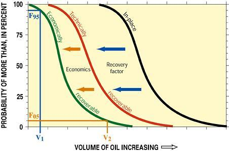

## Table of Contents

## What are proved reserves?

Proved reserves are the amounts of oil, gas, or other minerals that are known to exist and can be taken out of the ground using today's technology and at current prices. They are like a promise that these resources are there and can be used. Companies and countries count these reserves carefully because they help them plan for the future and show investors how much they can produce.

These reserves are important because they give a clear idea of how much energy or minerals a company or country can rely on. To be counted as proved, the reserves need to be checked and confirmed by engineers and geologists. This makes sure that the numbers are as accurate as possible. Knowing the amount of proved reserves helps in making smart decisions about how to use and sell these resources.

## How are proved reserves different from unproved reserves?

Proved reserves are resources like oil or gas that we know for sure are in the ground and we can get them out with the technology we have now and at today's prices. They are like a sure thing because experts have checked and confirmed them. This makes them very important for planning and showing investors how much a company can produce.

Unproved reserves, on the other hand, are resources that we think might be there but we're not completely sure. They are split into two groups: probable and possible reserves. Probable reserves have a good chance of being there, but we need more information to be certain. Possible reserves are even less sure, and we might need new technology or higher prices to get them out. Because they are less certain, companies can't count on them as much for planning and making decisions.

## What criteria must be met for a reserve to be classified as 'proved'?

For a reserve to be called 'proved', experts need to be very sure that the oil or gas is actually there and that we can get it out using the technology we have now and at today's prices. They use a lot of data from drilling, tests, and studies of the area to make sure. It's like having a map that shows exactly where the treasure is and how to dig it up.

Engineers and geologists check everything carefully. They need to be able to say with confidence that at least 90% of the reserve will be there when they start drilling. This makes proved reserves very reliable, which is important for companies to plan their future and show investors what they can count on.

## Who determines the classification of proved reserves?

The classification of proved reserves is done by engineers and geologists who work for oil and gas companies. They use a lot of information from drilling, tests, and studies of the area to make sure the reserves are real and can be taken out of the ground with the technology we have now and at today's prices.

These experts have to be very sure about the reserves. They need to be able to say with confidence that at least 90% of the reserve will be there when they start drilling. This makes proved reserves very reliable, which is important for companies to plan their future and show investors what they can count on.

## How are proved reserves estimated?

Proved reserves are estimated by engineers and geologists who work for oil and gas companies. They use a lot of information to make sure the reserves are real and can be taken out of the ground with the technology we have now and at today's prices. This information comes from drilling, tests, and studies of the area. They look at the rock layers, how much oil or gas is in them, and how easy it is to get it out.

These experts need to be very sure about the reserves. They use all this data to make a careful guess about how much oil or gas is there. They need to be able to say with confidence that at least 90% of the reserve will be there when they start drilling. This makes proved reserves very reliable, which is important for companies to plan their future and show investors what they can count on.

## What role do proved reserves play in the energy industry?

Proved reserves are very important in the energy industry because they show how much oil or gas a company or country can use. They are like a promise that these resources are there and can be taken out of the ground using today's technology and at current prices. Companies and countries count these reserves carefully because they help them plan for the future. They also help show investors how much a company can produce, which is important for getting money to keep working.

Knowing the amount of proved reserves helps companies make smart decisions about how to use and sell these resources. It's like having a map that shows exactly where the treasure is and how to dig it up. This information is used to decide how much to produce, when to sell, and how to invest in new projects. It's a big part of making sure the energy industry keeps running smoothly and can meet the world's needs.

## How do changes in technology affect the estimation of proved reserves?

Changes in technology can make a big difference in how much oil or gas we think is in the ground. When new technology comes out, it can help us find and take out resources that we couldn't reach before. For example, better drilling methods or new ways to see underground can show us that there's more oil or gas than we thought. This means that the amount of proved reserves can go up because we can now use these new tools to get to the resources.

But it's not just about finding more. Sometimes, new technology can change how much it costs to get the oil or gas out. If new tech makes it cheaper, then resources that were too expensive to count as proved reserves before might now be counted. This can make the total amount of proved reserves go up, too. So, technology can help us see more resources and make them easier and cheaper to get, which changes how we estimate proved reserves.

## Can you explain the impact of economic factors on proved reserves?

Economic factors like the price of oil or gas can change how much of it we count as proved reserves. If the price goes up, it can make it worth it to get oil or gas out of the ground that was too expensive before. This means more of it can be counted as proved reserves because it's now profitable to take it out. On the other hand, if the price goes down, some oil or gas might not be worth getting anymore, so it might not be counted as proved reserves.

This is important because companies need to know how much they can rely on to plan their future. When prices change, companies have to look at their reserves again and see if they can still count them as proved. It's like having a piggy bank where the value of what's inside changes depending on how much each coin is worth. This can affect how much a company produces and how they plan their business.

## What are the reporting standards for proved reserves?

When companies report how much oil or gas they have in the ground, they have to follow certain rules to make sure everyone understands the numbers the same way. These rules are called reporting standards. In many places, the rules come from groups like the Securities and Exchange Commission (SEC) in the United States or the Society of Petroleum Engineers (SPE). These standards say that companies need to use the best information they have to guess how much oil or gas is there. They also need to be very sure about their guesses, usually saying that at least 90% of the oil or gas will be there when they start drilling.

The standards also say that companies need to tell everyone about any changes that could affect their numbers. For example, if the price of oil goes up or down a lot, or if new technology comes out that makes it easier to get the oil or gas out, they need to update their numbers. This helps investors and others know exactly what to expect. By following these rules, companies make sure their reports are honest and useful for planning and making decisions about the future.

## How do international standards for classifying proved reserves compare?

Different countries and organizations have their own rules for classifying proved reserves, but many of them follow similar ideas. In the United States, the Securities and Exchange Commission (SEC) sets rules that say companies need to be very sure about their oil or gas reserves, usually at least 90% sure. The Society of Petroleum Engineers (SPE) also has rules that are used around the world. These rules say that proved reserves are the oil or gas that we know is there and can be taken out using today's technology and at today's prices.

Even though the rules might be a bit different in different places, the main idea is the same everywhere: proved reserves are the resources we're very sure about. For example, in Canada, the rules from the Canadian Securities Administrators (CSA) are similar to the SEC's rules in the U.S. In Europe, the Petroleum Resources Management System (PRMS) by the SPE is often used. All these standards help make sure that when companies report their reserves, everyone understands what they mean and can trust the numbers.

## What are the environmental implications of exploiting proved reserves?

When we use proved reserves, it can have a big impact on the environment. Taking oil or gas out of the ground can harm the land and water around where we drill. It can cause pollution and damage to nature. Also, when we burn oil or gas for energy, it puts a lot of carbon dioxide into the air. This gas traps heat and makes the Earth warmer, which is called global warming. This can lead to big changes in the weather and harm plants and animals.

To make things better, companies and countries are trying to find ways to use less oil and gas and to make them cleaner. They are using new technology to take oil and gas out of the ground without causing as much harm. They are also trying to capture the carbon dioxide that comes from burning these fuels so it doesn't go into the air. But even with these efforts, using proved reserves still affects the environment, so it's important to keep working on better solutions.

## How might future trends influence the concept and management of proved reserves?

Future trends like new technology and changes in how we use energy could change how we think about and manage proved reserves. As we get better at finding and taking out oil and gas, we might find more of it than we thought was there. This could mean more proved reserves. But at the same time, if we start using less oil and gas because we're switching to other kinds of energy like wind or solar, the amount of proved reserves might not matter as much. Companies will need to keep up with these changes and maybe focus more on finding and using cleaner energy sources.

Also, rules about the environment might get stricter in the future. This could make it harder to take oil and gas out of the ground if it harms nature too much. Companies might have to find new ways to do their work without causing as much damage. They might also need to report more about how their work affects the environment. All these changes will make managing proved reserves more complicated, but it's important for keeping our planet healthy while still meeting our energy needs.

## References & Further Reading

[1]: ["Modern Petroleum Technology, Volume 2: Downstream"](https://www.wiley.com/en-us/Modern+Petroleum+Technology%2C+Volume+2%2C+Downstream%2C+6th+Edition-p-9780470850220) edited by The Institute of Petroleum

[2]: Hull, J. C. (2018). ["Options, Futures, and Other Derivatives"](https://www.semanticscholar.org/paper/Options%2C-Futures%2C-and-Other-Derivatives-Hull/89bdee500c8623864fc9eb7a471546aa713acc44) (10th Edition). Pearson.

[3]: Hasbrouck, J. (2007). ["Empirical Market Microstructure: The Institutions, Economics, and Econometrics of Securities Trading"](https://archive.org/details/empiricalmarketm0000hasb) Oxford University Press.

[4]: Geman, H. (2005). ["Commodities and Commodity Derivatives: Modelling and Pricing for Agriculturals, Metals and Energy"](https://download.e-bookshelf.de/download/0000/5675/90/L-G-0000567590-0015270354.pdf) Wiley Finance.

[5]: ["The Handbook of Commodity Investing"](https://www.amazon.com/Handbook-Commodity-Investing-Frank-Fabozzi/dp/0470117648) by Frank J. Fabozzi, Roland Fuss, and Dieter G. Kaiser

[6]: Aldridge, I. (2013). ["High-Frequency Trading: A Practical Guide to Algorithmic Strategies and Trading Systems"](https://books.google.com/books/about/High_Frequency_Trading.html?id=6l0DDQAAQBAJ) Wiley.

[7]: Yergin, D. (2011). ["The Quest: Energy, Security, and the Remaking of the Modern World"](https://archive.org/details/questenergysecur0000yerg) Penguin Books.