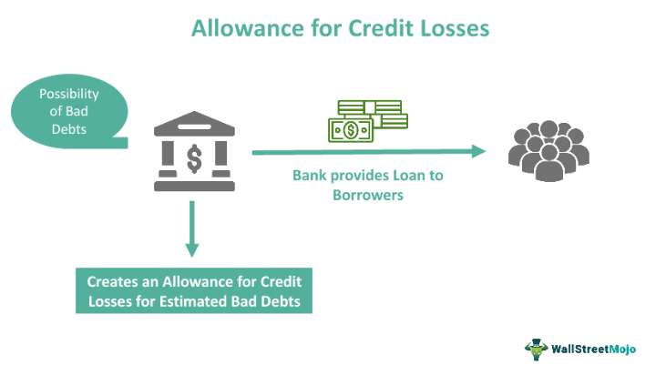

In the ever-evolving landscape of finance, understanding key concepts such as financial provision, accounting for credit losses, and algorithmic trading is crucial. These elements are fundamental in assessing a company's financial health and strategic positioning. Financial provisions, for instance, are critical for ensuring that future liabilities and expenses are anticipated and managed appropriately, thereby preventing unexpected financial strain. Accounting for credit losses involves estimating the potential losses a company might face due to credit risk, ensuring that financial statements accurately reflect these potential financial detriments. This practice not only aids in mitigating financial risks but also enhances the transparency and reliability of financial reporting.

Meanwhile, algorithmic trading represents a significant technological advance in the trading sector, using computer programs to execute trades based on pre-defined criteria. This approach leverages the processing power of modern computing to make fast, data-driven decisions, enabling traders to seize market opportunities with precision and speed. The synergy of these elements plays a critical role in modern financial data analytics, risk management, and strategic financial planning, enriching the toolkit for financial professionals.



This article explores these topics, highlighting their significance and interplay in modern financial management. It aims to provide a comprehensive understanding for both financial professionals and enthusiasts alike. From accounting principles to cutting-edge trading techniques, these concepts form the backbone of effective financial strategies. Through an examination of these crucial aspects, the article aims to deepen the reader's insight into how these practices underpin the sound financial management and strategic decision-making necessary to thrive in today's dynamic financial markets.

## Table of Contents

## Understanding Financial Provisions

Financial provisions represent a prudent financial strategy where companies set aside amounts from their profits to prepare for future expenses or liabilities. These are potential costs that a company anticipates but cannot measure precisely. Such costs typically encompass credit losses, warranty claims, and litigation expenses.

In accounting terms, provisions ensure that a company's financial statements accurately portray its true financial position. They achieve this by adhering to well-established accounting standards such as the International Financial Reporting Standards (IFRS) and Generally Accepted Accounting Principles (GAAP). These standards mandate the recognition of provisions to maintain transparency and fiscal accountability in financial reporting.

The calculation of financial provisions involves estimating potential liabilities based on historical data and current information. For instance, if a company frequently faces warranty claims, it may analyze past trends to forecast future claims accurately and allocate sufficient reserves accordingly. The following simple formula can represent the estimation for a provision:

$$
\text{Provision} = \text{Expected Liability} \times \text{Probability of Occurrence}
$$

The primary purpose of provisioning is to secure the company against known liabilities that are probable but not yet realized. By setting aside these amounts, a company demonstrates fiscal responsibility and financial foresight, which is crucial in maintaining financial robustness. This preparedness safeguards the company’s future, ensuring it can meet its obligations even under unforeseen circumstances.

In Python, estimating future provisions might involve statistical methods to determine probabilities based on past data. Here's a simplified example using Python:

```python
import numpy as np

# Example data for historical claims
historical_claims = np.array([10000, 12000, 8000, 15000, 11000])
probability_of_occurrence = 0.2  # Assume a certain probability

# Estimate provision
expected_liability = np.mean(historical_claims)
provision = expected_liability * probability_of_occurrence

print(f"Estimated Provision: ${provision:.2f}")
```

In this example, historical claims data are used to calculate an expected liability, which is then adjusted by the probability of the liability occurring, resulting in an estimated provision.

Overall, financial provisions are a crucial aspect of risk management and accounting, ensuring a company remains solvent and prepared for any future financial challenges that may arise.

## Accounting for Credit Losses

Provision for credit losses represents an estimation of potential losses arising due to credit risk, which is reflected as an expense on the financial statements. This accounting practice is crucial for companies as it aids in anticipating and mitigating financial risks stemming from credit defaults. By accurately estimating the portion of accounts receivable that is unlikely to be recovered, businesses can adjust their financial statements accordingly, ensuring they reflect the true financial position.

## Purpose and Importance

The primary purpose of accounting for credit losses is to provide a financial buffer against potential defaults and ensure the company's financial resilience. This practice aligns with the principles of prudence and conservatism in accounting, where potential losses are recognized as soon as they can be reasonably estimated. Essentially, provisions for credit losses allow a company to prepare for future uncertainties related to its receivables, thereby safeguarding its financial integrity.

## Methodologies

There are various methodologies employed to estimate credit losses, with Expected Credit Loss (ECL) models being commonplace in contemporary accounting practices. Under the ECL model, credit losses are estimated based on the risk of default over the lifetime of financial assets. This forward-looking approach leverages historical data, current conditions, and reasonable forecasts to derive a comprehensive estimate.

## Allowance for Credit Losses vs. Provision for Credit Losses

A critical distinction exists between the allowance for credit losses and the provision for credit losses. The provision refers to the expense recognized during a specific period to account for anticipated credit losses. In contrast, the allowance is a cumulative balance on the balance sheet representing the total amount set aside to cover those losses. 

Mathematically, the relationship can be expressed as:

$$
\text{Ending Allowance} = \text{Beginning Allowance} + \text{Provision for Credit Losses} - \text{Write-offs} + \text{Recoveries}
$$

Where:
- **Beginning Allowance** represents the balance at the start of the accounting period.
- **Write-offs** are the amounts deemed unrecoverable and removed from the allowance.
- **Recoveries** pertain to previously written-off amounts that have been recovered.

## Implications for Financial Reporting

Accurate calculation and reporting of credit losses are crucial for financial transparency and compliance. It ensures that stakeholders, including investors and regulators, have true insights into a company's risk exposure and financial health. By maintaining robust methodologies for assessing credit losses, companies can achieve a balance between risk management and financial performance, thus contributing to the overall stability of the financial system.

Accounting for credit losses remains a fundamental component of financial management, providing essential insights and preparations for potential disruptions in cash flows due to credit defaults. As regulatory frameworks and market conditions evolve, adapting these accounting methods is imperative for sustained financial resilience.

## Algorithmic Trading in Finance

Algorithmic trading, often known as algo trading, is a method of executing orders through the use of automated and pre-programmed trading instructions. These instructions are based on variables such as time, price, and [volume](/wiki/volume-trading-strategy), allowing the algorithms to make trading decisions and act quickly with minimal human intervention. This approach is driven by technology and hinges on the capacity to rapidly process large volumes of data, enabling traders to capitalize on market opportunities with precision and speed.

Recent advancements in financial technology, or fintech, have considerably broadened the accessibility and applicability of [algorithmic trading](/wiki/algorithmic-trading). Originally the domain of institutional investors and major financial firms, the proliferation of fintech solutions has democratized algo trading, making it available to individual retail investors. Platforms now exist that cater to a wide range of investors, offering user-friendly interfaces and a variety of algorithmic strategies. This has increased market participation and [liquidity](/wiki/liquidity-risk-premium), further enhancing the efficiency of financial markets.

One of the key benefits of algorithmic trading is its ability to integrate with risk management practices, including provisioning strategies. This integration is crucial in ensuring that trading activities are aligned with the broader risk management frameworks of a financial institution. By implementing algo trading systems, companies can incorporate predefined risk parameters directly into their trading algorithms. This ensures that trades are executed within the constraints of the institution's risk appetite and regulatory requirements.

For instance, an algorithm might include parameters such as maximum allowable loss or exposure limits, automatically adjusting trading activity to comply with these thresholds. This mechanized approach not only enhances the precision of trading operations but also helps mitigate potential risks associated with market [volatility](/wiki/volatility-trading-strategies). By marrying algorithmic trading with robust risk management frameworks, financial institutions can make more informed and strategic financial decisions, translating to improved performance and competitive advantage in the market.

In summary, algorithmic trading represents a pivotal evolution in trading strategies, offering significant technological advantages and operational efficiencies. Its synergy with risk management practices ensures that financial institutions can optimize their decision-making processes, maintaining a balance between growth opportunities and risk exposure. As algorithmic trading continues to evolve, its role in finance is likely to expand, driving future innovations in financial strategies and market dynamics.

## The Interplay Between Credit Provisions and Algo Trading

Algorithmic trading platforms are increasingly integrating advanced strategies to manage financial provisions and credit risks. This process is crucial due to the inherent volatility and unpredictability of financial markets. Provisions for credit losses play a pivotal role in ensuring that fintech companies maintain solvency despite potential loan defaults. These financial buffers allow companies to remain stable in the face of adverse economic conditions, protecting investors and stakeholders.

By integrating provisioning strategies into algorithmic trading models, companies can enhance their financial resilience. For instance, algorithms can be designed to [factor](/wiki/factor-investing) in potential credit risks by adjusting trading strategies based on predicted financial constraints. This integration ensures that trading decisions are not only driven by market trends and price movements but also by an understanding of the company's overall financial health.

This synergy between credit provisions and algo trading enhances risk management frameworks. Algorithms capable of evaluating financial provisions alongside market data can offer predictive insights that support strategic financial planning. By doing so, they provide fintech companies with a competitive edge in volatile markets, allowing for proactive rather than reactive decision-making.

A practical implementation example could be algorithmic models that continuously monitor market conditions against a company’s set credit provisions. These models can trigger automated trading responses to hedge potential losses, thereby safeguarding financial resources. Python, often used for its simplicity and extensive financial libraries, can be employed to develop such algorithms effectively. For example, using libraries like PyAlgoTrade or Backtrader can streamline the process of integrating comprehensive risk management strategies into trading models.

Overall, the incorporation of financial provisioning strategies within algorithmic trading not only bolsters financial resilience but also supports the development of sophisticated trading systems that anticipate and mitigate financial risks, setting a robust foundation for strategic financial planning.

## Challenges and Regulatory Considerations

The dynamic nature of financial markets presents numerous challenges in provisioning for credit losses and managing algorithmic trading systems. Accurate estimation of future losses is a prominent challenge due to market volatility and evolving economic conditions. Companies must navigate these uncertainties while adhering to regulatory standards, such as IAS 37 for provisions, which requires recognition and measurement of liabilities when the criteria of a present obligation, probable outflow of resources, and reliable estimate are met. Similarly, FASB ASC 450 provides guidance on accounting for contingencies, necessitating robust financial practices to ensure compliance and accuracy in reporting.

Market fluctuations can significantly impact the estimates used in provisioning for credit losses. For instance, changes in interest rates, economic cycles, and geopolitical events can alter the risk profiles of credit portfolios. As a result, financial institutions must employ sophisticated models to predict potential credit defaults and set aside appropriate provisions. These models often incorporate historical data and forward-looking information, requiring continuous refinement to account for new developments and emerging risks.

The integration of fintech innovations, such as algorithmic trading, adds another layer of complexity. Algorithmic trading systems must be designed to respond rapidly to market changes while ensuring compliance with regulatory frameworks. This necessitates a balance between speed and accuracy, as overly aggressive trading algorithms can lead to unintended risks and regulatory breaches. Additionally, the integration of [machine learning](/wiki/machine-learning) and [artificial intelligence](/wiki/ai-artificial-intelligence) into trading algorithms introduces challenges related to transparency and accountability, as the decision-making processes of these technologies can often be opaque.

Adapting to regulatory changes and advancements in fintech mandates strategic agility and continuous monitoring. Financial institutions must stay abreast of updates in regulatory frameworks and technological advancements to maintain compliance and competitiveness. This requires investment in talent and technology, fostering a culture of innovation and adaptability within the organization. By doing so, companies can navigate the complexities of modern financial markets, leveraging technological advancements to optimize risk management and financial decision-making.

## Conclusion

In the ever-evolving landscape of finance, a solid grasp of financial provisions, credit losses accounting, and algorithmic trading is vital for robust financial management. These concepts collectively ensure comprehensive risk management and the accurate representation of a company's financial condition. Financial provisions, by earmarking potential future expenses, allow companies to maintain a buffer against uncertainty, ensuring their financial statements reflect real-time liabilities. Credit losses accounting, meanwhile, aids in anticipating financial risks associated with credit defaults, promoting transparency and stability.

Algorithmic trading, propelled by technological advancements, enables swift and efficient decision-making, vital for capitalizing on market opportunities. The integration of algorithmic trading strategies with traditional financial principles, such as financial provisioning, enhances a company's resilience to market fluctuations. As the fintech sector progresses, this synergy fosters strategic agility, allowing businesses to not only withstand volatile markets but also to thrive.

The continuous development of fintech ensures that this integration of technology and finance will persist, paving the way for innovations in financial management frameworks. This amalgamation promises to uphold financial health and strategic preparedness, meeting the demands of a rapidly changing economic environment. Embracing these principles provides a foundation for future financial strategies that are both technologically advanced and fundamentally sound.

## References & Further Reading

[1]: ["Advances in Financial Machine Learning"](https://www.amazon.com/Advances-Financial-Machine-Learning-Marcos/dp/1119482089) by Marcos Lopez de Prado

[2]: ["Evidence-Based Technical Analysis: Applying the Scientific Method and Statistical Inference to Trading Signals"](https://www.amazon.com/Evidence-Based-Technical-Analysis-Scientific-Statistical/dp/0470008741) by David Aronson

[3]: ["Machine Learning for Algorithmic Trading"](https://github.com/stefan-jansen/machine-learning-for-trading) by Stefan Jansen

[4]: ["Quantitative Trading: How to Build Your Own Algorithmic Trading Business"](https://www.amazon.com/Quantitative-Trading-Build-Algorithmic-Business/dp/1119800064) by Ernest P. Chan

[5]: Bergstra, J., Bardenet, R., Bengio, Y., & Kégl, B. (2011). ["Algorithms for Hyper-Parameter Optimization."](https://dl.acm.org/doi/10.5555/2986459.2986743) Advances in Neural Information Processing Systems 24.

[6]: ["International Financial Reporting Standards (IFRS)"](https://en.wikipedia.org/wiki/International_Financial_Reporting_Standards) by the International Financial Reporting Standards Foundation

[7]: ["Accounting Standards Codification (ASC) 450: Contingencies"](https://accountinginfo.com/financial-accounting-standards/asc-400/450-contingencies.htm) by the Financial Accounting Standards Board