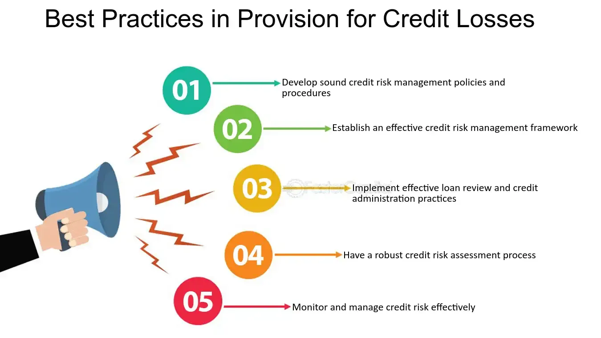

## Table of Contents

## What is a provision for credit losses?

A provision for credit losses is an amount of money that a bank or financial institution sets aside to cover potential losses from loans that might not be repaid. It's like saving money for a rainy day, but specifically for loans that could go bad. When a bank gives out loans, there's always a chance that some borrowers won't be able to pay back the money. To prepare for this, the bank estimates how much money it might lose and puts that amount into a special account.

This provision helps the bank to stay financially stable even if some loans default. It's an important part of managing risk in the banking industry. By setting aside money for potential losses, banks can show that they are prepared for bad situations and can continue to operate smoothly. The amount set aside can change based on the bank's assessment of the economy and the likelihood of loans not being repaid.

## Why is it important for businesses to have a provision for credit losses?

Having a provision for credit losses is important for businesses because it helps them stay financially healthy. When a business lends money to customers or other companies, there's always a chance that some of those loans won't be paid back. By setting aside money for these potential losses, the business can protect itself from big financial problems if some loans go bad. This way, even if a few customers can't pay, the business won't be in trouble because it has already saved up money to cover those losses.

It also helps businesses follow the rules and show they are being responsible. Banks and other financial institutions have to follow certain rules about how much money they need to set aside for bad loans. By having a provision for credit losses, a business can show that it is following these rules and taking care of its finances properly. This can make customers, investors, and regulators trust the business more, knowing that it is prepared for tough times.

## How does a provision for credit losses affect a company's financial statements?

A provision for credit losses shows up on a company's financial statements as an expense. This expense is listed on the income statement, which is like a report card showing how much money the company made and spent. When a company sets aside money for potential loan losses, it reduces the amount of profit it reports. This is because the money set aside is treated as a cost of doing business, just like paying for rent or salaries.

On the balance sheet, which is a snapshot of what the company owns and owes, the provision for credit losses appears as a liability. This is because the money set aside is not available for other uses; it's reserved to cover any loans that might not be paid back. By showing this liability, the balance sheet gives a clearer picture of the company's financial health, helping everyone see that the company is prepared for possible losses.

## What are the basic steps to calculate a provision for credit losses?

To calculate a provision for credit losses, a company first needs to look at all its loans and figure out how likely it is that each loan won't be paid back. They do this by checking things like how well the borrower is doing financially, how the economy is doing, and any other signs that might show a loan could go bad. After looking at these factors, the company comes up with a percentage that they think will be lost on each loan. This percentage is called the expected loss rate.

Once the company has the expected loss rate for each loan, they multiply this rate by the total amount of the loan to find out how much money they should set aside for that loan. They do this for all their loans and then add up all the amounts to get the total provision for credit losses. This total amount is then recorded in the company's financial statements as an expense and a liability, showing that the company is prepared for any loans that might not be paid back.

## Can you explain the difference between specific and general provisions for credit losses?

A specific provision for credit losses is when a company sets aside money for a particular loan that they think might not be paid back. They look at each loan one by one and decide how much money they need to save for each one that seems risky. For example, if a company sees that a customer is having money problems and might not be able to pay back their loan, they will set aside a specific amount of money just for that loan.

On the other hand, a general provision for credit losses is when a company sets aside money for all their loans, not just the risky ones. They look at all their loans together and guess how much money they might lose overall. This is like saving money for a rainy day without knowing exactly which day it will rain. General provisions help cover any unexpected losses from loans that might go bad, even if the company can't predict which ones will be a problem.

## How do accounting standards like IFRS and GAAP influence the calculation of provisions for credit losses?

Accounting standards like IFRS (International Financial Reporting Standards) and GAAP (Generally Accepted Accounting Principles) set the rules that companies must follow when they calculate provisions for credit losses. IFRS uses a method called the "expected credit loss model." This means that companies need to think about how much money they might lose on loans in the future, even if the loans are still good right now. They look at all sorts of information, like how the economy is doing and how well their customers are paying back their loans, to guess what might happen. This way, they set aside money for losses they expect to happen.

GAAP, on the other hand, uses a method called the "incurred loss model." This means that companies only set aside money for loans that are already showing signs of trouble. They wait until they see that a loan might not be paid back before they put money aside for it. This can make the provision for credit losses smaller at first, but it might lead to bigger problems if a lot of loans suddenly go bad. Both IFRS and GAAP want to make sure that companies are being honest about their finances, but they use different ways to do it.

## What are some common methods used to estimate the provision for credit losses?

One common method to estimate the provision for credit losses is the historical loss rate method. This method looks at past data to see how much money was lost on loans before. Companies use this information to guess how much money they might lose on their current loans. They look at things like how many loans went bad in the past and how much money was lost because of those bad loans. By using this past data, they can set aside a similar amount of money for their current loans, expecting that history might repeat itself.

Another method is the migration analysis method. This method looks at how loans change over time. Companies keep track of their loans and see if they get better or worse. If a loan starts to look riskier, they might move it to a different category that shows it's more likely to go bad. By watching these changes, companies can guess which loans might not be paid back and set aside money for those specific loans. This helps them be ready for any losses that might happen because of these risky loans.

A third method is the discounted cash flow method. This method looks at the future payments that are expected from loans and figures out how much those payments are worth right now. If a loan looks like it might not be paid back, the company will guess how much less money they will get from it. They then set aside money to cover this expected loss. This method helps companies think about the future and be ready for any problems that might come up with their loans.

## How often should a company review and adjust its provision for credit losses?

A company should review and adjust its provision for credit losses at least once a year. This is because things can change over time, like how the economy is doing or how well their customers are paying back their loans. By checking the provision every year, the company can make sure they have enough money set aside to cover any loans that might not be paid back. This helps them stay ready for any problems that might come up.

Sometimes, a company might need to check and change the provision more often than once a year. If there are big changes happening, like a sudden drop in the economy or if a lot of customers start having trouble paying back their loans, the company might need to look at the provision more often. This way, they can quickly set aside more money if they need to, making sure they are always prepared for any losses that might happen.

## What are the implications of underestimating or overestimating the provision for credit losses?

Underestimating the provision for credit losses can be risky for a company. If a company doesn't set aside enough money for loans that might not be paid back, it could face big financial problems if a lot of those loans go bad. This could make the company look like it's doing better than it really is, which might fool investors and regulators. If the truth comes out later, it could lead to a loss of trust and even legal trouble. Also, the company might have to suddenly set aside a lot of money to cover the losses, which could hurt its profits and make it harder to get loans or investments in the future.

Overestimating the provision for credit losses can also cause issues, but they are usually less serious than underestimating. If a company sets aside too much money for potential loan losses, it might end up not using all of that money. This means the company could have used that money for other things, like growing the business or paying for new projects. Overestimating can also make the company look less profitable than it really is, which might make it harder to attract investors. However, having extra money set aside is usually better than not having enough, because it helps the company stay safe and prepared for unexpected problems.

## Can you provide examples of how different industries approach the provision for credit losses?

In the banking industry, setting aside money for loans that might not be paid back is really important. Banks look at each loan carefully to see if it's risky. They use methods like looking at past data or watching how loans change over time to guess how much money they might lose. For example, if a bank sees that a lot of people are having trouble paying back their loans because of a bad economy, it might set aside more money to be safe. This helps the bank stay strong even if some loans go bad.

In the retail industry, companies that let customers buy things on credit also need to think about setting aside money for credit losses. For instance, a furniture store that lets people pay for their purchases over time might see that some customers are late on their payments. The store would then use information like how often this happens and how much money is usually lost to decide how much money to save for these potential losses. This way, the store can keep selling on credit without worrying too much about customers who can't pay.

## How does the economic environment impact the provision for credit losses?

The economic environment can really change how much money a company sets aside for loans that might not be paid back. When the economy is doing well, people and businesses usually have more money and can pay back their loans easier. This means companies might not need to set aside as much money for credit losses because the risk of loans going bad is lower. But if the economy is struggling, like during a recession, more people and businesses might have trouble paying back their loans. Companies then have to set aside more money to cover these possible losses, making the provision for credit losses bigger.

For example, if there's a big economic downturn and a lot of people lose their jobs, a bank might see that more of its customers are having trouble paying back their loans. The bank would then need to look at all its loans and guess how much more money it might lose because of the bad economy. By setting aside more money for these potential losses, the bank can stay safe and ready for any problems that come up because of the tough economic times.

## What advanced techniques or models are used by financial institutions to predict credit losses?

Financial institutions use some smart and fancy ways to guess how much money they might lose on loans. One popular way is called [machine learning](/wiki/machine-learning). This is like teaching a computer to learn from past data about loans that went bad. The computer looks at things like how much money people made, how often they paid their bills on time, and even what was happening in the economy. By learning from this past information, the computer can guess which loans might not be paid back in the future. This helps banks set aside the right amount of money to cover these possible losses.

Another advanced technique is called stress testing. This is when banks imagine really bad things happening, like a big economic crash, and see how their loans would do in those tough times. They use computer models to see how much money they might lose if a lot of people couldn't pay back their loans all at once. By doing these stress tests, banks can be ready for the worst and make sure they have enough money saved up. Both machine learning and stress testing help banks be smarter about setting aside money for loans that might go bad, keeping them safe no matter what happens in the economy.

## What is the understanding of financial provisions?

Financial provisions represent a prudent financial strategy where companies set aside amounts from their profits to prepare for future expenses or liabilities. These are potential costs that a company anticipates but cannot measure precisely. Such costs typically encompass credit losses, warranty claims, and litigation expenses.

In accounting terms, provisions ensure that a company's financial statements accurately portray its true financial position. They achieve this by adhering to well-established accounting standards such as the International Financial Reporting Standards (IFRS) and Generally Accepted Accounting Principles (GAAP). These standards mandate the recognition of provisions to maintain transparency and fiscal accountability in financial reporting.

The calculation of financial provisions involves estimating potential liabilities based on historical data and current information. For instance, if a company frequently faces warranty claims, it may analyze past trends to forecast future claims accurately and allocate sufficient reserves accordingly. The following simple formula can represent the estimation for a provision:

$$
\text{Provision} = \text{Expected Liability} \times \text{Probability of Occurrence}
$$

The primary purpose of provisioning is to secure the company against known liabilities that are probable but not yet realized. By setting aside these amounts, a company demonstrates fiscal responsibility and financial foresight, which is crucial in maintaining financial robustness. This preparedness safeguards the company’s future, ensuring it can meet its obligations even under unforeseen circumstances.

In Python, estimating future provisions might involve statistical methods to determine probabilities based on past data. Here's a simplified example using Python:

```python
import numpy as np

# Example data for historical claims
historical_claims = np.array([10000, 12000, 8000, 15000, 11000])
probability_of_occurrence = 0.2  # Assume a certain probability

# Estimate provision
expected_liability = np.mean(historical_claims)
provision = expected_liability * probability_of_occurrence

print(f"Estimated Provision: ${provision:.2f}")
```

In this example, historical claims data are used to calculate an expected liability, which is then adjusted by the probability of the liability occurring, resulting in an estimated provision.

Overall, financial provisions are a crucial aspect of risk management and accounting, ensuring a company remains solvent and prepared for any future financial challenges that may arise.

## What is the difference between Allowance for Credit Losses and Provision for Credit Losses?

A critical distinction exists between the allowance for credit losses and the provision for credit losses. The provision refers to the expense recognized during a specific period to account for anticipated credit losses. In contrast, the allowance is a cumulative balance on the balance sheet representing the total amount set aside to cover those losses. 

Mathematically, the relationship can be expressed as:

$$
\text{Ending Allowance} = \text{Beginning Allowance} + \text{Provision for Credit Losses} - \text{Write-offs} + \text{Recoveries}
$$

Where:
- **Beginning Allowance** represents the balance at the start of the accounting period.
- **Write-offs** are the amounts deemed unrecoverable and removed from the allowance.
- **Recoveries** pertain to previously written-off amounts that have been recovered.

## References & Further Reading

[1]: ["Advances in Financial Machine Learning"](https://www.amazon.com/Advances-Financial-Machine-Learning-Marcos/dp/1119482089) by Marcos Lopez de Prado

[2]: ["Evidence-Based Technical Analysis: Applying the Scientific Method and Statistical Inference to Trading Signals"](https://www.amazon.com/Evidence-Based-Technical-Analysis-Scientific-Statistical/dp/0470008741) by David Aronson

[3]: ["Machine Learning for Algorithmic Trading"](https://github.com/stefan-jansen/machine-learning-for-trading) by Stefan Jansen

[4]: ["Quantitative Trading: How to Build Your Own Algorithmic Trading Business"](https://www.amazon.com/Quantitative-Trading-Build-Algorithmic-Business/dp/1119800064) by Ernest P. Chan

[5]: Bergstra, J., Bardenet, R., Bengio, Y., & Kégl, B. (2011). ["Algorithms for Hyper-Parameter Optimization."](https://dl.acm.org/doi/10.5555/2986459.2986743) Advances in Neural Information Processing Systems 24.

[6]: ["International Financial Reporting Standards (IFRS)"](https://en.wikipedia.org/wiki/International_Financial_Reporting_Standards) by the International Financial Reporting Standards Foundation

[7]: ["Accounting Standards Codification (ASC) 450: Contingencies"](https://accountinginfo.com/financial-accounting-standards/asc-400/450-contingencies.htm) by the Financial Accounting Standards Board