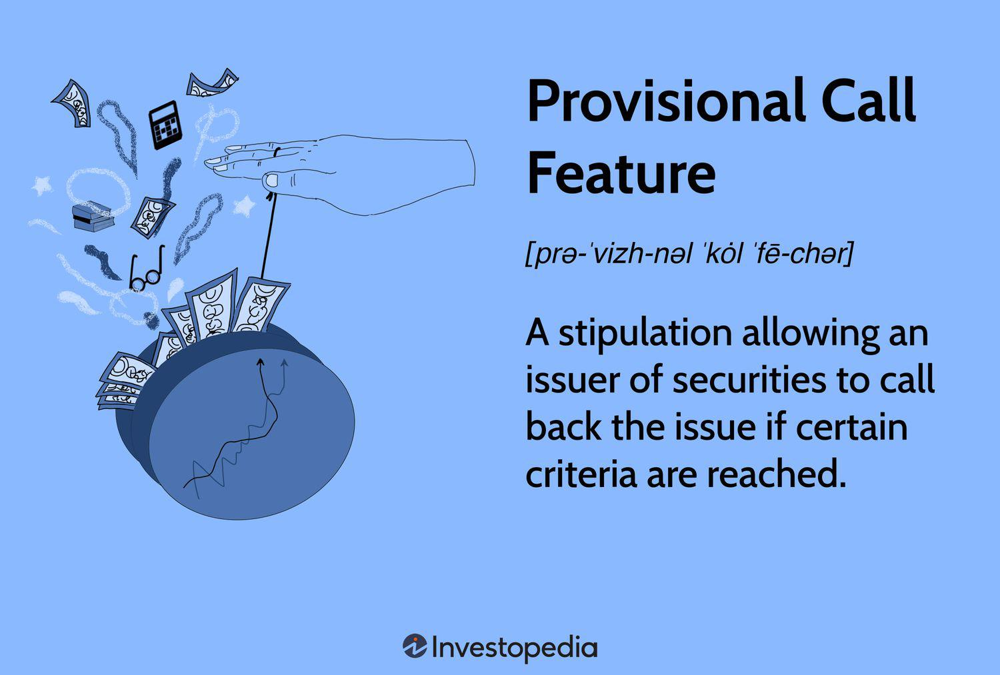

In today's dynamic financial landscape, investors are constantly on the lookout for innovative strategies to maximize returns while managing associated risks. The integration of provisional call features, bond investment options, and algorithmic trading offers sophisticated tools for enhancing portfolio performance. This article examines these components and their roles in robust investment strategies. Definitions, benefits, and potential challenges are addressed to highlight their relevance to contemporary investment practices. By understanding these concepts, investors can better navigate the complexities of modern financial markets, ensuring informed decision-making that aligns with shifting market dynamics and evolving investment goals.

## Table of Contents



## Understanding Provisional Call Features

Provisional call features are an integral component of certain fixed-income securities, offering issuers a mechanism to redeem bonds before their scheduled maturity under specific conditions. These conditions typically include hitting predefined price thresholds during periods designated as non-callable. Such features provide issuers with the tactical advantage to retire debt early should favorable market conditions arise—such as declining interest rates that allow refinancing at lower costs—thus playing a significant role in their financial strategy.

For investors, comprehending provisional call features is essential due to their impact on expected income streams and yield predictability. These features introduce variables that can affect the bond's duration and overall return on investment. The promise of a steady, predictable income from bond coupon payments can be disrupted if an issuer calls a bond early, hence affecting the investor's cash flow and reinvestment opportunities.

A critical [factor](/wiki/factor-investing) when evaluating bonds with provisional call features is the type of call protection in place. Call protection comes in two forms:

1. **Hard Call Protection**: This sets a specific period during which a bond cannot be called, regardless of any triggers that may otherwise allow a call. Bonds with hard call protection provide more predictability and stability in returns than those without, as investors have clear assurance about the duration of their investment.

2. **Soft Call Protection**: This introduces specific conditions under which the bond can be called within the protective period, such as paying a premium to the par value. Soft call protections might allow prior redemption but typically require issuers to compensate investors for the loss of future interest earnings, thus balancing the issuer's needs with investor protection.

From a risk management perspective, provisional call features offer issuers a route to mitigate [interest rate](/wiki/interest-rate-trading-strategies) risk by refinancing debt. For investors, understanding these features aids in crafting a portfolio that accounts for potential [volatility](/wiki/volatility-trading-strategies) in bond earnings and duration. Investors may adjust the composition of their portfolios to offset risks posed by such callable bonds, particularly in fluctuating interest environments where issuer calls may be frequent.

In conclusion, both issuers and investors benefit from the strategic utility of provisional call features. Issuers leverage these features for flexibility and cost-saving opportunities in debt management, while investors manage the additional risk these features introduce by diversifying their portfolios and incorporating robust analysis of potential returns and risks associated with callable bonds.

## Investment Options in Bonds

Bonds provide a diverse array of investment options, each designed to address specific investment goals while offering unique benefits and features. Among the critical elements in the bond market are call options and make-whole provisions, which play significant roles in balancing the interests of issuers and investors.

### Call Options

Call options in bonds grant the issuer the right to redeem the bonds before their maturity date at a predetermined call price. This feature provides issuers with the flexibility to refinance debt, especially when interest rates decline, allowing them to issue new bonds at lower rates and reduce overall borrowing costs. For investors, this can introduce a level of uncertainty regarding the bond's duration and yield. However, it also presents hedging opportunities, enabling investors to adjust their portfolios in response to potential exercises of these call options.

For example, consider a bond issued with a call option that allows the issuer to redeem it at par value five years before maturity if interest rates drop significantly. This arrangement can be beneficial for an issuer aiming to capitalize on lower rates but may require investors to reinvest at potentially lower yields.

### Make-whole Provisions

Make-whole provisions are another essential component of bond investment strategies. These provisions require issuers to compensate investors more comprehensively when bonds are called before maturity. Unlike standard call options, which might involve a fixed, often modest premium over the face value, make-whole provisions are calculated to ensure that investors are fairly compensated for the loss of future coupon payments.

The make-whole amount is typically determined by the present value of remaining interest payments and principal, discounted at a rate that includes a specified make-whole spread over a comparable Treasury security yield. This ensures that the present value maintains investors' expected returns.

```python
def calculate_make_whole(payment, rate, spread, treasury_yield):
    make_whole_rate = rate + spread + treasury_yield
    present_value = [payment / (1 + make_whole_rate)**t for t in range(1, len(payment)+1)]
    return sum(present_value)

# Example usage:
coupon_payments = [5, 5, 5, 5, 105]  # Annual coupon payments and principal at maturity
issuer_rate = 0.03
make_whole_spread = 0.01
treasury_yield = 0.02
make_whole_value = calculate_make_whole(coupon_payments, issuer_rate, make_whole_spread, treasury_yield)
```

This formula helps ensure that investors are not financially disadvantaged by an early redemption, creating a more equitable balance between the issuer's financial strategy and the investor's security.

In summary, both call options and make-whole provisions offer significant utility in managing interest rate risks and optimizing bond portfolios. For investors, understanding these options is crucial to navigating the complexities of bond investments and maximizing returns relative to changing market conditions.

## Algo Trading: Enhancing Financial Strategies

Algorithmic trading, commonly known as algo trading, employs sophisticated algorithms to automate and refine trading decisions. Leveraging its capacity to swiftly process vast quantities of data, algo trading is particularly effective in high-frequency trading environments like bond and options markets. This rapid processing ability enables traders to execute strategies with precision and speed that manual trading methods cannot match.

Among the most prevalent strategies in algo trading are [trend following](/wiki/trend-following), [arbitrage](/wiki/arbitrage), and mean reversion. Trend following algorithms capitalize on the [momentum](/wiki/momentum) of market trends, buying assets in an upward trend and selling in a downward one. Arbitrage algorithms exploit price differentials of the same asset in different markets, ensuring risk-free profits by simultaneously buying low and selling high. Mean reversion strategies assume that prices will eventually return to their historical average, allowing traders to identify overbought or oversold conditions and act accordingly.

The advantages of algo trading extend beyond speed and data processing; it significantly minimizes human error and exploits market inefficiencies, potentially enhancing portfolio performance. Algorithms can backtest strategies using historical data, allowing traders to refine their approaches before committing capital. Moreover, the disciplined nature of algorithms ensures objective decision-making, free from emotional biases that can often cloud human judgment.

However, successfully implementing [algorithmic trading](/wiki/algorithmic-trading) is not without its challenges. Key obstacles include navigating complex regulatory frameworks and managing technological costs. Financial regulations are constantly evolving, and compliance is essential to avoid legal repercussions. Additionally, the initial setup and ongoing maintenance of high-speed trading systems require substantial technological investment. These systems must be robust and reliable, capable of handling large volumes of transactions with minimal latency.

Effective algorithmic trading strategies demand significant expertise in both finance and technology. Traders need a nuanced understanding of market dynamics as well as the technical skills to code and implement trading algorithms. As regulatory concerns and technological expenses are managed, the potential benefits of algo trading can be fully realized, offering traders a powerful tool for optimizing financial strategies.

## Integrating Provisional Call Features, Bond Options, and Algo Trading

The integration of provisional call features, bond investment options, and algorithmic trading presents a sophisticated strategy mix capable of significantly enhancing investment frameworks. By aligning these elements, investors can not only safeguard their portfolios but also position themselves for growth. This synergy is crucial, especially in the context of current volatile financial markets where timing and precision in execution are paramount.

Understanding how these components work together begins with recognizing the complementary nature of each. Provisional call features provide issuers and investors with a mechanism to manage risk through the early redemption of securities if certain market conditions are met. This adds a layer of predictability and flexibility to the investment.

Bond investment options, such as call options and make-whole provisions, further contribute by allowing issuers to maneuver in response to shifting interest rates and market demands, while also furnishing investors with security and fair compensation during early redemptions. Together, they establish a balanced environment where both issuer needs and investor rights are addressed comprehensively.

Algorithmic trading introduces another dimension by utilizing computer algorithms to execute trades with speed and precision. This technology can process vast amounts of market data, facilitating strategies such as trend following, arbitrage, and mean reversion. By minimizing human error and capturing market inefficiencies, algorithmic trading greatly optimizes portfolio performance, ensuring that investment decisions align with prevailing market conditions.

Integrating these aspects allows for enhanced risk management. Investors can create simulation analyses and case studies to model potential outcomes and guide decision-making processes. Through simulations, various scenarios can be examined, providing insights on how these tools operate under different market conditions and how they can be effectively synchronized.

In practice, investors could leverage a Python-based framework to simulate the potential outcomes of incorporating these strategies into a portfolio. For example, using libraries such as NumPy and pandas, investors can model market dynamics and evaluate how provisional call features, bond options, and algo trading perform across different scenarios.

```python
import numpy as np
import pandas as pd

# Simulate market conditions
np.random.seed(0)
market_conditions = np.random.normal(loc=100, scale=10, size=1000)

# Simulate portfolio performance with integrated strategies
def simulate_portfolio(performance_data, call_feature_effect, bond_option_effect, algo_trade_effect):
    return performance_data + call_feature_effect + bond_option_effect + algo_trade_effect

call_feature_effect = np.random.normal(loc=0, scale=1, size=1000)
bond_option_effect = np.random.normal(loc=0, scale=0.5, size=1000)
algo_trade_effect = np.random.normal(loc=0, scale=2, size=1000)

portfolio_performance = simulate_portfolio(market_conditions, call_feature_effect, bond_option_effect, algo_trade_effect)

# Analyze results
performance_df = pd.DataFrame({
    'Market Conditions': market_conditions,
    'Portfolio Performance': portfolio_performance
})
performance_df.describe()
```

This exemplar code demonstrates how combining the effects of these strategies can be modeled to forecast portfolio outcomes. By leveraging such simulations, investors can build robust portfolios tailored to withstand market fluctuations, ultimately achieving a balanced mix of protection and growth.

## Advantages and Challenges

The primary advantage of utilizing the integration of provisional call features, bond options, and algorithmic trading is their collective ability to diversify risk while enhancing returns. Provisional call features and bond options offer a security framework and flexibility; these tools provide mechanisms for issuers and investors to manage interest rate risks and refinancing needs effectively. For instance, make-whole provisions ensure investors receive fair compensation when bonds are called early, while call options furnish issuers with refinancing opportunities, thus aligning the financial interests of both parties.

Algorithmic trading, on the other hand, introduces a new dimension of precision and efficiency. By leveraging complex algorithms to automate trading decisions, algo trading significantly reduces human error and capitalizes on market inefficiencies. Algorithms can process vast datasets rapidly, enabling high-frequency trading and strategic maneuvers such as trend following, arbitrage, and mean reversion. This automation enhances portfolio performance by optimizing trade timing and execution.

However, these strategies also present several challenges. A significant barrier to entry in algorithmic trading is understanding and implementing complex calculations and models, which often require advanced mathematical and programming skills. Below is a simple example of a mean reversion strategy using Python:

```python
import numpy as np

# Generate a synthetic price series
np.random.seed(42)
prices = np.random.normal(loc=100, scale=5, size=1000)

# Simple moving average
def moving_average(series, window=20):
    return np.convolve(series, np.ones(window)/window, mode='valid')

# Generate trading signals
def generate_signals(prices, ma):
    signals = np.zeros(len(prices))
    signals[prices[20:] > ma] = 1  # Buy signal
    signals[prices[20:] < ma] = -1 # Sell signal
    return signals

ma = moving_average(prices)
signals = generate_signals(prices, ma)
```

Regulatory constraints and market conditions necessitate continuous assessment to ensure compliance and adaptability. Changes in regulation may influence the permissible use of certain strategies or require additional reporting and transparency. Hence, staying informed on regulatory developments is crucial for success.

Moreover, because financial markets and technologies evolve rapidly, succeeding with these sophisticated tools requires a nuanced understanding and a willingness to embrace innovation. Investors must invest in continuous learning and adaptation to technological advancements, maintaining a competitive edge and achieving investment objectives in complex market environments.

## Conclusion

The integration of provisional call features, bond options, and algorithmic trading offers investors a robust strategy toolkit capable of addressing the complexities of modern financial markets. By adopting these financial innovations, investors can enhance their ability to manage risks such as interest rate fluctuations, market volatility, and issuer default, thus improving overall portfolio performance. 

Provisional call features and bond options provide critical security and flexibility. These instruments enable investors to navigate unpredictable market environments by allowing them to protect against premature bond redemption or capitalize on refinancing opportunities. In this way, they mitigate potential losses while securing returns on investment.

Algorithmic trading brings precision and efficiency to investment strategies. Its ability to process and analyze large volumes of market data in real time allows investors to make informed decisions quickly, efficiently executing trades that capitalize on market inefficiencies and trends. This reduces human error and maximizes profit opportunities.

Continual learning and adaptability are essential for investors aiming to harness these tools effectively. As financial markets and technologies continue to evolve, staying informed on regulatory changes, technological advancements, and market dynamics is crucial. This proactive approach helps investors refine strategies to suit novel challenges and emerging opportunities.

Strategically implementing these tools ensures that investors maintain a competitive edge, equipping them to achieve their investment objectives. By balancing innovation with due diligence, investors can successfully navigate increasingly complex markets, maximizing returns and minimizing associated risks.

## References & Further Reading

[1]: Lopez de Prado, M. (2018). ["Advances in Financial Machine Learning."](https://www.amazon.com/Advances-Financial-Machine-Learning-Marcos/dp/1119482089) Wiley.

[2]: Chan, E. (2009). ["Quantitative Trading: How to Build Your Own Algorithmic Trading Business."](https://github.com/ftvision/quant_trading_echan_book) Wiley.

[3]: Aronson, D. R. (2006). ["Evidence-Based Technical Analysis: Applying the Scientific Method and Statistical Inference to Trading Signals."](https://www.amazon.com/Evidence-Based-Technical-Analysis-Scientific-Statistical/dp/0470008741) Wiley.

[4]: Jansen, S. (2020). ["Machine Learning for Algorithmic Trading."](https://github.com/stefan-jansen/machine-learning-for-trading) Packt Publishing.

[5]: Fabozzi, F. J., & Mann, S. V. (2012). ["Introduction to Fixed Income Analytics: Relative Value Analysis, Risk Measures and Valuation."](https://onlinelibrary.wiley.com/doi/book/10.1002/9781118266649) Wiley.