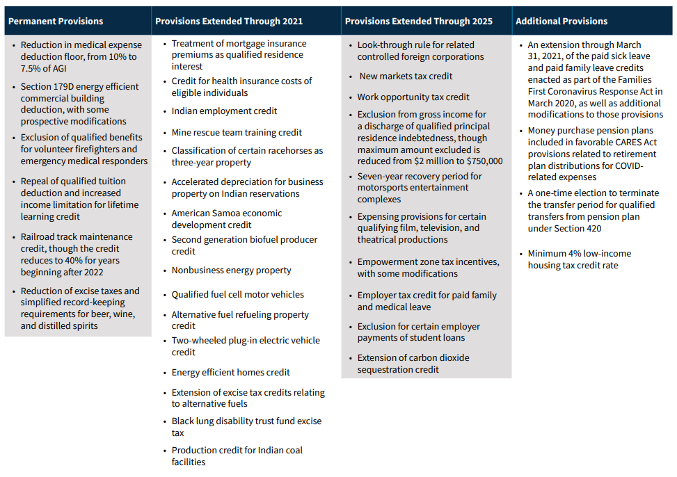

## Table of Contents

## What is the Consolidated Appropriations Act, 2021?

The Consolidated Appropriations Act, 2021 is a big law that the United States government passed at the end of 2020. It's important because it helps fund many parts of the government and provides money for different programs. This law is like a big package that includes money for things like schools, hospitals, and helping people who lost their jobs because of the COVID-19 pandemic.

One big part of this law is that it gives more money to people through something called stimulus checks. These checks are meant to help people pay for things they need, like food and bills, during tough times. The law also makes sure that there is money for other important things, like fixing roads and helping small businesses stay open. Overall, the Consolidated Appropriations Act, 2021 is about making sure the government can keep working and helping people when they need it most.

## When was the Consolidated Appropriations Act, 2021 signed into law?

The Consolidated Appropriations Act, 2021 was signed into law on December 27, 2020. This was an important moment because it meant that the government could start using the money from the law right away to help people and keep things running smoothly.

The law came at a time when many people were struggling because of the COVID-19 pandemic. By signing it into law, the government could send out stimulus checks, support small businesses, and make sure that important services like schools and hospitals had the money they needed to keep going.

## What are the main objectives of the Consolidated Appropriations Act, 2021?

The main objectives of the Consolidated Appropriations Act, 2021 are to provide financial support to various parts of the government and to help people who are struggling because of the COVID-19 pandemic. This law includes money for things like schools, hospitals, and programs that help people who lost their jobs. It's all about making sure the government has enough money to keep working and to help people when they need it the most.

Another big goal of the Act is to give direct financial help to people through stimulus checks. These checks are meant to help people pay for things like food and bills during tough times. The law also aims to support small businesses by giving them money to stay open and keep people employed. Overall, the Consolidated Appropriations Act, 2021 is about making sure the government can keep running smoothly and helping people and businesses get through the challenges caused by the pandemic.

## How does the Consolidated Appropriations Act, 2021 affect federal funding?

The Consolidated Appropriations Act, 2021 affects federal funding by providing money to many parts of the government. This law makes sure that there is enough money for important things like schools, hospitals, and programs that help people who are out of work. Without this law, these services might not have enough money to keep going, which could cause big problems for people who rely on them.

Another way this law affects federal funding is by giving money directly to people through stimulus checks. These checks help people pay for things like food and bills, especially during tough times like the COVID-19 pandemic. By doing this, the law helps keep the economy going and makes sure people have what they need.

The law also helps small businesses by giving them money to stay open and keep people employed. This is important because small businesses are a big part of the economy, and helping them means more jobs and more money moving around. Overall, the Consolidated Appropriations Act, 2021 makes sure the government has enough money to do its job and help people when they need it the most.

## What are some key provisions of the Consolidated Appropriations Act, 2021 related to healthcare?

The Consolidated Appropriations Act, 2021 has several important parts that help with healthcare. One big part is that it gives more money to hospitals and other healthcare places. This money helps them take care of people who are sick, especially those with COVID-19. It also helps make sure hospitals have enough supplies and workers to keep going during the pandemic.

Another key part of the law is that it helps people who lost their jobs keep their health insurance. This is really important because it means people can still go to the doctor even if they are not working. The law also gives money to programs that help people get mental health care, which is important because a lot of people were feeling stressed and worried during the pandemic.

Overall, the Consolidated Appropriations Act, 2021 makes sure that healthcare services have the money they need to keep helping people. It focuses on making sure hospitals can stay open and that people can get the care they need, whether it's for physical health or mental health. This law is a big help during a time when many people are struggling with their health.

## How does the Act address economic relief and support?

The Consolidated Appropriations Act, 2021 helps with economic relief and support by giving money directly to people through stimulus checks. These checks help people pay for things like food and bills, especially during tough times like the COVID-19 pandemic. By doing this, the law helps keep the economy going because when people have money, they can spend it on things they need, which helps businesses stay open.

Another way the Act supports the economy is by helping small businesses. It gives them money to stay open and keep people employed. This is really important because small businesses are a big part of the economy, and when they do well, more people have jobs and more money moves around. By supporting small businesses, the law helps make sure that the economy can keep going even during hard times.

Overall, the Consolidated Appropriations Act, 2021 is about making sure people and businesses have the help they need to get through the challenges caused by the pandemic. It focuses on giving direct money to people and supporting small businesses, which are both key parts of keeping the economy strong.

## What changes does the Act bring to education funding and policies?

The Consolidated Appropriations Act, 2021 helps schools by giving them more money. This money is important because it helps schools stay open and keep teaching kids, even during the COVID-19 pandemic. The Act makes sure that schools have the resources they need to buy things like computers and books, and to pay teachers and other staff. This is really helpful because it means schools can keep running smoothly and help students learn, no matter what is happening around them.

Another way the Act helps with education is by supporting programs that help kids who need extra help. This includes money for things like special education and programs that help kids from poor families. By doing this, the Act makes sure that all kids have a chance to get a good education, even if they face challenges at home. This is important because education is a key part of helping kids grow up to be successful adults.

## Can you explain the impact of the Act on small businesses?

The Consolidated Appropriations Act, 2021 helps small businesses by giving them money to stay open and keep people working. This money comes from something called the Paycheck Protection Program (PPP), which is a big part of the Act. The PPP gives loans to small businesses that they can use to pay their workers, rent, and other bills. If the businesses use the money the right way, the loans can be forgiven, which means they don't have to pay them back. This is really important because it helps small businesses keep going during tough times like the COVID-19 pandemic.

Another way the Act helps small businesses is by making it easier for them to get money. The law changes some rules to make it simpler for small businesses to apply for loans and grants. This means more small businesses can get the help they need without a lot of complicated paperwork. By doing this, the Act makes sure that small businesses, which are a big part of the economy, can keep working and help their communities. Overall, the Consolidated Appropriations Act, 2021 is a big help for small businesses during a time when many of them are struggling.

## What are the implications of the Act for tax policies and regulations?

The Consolidated Appropriations Act, 2021 has some important changes for tax policies and regulations. One big change is that it lets people take a special deduction for business meals. This means if you buy food for work, like taking a client out to eat, you can write it off on your taxes. This helps businesses save money and encourages them to spend more, which can help the economy. The Act also makes some changes to how much money people can put into their retirement accounts, which can help them save more for the future.

Another part of the Act that affects taxes is that it gives more time for people to pay back their taxes if they owe money. This is helpful because it gives people more time to get their finances in order, especially if they lost their job or had other money problems because of the pandemic. The law also makes some changes to how businesses can claim tax credits for keeping their workers on the payroll. This helps businesses save money on taxes and encourages them to keep people employed, which is good for the economy. Overall, the Act makes some important changes to tax rules to help people and businesses during tough times.

## How does the Consolidated Appropriations Act, 2021 modify existing laws or introduce new legislation?

The Consolidated Appropriations Act, 2021 changes some existing laws and adds new parts to help people and businesses. One big change is to the Paycheck Protection Program (PPP), which gives small businesses loans that can be forgiven if they use the money to pay their workers and other bills. The Act makes it easier for businesses to get these loans by changing some rules and making the application process simpler. It also adds new tax breaks, like letting businesses write off the cost of meals they buy for work, which helps them save money and spend more to help the economy.

The Act also changes some rules about taxes to help people who are struggling. It gives people more time to pay back their taxes if they owe money, which can be a big help if they lost their job or had other money problems because of the pandemic. The law also changes how much money people can put into their retirement accounts, making it easier for them to save for the future. These changes show how the Act tries to help people and businesses by making tax rules more friendly during tough times.

## What are the criticisms and controversies surrounding the Consolidated Appropriations Act, 2021?

The Consolidated Appropriations Act, 2021 has faced some criticism and controversy. One big issue is that some people think the stimulus checks, which are meant to help people during the pandemic, are not big enough. They say that the $600 checks don't give enough money to really help people who are struggling. Another criticism is that the Act is too big and complicated. Some people think it tries to do too many things at once, and it's hard to understand all the different parts of the law.

There's also controversy about how the money in the Act is being spent. Some people worry that not enough money is going to the most important things, like helping people who lost their jobs or small businesses that are struggling. They think the government should focus more on these areas instead of spending money on other things. Overall, while the Act tries to help a lot of people and businesses, there are different opinions about whether it's doing enough and if the money is being used in the best way possible.

## How can individuals and organizations stay updated on the implementation and effects of the Consolidated Appropriations Act, 2021?

Individuals and organizations can stay updated on the Consolidated Appropriations Act, 2021 by regularly checking official government websites like the U.S. Department of the Treasury or the Small Business Administration. These websites often have the latest news and updates about how the Act is being put into action and what it means for people and businesses. They can also sign up for email newsletters or alerts from these government agencies to get updates sent right to their inbox.

Another way to stay informed is by following news from trusted sources, like major newspapers or news websites. These sources often have reporters who specialize in covering government actions and can provide detailed information about how the Act is affecting different parts of society. People can also join online forums or discussion groups where others share information and experiences about the Act, which can be a helpful way to learn more and stay updated.

## References & Further Reading

[1]: U.S. Government Publishing Office. ["Consolidated Appropriations Act, 2021"](https://www.govinfo.gov/app/details/COMPS-16716).

[2]: Congressional Research Service. ["Overview of the Consolidated Appropriations Act, 2021"](https://www.govtrack.us/congress/bills/116/hr133/summary).

[3]: Hasbrouck, J. ("High Frequency Trading: New Realities for Traders, Markets and Regulators."](https://books.google.com/books/about/High_frequency_Trading.html?id=pli5oAEACAAJ) Journal of Financial Markets.

[4]: Narang, R. ("Inside the Black Box: The Simple Truth About Quantitative Trading"](https://www.amazon.com/Inside-Black-Box-Quantitative-Trading/dp/0470432063) Wiley Finance.

[5]: Arnuk, S. L., & Saluzzi, J. ("Broken Markets: How High Frequency Trading and Predatory Practices on Wall Street are Destroying Investor Confidence and Your Portfolio"](https://ptgmedia.pearsoncmg.com/images/9780132875240/samplepages/0132875241.pdf) FT Press.