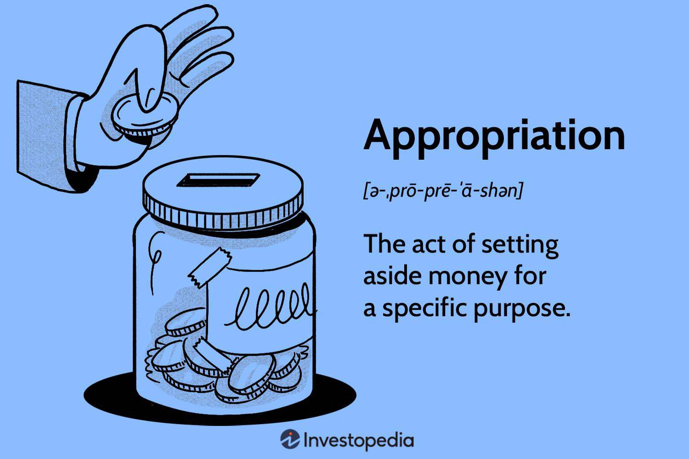

The 2021 Consolidated Appropriations Act, officially enacted into law on December 27, 2020, followed extensive negotiations aimed at addressing the multifaceted challenges posed by the COVID-19 pandemic and other socio-economic issues. As an extensive piece of legislation, the Act allocated approximately $2.3 trillion in government funding, impacting nearly every segment of the U.S. economy. It encompassed a $900 billion coronavirus relief package alongside regular government appropriations, signaling a significant fiscal intervention with broad implications for federal budget strategies. Understanding this Act is crucial, as it shapes the allocation of financial resources and sets regulatory standards affecting both short-term economic stabilization and long-term fiscal policy.

Algorithmic trading, or algo trading, is transforming the landscape of financial markets, becoming an increasingly critical facet of investment strategies. It refers to the use of computer algorithms to automatically execute trading orders based on predefined criteria. These algorithms can process vast data sets at high speed, identifying patterns and making trades more efficiently than human traders. As technology advances, the prevalence of algo trading continues to rise, influencing market dynamics through enhanced liquidity and altered volatility profiles.



This article aims to connect the dots between the 2021 Consolidated Appropriations Act and the burgeoning arena of algorithmic trading. By exploring the Act’s influence on economic regulations and fiscal measures, we can discern its ripple effects on the behavior and strategies of investors engaged in algorithmic trading. The synthesis of federal budget directives with market trading technologies holds profound insights for financial institutions and individual investors alike.

Comprehending these connections is pivotal for navigating the evolving investment terrain. As fiscal policies and regulatory changes recalibrate market conditions, both retail and institutional traders must adapt to maintain competitiveness. By examining these intersections, stakeholders can better anticipate shifts in trading algorithms and develop strategic responses to legislative developments. Understanding the symbiotic relationship between federal legislation and trading innovation not only enhances investment strategies but also helps mitigate risks inherent in a rapidly changing financial environment.

## Table of Contents

## Background on the 2021 Consolidated Appropriations Act

The 2021 Consolidated Appropriations Act was enacted as a response to the extraordinary economic challenges precipitated by the COVID-19 pandemic. This legislation combined various funding measures to support the economic stabilization and recovery efforts in the United States. The main motivation behind its creation was to address the immediate need for economic relief and to provide a comprehensive strategy for sustaining public health and economic vitality.

One of the pivotal components of the Act was its substantial funding allocations aimed at diverse sectors. The legislation approved a total of $2.3 trillion in spending, split between $900 billion dedicated to COVID-19 relief efforts and $1.4 trillion allocated for government operations funding through the fiscal year. This allocation was essential to provide both short-term relief and long-term fiscal support. [Reference: Congressional Research Service](https://crsreports.congress.gov/).

Among the critical policy objectives of the Act was economic relief for individuals and businesses affected by the pandemic. This included direct payments to Americans, extension of unemployment benefits, and introduction of rental assistance programs. The Act also prioritized healthcare funding by enhancing support for vaccine distribution and testing, and by increasing resources for hospitals and healthcare providers. 

In terms of regulatory measures, the Act introduced new provisions aimed at bolstering economic resilience and public health infrastructure. It included measures to improve vaccine distribution logistics and expanded eligibility criteria for assistance programs targeting small businesses.

The impact on different sectors was palpable. For instance, the healthcare sector witnessed increased funding for vaccines and medical supplies. Small businesses benefitted from the continuation and expansion of the Paycheck Protection Program (PPP), which offered forgivable loans to maintain payroll during economic disruptions. Additionally, sectors like tourism and airlines, heavily hit by the pandemic, received targeted assistance to mitigate revenue losses and support recovery.

In summary, the 2021 Consolidated Appropriations Act played a significant role in addressing the severe economic impacts of the pandemic, ensuring that both immediate needs were met and long-term economic recovery strategies were put in place. It stands as a crucial piece of legislation in the context of federal response to unprecedented economic challenges.

## Federal Budget Implications

The 2021 Consolidated Appropriations Act, a significant piece of legislation, has considerable implications for the annual federal budget, shaping fiscal policies that impact both short-term and long-term economic trajectories.

One of the primary influences of the Act on the federal budget is tied to its expansive funding allocations aimed at economic relief amidst the ongoing challenges posed by the COVID-19 pandemic. The Act set forth a total budget of approximately $2.3 trillion, which includes $900 billion in emergency economic stimulus due to pandemic-related conditions, intertwined with the regular fiscal budget measures. This substantial allocation reflects key budgetary priorities such as direct payments to individuals, extended unemployment benefits, and significant support for small businesses through the Paycheck Protection Program (PPP).

Budgetary priorities within the Act also highlight an emphasis on healthcare, evidenced by allocations made towards vaccine distribution and support for healthcare providers. This focus is reflected in the increased appropriations to the Department of Health and Human Services (HHS). The dominant allocation trends showcase a budgetary shift towards immediate relief and stabilization of critical sectors, which is crucial for short-term economic recovery.

Changes in financial regulations introduced by the Act also influence federal funding dynamics. These changes include easing certain banking restrictions to promote increased lending and [liquidity](/wiki/liquidity-risk-premium), thereby fostering a more conducive environment for economic recovery. The Act's provisions aimed at financial regulation modifications focus on lowering the regulatory barriers for financial institutions, facilitating smoother credit flow, and stabilizing financial markets. This approach is intended to catalyze economic activity in the short term while ensuring fiscal stability.

The Act plays a pivotal role in economic recovery, functioning as a linchpin for fiscal policy adjustments. It embodies a strategic fiscal response intended to boost consumption and prop up economic activity through monetary stimuli. The stimulus checks to individuals and extended assistance programs are direct interventions meant to enhance disposable income and stimulate demand, subsequently promoting economic growth.

Potential long-term economic outcomes of these budgetary decisions are multifaceted. While the immediate impact is geared towards economic recovery and stabilization, the sustained implications could involve increased national debt levels and considerations for fiscal consolidation in subsequent years. Additionally, the focus on healthcare and infrastructure, combined with the regulatory adjustments, may lead to structural changes in the financial markets and economy at large. These changes necessitate strategic planning and adaptation by both policymakers and financial institutions to optimize economic resilience and growth sustainability.

## Understanding Algorithmic Trading

Algorithmic trading, commonly referred to as algo trading, involves using computer algorithms to execute trading orders. The algorithms, often based on mathematical and statistical models, determine aspects such as timing, price, and quantity of trades. This form of trading relies on speed and precision that exceed human capabilities, making use of advanced technology to process large amounts of market data and execute trades at high frequencies.

At its core, [algorithmic trading](/wiki/algorithmic-trading) seeks to capitalize on small price discrepancies, enhance market efficiency, and reduce costs. The fundamental principles of algo trading rest on the automation of pre-defined trading strategies that are executed without human intervention. This automation is facilitated by complex algorithms coded in programming languages like Python or C++, accessing market conditions through high-speed internet connections and engaging in rapid transactions.

In modern financial markets, algorithmic trading plays a critical role by contributing to market liquidity and ensuring tighter spreads. It's extensively used by institutional investors such as hedge funds, investment banks, and market makers to manage massive numbers of orders that would be impossible to achieve manually. High-frequency trading ([HFT](/wiki/high-frequency-trading-strategies)), a subset of algorithmic trading, executes a large number of orders within fractions of seconds, influencing market dynamics significantly.

The advantages of algorithmic trading include efficiency and speed, which enhance decision-making processes. It minimizes emotional involvement in trading, thus reducing human errors. Moreover, algos can analyze multiple indicators and data streams simultaneously, identifying trends and opportunities in real-time. However, challenges such as technical failures, unforeseen market conditions, and the potential for exacerbating market [volatility](/wiki/volatility-trading-strategies) exist. For instance, the "Flash Crash" of 2010 demonstrated how algo trading can amplify a market downturn.

Emerging trends in algo trading following the 2021 fiscal policies indicate a shift towards adaptive strategies in response to evolving regulations and economic recovery measures. With increased data availability and computational power, [machine learning](/wiki/machine-learning) techniques are becoming prominent in constructing more intelligent and adaptive trading algorithms. These create opportunities for enhanced predictive analytics but also entail risks associated with model overfitting and increased dependency on data quality.

Overall, the dynamic nature of algorithmic trading necessitates a continuous adaptation to technological innovations and regulatory developments, underlining its critical role and evolving landscape in the global financial ecosystem.

## Impact of Legislative Changes on Algo Trading

The 2021 Consolidated Appropriations Act brought significant legislative changes that have influenced the landscape of algorithmic trading. This comprehensive spending bill, designed to provide economic relief and regulate financial activities, has several implications for algo trading, a method reliant on automated, rule-based systems for executing trades at speeds and frequencies that human traders cannot achieve.

One of the primary ways the Act influences algo trading is through fiscal stimulus measures. These measures have injected significant liquidity into the market, potentially increasing the [volume](/wiki/volume-trading-strategy) and frequency of algorithmic trades. With enhanced liquidity, algo trading systems can operate more efficiently, as they rely on the fluid movement of assets to execute high-frequency strategies. The increased market activity may also lead to narrower bid-ask spreads, which are critical for the profitability of various algo trading strategies.

Moreover, the Act introduces regulatory changes that compel algo traders to adopt adaptive strategies. For instance, measures aimed at increasing transparency and reducing systemic risk require algo trading systems to be more robust and resilient. Traders need to ensure compliance by enhancing their risk management algorithms and incorporating more sophisticated monitoring tools to detect and respond to regulatory changes promptly. The implementation of stress testing and scenario analysis may become more prevalent as traders seek to align with new compliance requirements.

The fiscal stimulus and regulatory changes have implications for market liquidity and volatility. While increased liquidity can enhance market efficiency, the resultant market conditions can also lead to heightened volatility. Algo trading systems, which capitalize on short-term price movements, might need reprogramming to adjust to these new volatility levels. Algorithmic models that incorporate volatility estimations are likely to perform better in this dynamic environment, as they can fine-tune trading algorithms to either exploit or hedge against sudden market swings.

As an example of algorithmic adjustments post-legislation, consider a case where algorithmic traders, recognizing increased market volatility, modify their mean-reversion strategies. These strategies can be adapted to shorter time frames or adjusted to include volatility filters, helping the programs to avoid false signals in turbulent markets. 

```python
# Example of a simple mean-reversion algorithm with volatility adjustment

def mean_reversion_strategy(prices, window_size=20, threshold=0.02):
    mean_price = prices[-window_size:].mean()
    current_price = prices[-1]
    volatility = prices[-window_size:].std()

    # Adjusting threshold based on recent volatility
    adjusted_threshold = threshold * (volatility / mean_price)

    if current_price < mean_price - adjusted_threshold:
        return "Buy"
    elif current_price > mean_price + adjusted_threshold:
        return "Sell"
    else:
        return "Hold"
```

Future developments in algo trading are expected as traders continue to adapt their strategies to an evolving regulatory landscape. A rigorous approach to risk management and compliance must be maintained, ensuring that trading strategies are resilient against possible legal and market fluctuations. Understanding these legislative impacts on algo trading is crucial for traders and institutions if they are to remain competitive and compliant.

## Future Outlook

Predictions for future legislative impacts on financial markets and algorithmic trading are crucial as both sectors continue to evolve with technological advancements and regulatory adjustments. In the aftermath of significant fiscal policies, such as the 2021 Consolidated Appropriations Act, the trajectory for financial markets and algorithmic trading is expected to be shaped by several factors.

**Ongoing and Future Regulatory Trends**

Regulatory trends are forecasted to exert a profound influence on the trading environment. Authorities are likely to introduce more comprehensive regulations aimed at ensuring market stability and preventing systemic risks. These measures may include stricter oversight of trading algorithms to prevent market manipulation and enhance transparency within the financial ecosystem. Regulatory technology (RegTech) is expected to play an instrumental role in this context, enabling faster compliance checks and real-time monitoring of trading activities.

One anticipated trend is the increased focus on environmental, social, and governance ([ESG](/wiki/esg-investing)) criteria within trading practices. Legislators are progressively integrating these considerations into financial regulations, which could significantly alter algorithmic trading strategies, as algorithms may need to [factor](/wiki/factor-investing) in ESG compliance metrics when executing trades.

**Innovation in Trading Technologies**

Innovation remains at the core of financial markets' evolution, with algorithmic trading poised to benefit from ongoing technological advancements. Machine learning and [artificial intelligence](/wiki/ai-artificial-intelligence) (AI) are predicted to drive the next wave of innovations, enabling more sophisticated predictive analytics and improved decision-making processes. Quantum computing, although in its nascent stages, could revolutionize algo trading by providing unprecedented computational power, thereby refining complex algorithms and optimizing trade executions.

Moreover, the advent of blockchain and decentralized finance (DeFi) opens new possibilities for transparent and efficient trading mechanisms. Integrating blockchain technology could streamline settlement processes and reduce counterparty risks, prompting traders and institutions to innovate their technological infrastructure.

**Long-term Strategic Planning**

For investors and institutions, strategic planning in response to these changes becomes vital. A deep understanding of regulatory shifts and technological advancements will be essential for crafting resilient investment strategies. Diversification across asset classes and geographical regions can help mitigate risks associated with regulatory uncertainties.

Investors should also consider pursuing advanced data analytics and algorithmic capabilities to enhance their competitive edge. This may involve investing in skilled personnel, upgrading technological resources, and fostering collaborations with tech firms to develop cutting-edge algorithms.

**Conclusion on Interplay Between Federal Legislation and Algorithmic Trading**

The relationship between federal legislation and algorithmic trading is becoming increasingly intertwined, with regulations influencing trading practices and technological innovation responding to new policy frameworks. As fiscal policies evolve, they will invariably change market dynamics, compelling traders and institutions to adapt their strategies accordingly.

In conclusion, the future outlook for financial markets and algorithmic trading is characterized by an intricate balance between regulatory evolution, technological innovation, and adaptive strategic planning. Stakeholders must remain vigilant and proactive in navigating this landscape to capitalize on emerging opportunities while mitigating potential risks. This interplay underscores the importance of staying informed and adaptable in the face of continuous change within the financial sector.

## Conclusion

The 2021 Consolidated Appropriations Act marked a significant legislative milestone, influencing both federal budgetary strategies and the sphere of algorithmic trading. The Act's comprehensive allocations and regulatory updates were pivotal in addressing economic relief, healthcare needs, and broader fiscal objectives. As detailed throughout this article, these legislative measures have profound implications, not only on traditional financial sectors but also on the rapidly evolving domain of algo trading.

The correlation between federal budgetary decisions and financial market dynamics highlights the essential role that legislative contexts play in shaping market behavior. Algorithmic trading, with its reliance on technological precision and speed, finds both opportunities and challenges in the fresh terrain shaped by such policies. The increased market liquidity and volatility potentially driven by these regulatory changes require traders and financial institutions to remain agile and informed.

It is crucial for traders and financial professionals to stay vigilant about these regulatory impacts. As legislative changes continue to unfold, the ability to adapt strategies and leverage technological advancements is more important than ever. This adaptability will facilitate not only survival but prosperity within an increasingly complex financial landscape.

In closing, the interaction between federal legislation and algo trading underscores the importance of continuous learning and strategic adjustment. I encourage readers to further explore and investigate these connections, as understanding the nuanced impacts of policy on trading can yield significant benefits in navigating the financial markets effectively.

## References & Further Reading

[1]: U.S. Government Publishing Office. ["Consolidated Appropriations Act, 2021"](https://www.govinfo.gov/app/details/COMPS-16716).

[2]: Congressional Research Service. ["Overview of the Consolidated Appropriations Act, 2021"](https://www.govtrack.us/congress/bills/116/hr133/summary).

[3]: Hasbrouck, J. ("High Frequency Trading: New Realities for Traders, Markets and Regulators."](https://books.google.com/books/about/High_frequency_Trading.html?id=pli5oAEACAAJ) Journal of Financial Markets.

[4]: Narang, R. ("Inside the Black Box: The Simple Truth About Quantitative Trading"](https://www.amazon.com/Inside-Black-Box-Quantitative-Trading/dp/0470432063) Wiley Finance.

[5]: Arnuk, S. L., & Saluzzi, J. ("Broken Markets: How High Frequency Trading and Predatory Practices on Wall Street are Destroying Investor Confidence and Your Portfolio"](https://ptgmedia.pearsoncmg.com/images/9780132875240/samplepages/0132875241.pdf) FT Press.