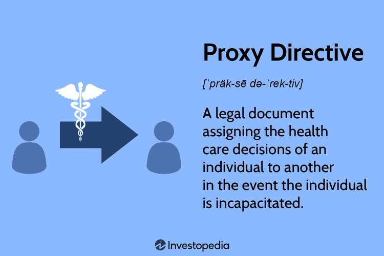

In today's fast-paced and complex world, both financial and medical decisions have grown more intricate, necessitating a proactive approach to planning. Individuals are increasingly called upon to make informed choices that directly impact their health and financial well-being. Two important aspects that require careful consideration are advanced care planning and financial strategies like algorithmic trading. These strategies, although seemingly disparate, share a common goal of ensuring a secure and informed future.

Advanced care planning involves making preemptive decisions regarding healthcare preferences, specifically in circumstances where individuals may be unable to communicate their wishes. Legal documents such as proxy directives play a crucial role in this context, empowering individuals to designate representatives to make medical decisions on their behalf. This proactive approach ensures that healthcare preferences are respected and provides clarity for both medical professionals and family members during challenging times.



Meanwhile, the financial landscape has witnessed a significant shift with the emergence of algorithmic trading. This strategy employs computer algorithms to execute trades at high speeds and precision, enabling traders to capitalize on market opportunities that human traders may miss. Algorithmic trading offers benefits such as speed, accuracy, and the capacity to back-test strategies with historical data. Nonetheless, it demands an in-depth understanding of financial markets and programming capabilities to harness its full potential.

Understanding the legal frameworks and dynamics of these areas is essential for making informed decisions that can impact daily life. Engaging with both advanced care planning and algorithmic trading not only enhances personal control over significant life aspects but also prepares individuals to navigate uncertainties with a structured approach. This article aims to shed light on these critical concepts, exploring how they intersect and contribute to a well-rounded strategy in life planning.

## Table of Contents

## Understanding Advanced Care Planning and Proxy Directives

Advanced care planning is an essential approach to making healthcare decisions that reflect an individual's preferences in situations where they may be unable to communicate. At the core of advanced care planning is the concept of proxy directives, which are legal instruments that appoint a representative to make healthcare decisions on behalf of an individual if they become incapacitated.

A proxy directive serves as a safeguard, ensuring that a person’s healthcare preferences are respected and adhered to by medical professionals and loved ones during difficult times. This legal document is pivotal in maintaining clarity and reducing the potential for conflict among family members and healthcare providers. It allows the designated representative, often referred to as a healthcare proxy or agent, to communicate the patient’s values and treatment preferences, which may include decisions about life-sustaining treatment, resuscitation, and organ donation.

In practice, several terms are associated with proxy directives, including living will, healthcare proxy, and durable medical power of attorney. A living will is a written statement detailing a person's desires regarding medical treatment in circumstances where they are no longer able to express informed consent. On the other hand, a healthcare proxy designates an individual to make medical decisions, whereas a durable medical power of attorney combines elements of both, authorizing a designated agent to make broader healthcare decisions in both foreseeable and unforeseen medical scenarios.

Understanding and establishing proxy directives require careful consideration and communication with family, legal advisors, and healthcare providers to ensure that the document accurately reflects the individual's wishes. The involvement of these parties ensures that the directive is comprehensive and legally binding.

In summary, proxy directives play a crucial role in advanced care planning, providing a structured approach to honoring an individual's healthcare preferences and mitigating uncertainties during critical medical situations.

## Drawing Up a Proxy Directive

Creating a proxy directive is an essential step in ensuring that your healthcare preferences are respected when you are unable to communicate them yourself. This process typically involves collaboration with family members, healthcare providers, and possibly legal advisors to craft a document that accurately reflects your wishes.

To begin, it is important that the proxy directive clearly and comprehensively outlines your healthcare preferences and any specific instructions for medical treatment you desire. This may include decisions regarding life-sustaining treatments, pain management, organ donation, and other personal healthcare choices. The specificity of the document can help alleviate stress and uncertainty for both healthcare providers and family members during emotionally challenging times.

To enhance the legal standing and effectiveness of a proxy directive, it is advisable to ensure that the document is both notarized and witnessed. This typically involves signing the directive in the presence of a notary public and one or more witnesses who can attest to your mental competence and voluntariness in creating the directive. The legal requirements for notarization and witnessing can vary by jurisdiction, so it may be beneficial to consult with a legal advisor to ensure compliance with local laws.

Once the proxy directive is finalized, maintaining it in an accessible, yet private, location is recommended. This ensures that it is readily available to those who might need to act on your behalf in a medical situation. Consider providing copies to your designated healthcare proxy, close family members, and healthcare providers. You may also want to keep a digital copy stored securely, possibly with restricted access, so it can be retrieved quickly when necessary.

Overall, drawing up a proxy directive is a crucial aspect of advanced care planning. By taking these thoughtful steps, you can ensure that your healthcare preferences are known and respected, even in times when you cannot voice them yourself.

 to Algorithmic Trading

Algorithmic trading, commonly known as algo trading, harnesses the power of computer algorithms to automate and optimize trading strategies. These algorithms are sets of rules designed to perform specific tasks, such as executing trades at the most opportune moments, managing portfolios, and minimizing costs.

One of the primary benefits of [algorithmic trading](/wiki/algorithmic-trading) is speed. By eliminating the lag inherent in human decision-making, algorithms can react to market conditions in a fraction of a second, executing trades more quickly than any human trader could. This rapid response capability can be especially advantageous in markets where price movements can occur in the blink of an eye.

In addition to speed, algo trading offers precision. Algorithms are programmed to follow exact instructions with consistency, reducing the likelihood of human error. This precision extends to risk management as well, allowing traders to set specified criteria for entering and exiting positions, ensuring that trading decisions adhere strictly to predefined plans.

Algorihtmic trading also enables back-testing, which involves using historical data to test how a trading strategy would have performed in the past. This process helps in assessing the viability of a strategy and refining it before deploying it in live markets. 

Despite these advantages, algorithmic trading comes with its share of challenges. A strong foundation in financial markets is crucial to develop effective trading strategies. Furthermore, proficiency in programming, particularly in languages like Python with libraries such as Pandas for data manipulation and Numpy for numerical calculations, is essential. Python, due to its rich ecosystem of libraries and its user-friendly syntax, is often the preferred language for developing trading algorithms.

For instance, a simple moving average crossover strategy can be implemented with Python as follows:

```python
import pandas as pd

# Load historical data
data = pd.read_csv('historical_data.csv')

# Calculate moving averages
data['SMA_50'] = data['Close'].rolling(window=50).mean()
data['SMA_200'] = data['Close'].rolling(window=200).mean()

# Define signals
data['Signal'] = 0
data['Signal'][50:] = np.where(data['SMA_50'][50:] > data['SMA_200'][50:], 1, 0 )

# Calculate positions
data['Position'] = data['Signal'].diff()

# Print signals
print(data[['Close', 'SMA_50', 'SMA_200', 'Signal', 'Position']])
```

Continuous monitoring is also necessary to ensure that the algorithms behave as intended and to make adjustments as market conditions evolve. In addition, a trader must be aware of the significant legal and regulatory frameworks that govern algorithmic trading, which vary across different regions and markets.

In sum, algorithmic trading provides a sophisticated toolset to enhance trading efficiency and accuracy. Nonetheless, it requires a blend of financial acumen, technical skills, and diligent oversight to maximize its potential benefits.

## Legal Aspects of Algo Trading

Algorithmic trading, often referred to as algo trading, operates within a complex and dynamic legal and regulatory framework. This framework can differ significantly based on the region and the specific financial market involved. To navigate this landscape successfully, traders must adhere to a plethora of regulations aimed at ensuring market integrity and protecting investors.

One of the primary legal concerns is the prevention of market manipulation. This includes practices such as spoofing—placing large orders with the intent to cancel them before execution to create misleading market signals—and quote stuffing, which involves submitting an excessive number of orders to slow down or confuse the trading systems of competitors. Regulatory bodies such as the U.S. Securities and Exchange Commission (SEC) and the Commodity Futures Trading Commission (CFTC) in the United States have established specific rules to curtail these practices. 

Insider trading is another critical aspect of the legal framework governing algo trading. This pertains to the illegal trading of securities based on material, non-public information. Algorithmic traders must ensure that their strategies and data sources comply with regulations to avoid unwittingly engaging in insider trading. 

Transparency is equally crucial. Regulators require that algorithmic traders maintain logs and records of their trading activities, including the logic and parameters of algorithms used in decision-making. This aids in audits and investigations should any suspicious trading activity occur. 

In terms of legal compliance, algorithmic traders must be vigilant about staying current with regulatory changes. For instance, the European Union's Markets in Financial Instruments Directive II (MiFID II) enforces rigorous transparency and conduct requirements for algo trading, necessitating continuous adaptation by market participants.

Beyond compliance, engaging with regulatory bodies, financial professionals, and legal experts can be beneficial. There are various tools and resources available for integrating regulatory updates into trading systems in real-time, allowing traders to remain compliant while optimizing their strategies.

In conclusion, operating legally within algorithmic trading demands a robust understanding of financial regulations and a commitment to maintaining the integrity and transparency of trading activities. By doing so, traders can effectively mitigate legal risks while capitalizing on the strategic advantages afforded by algorithmic trading.

## Connecting Health Care and Financial Strategies

In both healthcare and finance, the strategic application of foresight and preparedness underscores the necessity of advanced planning to navigate life's uncertainties effectively. Advanced care planning and financial strategies like algorithmic trading require a deep understanding of legal documents and technological tools to optimize outcomes.

In the context of healthcare, advanced care planning entails the meticulous preparation of documents such as proxy directives and durable medical power of attorney. These legal instruments ensure that an individual's healthcare preferences are explicitly honored when they are unable to communicate their wishes. Such preparation not only offers peace of mind but also alleviates the decision-making burden for family members during emotionally charged moments. 

Meanwhile, in the financial domain, algorithmic trading employs sophisticated algorithms to execute trades at speeds and accuracies superior to human capabilities. The potential for back-testing and refining strategies using historical data exemplifies the technological leverage in financial planning. Successful implementation requires a profound understanding of financial markets and programming expertise to develop and monitor these algorithms.

Integrating financial literacy and healthcare planning strengthens personal and familial decision-making processes. A comprehensive approach encompasses not only understanding intricate legal documents but also utilizing technology effectively to safeguard interests. Both disciplines emphasize the importance of remaining informed and making deliberate choices that align with one's long-term goals.

By merging these principles, individuals can create a balanced strategy for managing both health and financial futures, reducing the burden of uncertainty and enhancing the capacity for informed decision-making. This integration highlights the importance of a proactive stance and continuous learning to navigate the complexities of modern life.

## Conclusion

In both health and finance, proactive planning is crucial to reducing stress and ensuring optimal decision outcomes. By understanding and utilizing tools such as proxy directives in healthcare and algorithmic trading in financial markets, individuals can significantly expand their control over pivotal aspects of life. Proxy directives help ensure that healthcare preferences are honored when one is unable to communicate, providing peace of mind and avoiding potential conflicts among family members and medical providers. Similarly, algorithmic trading utilizes sophisticated algorithms to execute trading strategies, offering advantages like enhanced decision accuracy and the potential for optimized financial returns.

Engaging with these concepts demands an investment of time and resources, but the benefits are substantial. On the healthcare side, conversations with healthcare providers and legal advisors can clarify preferences and ensure that they are documented accurately. In finance, developing programming skills and staying informed about regulatory changes are necessary steps to harness the full potential of algorithmic trading. These efforts safeguard individuals against uncertainties and provide clarity, especially during challenging times, both medically and financially. As technology and legal frameworks continue to evolve, staying informed and proactive in planning becomes ever more important for achieving and maintaining security in health and wealth.

## References & Further Reading

[1]: Bergstra, J., Bardenet, R., Bengio, Y., & Kégl, B. (2011). ["Algorithms for Hyper-Parameter Optimization."](https://dl.acm.org/doi/10.5555/2986459.2986743) Advances in Neural Information Processing Systems 24.

[2]: ["Advances in Financial Machine Learning"](https://www.amazon.com/Advances-Financial-Machine-Learning-Marcos/dp/1119482089) by Marcos Lopez de Prado

[3]: ["Evidence-Based Technical Analysis: Applying the Scientific Method and Statistical Inference to Trading Signals"](https://www.amazon.com/Evidence-Based-Technical-Analysis-Scientific-Statistical/dp/0470008741) by David Aronson

[4]: ["Machine Learning for Algorithmic Trading"](https://github.com/stefan-jansen/machine-learning-for-trading) by Stefan Jansen

[5]: ["Quantitative Trading: How to Build Your Own Algorithmic Trading Business"](https://www.amazon.com/Quantitative-Trading-Build-Algorithmic-Business/dp/1119800064) by Ernest P. Chan