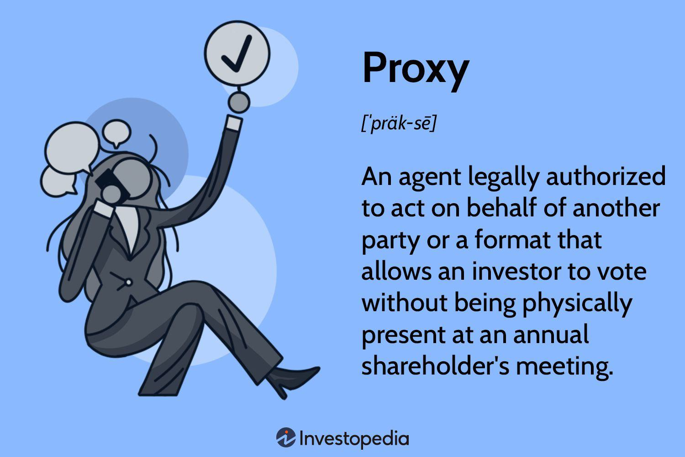

A proxy acts as an intermediary between a client and a server, allowing users to request information indirectly. This setup has become vital in modern network security and algorithmic trading. Proxies facilitate anonymity and security by preventing direct interaction between the user's device and the vast, potentially insecure web. This intermediary role comes into play in protecting data integrity and privacy, and optimizing network resources.

In network security, proxies mask the user's IP address, thus providing anonymity and reducing the risk of targeted cyberattacks. They also act as gatekeepers by filtering web content and distributing network traffic to minimize vulnerabilities. Proxies can protect against malicious attacks and offer a first line of defense in safeguarding sensitive data across networks.

Algorithmic trading also benefits from proxy utilization. These automated systems rely heavily on speed and security to execute trades efficiently. Proxies ensure that trading algorithms can function optimally by maintaining low latency and providing secure pathways for data transactions. Furthermore, through anonymization, proxies can protect the trading strategies and sensitive financial data from competitors and unauthorized access.

This article aims to explore how proxies enhance network security and support algorithmic trading by improving anonymity, data protection, and performance optimization, thus underscoring their critical role in the technological landscape today. Understanding the intersection of proxy usage in these domains can provide insights into more efficient and secure infrastructures for businesses and individuals alike.

## Table of Contents

## What is a Proxy?

A proxy is an intermediary entity that facilitates communication between a client and a server, often providing additional functionalities such as privacy, security, and data management. The concept of a proxy is widely utilized in computing and networking to enhance how data is transmitted and received across the internet. Proxies serve a dual purpose: ensuring security and optimizing performance in various contexts, including algorithmic trading and general internet use.

### Types of Proxies

There are primarily two categories of proxies: proxy servers and proxy software. 

**Proxy Servers:** These are hardware-based solutions, often running on dedicated network devices. Proxy servers intercept requests from client devices and forward them to the target server. They mask the client's IP address, providing anonymity and security. Common types include:

1. **Forward Proxies:** Handle requests from a client and send them to the internet. They are used to bypass firewalls and geographic restrictions.
2. **Reverse Proxies:** Sit in front of web servers and handle requests from clients on the internet. They help distribute traffic loads and improve security for web servers.
3. **Transparent Proxies:** Intercept communications without modifying requests or responses, useful mainly for caching and monitoring traffic.

**Proxy Software:** These are applications installed on devices to serve as proxies. They offer flexibility and customization for specific tasks, including automatic encryption and selective traffic management.

### Uses of Proxies in IT

Proxies are integral to network security and management. They offer several significant uses:

- **Anonymity and Privacy:** Proxies can hide the user's IP address, making online activities nearly anonymous and protecting against tracking and profiling.
- **Access Control and Content Filtering:** Organizations utilize proxies to manage access to specific websites and content, enhancing productivity and compliance with industry regulations.
- **Load Balancing and Caching:** By distributing incoming network traffic across multiple servers, proxies ensure efficient resource use and minimize response times in high-traffic situations.
- **Data Encryption:** Proxies can encrypt data transmitted between client and server, shielding sensitive information from potential interceptors.

### Proxies as Intermediaries

In security contexts, proxies act as gatekeepers, examining incoming and outgoing data to detect and block malicious activities. They serve as an additional defense layer in network infrastructures, thwarting unauthorized access and potential data breaches.

In trading environments, particularly in [algorithmic trading](/wiki/algorithmic-trading), proxies are pivotal for securing trading algorithms and ensuring data integrity. They manage access to trading platforms and servers, facilitating secure transactions and communications. Furthermore, proxies reduce latency—a crucial [factor](/wiki/factor-investing) in high-frequency trading—by routing data through the most efficient paths and thus enabling traders to execute algorithms with minimal delays.

By mediating interactions between clients and servers, proxies enhance the robustness and efficiency of both network security operations and trading processes, offering reliable support for the demands of modern computational tasks.

## Benefits of Proxies in Network Security

Proxies play a pivotal role in enhancing network security by acting as intermediaries between users and the internet, thereby masking the user's Internet Protocol (IP) address and ensuring anonymity. This layer of anonymity not only protects individual user identity but also secures sensitive data from potential attackers. By concealing the user's IP address, proxies mitigate the risks posed by direct cyber-attacks, thereby safeguarding personal and organizational data.

Furthermore, proxies serve as effective tools for filtering web content and controlling access to information. Network administrators can configure proxy servers to block or allow access to specific websites based on predefined security policies. This capability is especially beneficial in corporate environments where controlling the flow of internet traffic is crucial to maintaining network integrity and productivity. Proxies can restrict access to malicious websites, thus preventing the download of harmful software that could compromise network security.

In addition to web filtering and access control, proxies offer robust protection for sensitive trading data. In the trading domain, the confidentiality and integrity of data are paramount due to the significant financial implications of data breaches. Proxies encrypt data transmitted between the user and the server, adding an extra security layer that makes it difficult for attackers to intercept or alter trading information. Furthermore, proxies can detect unusual patterns of data requests and transactions, thereby identifying and preventing potential security threats before they occur.

By leveraging these security-enhancing features, proxies provide a comprehensive solution to protecting network infrastructure and ensuring secure data exchange. Whether used for individual anonymity or for the safeguarding of corporate data assets, proxies are indispensable in modern network security protocols, offering a barrier against unauthorized access and cyber threats.

## Proxies in Algorithmic Trading

Proxies play a vital role in algorithmic trading by securing trading algorithms and servers. They function as intermediaries between the user's device and the destination server, providing an added layer of security. By masking the original IP address, proxies protect sensitive information and trading strategies from malicious attacks and unauthorized access.

One significant advantage of using proxies in trading environments is their ability to ensure low latency, which is imperative for high-frequency trading ([HFT](/wiki/high-frequency-trading-strategies)). HFT relies on executing a large number of orders at extremely high speeds, often within microseconds. Proxies contribute to reducing latency by optimizing the route data takes to reach its destination, minimizing delays that can occur with longer or more congested paths. Additionally, dedicated proxy servers can be geographically positioned close to critical market data centers, further reducing the time taken for data transmission. This proximity means algorithms can react more swiftly to market changes, increasing the potential for profitability in trading strategies.

Network proxies also play a crucial role in maintaining anonymity within trading operations. By obscuring the trader's IP address, proxies ensure that trading activities cannot be easily attributed to a specific individual or organization. This anonymity is particularly important in competitive trading arenas where firms seek to protect their strategies from being reverse-engineered or targeted by competitors. In addition to safeguarding proprietary trading models, anonymity fosters a competitive edge by preventing adversaries from gaining insights into the trade patterns and volumes being executed.

Overall, proxies offer traders the dual benefits of enhanced security and operational efficiency. By securing algorithms and servers, ensuring low latency, and upholding anonymity, proxies are indispensable tools that bolster the robustness of algorithmic trading systems.

## Proxy Mechanisms: Enhancing Trading Algorithms

Proxies play a significant role in enhancing trading algorithms by enabling real-time analysis of trading data. They act as intermediaries that can help manage and analyze large volumes of data quickly and efficiently, which is crucial for algorithmic trading strategies. By routing data through proxy servers, trading systems can preprocess and filter data, facilitating faster decision-making.

**Proxy Indicators in Trading Strategies**

Proxy indicators serve as substitutes for direct measurements in trading strategies. When direct data measurements are either unavailable or too costly to obtain, proxy indicators provide alternative metrics that help evaluate market conditions. By using proxies, traders can infer market trends and make informed decisions without relying solely on primary data sources. For example, in a situation where direct market sentiment data is hard to come by, social media sentiment analysis could serve as a proxy to gauge the overall market mood. Proxy indicators thus allow trading algorithms to operate effectively even with incomplete data.

**Support for Algorithmic Upgrades and Governance**

Proxies also support algorithmic upgrades and governance by providing a flexible layer that can be updated or configured independently of the core trading engine. This modularity allows developers to upgrade or tweak algorithms without disrupting the main trading activities. For example, new data feeds or analytical models can be integrated through proxies, enabling the algorithm to adapt to changing market conditions swiftly.

Furthermore, using proxies aids in implementing governance policies related to trading algorithms. By centralizing control over which data is accessible to which parts of the trading system, proxies can enforce data governance rules, ensuring compliance with regulatory standards. This governance role of proxies helps maintain robust, secure, and compliant trading operations, which is especially important given the regulatory scrutiny in financial markets.

In implementing these mechanisms, proxies enhance both the efficiency and the compliance of trading algorithms, supporting the dynamic needs of modern trading environments.

## Proxy Applications and Tech Insights

Proxies have become indispensable tools in the domain of algorithmic trading, with numerous companies leveraging their capabilities to optimize trading platforms. A prime example is the use of proxies to access diverse market data sources without revealing the originating server's identity, ensuring confidentiality and minimizing the risk of data breaches. Companies employing high-frequency trading (HFT) rely on proxies to manage latency and improve the speed of transactions by facilitating direct connections to exchanges with minimal delay.

Advancements in financial technology have further integrated proxy technologies by improving encryption methods and developing specialized software to handle large volumes of trading data efficiently. These advancements allow for real-time data analysis while maintaining high levels of security through discrete proxy channels. For example, advanced proxy configurations enable algorithmic trading systems to automate trading strategies by executing high-speed transactions across multiple markets simultaneously, ensuring optimal execution and market impact minimization.

A noteworthy case study involves a fintech company that successfully integrated proxies into its trading system to enhance data security and algorithm efficiency. By employing rotating proxies, the company could continuously switch IP addresses, making it difficult for competitors to track trading patterns or predict strategies. This implementation not only protected sensitive trading algorithms but also optimized the trading speed, offering a competitive edge in the market.

Furthermore, proxies help improve the scalability of algorithmic trading systems. As [volume](/wiki/volume-trading-strategy) increases, proxies can distribute requests across multiple servers, preventing overload and ensuring consistent performance. This capability is crucial for companies that require robust systems capable of handling high-frequency trades during peak market times.

The integration of proxy technologies in trading systems highlights the importance of balancing security with performance. By employing sophisticated proxy solutions, companies can maintain anonymity, protect proprietary algorithms, and ensure the swift processing of trades in competitive financial environments. These developments reflect a growing trend in fintech where security and speed are paramount, demonstrating the critical role of proxies in modern algorithmic trading infrastructures.

## Challenges and Considerations

Implementing proxies within trading systems presents several challenges that need careful consideration. One of the most significant challenges involves navigating the regulatory landscape, particularly in financial markets where compliance requirements can be rigorous and demanding. Proxies, which often facilitate anonymity and data routing, may be scrutinized under regulations designed to prevent illegal activities such as money laundering and insider trading. For instance, regulations like the Markets in Financial Instruments Directive (MiFID II) in the European Union mandate stringent reporting and transparency requirements that can conflict with the inherent anonymity provided by proxies.

Furthermore, the implementation of proxies must also align with data protection laws such as the General Data Protection Regulation (GDPR), which imposes rules on data handling and transfers. Financial institutions must ensure that their use of proxies does not compromise sensitive customer data, leading to potential legal and financial repercussions.

Balancing proxy security with algorithm efficiency is another critical consideration. Proxies are integral in safeguarding trading algorithms and preventing unauthorized access. However, their implementation can introduce latency, which is a significant concern in high-frequency trading (HFT) environments where nanoseconds count. The additional layer a proxy introduces can potentially slow down data transmission, thus impacting the timing and efficacy of trading decisions.

To mitigate these latency issues, optimization strategies are vital. A possible solution involves utilizing high-performance proxy servers capable of handling substantial data loads with minimal delay. Another approach could involve deploying proxies strategically to balance the need for security with the requirements of speed. For instance, using direct connections for time-sensitive data while routing less critical operations through proxies can help maintain an efficient trading system.

In addition, algorithm efficiency can be hindered by the misuse or overuse of proxies, as excessive routing layers can complicate data paths and increase the risk of bottlenecks. Continuous monitoring and the use of advanced networking technologies, such as edge computing and content delivery networks (CDNs), can help alleviate these concerns by ensuring data is processed closer to its source, reducing the distance data needs to travel and subsequently enhancing speed and performance.

Ultimately, while proxies offer substantial benefits in securing trading systems, they necessitate a thoughtful balance between security requirements and trading performance. Financial institutions must meticulously evaluate their proxy configurations, remain compliant with regulatory standards, and continuously adapt to technological advancements to leverage the full potential of proxies in algorithmic trading systems.

## Conclusion

Proxies play a crucial role in enhancing both network security and algorithmic trading, serving as vital tools in modern financial technology. In network security, proxies offer anonymity and protection of sensitive data by acting as intermediaries between users and the internet. They filter content, control access, and prevent unauthorized data breaches, ensuring robust defenses against cyber threats.

In algorithmic trading, proxies are indispensable in protecting trading algorithms and ensuring secure server communications. They contribute to low-latency environments essential for high-frequency trading, maintaining competitive advantage and transaction speed. Furthermore, proxies safeguard trading data and enhance algorithm efficiency through real-time data analysis and proxy indicators, supporting strategic decision-making and operational agility.

The evolving landscape of financial technology continues to benefit from proxy applications, which enhance security protocols and trading efficiencies. Emerging advancements and innovative solutions promise to refine these applications further, paving the way for more sophisticated financial systems.

Future exploration and continued innovation in proxy technologies are critical for maintaining cutting-edge algorithmic trading practices and network security standards. Encouraging discourse on advanced solutions will contribute to adaptive, resilient systems that meet the demands of a fast-paced, ever-evolving financial environment. Engaging with these developments will be essential for financial institutions aiming to leverage the full potential of proxies.

## Further Reading and Resources

For those interested in expanding their knowledge of network security and algorithmic trading, numerous resources provide comprehensive insights and advanced techniques. Here are some recommended readings and platforms for further exploration:

### Articles and Studies on Network Security

1. **"A Survey of Network Security Systems: From Computer Networks to Hybrid Networks"** - This study provides an extensive overview of the various systems and frameworks involved in securing networks, emphasizing recent advancements and challenges faced in hybrid networks. It can be accessed at [ResearchGate](https://www.researchgate.net/).

2. **"The Science of Network Security: Strategies and Solutions"** - This article outlines strategic approaches to fortifying network security infrastructures and is available in the Journal of Network and Computer Applications. Explore more at [ScienceDirect](https://www.sciencedirect.com/).

3. **"Cyber Security and Internet of Things: Challenges, Opportunities, and Threats"** - Published by the IEEE, this paper discusses the intersection of cybersecurity with IoT, highlighting emerging threats and potential security strategies. Read it on [IEEE Xplore](https://ieeexplore.ieee.org/).

### Resources on Algorithmic Trading Technologies

1. **QuantInsti: Algorithmic Trading Courses** - QuantInsti offers extensive courses and webinars on algorithmic trading and financial engineering, focusing on practical implementation and trading strategies. Check their offerings at [QuantInsti](https://www.quantinsti.com/).

2. **"Advancements in High-Frequency Trading Models"** - This publication provides insights into the latest high-frequency trading models and algorithms, available at [Journal of Trading](https://www.trading.journal.com/).

3. **Kaggle: Algorithmic Trading Competitions** - Kaggle hosts competitions and datasets for algorithmic trading, posing real-world challenges and solutions within competitive environments. Engage with the community at [Kaggle](https://www.kaggle.com/).

### Learning Platforms for Proxy Technologies

1. **Coursera: Cybersecurity Specialization** - Offered by top universities, this specialization covers network security foundations, including proxy technologies. Enroll at [Coursera](https://www.coursera.org/).

2. **Pluralsight: Networking Security Courses** - Pluralsight offers expert-led courses on network security, with modules dedicated to understanding and implementing proxy solutions. Start learning at [Pluralsight](https://www.pluralsight.com/).

3. **GitHub: Open Source Proxy Projects** - Explore various open-source projects related to proxy development and implementation. This is particularly useful for those interested in hands-on learning and project contributions. Visit [GitHub](https://github.com/).

These resources cater to a range of interests and expertise levels, providing avenues for deeper understanding and practical skills in network security, algorithmic trading, and proxy technologies.

## References & Further Reading

[1]: Bergstra, J., Bardenet, R., Bengio, Y., & Kégl, B. (2011). ["Algorithms for Hyper-Parameter Optimization."](https://papers.nips.cc/paper/4443-algorithms-for-hyper-parameter-optimization) Advances in Neural Information Processing Systems 24.

[2]: ["Advances in Financial Machine Learning"](https://www.amazon.com/Advances-Financial-Machine-Learning-Marcos/dp/1119482089) by Marcos Lopez de Prado

[3]: ["Evidence-Based Technical Analysis: Applying the Scientific Method and Statistical Inference to Trading Signals"](https://www.amazon.com/Evidence-Based-Technical-Analysis-Scientific-Statistical/dp/0470008741) by David Aronson

[4]: ["Machine Learning for Algorithmic Trading"](https://github.com/PacktPublishing/Machine-Learning-for-Algorithmic-Trading-Second-Edition) by Stefan Jansen

[5]: ["Quantitative Trading: How to Build Your Own Algorithmic Trading Business"](https://books.google.com/books/about/Quantitative_Trading.html?id=j70yEAAAQBAJ) by Ernest P. Chan