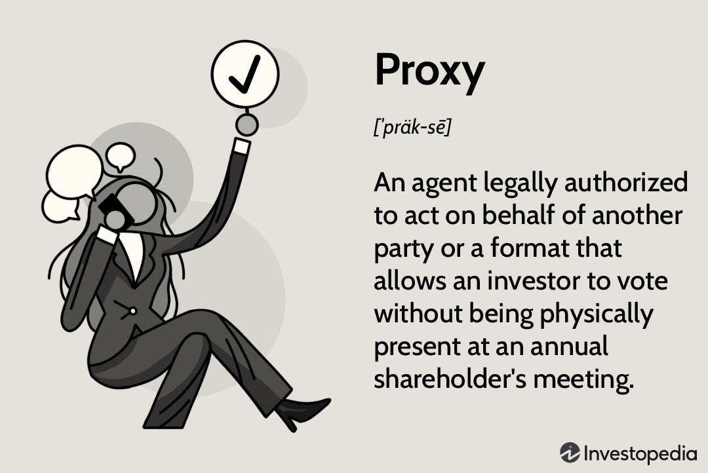

In today's corporate world, shareholder voting, corporate governance, and the use of proxy materials are essential for maintaining transparency and accountability within organizations. These mechanisms allow shareholders to exert influence over corporate decisions, such as electing board members, approving mergers, and determining executive compensation. Proxy materials serve as crucial informational tools that enable shareholders to make informed decisions by providing comprehensive insights into corporate agendas and issues. The Securities and Exchange Commission (SEC) plays a vital role in regulating these processes to ensure fairness and transparency.

However, modern trends such as algorithmic trading are increasingly influencing these traditional aspects. Algorithmic trading, which relies on sophisticated algorithms to automate trading decisions, has reshaped the dynamics of financial markets. It not only affects stock prices and market perceptions but also impacts shareholder decision-making processes. The rapid and massive volumes of trading executed by algorithms can create a volatile environment that influences corporate governance and shareholder voting. Understanding these intersections is critical, as the evolving financial landscape requires stakeholders to adapt governance strategies accordingly. By exploring these complex relationships, this article aims to provide a comprehensive view of their implications in the financial sector.

## Table of Contents

## Understanding Shareholder Voting

Shareholder voting is a fundamental aspect of corporate governance, enabling company owners, or shareholders, to exert their influence on pivotal corporate decisions. These decisions often include electing board members, approving strategic mergers and acquisitions, and determining executive compensation packages. Each shareholder's voting power is typically proportional to their ownership stake, embodying the principle of "one share, one vote," though variations can exist depending on company-specific voting structures.

The voting process can be conducted either in person at shareholder meetings or remotely via proxy voting. Proxy voting is a mechanism that allows shareholders to delegate their voting rights to a representative, offering an alternative for those unable to attend meetings in person. This flexibility ensures broader participation and facilitates the decision-making processes within corporations.

Regulatory frameworks, primarily guided by the Securities and Exchange Commission (SEC) in the United States, heavily regulate the shareholder voting process. The SEC sets stringent rules to ensure the fairness and transparency of voting procedures, aiming to protect shareholder rights and ensure they have access to adequate information for informed decision-making.

Understanding the intricacies of shareholder voting is essential for shareholders seeking to meaningfully engage with corporate governance. A well-versed shareholder will not only comprehend the immediate aspects of voting but also appreciate the broader implications of their decisions on corporate strategy and the company's long-term performance. This knowledge empowers shareholders to actively participate in shaping corporate policies and strategies, aligning their interests with those of the corporation.

## The Role of Proxy Materials in Corporate Governance

Proxy materials are critical components of corporate governance, serving as the primary communication tools between a corporation and its shareholders. These materials provide detailed information regarding the issues to be addressed in upcoming shareholders' meetings, facilitating informed decision-making by the shareholders. Proxy materials typically encompass documents such as proxy statements, annual reports, and information on agenda items including executive compensation packages, board member elections, and proposed mergers or acquisitions.

The distribution of proxy materials is heavily regulated by the Securities and Exchange Commission (SEC) to ensure transparency and accuracy. According to SEC regulations, companies must distribute these materials to shareholders well in advance of voting meetings, typically at least 40 days prior, giving shareholders ample time to review and understand the implications of the issues at hand. This requirement is intended to prevent the dissemination of misinformation and ensure that shareholders can exercise their voting rights effectively. 

Proxy statements, a central component of these materials, provide a comprehensive overview of the key issues that will be voted on. They include detailed descriptions of each agenda item, providing insights into the impact of different decisions on the company’s strategic direction. For example, information regarding executive compensation often includes salary structures, bonuses, stock awards, and other benefits, allowing shareholders to assess whether the proposed packages align with their interests and the company’s performance.

The informative nature of proxy materials plays a pivotal role in aligning shareholder interests with corporate goals. By delivering all necessary information, these materials enable shareholders to make decisions that reflect their preferences regarding how the company should be governed. This alignment reinforces the integrity of corporate governance, as it ensures that the actions taken by the management and the board are consistent with shareholder expectations and objectives.

Moreover, the process of preparing and distributing proxy materials fosters accountability within the corporate structure. Companies are compelled to clearly articulate their strategies, financial positions, and governance practices, which not only informs shareholders but also subjects the company’s plans and performance to scrutiny. This adds a layer of oversight that can deter management from engaging in risky or unapproved activities that might negatively affect shareholder value.

In summary, proxy materials are indispensable tools in the corporate governance framework, facilitating transparency, accountability, and informed decision-making. By ensuring that shareholders have access to complete and accurate information about voting matters, these materials help to align shareholder interests with corporate governance objectives, thus reinforcing the trust and integrity essential to effective corporate management.

## Legal Implications of Proxy Voting

The legal framework governing proxy voting serves a crucial role in protecting shareholder rights and sustaining corporate accountability. Underpinning this framework are regulations set forth by the U.S. Securities and Exchange Commission (SEC), which dictate the production, content, and distribution of proxy materials. These regulations aim to prevent misinformation and coercion, safeguarding the voting process and ensuring that shareholders make decisions based on accurate and comprehensive data.

Proxy materials, according to the SEC, must be meticulously crafted to include all relevant information concerning the matters to be voted on. This includes details about proposed board members, executive compensation packages, and any merger or acquisition proposals. The accuracy and completeness of these documents are paramount, as they inform shareholders about crucial decisions that impact their investments. Any omission or misleading information can result in severe consequences for the company, including legal penalties and diminished investor confidence.

Compliance with laws such as the Securities Exchange Act of 1934 is essential for validating proxy solicitations. This Act provides a statutory basis for regulating proxy voting and empowers the SEC to enforce rules that ensure transparency in shareholder communication. For instance, the Act mandates the timely distribution of proxy statements to all eligible voters, allowing them sufficient time to review and make informed decisions. Failure to comply with these legal requirements not only results in financial penalties but can also erode trust between shareholders and corporate management—a critical component in maintaining robust governance practices.

Legal compliance in the proxy voting process not only protects shareholders but also enhances the overall confidence in corporate governance. By adhering to these regulations, companies demonstrate their commitment to transparency and accountability. This assurance is particularly vital in today's market environment, where ethical governance standards are increasingly scrutinized by investors and the public alike.

Understanding these legal aspects is crucial for companies to navigate the complex landscape of corporate governance effectively. An informed approach to proxy voting ensures that companies remain in good standing with regulatory bodies and preserve the trust of their shareholders. By upholding these legal standards, corporations can foster a governance culture that values integrity and responsive stakeholder engagement.

## Algorithmic Trading and Its Impact on Shareholder Voting

Algorithmic trading is a sophisticated method that utilizes complex mathematical models and computational algorithms to make high-speed trading decisions with minimal human intervention. This approach has transformed the financial markets, introducing efficiencies and complexities that significantly influence stock market dynamics and, by extension, shareholder voting behavior.

One prominent way [algorithmic trading](/wiki/algorithmic-trading) influences shareholder voting is through its impact on stock prices and market perceptions. Algorithms often execute trades based on real-time data, news events, and financial indicators, thus affecting stock prices almost instantaneously. As stock prices fluctuate, the perceived value and stability of a company may alter, influencing shareholder sentiments and decision-making during votes. For example, a rapid decline in stock prices triggered by algorithmic trading could lead shareholders to vote against incumbent management in favor of board members advocating for change.

Furthermore, within the context of algorithmic trading, the term "proxy" can denote statistical indicators or strategic mechanisms employed to enhance trading strategies. By using proxies such as [volatility](/wiki/volatility-trading-strategies) indices, [liquidity](/wiki/liquidity-risk-premium) measures, or even digital constructs designed to ensure data privacy, trading algorithms can optimize their operations, further influencing market conditions and shareholder perceptions. 

The intersection of algorithmic trading and shareholder activities presents challenges to traditional voting processes. High-frequency trading, a subset of algorithmic trading, alone can create sudden market shifts, requiring companies to rethink governance frameworks to maintain decision-making efficacy. The traditional shareholder meeting process may not fully account for the rapid market changes instigated by algorithmic trades, leading to questions about the timeliness and relevance of shareholder votes. As these technologies evolve, they can outpace established governance structures, demanding innovations in shareholder engagement strategies to mitigate any adverse effects on corporate governance.

Looking ahead, algorithmic trading's growing influence on corporate governance will likely necessitate adaptation in shareholder engagement practices. To address these challenges, corporations may need to leverage technological advancements that enable real-time voting systems and enhanced data analytics for better insights into shareholder preferences. This can help align shareholder engagement with the fast-paced dynamics of modern financial markets, ensuring more effective governance and decision-making processes.

Ultimately, as algorithmic trading continues to reshape financial markets, the interplay between technology and governance will be critical in determining the future landscape of shareholder voting, urging stakeholders to remain adaptable and informed.

## Enhancing Corporate Governance Through Technology

The integration of technology within corporate governance frameworks is revolutionizing how organizations engage with shareholders, manage oversight, and ensure transparency. One of the primary advancements is the electronic dissemination of proxy materials. By moving from paper-based documents to digital formats, companies can significantly reduce costs associated with printing and distribution. Furthermore, electronic materials enhance accessibility, allowing shareholders to access essential information anywhere and at any time, fostering informed decision-making.

Online voting platforms represent another technological innovation enhancing shareholder participation. These platforms streamline the voting process, making it more accessible and user-friendly. Shareholders, regardless of their location, can participate in decision-making processes, effectively democratizing corporate governance. This increased participation can lead to more varied input into corporate decisions, contributing to more balanced and representative outcomes.

Moreover, technology plays a crucial role in enhancing the oversight capabilities of regulatory bodies. Advanced monitoring and reporting tools enable regulators to oversee corporate activities more efficiently, ensuring adherence to governance standards. By leveraging data analytics and [machine learning](/wiki/machine-learning), regulatory bodies can detect irregularities or non-compliance faster, allowing for timely intervention and maintaining integrity within markets.

Looking ahead, future technological developments are poised to further streamline proxy voting and corporate governance processes. Innovations such as blockchain technology have the potential to enhance security, transparency, and trust in shareholder voting by providing immutable records of transactions. Additionally, developments in [artificial intelligence](/wiki/ai-artificial-intelligence) could lead to more sophisticated analysis of shareholder votes and corporate behavior, supporting predictive analytics and strategic planning.

In conclusion, the integration of technology into corporate governance is facilitating a more inclusive, efficient, and transparent approach to shareholder engagement. As these technologies continue to evolve, they will likely drive further improvements in corporate governance structures, enabling organizations to better meet the needs of their diverse stakeholders.

## Conclusion

Shareholder voting, proxy materials, and corporate governance are essential to establishing and maintaining corporate accountability. These mechanisms ensure that shareholders have a voice in critical corporate decisions, thereby fostering transparency and trust between a corporation and its stakeholders. However, the advent of algorithmic trading introduces new complexities to these traditional practices. 

Algorithmic trading, characterized by high-speed automated decisions, not only influences market dynamics but also affects shareholder interactions. These changes compel corporations to adopt innovative governance strategies that can accommodate rapid shifts in market conditions. As algorithmic trading grows more sophisticated, its impact on corporate policies and shareholder voting becomes more pronounced, necessitating the development of new governance frameworks that are both agile and robust.

To achieve effective corporate governance, it is crucial to ensure transparency and adherence to legal standards, while simultaneously leveraging technological advancements. The deployment of digital solutions, such as online voting platforms and electronic distribution of proxy materials, has already begun to transform shareholder engagement. These technologies increase accessibility, reduce costs, and provide shareholders with timely, relevant information, which is essential for making informed voting decisions.

For stakeholders to capitalize on these developments, understanding and effectively navigating these intertwined areas is paramount. A well-informed shareholder base, equipped with the necessary tools and information, can drive impactful decisions that align with broader corporate goals. As the financial landscape continues to change, adaptability and vigilance will remain critical for all parties engaged in corporate governance. Stakeholders must stay updated on legal and technological changes, ensuring that their engagement strategies are reflective of the evolving corporate environment.

## References & Further Reading

[1]: Bebchuk, L., & Hamdani, A. (2009). ["The Elusive Quest for Global Governance Standards."](https://scholarship.law.upenn.edu/cgi/viewcontent.cgi?article=1193&context=penn_law_review) University of Pennsylvania Law Review, 157(5), 1263–1317.

[2]: Yermack, D. (2010). ["Shareholder Voting and Corporate Governance."](https://papers.ssrn.com/sol3/papers.cfm?abstract_id=1523562) National Bureau of Economic Research Working Paper No. 16574.

[3]: Harris, L. (2003). ["Trading and Exchanges: Market Microstructure for Practitioners."](https://www.amazon.com/Trading-Exchanges-Market-Microstructure-Practitioners/dp/0195144708) Oxford University Press.

[4]: O'Hara, M. (1997). ["Market Microstructure Theory."](https://www.amazon.com/Market-Microstructure-Theory-Maureen-OHara/dp/0631207619) Blackwell Publishers.

[5]: Hasbrouck, J. (2007). ["Empirical Market Microstructure: The Institutions, Economics, and Econometrics of Securities Trading."](https://academic.oup.com/book/52241) Oxford University Press.

[6]: Securities and Exchange Commission. (2020). ["Proxy Voting Process."](https://www.sec.gov/files/rules/policy/2020/ia-5547.pdf) U.S. Securities and Exchange Commission.

[7]: Lopez de Prado, M. (2018). ["Advances in Financial Machine Learning."](https://www.amazon.com/Advances-Financial-Machine-Learning-Marcos/dp/1119482089) Wiley.

[8]: Chan, E. (2013). ["Algorithmic Trading: Winning Strategies and Their Rationale."](https://github.com/ftvision/quant_trading_echan_book) Wiley.

[9]: Glassman, C. A. (2003). ["The Importance of Proxy Materials."](https://www.academia.edu/126591363/Physician_satisfaction_with_formulary_policies_is_it_access_to_formulary_or_nonformulary_drugs_that_matters_most) U.S. Securities and Exchange Commission.