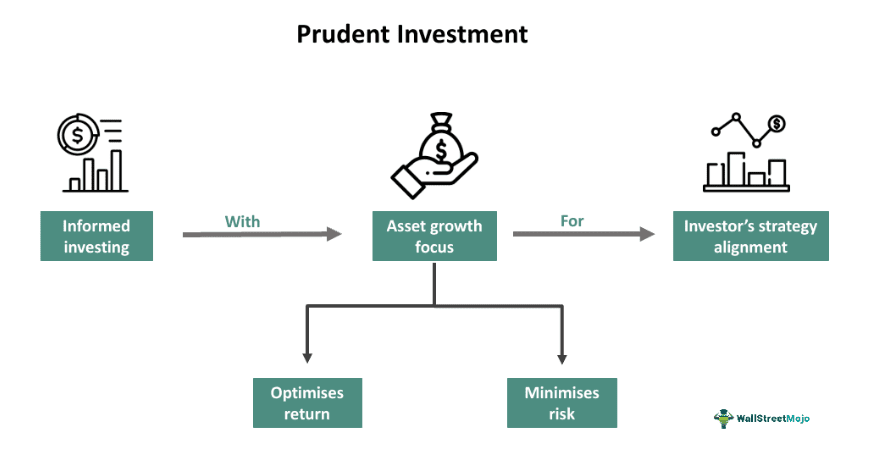

Investment strategies are essential for achieving financial goals and ensuring long-term growth. These strategies serve as structured plans that guide decision-making processes to balance risk and reward according to individual goals and circumstances. A well-structured investment strategy considers several critical factors, such as risk tolerance, which is the degree of variability in investment returns that an investor is willing to withstand. Additionally, the time horizon, or the expected period over which an investment is anticipated to be held before being liquidated, plays a crucial role. Understanding market conditions, which encompass economic indicators, industry trends, and geopolitical events, is equally vital to refine and adapt an investment strategy.

With technological advancements, algorithmic trading has emerged as an innovative and influential component of modern investment strategies. Algorithmic trading, or algo trading, employs complex mathematical models and rapid computer systems to automate trading decisions, thereby enhancing efficiency and performance. Algorithms can process vast amounts of market data quickly and execute trades based on predetermined criteria, which reduces human error and emotional involvement in trading decisions.



There is a growing intersection between prudent investment strategies and algorithmic trading. Combining traditional investment principles with the capabilities offered by technology enables investors to optimize their portfolios more effectively. This convergence reflects a transformative shift in investment management, where comprehensive financial planning incorporates algorithmic tools to achieve a more dynamic and responsive approach to realizing financial objectives.

This article explores several dimensions of investment strategies, emphasizing the need for prudent investment practices, the role of thorough financial planning, and the integration of algorithmic trading in today's dynamic investment landscape. By understanding these components, investors can tailor their strategies to meet personal financial goals while navigating the complexities of modern markets.

## Table of Contents

## Understanding Prudent Investment Strategies

A prudent investment strategy involves a disciplined approach to selecting and managing investments with the primary goal of maximizing returns while minimizing risks. One of the fundamental principles of prudent investment is diversification, which involves spreading investments across various asset classes to reduce exposure to any single asset's volatility. Asset classes typically include stocks, bonds, and commodities, each offering unique risk and return profiles, thus providing a balanced portfolio that can withstand market fluctuations.

For example, the correlation between different asset classes can be utilized to achieve diversification. If we denote the expected returns of assets by $E(R_i)$, the overall portfolio return can be modeled as:

$$
E(R_p) = \sum_{i=1}^{n} w_i \cdot E(R_i)
$$

where $w_i$ represents the weight of asset $i$ in the portfolio, and $n$ is the total number of assets. By adjusting these weights, investors can balance the trade-off between risk and return.

Regularly rebalancing the portfolio is another critical aspect of a prudent investment approach. Rebalancing involves adjusting the proportions of different assets in a portfolio to maintain the desired level of risk and to ensure alignment with investment objectives. For instance, suppose an investor's target allocation is 60% stocks and 40% bonds. Market movements may alter this distribution, leading to higher risk. Thus, periodic rebalancing realigns the actual allocation to the target, managing risk effectively.

Minimizing fees and costs associated with investments is crucial for optimizing portfolio performance. Investment costs, including management fees, transaction costs, and taxes, can significantly impact returns over time. Hence, selecting cost-effective investment vehicles, such as index funds or exchange-traded funds (ETFs), which typically have lower expense ratios compared to actively managed funds, can enhance net returns.

In summary, prudent investment strategies are centered around the principles of diversification, rebalancing, and cost minimization, all of which contribute to achieving a portfolio that maximizes returns while mitigating risks.

## The Role of Financial Planning in Investment Success

Financial planning is an essential component for achieving investment success, acting as the foundation for setting objectives, assessing resources, and strategizing to meet financial goals. The financial planning process includes various aspects like budgeting, tax planning, retirement planning, and estate planning, each contributing uniquely to the formulation of a robust financial strategy.

Budgeting forms the cornerstone of financial planning by offering a clear picture of income and expenses, enabling individuals to manage resources effectively. Ensuring that spending aligns with financial goals allows for the allocation of funds towards savings and investments, thus fostering financial security and growth. Carefully devised budgets can help individuals avoid unnecessary debt and allocate surplus funds to investment opportunities that match their risk tolerance and time horizons.

Tax planning optimizes financial efficiency by minimizing tax liabilities through strategic decisions. Effective tax planning considers potential deductions, credits, and the timing of income and expenses, which may alleviate the tax burden on investments. For instance, utilizing tax-advantaged accounts, such as retirement savings plans, can significantly enhance an individual's net worth over time.

Retirement planning is crucial for securing financial independence in the later stages of life. This process involves estimating future income requirements, assessing current savings, and choosing appropriate investment vehicles to bridge any gap. Key to this endeavor is understanding the power of compound interest, which can exponentially grow savings over extended periods. Selecting the right blend of investment products, including stocks, bonds, and mutual funds, helps in building a diversified retirement portfolio. 

Estate planning ensures that an individual's wealth is distributed according to their wishes posthumously, safeguarding their legacy. It includes drafting wills, setting up trusts, and designating beneficiaries for various accounts. Comprehensive estate planning minimizes probate costs and tax implications, thereby maximizing the benefits for heirs.

A comprehensive financial plan thus serves as a strategic roadmap for making informed investment decisions and maintaining [momentum](/wiki/momentum) towards financial targets. By outlining clear objectives and systematic strategies, a well-constructed plan assists individuals in weathering market [volatility](/wiki/volatility-trading-strategies) and adapting to life changes. Engaging with certified financial planners can further enhance this process. These professionals bring valuable expertise, offering insights tailored to individual circumstances and financial aspirations. By leveraging their knowledge, individuals can optimize their financial strategies to align with both current needs and future ambitions.

In conclusion, financial planning is instrumental in navigating the complexities of investment management. By incorporating detailed budgeting, strategic tax planning, disciplined retirement saving, and thorough estate considerations, individuals are better equipped to achieve enduring financial success.

 to Algorithmic Trading

Algorithmic trading, often referred to as algo trading, is a method of executing orders using automated pre-programmed trading instructions that take into account variables such as time, price, and [volume](/wiki/volume-trading-strategy). This form of trading leverages computer algorithms to make trading decisions, enabling rapid and precise execution of trades. The key advantage of [algorithmic trading](/wiki/algorithmic-trading) lies in its ability to enhance trading speed and accuracy while eliminating the emotional biases that often affect human traders. 

The core of algorithmic trading strategies revolves around a set of predefined rules or criteria. These strategies can be broadly categorized into various types, including trend-following, mean reversion, [arbitrage](/wiki/arbitrage), and [market making](/wiki/market-making). Trend-following strategies aim to capitalize on persistent market movements by identifying and surfing along prevailing trends. Mean reversion strategies, on the other hand, are based on the assumption that asset prices will eventually revert to their historical averages, offering opportunities to profit from price corrections.

Arbitrage strategies seek to exploit price discrepancies between different markets or instruments, generating profits from these inefficiencies. Market making involves providing [liquidity](/wiki/liquidity-risk-premium) to the market by placing simultaneous buy and sell orders, profiting from the bid-ask spread. These strategies highlight the diversity and adaptability of algorithmic trading approaches.

The automation enabled by algorithmic trading is a significant advantage over traditional manual trading. Algorithms can monitor multiple markets and execute numerous trades simultaneously, a feat that is virtually impossible for human traders. This capability allows algorithmic trading to take advantage of fleeting market opportunities and execute trades at speeds often measured in milliseconds.

Algorithmic trading has become an integral component of modern financial markets, enabling higher liquidity and more efficient market operations. It is crucial for traders and institutions to carefully design and test these algorithms to ensure they function as intended and manage the associated risks effectively.

## Types and Benefits of Algorithmic Trading Strategies

Algorithmic trading strategies are diverse, each with unique approaches to taking advantage of market conditions. Among these, trend-following, mean reversion, and arbitrage are widely recognized for their effectiveness and popularity.

Trend-following strategies aim to profit from identifying and following established market directions. These strategies monitor historical price movements to detect patterns that suggest continued trends. They leverage technical indicators like moving averages and momentum oscillators to signal entry and [exit](/wiki/exit-strategy) points. Successful trend-following relies on the statistical persistence of market trends and minimizes reliance on [fundamental analysis](/wiki/fundamental-analysis).

Mean reversion strategies are based on the premise that asset prices will revert to their historical averages over time. These strategies are employed when deviations from the mean are detected, positing that these movements are temporary and will correct themselves. Traders utilizing mean reversion may use Bollinger Bands or the Relative Strength Index (RSI) to identify overbought or oversold conditions. Such strategies are particularly effective in stable markets with no strong directional trends.

Arbitrage strategies exploit price discrepancies of the same asset across different markets or financial instruments. Opportunities arise when inefficiencies cause temporary differences in pricing. High-frequency traders often employ sophisticated algorithms to detect and execute arbitrage opportunities almost instantaneously. For example, [statistical arbitrage](/wiki/statistical-arbitrage) may involve pairs trading, where two correlated assets are traded against each other based on divergence and convergence patterns.

Algorithmic trading offers several benefits, making it an indispensable tool for modern traders and investors. The speed at which algorithms execute trades far surpasses human capabilities, which is crucial in markets where prices can change in milliseconds. Furthermore, algorithmic trading significantly reduces transaction costs by optimizing order execution and minimizing slippage. Finally, continuous market monitoring allows algorithms to operate 24/7, taking advantage of opportunities whenever they arise without human intervention.

In conclusion, the diverse types of algorithmic trading strategies cater to various market conditions and trading philosophies. The advantages of speed, cost efficiency, and perpetual market observation underscore their value in enhancing overall trading performance.

## Challenges and Considerations in Algorithmic Trading

Algorithmic trading, while providing significant advantages, also comes with its set of challenges that traders must navigate. Among these are technical glitches, which can arise from hardware or software malfunctions, leading to potentially significant financial losses. For instance, unexpected system failures or network issues might prevent the execution of trades, leaving traders vulnerable to volatile market conditions.

Another challenge is the overfitting of strategies. Overfitting occurs when a trading model is too finely tuned to historical data, capturing noise rather than genuine patterns. As a result, such models may perform well in [backtesting](/wiki/backtesting) but fail in live markets where the conditions differ. To address overfitting, traders often utilize techniques like cross-validation and out-of-sample testing to ensure their models are robust.

The high infrastructure costs associated with algorithmic trading can be a barrier, particularly for individual or small-scale investors. Establishing a reliable and efficient algorithmic trading system requires significant investment in technology infrastructure, encompassing powerful computing resources, fast and stable internet connections, and data feeds. Additionally, developing and maintaining successful algorithms require advanced technical knowledge, often necessitating a multidisciplinary team of quants, developers, and financial analysts.

Market impacts are another critical consideration in algorithmic trading, especially when executing large-scale trades. Such trades can cause significant price fluctuations, impacting market stability. This phenomenon is sometimes referred to as "market impact" and can lead to increased transaction costs and unfavorable trade conditions. Large orders can lead to price slippage, where the execution price deviates from the expected price due to market movements.

To mitigate the risks associated with algorithmic trading, careful design and thorough testing of algorithms are crucial. Traders typically use a variety of backtesting and simulation techniques to evaluate the performance of their strategies under different market scenarios. Additionally, implementing robust risk management protocols, such as setting stop-loss levels and using hedging strategies, can help protect against unforeseen market movements.

In summary, while algorithmic trading can enhance market efficiency and trading precision, it requires careful consideration of technical, financial, and market-related challenges. Traders must continuously refine their strategies and infrastructure to remain competitive and minimize risks.

## Integrating Prudent Strategies with Algorithmic Trading

Investment strategies that integrate prudent investment principles with algorithmic trading can provide a comprehensive approach to financial management. By merging traditional methodologies with technological advancements, investors can reap the benefits of both worlds, achieving diversified and efficient portfolios.

Prudent investment principles, built on diversification, risk management, and cost efficiency, establish a robust framework for algorithmic trading strategies. Diversification involves spreading investments across various asset classes to reduce risk. When integrated with algorithmic trading, diversification is enhanced through automation, allowing simultaneous execution of trades in different markets and asset types, ensuring better risk management and opportunities for returns.

Algorithmic trading's ability to adapt swiftly to market changes aligns with the prudent strategy of continuous evaluation and adaptation. Algorithms can be programmed to monitor market conditions and adjust positions automatically based on predefined criteria. For example, deploying a Python-based algorithm using libraries like NumPy and pandas, investors can adjust their trading strategies effectively:

```python
import numpy as np
import pandas as pd

# Example: Rebalancing portfolio based on market conditions
def rebalance_portfolio(portfolio, target_allocation, market_data):
    current_value = np.sum(portfolio['value'])
    target_value = current_value * target_allocation

    for asset in portfolio.index:
        if market_data[asset]['trend'] == 'uptrend':
            portfolio.at[asset, 'value'] += (target_value[asset] - portfolio.at[asset, 'value']) * 0.1
        elif market_data[asset]['trend'] == 'downtrend':
            portfolio.at[asset, 'value'] -= (portfolio.at[asset, 'value'] - target_value[asset]) * 0.1

    return portfolio

# Sample portfolio and market data
portfolio = pd.DataFrame({'value': [5000, 3000, 2000]}, index=['Stock A', 'Bond B', 'Commodity C'])
target_allocation = np.array([0.5, 0.3, 0.2])
market_data = {'Stock A': {'trend': 'uptrend'}, 'Bond B': {'trend': 'downtrend'}, 'Commodity C': {'trend': 'stable'}}

# Rebalance portfolio
rebalanced_portfolio = rebalance_portfolio(portfolio, target_allocation, market_data)
```

Collaboration with financial advisors can further optimize strategies by harnessing insights into both conventional and algorithmic methods. Financial advisors provide an essential perspective on risk tolerance, financial goals, and market knowledge, enabling more informed decision-making.

Leveraging technological advancements, like AI and [machine learning](/wiki/machine-learning), further enhances the integration by offering predictive analytics and improved data processing capabilities. This enables more precise and informed trading decisions, helping investors to adjust strategies dynamically and accurately.

The integration of prudent investment strategies with algorithmic trading provides a holistic approach to investment management, capitalizing on the strengths of both traditional and modern methods. Continuously evaluating and adapting strategies in response to market dynamics ensures that portfolios remain resilient and aligned with investors' financial objectives.

## Conclusion

Investment strategies vary widely, as they need to be customized to align with individual financial objectives and risk tolerance. Understanding one's unique financial situation and aspirations is critical for developing a tailored approach that maximizes potential returns while managing risk effectively. 

Prudent investment involves a combination of meticulous financial planning and the strategic allocation of resources. This careful planning forms the foundation for long-term success and provides resilience against the unpredictabilities of market fluctuations. Assets are allocated in a way that aims to balance growth and security, ensuring that investments can withstand economic turbulence and continue to work towards financial goals.

Integrating algorithmic trading within a comprehensive investment strategy offers significant advantages. This technological approach enhances the precision and efficiency of trades, thus optimizing the performance of an investment portfolio. The speed and data-driven nature of algorithmic trading ensure that investment decisions are free from human emotion, which can otherwise lead to irrational market behaviors.

However, the key to effective investment is adaptability. Given the rapidly evolving nature of the financial markets, investors must stay well-informed and proactive in modifying their strategies to adapt to new conditions. This involves continuous monitoring of market trends and being open to adopting new tools and methods that can further augment their investment portfolios.

In summary, a thoughtful blend of traditional investment principles and modern technological advances, such as algorithmic trading, can substantially enhance the efficiency and effectiveness of an investment strategy. Investors who remain engaged, adaptable, and informed not only safeguard their investments but also position themselves for sustained financial growth and success.

## References & Further Reading

[1]: Bergstra, J., Bardenet, R., Bengio, Y., & Kégl, B. (2011). ["Algorithms for Hyper-Parameter Optimization."](https://dl.acm.org/doi/10.5555/2986459.2986743) Advances in Neural Information Processing Systems 24.

[2]: ["Advances in Financial Machine Learning"](https://www.amazon.com/Advances-Financial-Machine-Learning-Marcos/dp/1119482089) by Marcos Lopez de Prado

[3]: ["Evidence-Based Technical Analysis: Applying the Scientific Method and Statistical Inference to Trading Signals"](https://www.amazon.com/Evidence-Based-Technical-Analysis-Scientific-Statistical/dp/0470008741) by David Aronson

[4]: ["Machine Learning for Algorithmic Trading"](https://github.com/stefan-jansen/machine-learning-for-trading) by Stefan Jansen

[5]: ["Quantitative Trading: How to Build Your Own Algorithmic Trading Business"](https://www.amazon.com/Quantitative-Trading-Build-Algorithmic-Business/dp/1119800064) by Ernest P. Chan