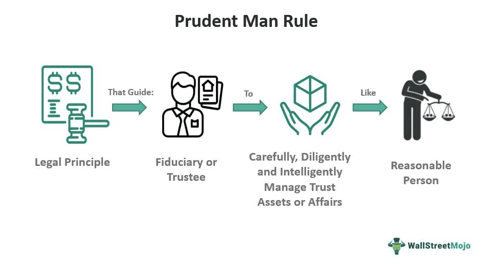

The world of investing is complex, with an array of rules and regulations designed to safeguard investors and ensure that fiduciaries act in the best interests of their clients. At the heart of this regulatory framework lies the concept of fiduciary duty, a fundamental principle that guides investment activities. Fiduciary duty requires those managing assets to prioritize the interests of their beneficiaries over their own, thereby enhancing trust and promoting responsible financial management. Among the investment standards that embody these principles is the prudent investor rule, which provides a benchmark for fiduciaries to adhere to when managing portfolios.

Originally derived from the early 19th-century Prudent Man Rule, the prudent investor rule mandates that trustees manage assets with the same care and skill that a prudent person would exhibit under similar circumstances. As codified in the Uniform Prudent Investor Act (UPIA), this rule emphasizes key investment strategies like risk management and portfolio diversification, allowing for a wide range of asset choices while maintaining a focus on beneficiaries' best interests.



In recent years, the rise of algorithmic trading has added a new dimension to investment management, making it even more crucial for fiduciaries to understand and apply these standards effectively. Algorithmic trading utilizes computer algorithms to execute trades at high speeds and volumes, offering potential benefits such as improved efficiency and enhanced risk management. However, this technological advancement also presents challenges, as fiduciaries must ensure that algorithmic strategies align with the fiduciary responsibilities outlined in the prudent investor rule.

This article will explore the prudent investor rule, its implications for fiduciaries, and the intersection of algorithmic trading with these duties. By examining the ethical and practical considerations involved, the article aims to provide a comprehensive overview of how fiduciary duty continues to evolve in the face of technological advancements in investment management. Through this exploration, investors and fiduciaries can better understand the balance between innovation and adherence to established fiduciary standards.

## Table of Contents

## Understanding Fiduciary Duty

Fiduciary duty represents a cornerstone of trust-based financial relationships, legally obligating one party to prioritize the interests of another when managing funds and assets. This duty is fundamentally defined by two core principles: loyalty and care. The duty of loyalty requires fiduciaries to act without personal conflict, keeping beneficiaries' interests paramount. This ensures fiduciaries cannot profit from their position unless expressly permitted by the beneficiaries themselves. The duty of care mandates fiduciaries to act with the same level of prudence and diligence that one would reasonably expect of a careful individual managing their own financial affairs.

In the context of investment management, fiduciary duty plays an essential role in structuring how decisions are made regarding asset management. Fiduciaries must navigate an increasingly complex array of financial instruments and strategies, ensuring that each choice aligns with the beneficiary's financial objectives and risk tolerance. The intricate nature of modern financial markets adds layers of complexity to these responsibilities, where fiduciaries must balance the potential for high returns with an acceptable level of risk exposure.

Moreover, fiduciaries are tasked with continuously monitoring the performance of investments, requiring a dynamic approach to portfolio management that adapts to changing market conditions. This involves analyzing data, forecasting economic trends, and applying financial theories, such as Modern Portfolio Theory (MPT), to optimize portfolio performance whilst managing risk. Importantly, the principles of diversification—investing in a varied range of assets to reduce overall risk—are central to fulfilling the duty of care.

Given these requirements, fiduciaries often rely on a combination of quantitative analysis and qualitative judgment to make informed investment decisions. This dual approach helps ensure that fiduciary obligations are met, safeguarding the financial welfare of beneficiaries despite the complexities inherent in contemporary financial ecosystems.

## The Prudent Investor Rule Explained

The prudent investor rule represents a significant evolution in fiduciary investment standards, originating from the historical Prudent Man Rule of the 1830s. This rule demands that trustees manage assets with the care, skill, and caution that a prudent person would exercise under similar circumstances. One of the primary objectives is to protect beneficiaries' interests by ensuring that fiduciaries make informed and judicious investment decisions.

The rule has been formalized through the Uniform Prudent Investor Act (UPIA), which provides a comprehensive framework emphasizing several key investment principles. A central tenet of the UPIA is the importance of risk management. This includes assessing and balancing potential risks and returns to safeguard the trust's assets. Proper risk management requires careful consideration of market conditions, economic forecasts, and the individual circumstances of the beneficiaries.

Diversification is another crucial aspect under the prudent investor rule. The UPIA stresses the need to spread investments across various asset classes to mitigate risk. This approach reduces the impact of a poor performance in any single investment or asset class on the overall portfolio. By diversifying, trustees can maximize potential returns while limiting exposure to any single source of financial risk.

Moreover, the prudent investor rule advocates for a holistic approach to portfolio management. Trustees are encouraged to consider the trust's entire portfolio rather than focusing on the performance of individual investments. This comprehensive strategy ensures that the portfolio aligns with the trust's objectives and the beneficiaries' needs.

The UPIA also introduces flexibility for trustees, allowing them to invest in a broad array of assets, including nontraditional investments, provided these serve the best interests of the beneficiaries. This adaptability is crucial in today's dynamic financial landscape, where a rigid adherence to conventional investment vehicles may not always yield the best outcomes.

In summary, the prudent investor rule, as encapsulated by the UPIA, mandates a balanced approach to investment with a focus on risk management, diversification, and strategic portfolio oversight. It empowers trustees to make well-informed decisions that prioritize beneficiaries' interests while allowing adaptability in changing market conditions.

## Investment Standards Under the Prudent Investor Rule

Trustees have a critical responsibility under the prudent investor rule to consider each investment not in isolation but as part of the entire trust portfolio. This holistic approach prioritizes the balance between risk and return, urging trustees to diversify investments to reduce potential losses effectively.

Diversification is a fundamental principle embedded in the prudent investor rule, and it requires a trustee to allocate resources across various asset classes and geographical regions to bolster the portfolio's risk-bearing capacity. This strategy helps to mitigate the undue influence of adverse performance from any single investment or market sector on the overall portfolio.

A key aspect of adhering to the prudent investor rule is the consideration of risk tolerances. Trustees must assess how much risk is acceptable based on the trust's objectives and the beneficiaries' specific needs. Different beneficiaries may have varying income requirements and time horizons, necessitating a tailored risk management approach in the investment strategy.

Investment objectives also play a pivotal role. Trustees should clarify the financial goals, whether income generation, growth, or preservation of capital, and align the investment strategy accordingly. Aligning the objectives with the risk profile ensures the portfolio meets the fiduciary duty requirements to the beneficiaries.

Moreover, trustees are advised to employ Modern Portfolio Theory (MPT) principles, which quantitatively analyze asset performance correlations to construct an optimal portfolio that maximizes returns for a given risk level. The application of MPT can be facilitated using Python libraries such as NumPy and pandas. Below is a sample Python code snippet demonstrating how to calculate the expected return and portfolio variance:

```python
import numpy as np

# Expected returns for each asset
returns = np.array([0.08, 0.12, 0.15])

# Covariance matrix
cov_matrix = np.array([[0.005, -0.010, 0.004], 
                       [-0.010, 0.040, -0.002], 
                       [0.004, -0.002, 0.023]])

# Portfolio weights
weights = np.array([0.3, 0.4, 0.3])

# Calculate expected portfolio return
portfolio_return = np.dot(weights, returns)

# Calculate portfolio variance
portfolio_variance = np.dot(weights.T, np.dot(cov_matrix, weights))

portfolio_return, portfolio_variance
```

This code calculates the portfolio's expected return and variance based on various asset returns and covariances, helping trustees to make informed decisions under the prudent investor rule.

Ultimately, trustees are expected to exercise due care and skill in aligning investment decisions with the trust's mandates while balancing the risk-return trade-off so crucial typical of modern fiduciary investing.

## Algorithmic Trading and Fiduciary Duty

Algorithmic trading, a method utilizing complex algorithms to automate and optimize trading strategies, introduces significant considerations for fiduciaries operating under the prudent investor rule. While algorithmic strategies can significantly enhance trading efficiency and risk management, they necessitate diligent oversight to ensure that these technological innovations comply with fiduciary duties.

Algorithms can process vast amounts of data to make informed trading decisions swiftly, often executing trades at a speed and frequency beyond human capacity. This capability aligns with the fiduciary obligation to manage assets efficiently, aiming to achieve optimal returns for beneficiaries. However, the rapid decision-making by algorithms must be carefully monitored. Fiduciaries must engage in due diligence to ensure these strategies do not compromise the portfolio's risk parameters or conflict with the trust's long-term investment goals.

One critical aspect of this oversight is the testing and validation of algorithmic models. Fiduciaries should collaborate with quantitative analysts to backtest algorithms over historical data, thereby evaluating their potential performance and susceptibility to market conditions. Implementing simulation techniques, such as Monte Carlo simulations, can provide insights into how algorithms might perform under various market scenarios, allowing fiduciaries to assess potential risks adequately.

```python
import numpy as np

def monte_carlo_simulation(initial_value, num_simulations, num_days, daily_return, daily_volatility):
    np.random.seed(42)
    results = []
    for _ in range(num_simulations):
        prices = [initial_value]
        for _ in range(num_days):
            prices.append(prices[-1] * (1 + np.random.normal(daily_return, daily_volatility)))
        results.append(prices)
    return results

# Parameters
initial_portfolio_value = 100000  # starting portfolio value
simulations = 1000  # number of simulations
days = 252  # number of trading days in a year
expected_daily_return = 0.0005  # expected daily return
daily_volatility = 0.01  # daily volatility

simulated_data = monte_carlo_simulation(initial_portfolio_value, simulations, days, expected_daily_return, daily_volatility)
```

Moreover, fiduciaries have the responsibility to ensure algorithms do not take undue risks that could endanger the portfolio. This involves setting strict parameters for trading strategies, such as position limits, stop-loss levels, and risk-reward ratios, to prevent excessive exposure to volatile market conditions. Regular audits and performance reviews are essential to adapt algorithms to evolving market dynamics and verify their alignment with fiduciary obligations.

Incorporating environmental, social, and governance ([ESG](/wiki/esg-investing)) considerations into algorithmic models is another growing facet of fiduciary responsibility. By integrating these ethical considerations, algorithms can be tailored to support sustainable investment practices without sacrificing performance.

While the delegation of trading functions to algorithmic systems is permissible under the Uniform Prudent Investor Act, fiduciaries remain ultimately accountable for their oversight. They must establish comprehensive frameworks to monitor algorithmic operations, ensuring they continually uphold the trust's investment objectives and adhere to fiduciary standards. Through meticulous supervision and adaptation, fiduciaries can leverage [algorithmic trading](/wiki/algorithmic-trading) to optimize portfolio management while steadfastly honoring the principles of the prudent investor rule.

## Ethical Considerations and Delegation

The Uniform Prudent Investor Act (UPIA) grants fiduciaries the ability to delegate investment decisions to qualified professionals. This delegation, however, does not absolve fiduciaries from maintaining overall responsibility for monitoring and managing these entrusted decisions. The core principle underlining this process is that fiduciaries must ensure the delegated tasks are performed in a manner consistent with their duty to act in the beneficiaries' best interests. This requires exercising careful judgment both in the selection of these professionals and in the ongoing supervision of their activities.

Ethical considerations are becoming increasingly significant in investment decision-making. Environmental, Social, and Governance (ESG) factors are gaining traction as critical investment criteria. Incorporating ESG factors into the investment process is not only a response to global challenges such as climate change and social inequality but also a component of the fiduciary's duty to evaluate all material risks and opportunities that may impact the beneficiaries' interests.

Trustees must engage in thorough due diligence when selecting external managers or advisors. This involves assessing the qualifications, performance history, and investment philosophy of potential [agents](/wiki/agents) to ensure they align with the objectives and risk tolerance of the trust. Additionally, fiduciaries should establish clear guidelines and metrics for evaluating the performance of these agents. Regular reviews and audits should be conducted to verify that the agents are adhering to these guidelines and delivering satisfactory results.

Moreover, monitoring delegated functions is crucial to uphold fiduciary duties. This entails continuous evaluation of the investment strategies and their execution to confirm they remain aligned with the trust's objectives. Technology can aid in this oversight role, providing tools that can track investments, analyze performance against benchmarks, and simulate potential outcomes under varying market conditions. However, reliance on technology should be complemented with human insight to interpret data and make informed decisions.

In conclusion, while the UPIA accommodates delegation to expert professionals, fiduciaries owe it to their beneficiaries to maintain rigorous oversight, incorporate ethical considerations such as ESG, and ensure that delegated tasks advance the trust's overall mission effectively.

## Case Studies and Examples

### Case Studies and Examples

The prudent investor rule, integral to fiduciary duty, has evolved significantly over time. Historical cases such as Harvard College v. Amory (1830) provide a bedrock for understanding fiduciary investing, highlighting the challenges trustees faced in balancing risk and return for beneficiaries. This landmark case established the "Prudent Man Rule," which guided trustees to act as a "prudent man" would in managing a trust's financial resources, laying the groundwork for modern fiduciary standards.

In contemporary settings, trustees often manage complex portfolios under the Uniform Prudent Investor Act (UPIA). For instance, public pension funds such as the California Public Employees' Retirement System (CalPERS) illustrate the modern implementation of fiduciary responsibilities. CalPERS employs diversified investment strategies, incorporating both traditional assets and alternative investments like private equity and real estate, aligning with the UPIA's emphasis on diversification and risk management. This approach demonstrates how trustees seek to optimize returns while adhering to the best interests of beneficiaries.

The advent of technology has further transformed trust management. Algorithmic trading, in particular, poses unique challenges and opportunities. Modern fiduciary practitioners integrate sophisticated technology platforms to execute trades and manage risks efficiently. Case studies in the financial services sector, such as the adoption of robo-advisors by wealth management firms, exemplify the balance between innovation and the maintenance of prudent investment practices.

As an example, consider the implementation of [machine learning](/wiki/machine-learning) algorithms to optimize portfolio performance. These algorithms analyze historical data to identify optimal asset allocations, factoring in the risk tolerance and investment goals of the trust. However, fiduciaries must ensure these technological tools do not deviate from the trust's objectives, maintaining oversight and conducting due diligence to comply with the prudent investor rule.

The integration of Environmental, Social, and Governance (ESG) considerations further exemplifies the evolving nature of fiduciary duties. Trustees are increasingly incorporating ESG factors into investment decisions, acknowledging that sustainable practices can align with beneficiaries' long-term interests. Companies like BlackRock have been trailblazers in this domain, demonstrating that strategic alignment with ESG principles can fulfill fiduciary obligations while potentially enhancing financial returns.

Through these historical and modern examples, it is evident that the prudent investor rule remains pivotal to fiduciary investing. As fiduciaries navigate complex financial landscapes, the balance between traditional prudence and technological innovation will continue to shape the future of trust management.

## Conclusion

The prudent investor rule serves as a crucial pillar of fiduciary duty within investment management. At its core, the rule guides fiduciaries to act with the care, skill, prudence, and diligence that a prudent person familiar with such matters would employ. This ensures that trustees manage assets with a focus on fulfilling their obligations to beneficiaries.

As the investment landscape continues to transform with technological advancements and the implementation of modern financial theories, fiduciaries are tasked with the intricate challenge of harmonizing long-standing traditional practices with innovative techniques. The rise of algorithmic trading exemplifies this shift, providing opportunities for increased efficiency and precision in managing investments. However, the use of complex algorithms calls for a fortified commitment to fiduciary standards, ensuring these automated strategies do not introduce unforeseen risks or deviate from the trust's overarching objectives.

By diligently adhering to fiduciary standards within algorithmic trading, trustees can adeptly navigate evolving financial landscapes while optimizing trust portfolios. This balance not only safeguards the interests of beneficiaries but also sets a precedent for responsible and effective investment management in a rapidly changing world. These efforts are vital for maintaining trust integrity, enhancing portfolio performance, and ultimately fulfilling the fiduciary duty to act in the best interests of those they serve.

## Further Resources and Reading

### Further Resources and Reading

1. **Foundational Texts on UPIA and Fiduciary Responsibilities**
   - The Uniform Law Commission provides access to the Uniform Prudent Investor Act (UPIA), which can be found on their official website. This document offers comprehensive guidance on the legal framework governing fiduciary responsibilities. Visit [Uniform Law Commission](https://www.uniformlaws.org/) for further reading.
   - The American College of Trust and Estate Counsel (ACTEC) offers extensive publications that detail fiduciary duties in trust and estate management. Explore their resources at [ACTEC](https://www.actec.org/).

2. **Resources on Modern Portfolio Theory**
   - "Modern Portfolio Theory and Investment Analysis" by Edwin J. Elton and Martin J. Gruber is a seminal text that discusses portfolio diversification and management, crucial for understanding the application of modern portfolio theory (MPT) in fiduciary investing.
   - For those interested in financial modeling and practical applications of MPT, "Quantitative Financial Economics: Stocks, Bonds and Foreign Exchange" by Keith Cuthbertson and Dirk Nitzsche is highly recommended. This book covers asset pricing models, risk management, and portfolio diversification strategies.

3. **Guides for Integrating Technology and Automation into Trust Management**
   - The CFA Institute provides a plethora of white papers and articles on the use of fintech in investment management, which include insights on algorithmic trading and its alignment with fiduciary standards. Visit the [CFA Institute](https://www.cfainstitute.org/) for access to their publications.
   - Programming languages such as Python can be instrumental in automating investment strategies while adhering to fiduciary guidelines. Resources like "Python for Finance" by Yves Hilpisch offer a deep dive into using programming for financial analytics and automating trade strategies responsibly.

These resources provide foundational knowledge and practical guidelines that are essential for fiduciaries navigating the complexities of modern investment management.

## References & Further Reading

[1]: ["Modern Portfolio Theory and Investment Analysis"](https://www.amazon.com/Modern-Portfolio-Theory-Investment-Analysis/dp/1118469941) by Edwin J. Elton and Martin J. Gruber.

[2]: ["Quantitative Financial Economics: Stocks, Bonds and Foreign Exchange"](https://www.amazon.com/Quantitative-Financial-Economics-Foreign-Exchange/dp/0470091711) by Keith Cuthbertson and Dirk Nitzsche.

[3]: ["Python for Finance"](https://www.coursera.org/learn/packt-python-for-finance-investment-fundamentals-and-data-analytics-zafvf) by Yves Hilpisch.

[4]: ["Advances in Financial Machine Learning"](https://www.amazon.com/Advances-Financial-Machine-Learning-Marcos/dp/1119482089) by Marcos Lopez de Prado.

[5]: ["The Uniform Prudent Investor Act Summary"](https://www.investopedia.com/terms/u/uniform-prudent-investor-act.asp) provided by the Uniform Law Commission.