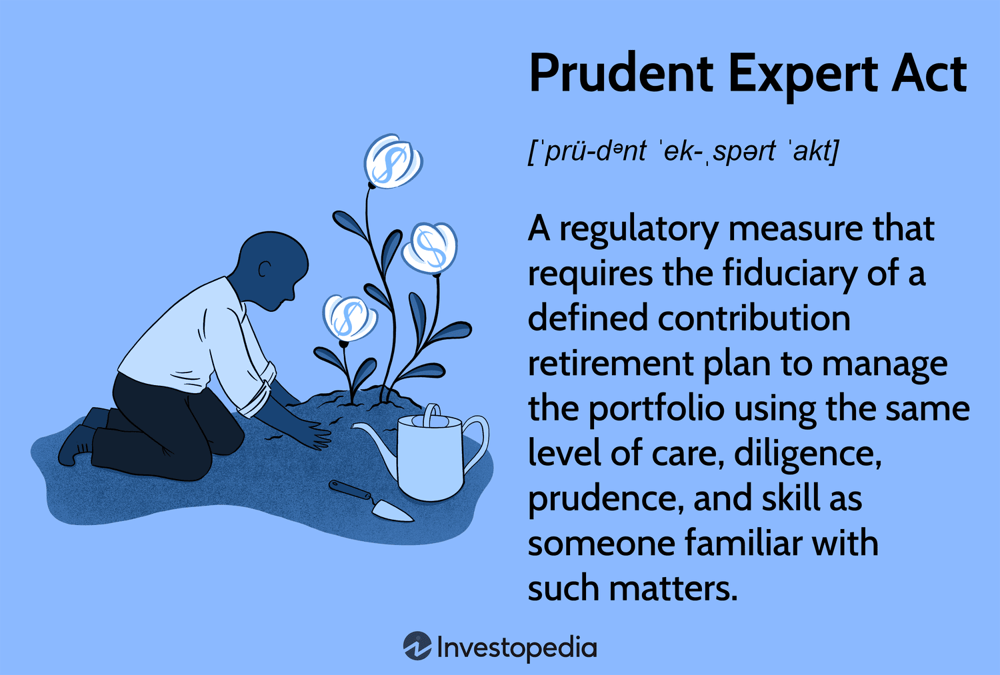

Understanding the interplay between fiduciary duty and investment standards is crucial in asset management. As financial markets evolve, fiduciaries must navigate a complex landscape to protect and grow asset value for their clients. Central to this responsibility is the Prudent Person Rule, a principle mandating that investments should be conducted with care, skill, and caution. This rule serves as a benchmark, ensuring that fiduciaries make decisions similarly to how a prudent person would manage their own investments. Its application spans across different components of asset management, from pension funds to individual investment portfolios, reinforcing the emphasis on preserving capital and making rational decisions.

In recent years, the landscape of asset management has been rapidly transformed by technological advancements, notably in the sphere of algorithmic trading. This high-tech approach leverages sophisticated algorithms and high-frequency trading to optimize investment strategies. As a result, the foundational principles of the Prudent Person Rule must evolve to accommodate these innovations while maintaining their core intent. The challenge lies in balancing traditional investment prudence with the opportunities and complexities introduced by algorithmic trading.



This article explores the Prudent Person Rule in detail, examining its origins and its integration within the broader framework of fiduciary duty. By understanding how these principles align with modern investment practices, we gain insights into the adaptation of traditional investment standards within the high-tech world of algorithmic trading. As fiduciaries steer through these developments, maintaining the integrity and prudence of their investment decisions remains paramount.

## Table of Contents

## Defining the Prudent Person Rule

The Prudent Person Rule mandates that financial managers restrict their choices to investments that a reasonable individual might purchase for their own portfolio. This guideline plays a fundamental role in maintaining trust and integrity among those who manage investments on behalf of others. Traditionally, the rule applied to those responsible for pension funds, employee investment accounts, and trustees, thereby aiming to protect and preserve capital effectively.

The origins of the Prudent Person Rule can be traced back to 19th-century legal frameworks, particularly the case of Harvard College v. Amory in 1830. This lawsuit established the foundations for the rule, suggesting that trustees should act as prudent persons would manage their own affairs, focusing on the security of the capital over speculative interests. Over time, this was formalized into a standard that expects fiduciaries to make rational and intelligent decisions on investment choices. These choices should be aligned with common sense and a reasonable approach to risk, essentially balancing the need to protect the capital while also seeking growth.

The essence of the rule revolves around the principles of due care and caution. Fiduciaries are expected to exercise discretion and judgment with the investable resources of individuals who entrust them. This involves conducting thorough research, analyzing the risk profile of investment opportunities, and ensuring a well-diversified portfolio to mitigate potential losses. The Rule enforces a duty of loyalty and impartiality, requiring fiduciaries to put the interests of their beneficiaries above their own.

In practical terms, compliance with the Prudent Person Rule involves a dynamic evaluation of investment environments, allowing fiduciaries to adjust strategies as market conditions evolve. This ensures that a balance between risk and return is methodically achieved, safeguarding the interests of those whose assets they manage. The Rule contributes to the fiduciary’s broader legal obligations, serving as a crucial component of ethical and responsible asset management practices.

## Fiduciary Duty and Legal Framework

Fiduciaries bear the critical responsibility of managing assets with a legal and ethical commitment to act in the best interests of the plan participants and beneficiaries. This duty encapsulates the obligation to avoid conflicts of interest and prioritize the preservation and growth of plan assets. Key legislation governing these responsibilities is the Employee Retirement Income Security Act (ERISA) of 1974, which establishes stringent standards and guidelines for fiduciaries managing employee benefit plans.

ERISA's framework is closely aligned with the principles of the Prudent Person Rule, urging fiduciaries to exercise prudent judgment in their investment strategies. Specifically, ERISA mandates that fiduciaries administer plans with diligence, diversify plan investments to minimize risks of significant losses, and adhere to the plan documents as long as they align with ERISA.

Legal safeguards under ERISA are designed to protect investors from reckless or negligent fiduciary decisions. The act requires fiduciaries to ensure that the decisions concerning the plan are documented and justifiable, based on comprehensive analysis and evaluation of relevant investment factors. For instance, prudent investment practices under ERISA do not only involve selecting suitable investments but also continuously monitoring their performance and making adjustments as market conditions evolve. 

ERISA also provides mechanisms for holding fiduciaries accountable by defining specific penalties and remedies for breaches of fiduciary duties. This includes restoring any losses to the plan that result from the fiduciary's violation and any profits gained through improper use of plan assets. Furthermore, fiduciaries can face civil penalties, and in severe cases, criminal liability if their actions constitute willful misconduct.

In protecting plan participants, ERISA empowers them to bring legal actions against fiduciaries who fail to meet their obligations. This right of action serves both as a remedy for participants and as a deterrent against potential fiduciary misconduct. As the investment landscape continues to evolve with new technologies and strategies such as [algorithmic trading](/wiki/algorithmic-trading), fiduciaries must navigate these changes while adhering to their fundamental responsibilities under ERISA and the Prudent Person Rule. This balancing act remains vital in safeguarding the financial well-being of plan participants and upholding the integrity of fiduciary standards.

## Investment Standards in a Modern Context

Modern investment strategies have evolved significantly, yet they still adhere to the foundational principles of the Prudent Person Rule, particularly in the areas of diversification and risk management. This rule, which traditionally guided fiduciaries in making rational and intelligent investment decisions, remains pivotal in crafting strategies that balance capital preservation with the quest for reasonable returns.

In today's financial landscape, diversification remains a key strategy to mitigate risk and optimize returns. The Prudent Person Rule endorses spreading investments across multiple assets to reduce the impact of [volatility](/wiki/volatility-trading-strategies) on a portfolio. By avoiding the concentration of investments in a single asset class or market, portfolio managers can shield the portfolio from significant losses during market downturns. This approach aligns with modern portfolio theory, which emphasizes the benefits of asset allocation and diversification to minimize risk.

Furthermore, contemporary investment strategies are integrating traditional frameworks with novel investment vehicles such as derivatives, exchange-traded funds (ETFs), and real estate investment trusts (REITs). These instruments provide fiduciaries with avenues to enhance returns while systematically managing risk. For instance, ETFs offer the advantage of [liquidity](/wiki/liquidity-risk-premium), transparency, and diversification across sectors or geographies, thus embodying the prudent principles of diversification and risk management.

Algorithmic and quantitative strategies also play an increasingly important role in modern investment practices. These strategies employ advanced computational models and [machine learning](/wiki/machine-learning) to make data-driven investment decisions, which can optimize portfolios in line with the risk management principles enshrined in the Prudent Person Rule. Algorithms can swiftly analyze vast sets of market data to identify patterns and predict asset performance, thereby aiding fiduciaries in achieving a balanced and prudent portfolio.

Incorporating technology into investment strategies necessitates adherence to the Prudent Person Rule's core objective: making sound decisions that balance growth with potential risks. The evolving role of fiduciaries includes leveraging these advanced technologies to uphold these tenets while also adapting to the dynamic landscape of financial markets.

In conclusion, while investment standards continue to adapt and incorporate new investment vehicles, the core principles of the Prudent Person Rule—diversification, risk management, and prudent decision-making—remain integral to modern strategies. These principles guide fiduciaries in crafting portfolios that seek to preserve capital while striving for enhanced returns amidst an ever-changing financial environment.

## Algorithmic Trading: A New Paradigm

Algorithmic trading represents a significant shift in the investment landscape, using high-frequency trading and complex algorithms to enhance decision-making processes. It offers remarkable speed and precision, enabling transactions to be executed in fractions of a second. However, it also introduces challenges for fiduciaries who must align these modern practices with the Prudent Person Rule's cautious principles. 

The rule emphasizes careful and sensible investment decisions, which can coexist with algorithmic strategies when properly managed. High-frequency trading relies on statistical analysis and computational algorithms to predict market trends, identify investment opportunities, and execute orders swiftly. Despite its sophistication, this approach must still adhere to fiduciary duties, ensuring investments prioritize the client's best interest, minimize conflicts, and adequately manage risks.

Aligning the Prudent Person Rule with algorithmic trading involves rigorous oversight. Fiduciaries can implement advanced risk management protocols that scrutinize algorithms' performance, stability, and compliance with investment goals. This oversight often includes regular audits, stress testing scenarios, and real-time monitoring tools that track algorithmic outputs and flag unusual patterns or potential breaches of acceptable risk thresholds.

The rise of algorithmic trading necessitates a re-evaluation of existing risk management frameworks. Traditional methods are being fortified with cutting-edge technologies such as [artificial intelligence](/wiki/ai-artificial-intelligence) and machine learning, which allow fiduciaries to analyze large datasets and uncover insights that human analysis might overlook. These technologies contribute to refining strategies and ensuring that they remain within the constraints of the Prudent Person Rule.

Moreover, integrating these automated strategies with a prudent approach requires maintaining a balance between innovation and regulation. Fiduciaries must stay informed about technological advancements and evolving legal standards to adapt strategies effectively and avoid compromising fiduciary duties. Continuous education and collaboration with tech experts ensure that fiduciaries can exploit the opportunities algorithmic trading presents while mitigating its inherent risks. 

Overall, algorithmic trading provides a new paradigm in investment strategy, offering immense potential when harnessed with caution and oversight, consistent with the guiding principles of fiduciary responsibility.

## Integrating The Prudent Person Rule and Algo Trading

Integrating traditional investment prudence with algorithmic trading requires a comprehensive framework capable of evaluating automated decisions while adhering to fiduciary responsibilities. Algorithmic trading, with its reliance on high-frequency and complex strategies, presents both opportunities and challenges. The Prudent Person Rule, grounded in reasonableness and care, must evolve to accommodate these modern techniques without losing its core tenets.

**Framework for Evaluating Automated Decisions**

Creating a robust framework involves integrating quantitative models and qualitative judgments. A multi-layered approach can be adopted, ensuring that the automated strategies align with the desired investment objectives and maintain risk levels within acceptable ranges. One method for achieving this integration is through the development of machine learning models that cater to fiduciary standards.

For instance, a fiduciary could employ a Python-based system utilizing libraries such as scikit-learn for predictive modeling. An example code snippet to evaluate and select investment strategies might look like this:

```python
from sklearn.model_selection import train_test_split
from sklearn.ensemble import RandomForestClassifier
from sklearn.metrics import accuracy_score

# Load your dataset
data = load_investment_data()
X = data.features
y = data.target

# Split the data
X_train, X_test, y_train, y_test = train_test_split(X, y, test_size=0.2, random_state=42)

# Create a model
model = RandomForestClassifier(n_estimators=100, random_state=42)

# Train the model
model.fit(X_train, y_train)

# Predict
y_pred = model.predict(X_test)

# Evaluate
print(f"Accuracy: {accuracy_score(y_test, y_pred)}")
```
Through this process, the model can evaluate potential investments, considering both historical performance and correlations, while adhering to risk management protocols defined by fiduciary standards.

**Case Studies and Best Practices**

Several institutions have successfully integrated prudent investment strategies with algorithmic trading. One such case involves the adoption of quantitative models by pension funds to manage asset allocations more dynamically. These funds use data analytics to anticipate market changes, subsequently adjusting their portfolios to preserve capital and achieve reasonable returns. By adhering to the Prudent Person Rule, these funds can justify their automated decisions in terms of rationality and thorough analysis.

**Leveraging Data Analytics and AI**

Data analytics and artificial intelligence (AI) offer immense potential in optimizing investment outcomes within fiduciary constraints. Techniques such as sentiment analysis of market news and event-driven trading strategies can be implemented to predict short-term market movements. This requires continuous learning algorithms that adapt to new information while remaining bounded by defined risk parameters.

Adopting AI tools like neural networks enables the processing of vast datasets to detect patterns not evident through traditional analysis. However, it's vital to ensure that such tools are tailored to comply with the Prudent Person Rule, emphasizing transparency and accountability. By maintaining detailed logs and justifications for automated decisions, fiduciaries can demonstrate compliance with their duties.

In summary, blending the Prudent Person Rule with algorithmic trading entails a nuanced balance of innovative technology and timeless principles. By developing rigorous frameworks and employing data-driven techniques, fiduciaries can responsibly embrace modern investment methods while honoring their obligation to act in the best interests of their beneficiaries.

## Critiques and Modern Perspectives

The Prudent Person Rule is often lauded for its adaptability across various market conditions. However, this very flexibility is also a point of contention among critics. Some argue that the lack of rigid guidelines can lead to inconsistency in how fiduciaries interpret and apply the rule, potentially exposing investments to unnecessary risks. The subjective nature of what constitutes "prudence" can lead fiduciaries to different conclusions, reflecting their individual biases and levels of expertise.

On the other hand, the flexibility of the Prudent Person Rule is also its strength, offering a dynamic framework that can be adapted to evolving market conditions and emerging technologies. This adaptability supports fiduciaries in managing a range of investment scenarios, from conservative portfolios to those embracing cutting-edge strategies like algorithmic trading.

Despite these advantages, the debate continues over whether the rule is an enduring guide or a possible hindrance to financial innovation. As market environments evolve, some fear that the rule might stifle the adoption of innovative investment strategies, as fiduciaries remain cautious of exceeding the boundaries of prudence. The tension between compliance and innovation remains pronounced, particularly in today's fast-paced, technology-driven financial landscape.

Modern legal interpretations of the Prudent Person Rule have begun to incorporate more nuanced considerations of technology and market volatility. Legal frameworks now emphasize the importance of informed decision-making, requiring fiduciaries to be more knowledgeable about diverse investment products, including those using advanced algorithms and analytics. As such, the rule's effectiveness is continuously subject to reevaluation, with courts and regulators interpreting it in light of contemporary circumstances.

Technological advancements also play a crucial role in shaping the application of the Prudent Person Rule. Innovations such as artificial intelligence and big data analytics offer fiduciaries new tools to assess risks and opportunities with greater precision. However, these tools must be harnessed while maintaining compliance with fiduciary standards, balancing the quest for returns with the necessity of protecting investors.

The ongoing discourse reveals a dual perspective: while the Prudent Person Rule provides a timeless foundation, it necessitates continual adaptation. This ensures fiduciaries can make prudent decisions aligned with modern investment environments without compromising their legal and ethical responsibilities.

## Conclusion: The Future of Fiduciary Standards

The Prudent Person Rule remains a cornerstone in fiduciary standards as investment tactics evolve. Its enduring relevance lies in its ability to guide fiduciaries through complex financial decisions. This rule demands that investment decisions be informed, reasonable, and in the best interest of beneficiaries, a principle that withstands the tests of time and technology.

In an era where algorithmic trading and artificial intelligence are reshaping investment strategies, maintaining fiduciary integrity and prudence becomes a dynamic task. Algorithmic trading, characterized by high-frequency transactions and complex algorithms, presents both opportunities and challenges. The effective marriage of traditional fiduciary duties with these modern strategies requires a nuanced understanding and application of the Prudent Person Rule.

Adapting fiduciary standards to technological innovations involves several considerations. Rigorous evaluation and continuous monitoring of algorithmic systems ensure that these tools enhance decision-making without compromising fundamental fiduciary principles. The key lies in leveraging new technologies to uphold the care, skill, and caution prescribed by the rule. This adaptation inevitably involves integrating advanced data analytics and artificial intelligence, which can augment decision-making processes while safeguarding the interests of all stakeholders involved.

Ultimately, as global markets and investment vehicles evolve, so must the frameworks that govern fiduciary duties. The Prudent Person Rule, with its balanced approach to risk and return, provides a flexible yet steadfast guide that adapts to changing times. As fiduciaries embrace tech-driven methodologies, they must continue to uphold the integrity and prudence that this rule embodies, ensuring that technological advancements do not undermine the fiduciary duty owed to beneficiaries. As such, the future of fiduciary standards lies in the harmonization of traditional principles with innovative practices, ensuring sustainable and ethical investment management.

## References & Further Reading

[1]: Restatement of Trusts, Third (1992). American Law Institute. An important source discussing the Prudent Person Rule in trust law.

[2]: Whitman, J. A. (1995). "The Origins of the Prudent Man Rule in American Law." Journal of Legal Studies, 24(2), 337-367. A detailed account on the legal history and development of the Prudent Person Rule.

[3]: "Modern Portfolio Theory and Investment Analysis" by Edwin J. Elton, Martin J. Gruber, Stephen J. Brown, and William N. Goetzmann, a foundational textbook that addresses principles related to the Prudent Person Rule in modern investment.

[4]: Malkiel, B. G. (2019). "A Random Walk Down Wall Street: The Time-Tested Strategy for Successful Investing." W.W. Norton & Company. Recommended for understanding investment strategies aligned with prudent decision-making.

[5]: "Algorithmic Trading: Winning Strategies and Their Rationale" by Ernie Chan, to understand the integration of quantitative strategies within the framework of prudent investing.

[6]: Board of Governors of the Federal Reserve System. "Algorithmic Trading in the Financial Markets". Available from Federal Reserve's official website, discussing the impact and regulation of algorithmic trading aligning with the Prudent Person Rule.

[7]: The Employee Retirement Income Security Act of 1974 (ERISA), available on the U.S. Department of Labor website. It lays down applicable fiduciary responsibilities in alignment with the Prudent Person Rule.

[8]: Blanchett, D. M., & Kaplan, P. D. (2013). "Alpha, Beta, and Now… Gamma." The Journal of Retirement, 1(2), 29-45. Discusses advanced metrics in investment decision-making within a prudent investment framework.