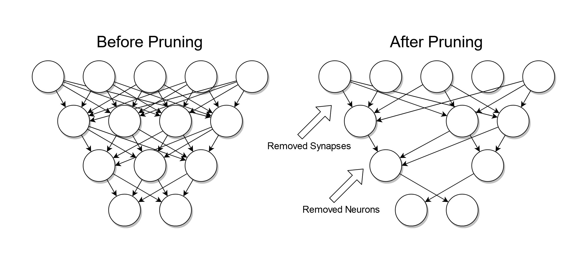

## Table of Contents

## What is pruning in the context of machine learning?

Pruning in machine learning is a technique used to simplify and improve the performance of a model, especially in decision trees and neural networks. In decision trees, pruning involves removing sections of the tree that provide little predictive power, which helps to reduce the complexity of the model and prevent overfitting. Overfitting happens when a model learns the training data too well, including its noise and outliers, and as a result, it performs poorly on new, unseen data. By pruning, we cut back the tree to make it generalize better to new data.

In neural networks, pruning works by removing weights or even entire neurons that contribute the least to the network's output. This process can lead to a more compact and efficient model without significantly sacrificing accuracy. For example, if a weight in a neural network has a value close to zero, it means that neuron has little effect on the output, and removing it might not hurt the model's performance much. Pruning helps in reducing the computational resources needed to run the model and can make it easier to deploy on devices with limited memory or processing power.

## Why is pruning important for neural networks?

Pruning is important for neural networks because it helps make them smaller and faster. When a neural network is pruned, it removes parts that don't help much with making predictions. This means the network needs less computer power to work, which is great for putting the network on small devices like phones or smartwatches. It also makes the network easier to understand and work with because it's simpler.

Another reason pruning is important is that it can stop the network from overfitting. Overfitting happens when a network learns too much about the training data, including the mistakes and odd bits, and then doesn't work well on new data. By pruning, we can cut away the parts of the network that might be causing overfitting, helping the network to make better guesses on new data it hasn't seen before. This makes the network more reliable and useful in real-world situations.

## What are the different types of pruning methods used in machine learning?

In [machine learning](/wiki/machine-learning), there are mainly two types of pruning methods: magnitude-based pruning and structured pruning. Magnitude-based pruning is the simpler of the two. It looks at the weights in a [neural network](/wiki/neural-network) and removes those with the smallest values. The idea is that if a weight is very small, it doesn't affect the network's output much. So, by getting rid of these small weights, we can make the network smaller without losing much accuracy. This method is easy to do and works well for many types of networks.

Structured pruning, on the other hand, is a bit more complex. Instead of just removing individual weights, it removes whole parts of the network, like entire neurons or layers. This can be trickier because you need to make sure that taking out these bigger parts doesn't mess up the network too much. Structured pruning can make the network even smaller and faster than magnitude-based pruning, but it needs more careful planning. Both methods help make neural networks more efficient and easier to use on devices with limited power.

## How does dataset pruning work and what are its benefits?

Dataset pruning is a process where we make a big dataset smaller by removing some of the data. We do this to make it easier and faster to train machine learning models. Imagine you have a huge pile of photos, and you want to teach a computer to recognize cats. If you only need a few good examples of cats, you don't need to use every single photo. By [picking](/wiki/asset-class-picking) out the most useful ones, you can train the model just as well, but much quicker.

The benefits of dataset pruning are big. First, it makes training faster because the computer doesn't have to go through as much data. This saves time and can be really helpful when you're working with very large datasets. Second, it can make your model better at guessing new things. When you use a smaller, cleaner dataset, the model can focus on the most important parts and not get confused by extra, less useful data. This can help the model work better when it sees new data it hasn't seen before.

## What is movement pruning and how does it differ from other pruning techniques?

Movement pruning is a special kind of pruning used in machine learning to make neural networks smaller and faster. It's different because it looks at how the weights in the network change over time. If a weight doesn't move much or stays close to zero, movement pruning says we can take it out. This helps make the network simpler without messing up its ability to make good guesses.

Unlike magnitude-based pruning, which just looks at the size of the weights and removes the smallest ones, movement pruning cares more about how the weights behave during training. This can be really helpful because sometimes a weight might be small but still important if it's changing a lot. Structured pruning, on the other hand, removes bigger parts of the network, like whole neurons or layers, which can be more complicated but can make the network even smaller. Movement pruning finds a middle ground by focusing on the movement of weights, making it a unique way to simplify neural networks.

## Can you explain the RigL pruning method and its advantages?

The RigL pruning method is a special way to make neural networks smaller and faster. It works by removing weights that aren't very important and adding new ones to keep the network learning well. RigL does this during the training process, which means it keeps the network changing and improving. The key idea is to balance the number of weights being removed and added, so the network stays strong and doesn't lose its ability to learn.

One of the big advantages of RigL is that it helps the network keep learning even as it gets smaller. This is different from other methods where the network might stop learning well after being pruned. RigL also makes the training process more stable because it adds new weights to replace the ones it removes. This means the network can keep getting better over time, even with fewer weights. Overall, RigL helps make neural networks more efficient and easier to use on smaller devices without losing much accuracy.

## How does the HRank pruning method assess the importance of neurons?

The HRank pruning method looks at how important each neuron in a neural network is by checking how much information it handles. It does this by using something called the 'effective rank' of the neuron's output. The effective rank tells us how much unique information a neuron is giving to the network. If a neuron has a high effective rank, it means it's doing a lot of important work, so we keep it. But if it has a low effective rank, it's not adding much new information, so we can take it out without hurting the network too much.

HRank helps make the neural network smaller and faster by removing the less important neurons. This method is good because it looks at how the neurons actually work during training, not just at the weights. By focusing on the information flow, HRank can make the network more efficient while keeping it smart. This means the network can still do its job well even after we prune it, which is great for using it on devices with less power.

## What role do Spectral-Normalized Identity Priors play in pruning?

Spectral-Normalized Identity Priors (SNIP) is a way to decide which parts of a neural network are important before we start training it. SNIP looks at how much each weight in the network helps the network's output. If a weight doesn't help much, SNIP thinks we can remove it. This helps make the network smaller and faster right from the start, even before we train it. SNIP uses something called the "sensitivity" of the weights to figure out which ones to keep. The sensitivity tells us how much a small change in a weight can affect the network's output. If the sensitivity is low, the weight isn't very important, so we can prune it.

Using SNIP can make training a neural network much easier. By removing the less important weights before training, the network doesn't need as much time or computer power to learn. This is really helpful when you're working with big networks that take a long time to train. SNIP helps make the network simpler and more efficient, which means it can work better on devices with less power. This method is smart because it thinks about how the weights will affect the network before we even start training, making the whole process smoother and faster.

## How does LLM-Rank pruning specifically target large language models?

LLM-Rank pruning is a way to make big language models smaller and faster. These models, called large language models (LLMs), are used for things like understanding and making text. LLM-Rank looks at how important each part of the model is by checking how much it helps with understanding words and sentences. If a part isn't very helpful, LLM-Rank says we can take it out. This helps the model use less computer power and work faster, which is good for using it on smaller devices.

The way LLM-Rank works is by using a special score called "rank" to see how important each part of the model is. If a part has a high rank, it means it's doing a lot of important work, so we keep it. But if it has a low rank, it's not adding much, so we can remove it. By focusing on this rank score, LLM-Rank can make the model smaller without making it worse at understanding and making text. This makes LLMs more useful and easier to use in real life.

## What are the challenges faced when implementing pruning in deep learning models?

Pruning [deep learning](/wiki/deep-learning) models can be tricky because it's hard to know which parts of the model to take out without making it worse at its job. If we remove too much, the model might not work well anymore. This is called underfitting, where the model doesn't learn enough from the data. On the other hand, if we don't prune enough, the model might still be too big and slow. Finding the right balance is a big challenge. Also, different types of models, like those for images or text, might need different pruning methods, which makes it even harder to find a one-size-fits-all solution.

Another challenge is that pruning can make training the model more complicated. When we prune during training, we need to keep checking how the model is doing and adjust what we're pruning. This can take a lot of time and computer power. Plus, if we prune too early, we might miss out on important parts of the model that could become useful later. If we prune too late, we might have already wasted time training parts that we'll end up removing. It's like trying to build a house while also taking parts of it away at the same time, which is not easy to do right.

## How can pruning affect the performance and efficiency of a machine learning model?

Pruning can make a machine learning model more efficient by making it smaller and faster. When we prune a model, we take out parts that don't help much with making predictions. This means the model needs less computer power to work, which is great for using it on small devices like phones or smartwatches. It also makes the model easier to understand and work with because it's simpler. For example, if we have a big model that takes a long time to run, pruning can help it run faster without losing much accuracy.

However, pruning can also affect the performance of a model if not done carefully. If we remove too many parts, the model might not work as well as before. This is because we might take out important parts that help the model make good guesses. Finding the right balance between making the model smaller and keeping it accurate is tricky. If we prune too much, the model might underfit, meaning it doesn't learn enough from the data. If we don't prune enough, the model might still be too big and slow. So, it's important to prune carefully to keep the model both efficient and good at its job.

## What are the latest advancements in pruning techniques for machine learning?

Recent advancements in pruning techniques have focused on making neural networks even more efficient while maintaining high accuracy. One exciting development is the introduction of dynamic pruning methods like RigL, which prune and regrow weights during training. This helps the network keep learning and improving even as it gets smaller. Another advancement is the use of more sophisticated metrics to decide which parts to prune. For example, the HRank method uses the effective rank to measure how much unique information a neuron contributes, making pruning decisions more informed and effective.

Another notable advancement is the application of pruning to large language models (LLMs). Techniques like LLM-Rank have been developed specifically for these models, which are used for tasks like text generation and understanding. LLM-Rank uses a rank score to assess the importance of different parts of the model, allowing for more targeted pruning that can significantly reduce the model's size without sacrificing its language abilities. These advancements show that pruning is becoming more tailored and effective, helping to make machine learning models more practical for real-world use.

## References & Further Reading

[1]: Han, Song, et al. (2015). ["Learning both Weights and Connections for Efficient Neural Networks."](https://arxiv.org/abs/1506.02626) Advances in Neural Information Processing Systems 28.

[2]: Gale, Trevor, et al. (2019). ["The State of Sparsity in Deep Neural Networks."](https://arxiv.org/abs/1902.09574) arXiv preprint arXiv:1902.09574.

[3]: Blalock, Davis, et al. (2020). ["What is the State of Neural Network Pruning?"](https://arxiv.org/abs/2003.03033) arXiv preprint arXiv:2003.03033.

[4]: Frankle, Jonathan, and Carbin, Michael. (2019). ["The Lottery Ticket Hypothesis: Finding Sparse, Trainable Neural Networks."](https://arxiv.org/abs/1803.03635) International Conference on Learning Representations.

[5]: Molchanov, Pavlo, et al. (2017). ["Variational Dropout Sparsifies Deep Neural Networks."](https://arxiv.org/abs/1701.05369) International Conference on Machine Learning.

[6]: Li, Hao, et al. (2017). ["Pruning Filters for Efficient ConvNets."](https://arxiv.org/abs/1608.08710) International Conference on Learning Representations.

[7]: Liu, Zhuang, et al. (2019). ["Rethinking the Value of Network Pruning."](https://arxiv.org/abs/1810.05270) International Conference on Learning Representations.