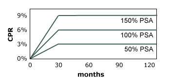

## Table of Contents

## What is a PSA Prepayment Model?

A PSA Prepayment Model is a tool used to predict how quickly people will pay off their mortgages before they are due. It helps banks and investors understand how much money they can expect to get back and when. The model uses a standard called the PSA standard prepayment model, which assumes that prepayments will happen at a certain rate over time. This rate starts slowly and then speeds up, reaching a peak after 30 months.

The PSA model measures prepayment speed using a benchmark called the 100% PSA. At 100% PSA, it is assumed that prepayments start at 0.2% per year in the first month and increase by 0.2% each month until they reach 6% per year after 30 months. After that, the prepayment rate stays at 6% per year. If prepayments happen faster than this, the model might use 150% PSA or 200% PSA to show that prepayments are happening at a rate 1.5 or 2 times faster than the standard. This helps everyone involved plan better for the future.

## Why is the PSA Prepayment Model important in finance?

The PSA Prepayment Model is important in finance because it helps banks and investors predict how quickly people will pay off their mortgages early. This is useful because it lets them know how much money they will get back and when. If people pay off their mortgages faster than expected, banks might get their money back sooner, but they might also lose out on interest they were expecting to earn. On the other hand, if people pay off their mortgages slower than expected, banks might have to wait longer to get their money back.

This model uses a standard way to measure how fast prepayments happen, called the 100% PSA. It helps everyone involved plan better for the future. For example, if a bank knows that prepayments are happening faster than the standard rate, they can adjust their plans and maybe invest the money they get back sooner into something else. This makes the PSA Prepayment Model a key tool for managing financial risks and making smart investment decisions.

## How does the PSA Prepayment Model differ from other prepayment models?

The PSA Prepayment Model is different from other prepayment models because it uses a specific way to predict how fast people will pay off their mortgages early. It starts with a slow rate of prepayments and then speeds up over time, reaching a peak after 30 months. This is called the 100% PSA standard. Other models might use different ways to predict prepayments. For example, some might assume a constant rate of prepayments, while others might use different formulas or data to make their predictions.

Another way the PSA Prepayment Model is different is that it is widely used in the finance industry, especially for mortgage-backed securities. This means many people in the industry understand and use it, which makes it easier for them to talk about and compare prepayment rates. Other models might be used less often or only in certain situations, so they might not be as well-known or as easy to compare with other models. This makes the PSA model a common language in the world of finance when it comes to predicting how quickly mortgages will be paid off early.

## What are the key components of the PSA Prepayment Model?

The PSA Prepayment Model is made up of a few important parts. The main part is the 100% PSA standard, which is a way to predict how fast people will pay off their mortgages early. This standard says that prepayments start at 0.2% per year in the first month and go up by 0.2% each month until they reach 6% per year after 30 months. After that, the prepayment rate stays at 6% per year. This helps everyone know what to expect and plan for the future.

Another key part of the PSA Prepayment Model is how it can be changed to fit different situations. If prepayments are happening faster than the standard rate, the model can use 150% PSA or 200% PSA to show that prepayments are happening 1.5 or 2 times faster than the standard. This flexibility makes the model useful for a lot of different situations. By using these components, the PSA Prepayment Model helps banks and investors understand how quickly they will get their money back and make better financial decisions.

## How is the PSA prepayment speed calculated?

The PSA prepayment speed is calculated using a standard called the 100% PSA. This standard says that prepayments start at a slow rate of 0.2% per year in the first month. Each month after that, the prepayment rate goes up by another 0.2%. This keeps happening until the prepayment rate reaches 6% per year after 30 months. After 30 months, the prepayment rate stays at 6% per year.

If prepayments are happening faster than the 100% PSA standard, the model can be adjusted. For example, if prepayments are happening 1.5 times faster than the standard, the model uses 150% PSA. If they are happening 2 times faster, it uses 200% PSA. This helps everyone understand how quickly people are paying off their mortgages early compared to what is expected.

## What is the standard PSA prepayment benchmark?

The standard PSA prepayment benchmark is called the 100% PSA. This benchmark says that prepayments start at a slow rate of 0.2% per year in the first month. Each month after that, the prepayment rate goes up by another 0.2%. This keeps happening until the prepayment rate reaches 6% per year after 30 months. After 30 months, the prepayment rate stays at 6% per year.

If prepayments are happening faster than the 100% PSA standard, the model can be adjusted. For example, if prepayments are happening 1.5 times faster than the standard, the model uses 150% PSA. If they are happening 2 times faster, it uses 200% PSA. This helps everyone understand how quickly people are paying off their mortgages early compared to what is expected.

## How can the PSA model be adjusted for different scenarios?

The PSA model can be changed to fit different situations by using different percentages of the standard 100% PSA. If people are paying off their mortgages faster than the standard rate, the model can use a higher percentage like 150% PSA or 200% PSA. This means the prepayment rate is 1.5 or 2 times faster than the standard. If people are paying off their mortgages slower than the standard rate, the model can use a lower percentage like 50% PSA or 75% PSA. This helps everyone understand how quickly people are paying off their mortgages compared to what is expected.

For example, if a bank sees that people are paying off their mortgages much faster than the standard 100% PSA, they might use 200% PSA to show that prepayments are happening twice as fast. This helps the bank plan better for the future because they know they will get their money back sooner. On the other hand, if people are paying off their mortgages slower than expected, the bank might use 50% PSA to show that prepayments are happening half as fast. This helps the bank know they will have to wait longer to get their money back. By adjusting the PSA model, banks and investors can make better decisions based on how quickly people are paying off their mortgages.

## What are the limitations of using the PSA Prepayment Model?

The PSA Prepayment Model has some limitations that people should know about. One big limitation is that it assumes prepayments will follow a certain pattern, starting slow and then speeding up to a peak after 30 months. But in real life, prepayments can happen in different ways. Sometimes, they might speed up a lot because of changes in interest rates or the economy. Other times, they might slow down if people don't have as much money to pay off their mortgages early. This means the model might not always predict prepayments accurately.

Another limitation is that the PSA model is based on a standard that might not fit every situation. It uses the 100% PSA as a benchmark, but different groups of people might pay off their mortgages in different ways. For example, people in one area might pay off their mortgages faster than people in another area. Also, the model doesn't take into account things like how people might refinance their mortgages or sell their homes, which can change how quickly mortgages are paid off. Because of these limitations, people using the PSA model need to be careful and consider other information too.

## How does the PSA model impact mortgage-backed securities?

The PSA model helps people who invest in mortgage-backed securities (MBS) understand how quickly they will get their money back. MBS are investments that are made up of a bunch of mortgages. When people pay off their mortgages early, it affects how much money investors get and when they get it. The PSA model predicts how fast these prepayments will happen, using a standard called the 100% PSA. This helps investors plan better because they can guess when they will get their money back and how much interest they will earn.

But the PSA model is not perfect. It assumes that prepayments will follow a certain pattern, but in real life, things can change. For example, if interest rates go down, more people might pay off their mortgages early to get a better deal. This can make the prepayments happen faster than the PSA model predicts. If investors rely too much on the PSA model without thinking about other things that can affect prepayments, they might be surprised by how quickly or slowly they get their money back. So, while the PSA model is a helpful tool, it's important for investors to also look at other information to make the best decisions about MBS.

## Can you explain the mathematical formula behind the PSA Prepayment Model?

The PSA Prepayment Model uses a simple formula to predict how fast people will pay off their mortgages early. It starts with a slow rate of 0.2% per year in the first month. Each month after that, the prepayment rate goes up by another 0.2%. This keeps happening until the prepayment rate reaches 6% per year after 30 months. After 30 months, the prepayment rate stays at 6% per year. This is called the 100% PSA standard. If you want to find out the prepayment rate for any month, you just need to know how many months have passed and use the formula: Prepayment Rate = 0.2% x (Month Number), but it stops at 6% after 30 months.

The model can be changed to fit different situations by using different percentages of the 100% PSA standard. If prepayments are happening faster than the standard rate, you can use a higher percentage like 150% PSA or 200% PSA. This means the prepayment rate is 1.5 or 2 times faster than the standard. If prepayments are happening slower than the standard rate, you can use a lower percentage like 50% PSA or 75% PSA. To adjust the formula, you multiply the standard prepayment rate by the percentage you are using. For example, at 150% PSA, the prepayment rate for the first month would be 0.3% (0.2% x 1.5), and it would keep going up by 0.3% each month until it reaches 9% after 30 months.

## How do changes in interest rates affect the PSA Prepayment Model?

Changes in interest rates can have a big effect on the PSA Prepayment Model. When interest rates go down, people might want to pay off their old mortgages early so they can get a new mortgage with a lower interest rate. This can make prepayments happen faster than the PSA model predicts. If interest rates go up, people might not want to pay off their mortgages early because they would have to take out a new mortgage with a higher interest rate. This can make prepayments happen slower than the PSA model predicts.

Because the PSA model uses a standard pattern for prepayments, it might not always be able to predict how people will react to changes in interest rates. If interest rates change a lot, the model might not be very accurate. People who use the PSA model need to think about how interest rates might change and how that could affect prepayments. They might need to adjust the model or look at other information to make better predictions.

## What advanced techniques can be used to enhance the accuracy of the PSA Prepayment Model?

To make the PSA Prepayment Model more accurate, one advanced technique is to use more data. Instead of just using the standard 100% PSA, you can look at lots of other information like how old the mortgages are, where the houses are, and what the economy is doing. This can help you see patterns that the standard model might miss. For example, if you know that people in a certain area are more likely to pay off their mortgages early, you can adjust the model to predict that better.

Another way to improve the model is to use computer programs that learn from data, called [machine learning](/wiki/machine-learning). These programs can look at past prepayments and find new patterns that the PSA model doesn't see. They can also keep updating their predictions as new data comes in. This means the model can get better over time and be more accurate for different situations. By using these advanced techniques, you can make the PSA Prepayment Model work better and help banks and investors make smarter decisions.

## What is the PSA Prepayment Model and how does it work?

The PSA prepayment model plays a crucial role in evaluating mortgage-backed securities (MBS) and collateralized mortgage obligations (CMO). Developed by the Public Securities Association, this model provides a standardized approach to estimating prepayment rates. Prepayment risk refers to the potential for borrowers to pay off their mortgage loans earlier than expected, which can significantly impact the cash flows and valuation of the securities backed by these mortgages.

The PSA model serves as a benchmark for predicting these prepayment behaviors. It assumes that prepayments on a mortgage pool increase over time, reaching a peak at 30 months. This assumption is pivotal for investors, as prepayments affect the duration and yield of the securities. Understanding the PSA model enables investors and financial analysts to gain insight into the [liquidity](/wiki/liquidity-risk-premium) and risk profile of MBS and CMO portfolios.

The standard PSA model is expressed as a monthly series of conditional prepayment rates (CPR) that gradually increase. It begins with a CPR of 0.2% in the first month, rising by 0.2% each subsequent month until it stabilizes at 6% per annum after 30 months. The formula for computing CPR based on the PSA assumption is given by:

$$
\text{CPR}_{\text{month}} = 0.2\% \times \min(n, 30)
$$

where $n$ is the number of months since origination. This estimation implies that after 30 months, the CPR stabilizes at 6% annually, reflecting long-term prepayment behavior.

Financial institutions and analysts use the PSA model for stress testing and scenario analysis by adjusting the base assumption—often denoted as 100 PSA—to reflect different economic conditions. Multiplying the base CPR by a [factor](/wiki/factor-investing) (e.g., 200 PSA doubles the prepayment rate assumptions) allows for simulations under various market scenarios, providing a robust framework for risk assessment.

By employing the PSA prepayment model, traders and portfolio managers can better manage the prepayment risks associated with MBS and CMO, facilitating more informed investment decisions. Understanding these risks is vital for maintaining the desired balance in investment portfolios, particularly as they relate to [interest rate](/wiki/interest-rate-trading-strategies) shifts and market [volatility](/wiki/volatility-trading-strategies).

## References & Further Reading

[1]: Fabozzi, F. J., & Vink, D. (2012). ["Handbook of Mortgage Backed Securities"](https://academic.oup.com/book/7943) by Frank J. Fabozzi (Editor)

[2]: Giesecke, K. (2003). ["Credit risk modeling and valuation: an introduction"](http://mx.nthu.edu.tw/~jtyang/Teaching/Risk_management/Papers/Models/Credit%20Risk%20Modeling%20and%20Valuation.pdf). Stanford University.

[3]: Hayre, L. S. (2001). ["Salomon Smith Barney Guide to Mortgage-Backed and Asset-Backed Securities"](https://archive.org/details/isbn_0471385875) by Lakhbir S. Hayre

[4]: ["Mortgage-Backed Securities: Products, Structuring, and Analytical Techniques"](https://www.amazon.com/Mortgage-Backed-Securities-Structuring-Analytical-Techniques/dp/1118004698) by Frank J. Fabozzi

[5]: Kuhn, T. S. (1970). ["The Structure of Scientific Revolutions"](https://www.researchgate.net/publication/305296586_The_structure_of_scientific_revolutions_Thomas_S_Kuhn_1970_2nd_ed_Chicago_London_University_of_Chicago_Press_Ltd_210_pages)

[6]: ["Algorithmic Trading and DMA: An introduction to direct access trading strategies"](https://www.amazon.com/Algorithmic-Trading-DMA-introduction-strategies/dp/0956399207) by Barry Johnson