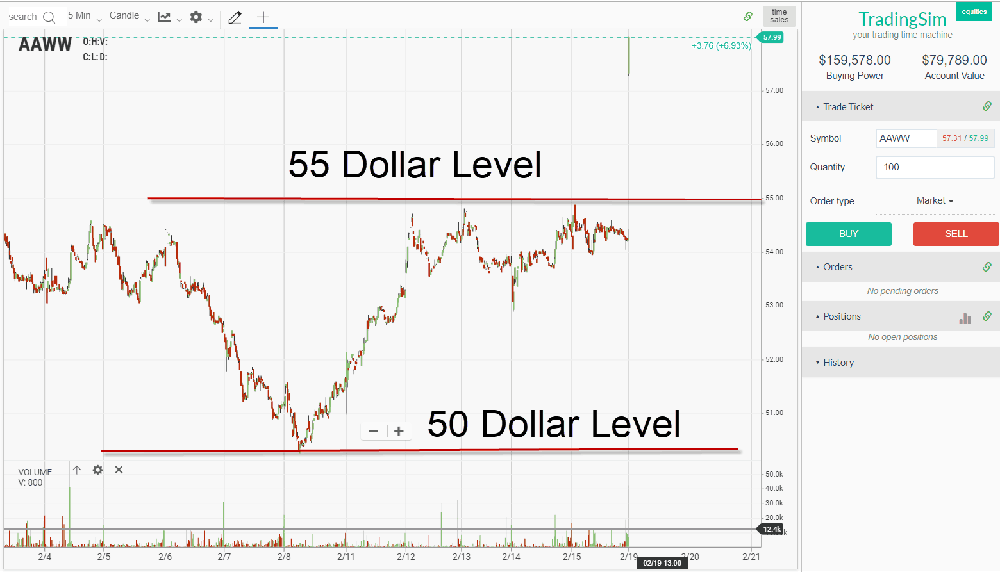

## Table of Contents

## What are support and resistance in trading?

Support and resistance are important concepts in trading that help traders make decisions about when to buy or sell assets. Support is a price level where a falling asset tends to stop falling and may even start to rise again. It's like a floor that the price bounces off of. Traders often see this as a good time to buy, because they think the price won't go much lower.

Resistance, on the other hand, is a price level where a rising asset tends to stop rising and may start to fall again. It's like a ceiling that the price hits and can't go through easily. Traders often see this as a good time to sell, because they think the price won't go much higher. By understanding these levels, traders can better predict how prices might move in the future.

## How do psychological factors influence the formation of support and resistance levels?

Psychological factors play a big role in creating support and resistance levels in trading. People often think in round numbers, so prices like $50 or $100 become important. When a stock price gets close to these round numbers, many traders start to pay more attention. They might decide to buy or sell at these levels because they believe others will do the same, creating a self-fulfilling prophecy. This collective behavior can make these round numbers act as strong support or resistance levels.

Another psychological factor is the fear of loss and the hope for gains. When a stock price drops to a level where many people bought it before, those buyers might feel scared of losing more money. They might decide to buy more at this price to lower their average cost, creating a support level. On the flip side, if a stock price rises to a level where many people sold it before, those sellers might feel happy about their decision and decide to sell again at this price, creating a resistance level. These emotions can cause prices to bounce off certain levels repeatedly.

## What role does fear play in the creation of support levels?

Fear plays a big part in making support levels. When a stock's price goes down to a certain point, people who bought it before might get scared. They worry about losing more money. So, they might decide to buy more of the stock at this lower price. They think this will make their average cost lower and maybe help them not lose as much money. When lots of people do this at the same price, it can stop the stock from falling further. This creates a support level.

Fear also makes people hold onto their stocks at these support levels. They might be scared to sell because they hope the price will go back up. If everyone is feeling the same fear and decides to hold or buy more at this price, it can make the support level even stronger. So, fear can really help create and keep support levels in place.

## How does greed contribute to the establishment of resistance levels?

Greed helps create resistance levels when a stock's price goes up. People who already own the stock might get greedy and want to sell it at a high price to make a big profit. They think the price has gone up enough, so they decide to sell at this point. When lots of people feel the same way and sell at the same price, it can stop the stock from going up more. This creates a resistance level.

Greed also makes new buyers think twice. They might see the high price and get greedy, wanting to buy the stock at a lower price so they can make more money later. If enough people wait for a lower price, it can keep the stock from going up past the resistance level. So, greed can really help set and keep resistance levels in place.

## Can you explain the concept of 'round numbers' in relation to psychological support and resistance?

Round numbers are important in trading because people like to think in simple, whole numbers. For example, prices like $50 or $100 stick in people's minds more than $49.75 or $100.25. When a stock's price gets close to these round numbers, lots of traders start to pay attention. They might decide to buy or sell at these levels because they think other people will do the same. This can make the round numbers act as strong support or resistance levels.

When a stock's price is going up and reaches a round number, many people might want to sell to make a profit at that nice, round price. This can stop the price from going up more, creating a resistance level. On the other hand, if the price is going down and hits a round number, people might see it as a good time to buy, thinking the price won't go much lower. This can create a support level. So, round numbers can affect how traders act and help form these important levels in the market.

## How do traders' emotions affect their decision-making at key support and resistance levels?

Traders' emotions play a big role in how they make choices at support and resistance levels. When a stock's price hits a support level, traders might feel scared. They worry about losing money if the price keeps dropping. So, they might buy more at this low price to make their average cost lower. This fear can make lots of people buy at the same time, creating a strong support level. On the other hand, when the price reaches a resistance level, traders might feel greedy. They want to sell at this high price to make a big profit. This greed can make lots of people sell at the same time, creating a strong resistance level.

These emotions can also make traders hold onto their stocks longer than they should. At a support level, fear might keep them from selling, hoping the price will go back up. At a resistance level, greed might make them wait for an even higher price before selling. These feelings can make support and resistance levels even stronger because so many people are feeling the same way and acting at the same time. So, emotions like fear and greed can really affect how traders act and make decisions at these key price points.

## What psychological biases commonly impact traders' perceptions of support and resistance?

One common psychological bias that impacts traders' perceptions of support and resistance is confirmation bias. This happens when traders only pay attention to information that agrees with what they already think. For example, if a trader believes a certain price will act as a support level, they might ignore signs that the price might keep falling. This can make them hold onto their stocks longer than they should, hoping the price will bounce back up.

Another bias is the anchoring effect. This is when traders put too much importance on the first price they see or the price they bought at. If a stock falls to a certain price, traders might see that as a support level just because it's where they first bought it, even if there's no real reason for the price to stop falling there. This can make them buy more at that price, thinking it's a good deal, even if the market is telling them otherwise.

## How can understanding mass psychology help in predicting support and resistance movements?

Understanding mass psychology can really help traders predict where support and resistance levels might form. When lots of people start thinking the same way about a stock's price, it can make the price move in certain ways. For example, if many traders see a price like $50 as a good place to buy, they might all start buying there. This can create a strong support level because so many people are acting the same way. On the other hand, if lots of traders think $100 is a good place to sell, they might all start selling there, creating a strong resistance level. By watching what other traders are doing and feeling, a trader can guess where these levels might be before they happen.

Mass psychology also helps traders understand why these levels might break. If fear or greed gets really strong, more people might start selling or buying at different prices than they thought before. For example, if a stock keeps falling and more people get scared, they might sell at a lower price than the usual support level. This can make the support level break. Or, if a stock keeps going up and more people get greedy, they might keep buying at higher prices than the usual resistance level, making it break. By paying attention to how emotions are changing in the market, traders can better predict when these important levels might not hold anymore.

## What are some advanced psychological techniques traders use to anticipate support and resistance breakouts?

Traders use a technique called sentiment analysis to guess when support and resistance levels might break. They look at what other traders are saying and feeling on social media, news, and trading forums. If lots of people start talking about a stock in a scared or excited way, it can mean the price might move a lot. For example, if everyone is scared and talking about selling a stock at a certain price, that might be a sign the support level will break. On the other hand, if everyone is excited and talking about buying a stock at a certain price, that might mean the resistance level will break.

Another technique traders use is called behavioral finance. This means they study how people make choices when they're scared or greedy. Traders might look at past data to see how people acted when a stock's price hit certain levels before. If they see that people often got scared and sold at a certain price, they might guess that the support level will break again at that price. Or, if people often got greedy and bought at a certain price, they might guess that the resistance level will break again at that price. By understanding these patterns, traders can better predict when the price might move past the usual support and resistance levels.

## How do historical price reactions at support and resistance levels inform future psychological expectations?

When traders look at how a stock's price moved in the past at certain support and resistance levels, they can guess how people might act in the future. If a stock's price always stopped falling at $50 and started going up again, traders might think $50 will be a strong support level next time too. They remember how scared people got and started buying at $50 before, so they expect the same thing to happen again. This helps them decide when to buy or sell the stock.

But, traders also know that things can change. If the stock's price used to stop at $50 but then broke through it and kept falling, they might think people's feelings have changed. Maybe more people are scared now, so they won't buy at $50 anymore. By looking at these past reactions, traders can better understand what might happen next time the price hits these levels. This helps them make smarter choices about when to trade.

## In what ways can a trader's psychological state alter the effectiveness of support and resistance strategies?

A trader's psychological state can really change how well support and resistance strategies work. If a trader is feeling scared, they might see a support level and think it's a good time to buy. But if they're too scared, they might buy too much or at the wrong time, hoping the price will go back up fast. This can make them lose money if the price keeps falling. On the other hand, if a trader is feeling greedy, they might see a resistance level and think it's a good time to sell. But if they're too greedy, they might wait too long to sell, hoping the price will go even higher. This can make them miss out on making a profit if the price starts to fall.

Understanding their own feelings can help traders use support and resistance levels better. If a trader knows they get scared easily, they might set rules for themselves about when to buy or sell, so they don't make choices based on fear. If a trader knows they get greedy, they might set a price they're happy to sell at and stick to it, so they don't wait too long. By being aware of their emotions, traders can make smarter choices and use support and resistance levels more effectively.

## How might cognitive dissonance affect a trader's approach to support and resistance levels?

Cognitive dissonance happens when a trader feels two different things at the same time. For example, a trader might think a stock's price will stop falling at a certain support level because that's what happened before. But, if the price keeps falling past that level, the trader feels confused and uncomfortable. They have to decide if they should keep believing in the support level or change their mind. This can make them hold onto the stock longer than they should, hoping the price will go back up, or sell it too soon because they're scared it will keep falling.

This feeling of being unsure can really mess up a trader's plan. If they're feeling a lot of cognitive dissonance, they might not stick to their trading rules. They might buy or sell at the wrong times because they're trying to make their feelings match what's happening with the price. Understanding cognitive dissonance can help traders be more aware of their feelings and make better choices about when to trade at support and resistance levels.

## References & Further Reading

[1]: Murphy, J. J. (1999). ["Technical Analysis of the Financial Markets: A Comprehensive Guide to Trading Methods and Applications"](https://archive.org/details/technicalanalysi0000murp). New York Institute of Finance.

[2]: Nison, S. (1991). ["Japanese Candlestick Charting Techniques: A Contemporary Guide to the Ancient Investment Techniques of the Far East"](https://archive.org/details/japanesecandlest0000niso). Prentice Hall Press.

[3]: Elder, A. (1993). ["Trading for a Living: Psychology, Trading Tactics, Money Management"](https://www.amazon.com/Trading-Living-Psychology-Tactics-Management/dp/0471592242). John Wiley & Sons.

[4]: Bulkowski, T. N. (2005). ["Encyclopedia of Chart Patterns"](https://www.wiley.com/en-us/Encyclopedia+of+Chart+Patterns,+3rd+Edition-p-9781119739685). Wiley.

[5]: Tharp, V. K. (1998). ["Trade Your Way to Financial Freedom"](https://www.amazon.com/Trade-Your-Way-Financial-Freedom/dp/007147871X). McGraw-Hill Education.