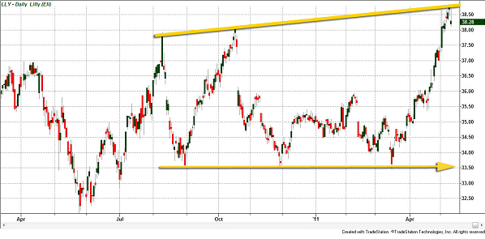

Understanding the financial markets necessitates familiarity with several foundational concepts, with support and resistance zones standing out as vital elements. These zones, intricately tied to market dynamics, signify the areas where demand and supply forces converge, often acting as indicators of potential reversals in market trends. Support serves as a bastion against further declines in asset prices, providing a psychological anchor for buyers who believe an asset is undervalued at that point. Conversely, resistance functions as a cap that impedes additional price increases, representing a level at which sellers might gain conviction that an asset is overvalued.

These zones are not random or static; they are the result of collective market sentiment and intrinsic psychological biases that drive investor behavior. Market participants, influenced by historical price patterns and human emotions such as fear and greed, often project these biases onto price charts, creating observable patterns in the process. This psychological interplay is reflected within these support and resistance levels, which can become self-reinforcing as traders place significant weight on these points.



Technical analysts regard these levels as crucial indicators, employing them to interpret likely market movements and to establish strategic entry and exit points for trades. By understanding the underlying psychological factors, traders can better anticipate shifts in market sentiment and react accordingly, making these zones indispensable tools in the toolkit of any market participant aiming to navigate the complexities of financial markets efficiently.

## Table of Contents

## The Psychology Behind Support and Resistance Zones

Support and resistance zones in financial markets are primarily influenced by the psychological states of market participants. These zones emerge as collective interpretations of price trends by different types of investors—bullish, bearish, and undecided. Each group reacts differently to price movements, which in turn shapes these zones.

Bullish investors, anticipating price increases, view support levels as optimal entry points. Their buying actions at these levels contribute to increased demand, reinforcing the idea of support. Conversely, bearish investors, expecting price declines, perceive resistance levels as advantageous offloading points. Their selling actions at these levels heighten supply, accentuating resistance.

Undecided investors often wait for confirmation of trends before taking action. Their eventual involvement can either uphold or breach support and resistance zones, depending on prevailing market conditions. This dynamic interplay highlights the zones' role as psychological barriers. Traders' collective behavior, driven by fear and greed, reinforces these zones' significance in predicting potential market reversals or continuations.

The psychological underpinnings of support and resistance stem from anchoring, where traders fixate on specific price levels due to past price behaviors or significant historical events. These levels represent perceived value areas, becoming focal points for future trading decisions. Understanding these psychological dynamics is crucial for traders aiming to accurately interpret market signals within these zones.

## Examples of Shifting Zones

Support and resistance zones play a pivotal role in technical analysis, serving as indicators of potential reversals in price trends. A fundamental principle is their interchangeability – the ability for a support zone to transform into a resistance zone and vice versa. This phenomenon is driven by shifts in market conditions and sentiment, reflecting the adaptability of these levels.

When a price breaks below a support level, it often demonstrates a change in sentiment, where a buying stronghold becomes a selling barrier. This shift is frequently observed in charts across various timeframes, reinforcing the idea that these zones are not static. A classic example is when security drops below a previously held support level; upon a subsequent rally, this same area might now act as resistance. This transition can often be attributed to the psychology of market participants who previously viewed the price as a buying opportunity (i.e., support). Upon the breakdown, the area is seen as a favorable point to sell (i.e., resistance).

This concept is not limited to one specific timeframe or chart type. For instance, in an intraday trading chart, if a stock holds a particular price level as support in the morning but breaks below it in the afternoon, that same price level could turn into a resistance as traders look to [exit](/wiki/exit-strategy) their positions at a break-even point. In contrast, on a weekly or monthly chart, a historical support zone might transform into a major resistance level when revisited after a considerable period. This dynamic nature is what makes support and resistance zones a critical component in the toolkit of technical analysts.

To further elaborate, consider a Python code snippet that might be used to identify these zones in a dataset of stock prices:

```python
import pandas as pd

# Example DataFrame creation with historical prices
data = {
    'Date': ['2023-01-01', '2023-01-02', '2023-01-03', '2023-01-04'],
    'Close': [150, 145, 140, 148]
}

df = pd.DataFrame(data)

# Function to detect potential support/resistance shifts
def detect_shifting_zones(df):
    df['Previous_Close'] = df['Close'].shift(1)
    df['Zone_Type'] = 'Neutral'

    for i in range(1, len(df)):
        if df.loc[i, 'Close'] < df.loc[i, 'Previous_Close']:
            df.loc[i, 'Zone_Type'] = 'Support Break'
        elif df.loc[i, 'Close'] > df.loc[i, 'Previous_Close']:
            df.loc[i, 'Zone_Type'] = 'Resistance Break'

    return df

df_with_zones = detect_shifting_zones(df)
print(df_with_zones)
```

In this simplified example, a DataFrame of closing prices is analyzed to detect breaks in support or resistance – both pivotal indicators of shifting zones in the financial markets. Interpreting these dynamic changes can provide traders with invaluable insight into potential price movements, enabling more informed decision-making. Understanding the behavior of these zones offers a lens through which traders can anticipate market dynamics and refine their strategies accordingly.

## Human Emotions and Market Behavior

Fear and greed are fundamental emotions that play a significant role in driving market movements and shaping support and resistance zones. These emotions influence traders' decision-making processes, often leading to exaggerated price fluctuations as markets react to collective sentiment. When fear dominates, traders might rush to sell, pressing prices downward until they hit a support level where buyers perceive prices as undervalued. Conversely, during periods of greed, traders might drive prices up, encountering resistance once prices are seen as overvalued. 

Herd instinct also significantly affects support and resistance zones as traders often gravitate towards these levels, reinforcing their importance. When a price approaches a known support or resistance level, a large number of traders may react similarly, buying at support levels to capitalize on potential price increases or selling at resistance levels to avoid potential declines. This collective action strengthens these zones, creating self-fulfilling prophecies where the mere expectation that others will react in a certain way leads to a consistent pattern.

Moreover, the concept of anchoring in behavioral finance influences market behavior around these zones. Traders tend to fixate on specific price levels, such as past highs or lows, and use them as reference points for decision-making. This anchoring effect can prevent them from adjusting their valuations despite new information, causing prices to halt or reverse at these psychological levels. For example, if a stock price approaches a historical high, traders anchored to this price might be reluctant to buy at higher prices, reinforcing it as a resistance level.

These psychological dynamics, driven by fear, greed, herd behavior, and anchoring, are instrumental in shaping support and resistance zones. Understanding these elements is crucial for traders to interpret market signals accurately and anticipate potential price movements.

## Emotional Price Levels

Round numbers, 52-week highs/lows, and historic market levels can significantly influence traders' behavior, acting as emotional price levels that serve as psychological magnets. Traders often view these levels as mental benchmarks, leading to increased trading activity as prices approach them.

**Round Numbers**  
Round numbers, such as those ending in zeros (e.g., 100, 1000), are commonly perceived as psychological barriers due to their simplicity and memorability. Traders, both retail and institutional, may place orders around these levels, contributing to increased market [liquidity](/wiki/liquidity-risk-premium). This phenomenon can be attributed to cognitive biases where round numbers are subconsciously viewed as important. As a result, these levels can serve as pivotal points for reversals or continuations in price movements.

**52-Week Highs/Lows**  
The 52-week highs and lows represent significant emotional markers within the timeframe of one year. Traders may interpret a 52-week high as a sign of upward [momentum](/wiki/momentum) and optimism in the market, often bolstering buying pressure. Conversely, a 52-week low might indicate pessimism, attracting buying interest from value investors or triggering stop-loss orders. These emotional price levels can have varying impacts, but they generally increase the focus and trading volumes as prices test these boundaries.

**Historic Market Levels**  
Historic price levels are those that previously represented significant support or resistance. Traders tend to remember these levels and consider them when strategizing future trades. If a price returns to a historic level, it might attract traders' attention due to the historical context, leading to decisions influenced by past price action. This awareness creates potential self-fulfilling prophecies where the historic level’s importance is reinforced as traders act on it, thereby increasing trade volumes around these points.

The impact of emotional price levels is observable in market data, where increased activity often accompanies significant levels. Incorporating these understandings into trading strategies can aid in predicting potential reactions and market trends. Moreover, recognizing these psychological factors offers a deeper insight into price movements, assisting traders in making more informed decisions and optimizing their trading outcomes.

## Algorithmic Trading and Support/Resistance Zones

Algorithmic trading has become an integral part of modern financial markets, employing complex mathematical models and algorithms to execute trades at high speeds and volumes. One of the fundamental components often utilized in these systems is the concept of support and resistance levels. These predefined price points assist algorithms in making informed trading decisions, effectively minimizing human emotional biases.

Support and resistance levels function as key indicators in [algorithmic trading](/wiki/algorithmic-trading) models by helping to identify potential entry and exit points. Algorithms are specifically designed to recognize these zones through various technical indicators. For instance, moving averages, Bollinger Bands, and the Relative Strength Index (RSI) are commonly used to detect when prices are approaching key support or resistance levels. The mathematical models embedded within the algorithms analyze historical price data to project future price movements, allowing for timely buy or sell decisions.

A simple algorithm might involve conditions like:

```python
import pandas as pd

# Assume you have a dataframe 'df' with columns ['Date', 'Close', 'RSI', 'MovingAverage']
def algorithmic_trade_strategy(df):
    signals = []
    for index, row in df.iterrows():
        if row['Close'] > row['MovingAverage'] and row['RSI'] < 30:  # Potential support level
            signals.append('Buy')
        elif row['Close'] < row['MovingAverage'] and row['RSI'] > 70:  # Potential resistance level
            signals.append('Sell')
        else:
            signals.append('Hold')
    return signals

# Example usage
# df['Signal'] = algorithmic_trade_strategy(df)
```

This simplified strategy evaluates whether a stock is at a support level (potential buy signal) or a resistance level (potential sell signal) by cross-referencing price movements against technical indicators like moving averages and the RSI.

Algorithmic systems often exploit even minor price fluctuations around these levels. The precision and speed with which algorithms operate enable traders to capitalize on transient opportunities in high-frequency trading scenarios. As such, computers can execute trades more swiftly and accurately than human traders, often leading to significant advantages in volatile markets.

Moreover, these models minimize human psychological biases, such as fear and greed, by relying on quantitative data rather than emotional impulse. This objective approach allows for consistent trading strategies that are less susceptible to the erratic behaviors commonly exhibited by human traders.

In conclusion, algorithmic trading systems extensively incorporate support and resistance levels to optimize trading performance. By leveraging advanced technical indicators, algorithms identify strategic entry and exit points, striving for optimal outcomes while circumventing the pitfalls of human decision-making biases.

## The Bottom Line

Support and resistance zones are fundamental components in technical analysis, heavily influenced by market psychology. These zones reflect the price levels where traders exhibit repeated behaviors, resulting in patterns that can guide future trading actions. Understanding these zones begins with recognizing that they are not fixed points but rather areas where buying or selling pressures prevail.

Traders utilize support and resistance levels to anticipate potential price movements, which can inform their trading strategies. When prices approach a support zone, it's a signal that the market perceives the asset as undervalued, potentially leading to increased buying activity. Conversely, when prices reach a resistance zone, it may indicate overvaluation, triggering selling pressures. These behaviors occur due to the psychological biases of market participants, such as fear of missing out or the desire to lock in profits. Recognizing these biases can offer traders a tactical advantage.

The accuracy in predicting price changes reliant on support and resistance levels is not just instinctual but can also be mathematical. Traders often employ tools like moving averages, Fibonacci retracement levels, and other technical indicators to better identify these zones. While support and resistance points appear frequently on charts, their exact effectiveness can vary depending on the overall market conditions and individual asset [volatility](/wiki/volatility-trading-strategies).

These insights into market psychology and technical foundations underscore the necessity for traders to integrate psychological perspectives with empirical data. A comprehensive understanding of support and resistance zones goes beyond recognizing patterns; it involves sensing the collective sentiment of the marketplace. Traders equipped with this knowledge are more adept at creating strategic plans, enhancing their likelihood of success amidst the often unpredictable terrains of financial markets.

## References & Further Reading

[1]: Murphy, J. J. (1999). ["Technical Analysis of the Financial Markets: A Comprehensive Guide to Trading Methods and Applications"](https://archive.org/details/technicalanalysi0000murp). New York Institute of Finance.

[2]: Nison, S. (1991). ["Japanese Candlestick Charting Techniques: A Contemporary Guide to the Ancient Investment Techniques of the Far East"](https://archive.org/details/japanesecandlest0000niso). Prentice Hall Press.

[3]: Elder, A. (1993). ["Trading for a Living: Psychology, Trading Tactics, Money Management"](https://www.amazon.com/Trading-Living-Psychology-Tactics-Management/dp/0471592242). John Wiley & Sons.

[4]: Bulkowski, T. N. (2005). ["Encyclopedia of Chart Patterns"](https://www.wiley.com/en-us/Encyclopedia+of+Chart+Patterns,+3rd+Edition-p-9781119739685). Wiley.

[5]: Tharp, V. K. (1998). ["Trade Your Way to Financial Freedom"](https://www.amazon.com/Trade-Your-Way-Financial-Freedom/dp/007147871X). McGraw-Hill Education.