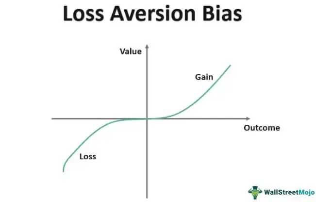

Algorithmic trading represents a confluence of technological prowess and financial acumen, leveraging computational algorithms to execute trades at speeds and frequencies impossible for human traders. Despite its potential for profit generation, this sophisticated approach is not devoid of challenges, particularly the inevitability of financial losses. Losses in trading are not merely numbers on a spreadsheet; they resonate with deeper psychological impacts that can influence a trader's decision-making processes and overall mental state.

At the heart of coping with these financial setbacks lies the necessity to comprehend the psychological burden they impose. A trader's ability to navigate the intricate emotions tied to losing money is pivotal for sustaining long-term success in algorithmic trading. Emotional responses such as frustration, anxiety, and even overconfidence following a loss can lead to compromised decision-making, affecting subsequent trades adversely. Thus, recognizing these emotional triggers and developing effective strategies to manage them is essential.



This article outlines various psychological approaches aimed at mitigating the stress and mental strain caused by trading losses. By fostering an understanding of the psychological landscape of trading, individuals can not only enhance their resilience against the unpredictabilities of the market but also refine their trading strategies to better accommodate the inevitability of losses. Cultivating such strategies enables traders to maintain composure, ensure disciplined trading practices, and ultimately, achieve sustainable profitability in the competitive world of algorithmic trading.

## Table of Contents

## Coping With Losses in Algorithmic Trading

Losses are an inherent part of trading, and algorithmic trading is no exception. The nature of financial markets means that price fluctuations can be unpredictable and driven by a myriad of factors, including macroeconomic data releases, geopolitical events, or market sentiment. Algorithmic trading, while designed to leverage speed and precision, is also subject to these market dynamics. Automated strategies, despite being meticulously programmed, can suffer from miscalculations or react undesirably under unforeseen conditions.

Traders must recognize and accept this reality. Acknowledgment of potential losses is essential for maintaining emotional balance and developing a sustainable trading practice. Algorithmic traders should prepare for losses as part of their strategy design process. This preparation includes establishing risk management protocols and setting appropriate expectations about strategy performance.

To maintain long-term resilience, it is crucial to develop a mindset oriented toward acceptance and adaptation. This involves understanding that losses do not inherently signify failure but rather serve as feedback for refining and optimizing trading systems. By cultivating an approach that views losses as learning opportunities, traders can enhance the robustness of their algorithms.

```python
def calculate_loss(profit_loss):
    """Calculates total loss from a list of profits and losses."""
    total_loss = sum(x for x in profit_loss if x < 0)
    return total_loss

# Example Usage
profit_loss_data = [100, -50, 30, -20, -10, 60]
total_loss = calculate_loss(profit_loss_data)
print(f"Total Trading Loss: {total_loss}")
```

Maintaining resilience also requires systematic reflection on trading outcomes. By periodically reviewing trading performance and analyzing losses, traders can identify patterns and make data-driven improvements to their algorithms. This analytical process benefits from a structured approach, such as maintaining a trading journal, where observations and insights are diligently recorded.

Ultimately, a mindset that embraces the inherent uncertainties of [algorithmic trading](/wiki/algorithmic-trading) helps pave the way for personal growth and professional development. By recognizing losses as integral to the trading journey, traders can fortify their strategies against future adversities, resulting in an enduring and adaptive trading practice.

## Understanding Trading Psychology

Trading psychology focuses on how traders' emotions and cognitive biases impact their trading decisions and performance. This discipline is essential in understanding the dynamics of trading behavior and is critical in developing an effective trading strategy. Emotions like fear and greed are prevalent and can significantly impact both novice and experienced traders, often resulting in impulsive decisions that lead to losses.

Fear in trading usually manifests in two main ways: the fear of losing and the fear of missing out (FOMO). The fear of losing can cause traders to [exit](/wiki/exit-strategy) positions prematurely, preventing them from realizing potential gains. Conversely, FOMO might drive a trader to enter a position hastily due to the anxiety of missing lucrative opportunities, often without thorough analysis or strategic planning. Greed, on the other hand, might lead a trader to hold onto winning trades for too long in pursuit of additional gains, increasing exposure to risk despite a lack of supporting market signals.

Cognitive biases also play a significant role in trading psychology. Common biases include:

1. **Confirmation Bias**: The tendency to favor information that confirms pre-existing beliefs or hypotheses, which might lead traders to ignore critical contrary data.
2. **Anchoring Bias**: The reliance on specific anchors, like past prices, to make decisions, potentially skewing the perception of a security's current value.
3. **Herding Behavior**: The propensity to mimic the actions of the majority, which can result in buying high during market rallies and selling low during downturns.

Recognizing these emotional and cognitive influences is crucial for developing discipline in trading. Through self-awareness and reflection, traders can mitigate the impact of these psychological pitfalls by establishing rules and strategies that limit emotional involvement in decision-making. For instance, automated trading systems and algorithmic trading strategies can be employed to diminish emotional biases by adhering strictly to predefined rules and conditions.

Implementing a structured approach to trading involving risk management, consistent review of strategies, and continuous education can further shield traders from detrimental emotional reactions. Regular introspection and learning help traders adapt to changing market conditions and hone their psychological resilience, leading to more deliberate and rational trading decisions.

## Dysfunctional Coping Strategies

Traders often face significant challenges when coping with financial losses, and some resort to dysfunctional coping strategies. These strategies include denial, projection, and suppression. Denial involves refusing to acknowledge the reality of a loss, which can lead to continued risky behavior without addressing the underlying issues. Projection shifts the responsibility of poor outcomes onto external factors or other individuals, preventing traders from learning from their mistakes. Suppression involves consciously attempting to ignore or block out unpleasant emotions associated with losses, which can result in increased stress and anxiety over time.

Adopting these maladaptive coping mechanisms can exacerbate stress and create compounded problems. In a professional setting, traders who engage in these behaviors might make increasingly irrational decisions, harming their career prospects and the financial well-being of their clients or firms. On a personal level, the stress associated with these strategies can spill over into a trader's personal life, affecting relationships and overall mental health.

Recognizing and avoiding such negative patterns is crucial. It is the first step toward establishing healthier coping mechanisms. Successful traders often focus on self-awareness, which involves acknowledging emotional responses to trading outcomes and understanding their impact on decision-making. By doing so, traders can begin to replace dysfunctional strategies with constructive ones, such as reflection, seeking feedback, and developing emotional intelligence. This contributes to a more balanced approach to trading and mitigates the psychological toll it can take.

## Sound Psychological Coping Strategies

Successful traders often employ a range of psychological coping strategies to manage losses effectively. One of the primary strategies is the re-evaluation of current trading methods. This involves analyzing past trades to identify patterns or mistakes that may have contributed to the losses. By conducting a thorough review, traders can modify their strategies and improve future performance.

Learning from past mistakes is crucial. Effective traders cultivate a mindset of continuous improvement, where each error is viewed as an opportunity for growth. This attitude fosters resilience and adaptability, essential qualities in the volatile trading environment.

Seeking professional guidance is another sound strategy. Engaging with mentors or financial advisors can provide new perspectives and insights into trading strategies. Professional support can also help traders to detach emotionally from their losses, allowing for more rational decision-making.

Emotional resilience is a cornerstone of successful trading. Practices such as mindfulness meditation help traders develop greater awareness of their emotional states. By recognizing emotions as they arise, traders can prevent these feelings from influencing their trading decisions. Mindfulness, therefore, serves as a buffer against impulsive reactions driven by fear or greed.

Maintaining a balanced lifestyle plays a vital role in emotional resilience. Regular physical activity, healthy eating, adequate sleep, and social interaction contribute to overall well-being, which in turn supports robust mental health. When traders prioritize these aspects of their lives, they are better equipped to handle the pressures and stresses of trading.

Incorporating these psychological strategies requires discipline and commitment but can significantly enhance a trader's ability to recover from losses and sustain long-term success.

## Implementing Risk Management Techniques

Risk management is essential in mitigating the impact of trading losses and achieving long-term success. Effective risk management involves setting realistic goals, utilizing stop-loss strategies, and ensuring a balanced risk-reward ratio.

Setting realistic goals is the first step toward effective risk management. Traders should have well-defined objectives that align with their risk tolerance and investment strategy. Unrealistic expectations can lead to excessive risk-taking and emotional stress. Traders should regularly review and adjust their goals based on market conditions and personal financial circumstances.

Stop-loss strategies are another critical component. A stop-loss order is a pre-determined price level at which a trader will exit a losing position to prevent further losses. This technique helps traders establish clear exit points, reducing emotional decision-making during market [volatility](/wiki/volatility-trading-strategies). For example, if a trader buys a stock at $100 and sets a stop-loss at $95, the stock will be automatically sold if its price drops to $95, limiting the trader's loss.

Maintaining a balanced risk-reward ratio is fundamental to successful trading. The risk-reward ratio measures the potential profit against the potential loss in a trade. For example, a 1:3 risk-reward ratio means that for every dollar risked, the potential profit could be three dollars. Traders should aim for trades with favorable risk-reward ratios to maximize potential returns while keeping losses manageable.

Employing proper risk management techniques can alleviate emotional stress associated with trading. When traders have a clear plan for managing risks, they are less likely to make impulsive decisions driven by fear or greed. Consistently applying these techniques supports a disciplined trading approach, enhancing overall market performance.

In Python, risk management tools can be implemented via libraries like pandas and NumPy to automate processes such as calculating risk-reward ratios or automatically placing stop-loss orders. Here's a simple Python example demonstrating how one might calculate the risk-reward ratio for a given trade:

```python
def calculate_risk_reward(entry_price, target_price, stop_loss_price):
    risk = entry_price - stop_loss_price
    reward = target_price - entry_price
    risk_reward_ratio = reward / risk
    return risk_reward_ratio

entry_price = 100
target_price = 115
stop_loss_price = 95
ratio = calculate_risk_reward(entry_price, target_price, stop_loss_price)
print(f"Risk-Reward Ratio: {ratio:.2f}")
```

By implementing these strategies, traders can construct a robust risk management plan that enhances their ability to navigate market challenges and promote long-term profitability.

## Developing a Resilient Mindset

A resilient mindset is essential for traders dealing with losses in algorithmic trading. This mindset enables recovery from setbacks and ensures traders remain focused on long-term objectives despite short-term challenges. Developing mental resilience involves several strategies, starting with positive thinking. Positive thinking shifts the trader's focus from their current difficulties to future possibilities and solutions. By harboring an optimistic attitude, traders are more likely to make rational decisions that support their overall trading strategies.

Regular stress reduction exercises contribute significantly to mental toughness. Practices such as meditation, deep-breathing exercises, and even physical activity can reduce stress and improve emotional regulation. These activities help traders maintain a clear head, preventing emotional reactions that could lead to impulsive trading decisions. For instance, meditation has been shown to reduce stress by affecting areas of the brain responsible for emotion regulation. Incorporating a daily routine of such exercises can lead to improved decision-making and resilience.

Maintaining a trading journal offers another powerful tool in cultivating resilience. By documenting trades, emotions, and outcomes, traders can better understand their decision-making processes and emotional triggers. Review of journal entries can help identify patterns of behavior that lead to losses, allowing for adjustments that could improve future performance. A trading journal serves not only as a record but as a reflective tool that promotes learning from past experiences.

Viewing losses as opportunities for growth is crucial for a resilient mindset. Traders should reframe losses not as failures but as lessons that can guide future strategies. This perspective shift can transform setbacks into constructive experiences, aiding in the development of improved trading tactics. Celebrated in various domains of personal development, the ability to view challenges as opportunities fosters persistence and innovation.

In conclusion, a resilient mindset allows traders to navigate the complexities and emotional challenges of algorithmic trading. By focusing on positive thinking, engaging in stress reduction activities, maintaining a thorough trading journal, and perceiving losses as learning opportunities, traders can enhance their mental strength and adaptability in the dynamic financial markets.

## Conclusion

Coping with losses in algorithmic trading requires a blend of psychological strategies and effective risk management techniques. Algorithmic trading, which utilizes computer algorithms to execute trades at optimal speed and frequency, can be highly lucrative but also subject to market volatility and unexpected downturns. The key to resilience in this field lies in developing a robust trading psychology and maintaining rigorous discipline. 

Firstly, psychological resilience plays a pivotal role in navigating market fluctuations. Traders who cultivate a strong trading psychology are better equipped to handle the emotional impacts of losses. This involves understanding and mitigating the influence of emotions like fear and greed, which can lead to impulsive and irrational trading decisions. Traders should practice continual self-awareness, assessing their emotional state and recognizing triggers that may compromise their trading strategies. Emotional regulation strategies, such as mindfulness and stress management techniques, can aid in maintaining clarity and focus during stressful trading periods.

Moreover, continuous learning is essential for long-term success. Traders should stay informed about market changes, evolving technologies, and new strategies. This commitment to learning not only helps in optimizing current trading algorithms but also in anticipating and preparing for potential market shifts. Maintaining a trading journal can be beneficial in this regard, as it allows traders to document and analyze trades, thereby facilitating reflective learning and improvement over time.

In parallel, implementing practical risk management techniques is crucial. Traders should establish clear risk parameters, including stop-loss orders and risk-reward ratios, to minimize potential losses. Setting realistic goals rather than overly ambitious targets can prevent the emotional burnout associated with constant trading pressure. Such strategies help in mitigating the financial impact of individual losses and maintain the overall integrity of the trading portfolio.

In conclusion, a combination of strong psychological strategies and sound risk management is vital for achieving long-term profitability and success in algorithmic trading. By fostering resilience, maintaining discipline, and committing to ongoing learning and self-assessment, traders can better manage the inherent ups and downs of the market.

## Frequently Asked Questions

### Frequently Asked Questions

**What is trading psychology and why is it important?**

Trading psychology refers to the emotional and psychological factors that influence a trader's decisions. It is a crucial aspect of trading as it directly impacts how traders respond to market fluctuations, make decisions under pressure, and deal with gains and losses. Emotions such as fear, greed, anxiety, and overconfidence can skew judgment and lead to suboptimal trading decisions. Recognizing the role of psychology in trading helps individuals develop self-awareness and discipline, which are essential for achieving consistency and long-term profitability in the markets.

**How can traders manage emotions like fear and greed?**

Managing emotions like fear and greed is vital for maintaining a clear and objective trading mindset. Several strategies can be employed to manage these emotions effectively:

1. **Develop a Trading Plan**: A comprehensive trading plan that includes specific entry and exit points, risk management rules, and defined goals can serve as an objective guide. It helps reduce emotional decision-making by providing a structured framework to follow.

2. **Use Automated Trading Systems**: Algorithmic trading can minimize emotional interference by executing trades based on pre-defined criteria without human intervention.

3. **Practice Mindfulness and Stress Reduction Techniques**: Methods such as meditation, deep breathing exercises, and regular physical activity can help traders maintain emotional balance and reduce stress levels.

4. **Regular Self-Assessment**: Keeping a trading journal to document emotions, thoughts, and decisions can provide insights into personal emotional triggers and help in recognizing patterns that could be harmful in trading.

**What are some effective methods for dealing with trading losses?**

Dealing with trading losses is an inevitable part of the trading experience. Here are effective methods for coping with losses:

1. **Accept Losses as Part of Trading**: Understanding that losses are natural and inevitable can help traders emotionally detach from unfavorable outcomes and focus on long-term performance.

2. **Re-evaluate Trading Strategies**: Consistently analyzing and adjusting trading strategies based on past performance helps identify mistakes and learn from them, reducing the risk of repeating them in future trades.

3. **Implement Risk Management Techniques**: Setting stop-loss orders, diversifying portfolios, and maintaining a balanced risk-reward ratio can protect traders from significant losses and reduce emotional stress.

4. **Seek Professional Guidance**: Consulting with a trading coach or psychologist can provide valuable insights and strategies for handling emotions related to trading.

These methods, combined with a disciplined approach, can help traders effectively manage losses and maintain psychological resilience.

## References & Further Reading

[1]: Bergstra, J., Bardenet, R., Bengio, Y., & Kégl, B. (2011). ["Algorithms for Hyper-Parameter Optimization."](https://dl.acm.org/doi/10.5555/2986459.2986743) Advances in Neural Information Processing Systems 24.

[2]: ["Advances in Financial Machine Learning"](https://www.amazon.com/Advances-Financial-Machine-Learning-Marcos/dp/1119482089) by Marcos Lopez de Prado

[3]: ["Evidence-Based Technical Analysis: Applying the Scientific Method and Statistical Inference to Trading Signals"](https://www.amazon.com/Evidence-Based-Technical-Analysis-Scientific-Statistical/dp/0470008741) by David Aronson

[4]: ["Machine Learning for Algorithmic Trading"](https://github.com/stefan-jansen/machine-learning-for-trading) by Stefan Jansen

[5]: ["Quantitative Trading: How to Build Your Own Algorithmic Trading Business"](https://www.amazon.com/Quantitative-Trading-Build-Algorithmic-Business/dp/1119800064) by Ernest P. Chan