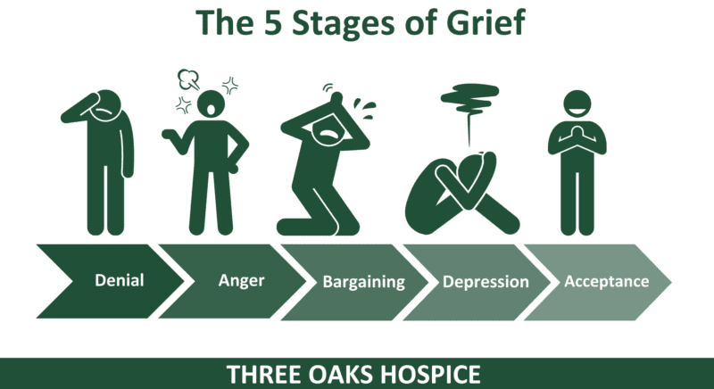

## Table of Contents

## What is loss and how does it impact mental health?

Loss is when you lose something or someone important to you. This can be a person, like a family member or friend, or it can be a job, a home, or even a pet. When you experience loss, it can make you feel very sad and can change how you feel and act every day.

Loss can impact your mental health in many ways. It can make you feel very sad, angry, or confused. Sometimes, it can make it hard to sleep or eat. You might feel like you don't want to do things you used to enjoy. It's normal to feel these things after a loss, but if these feelings last a long time, it might be a good idea to talk to someone who can help, like a counselor or therapist.

## What are the stages of grief and how do they manifest?

The stages of grief are a way to understand how people might feel after a loss. They include denial, anger, bargaining, depression, and acceptance. These stages don't always happen in order, and people might go back and forth between them. Denial is when you might feel like the loss isn't real. Anger can make you feel mad at the world or at the person who is gone. Bargaining is when you might think about what you could have done differently. Depression is when you feel very sad and might not want to do anything. Acceptance is when you start to feel okay with the loss and can move forward.

These stages can show up in different ways. In denial, you might avoid talking about the loss or pretend it didn't happen. Anger might make you yell or feel frustrated easily. Bargaining could mean you keep thinking about "if only" scenarios, like "If only I had called more often." Depression might make you feel tired all the time, or you might cry a lot. Acceptance doesn't mean you forget the loss, but you start to find ways to live with it and remember the good things about what you lost. It's important to know that everyone goes through these stages differently and at their own pace.

## How can mindfulness help in coping with loss?

Mindfulness can help a lot when you're dealing with loss. It means paying attention to what's happening right now, without judging it. When you're mindful, you can notice your feelings of sadness or anger without getting overwhelmed by them. This can make it easier to handle these feelings because you're not fighting them or trying to push them away. Instead, you're just letting them be there, which can make them feel less scary or big.

Practicing mindfulness can also help you find moments of peace and calm during a tough time. You might do things like deep breathing, where you focus on your breath going in and out. Or you might pay attention to what you see, hear, or feel around you. These activities can give you a break from the pain of loss and help you feel more grounded. Over time, mindfulness can help you accept your loss and find ways to move forward, even if it's just a little bit at a time.

## What role does social support play in the grieving process?

Social support is very important when you are grieving. It means having friends, family, or others who help you feel less alone during a tough time. When you lose someone or something important, talking to people who care about you can make a big difference. They can listen to you, give you a hug, or just be there with you. This can help you feel understood and less sad. Sometimes, just knowing that someone is there for you can make the pain of loss a little easier to handle.

Having social support also means you have people who can help you with everyday things. They might bring you food, help you with chores, or remind you to take care of yourself. This can be really helpful because when you're grieving, it can be hard to do these things on your own. Being around others can also give you a sense of normalcy and routine, which can be comforting when everything else feels upside down. In the end, social support can make the grieving process feel less lonely and more manageable.

## Can journaling be an effective strategy for dealing with grief?

Journaling can be a good way to deal with grief. When you write down your thoughts and feelings, it can help you understand them better. Sometimes, it's hard to talk about how you feel, but writing in a journal gives you a safe place to let it all out. You can write about the person or thing you lost, how much you miss them, or even the happy memories you shared. This can help you process your feelings and start to heal.

Journaling also lets you see how your feelings change over time. You might feel very sad at first, but as you keep writing, you might start to feel a little better. Looking back at what you wrote can show you that you are moving forward, even if it's slow. This can give you hope and help you feel less stuck in your grief. In the end, journaling can be a helpful tool to cope with the pain of loss.

## How can cognitive-behavioral techniques assist in managing grief?

Cognitive-behavioral techniques can help you manage grief by changing the way you think and act. When you're grieving, you might have a lot of negative thoughts, like feeling guilty or thinking that life will never be good again. Cognitive-behavioral therapy, or CBT, helps you notice these thoughts and challenge them. For example, if you think "I'll never be happy again," a therapist might help you see that while you're very sad now, happiness can come back in time. By changing these thoughts, you can start to feel better.

CBT also helps you change your behaviors. When you're grieving, you might stop doing things you used to enjoy, like going out with friends or exercising. A therapist can help you set small goals to start doing these things again. Maybe you start by going for a short walk or calling a friend. These small steps can help you feel more in control and less overwhelmed by your grief. Over time, these changes in thinking and behavior can make a big difference in how you cope with your loss.

## What are some common myths about grief and how can they be debunked?

A common myth about grief is that it follows a set timeline and stages that everyone goes through in order. People often think you should be over your grief after a certain time, like a year. But the truth is, everyone grieves differently. Some people might feel better after a few months, while others might take years. Grief doesn't follow a neat path, and it's okay if you still feel sad or miss someone long after they're gone.

Another myth is that showing emotions during grief is a sign of weakness. Some people think you should keep your feelings inside and be strong. But it's actually healthy to express your feelings, whether you're crying, talking about your loss, or even feeling angry. Letting out your emotions can help you heal. It's okay to be sad, and it's okay to show it. Being open about your grief can even help others support you better.

## How does one differentiate between normal grief and complicated grief?

Normal grief is what most people feel after losing someone or something important. It can make you feel very sad, angry, or confused. You might miss the person a lot and think about them often. Over time, these feelings usually get a little better, even if you still feel sad sometimes. Normal grief can last for different amounts of time for different people, but you start to feel like you can live your life again, even if it's hard.

Complicated grief is when your grief lasts a long time and makes it hard to live your life. It's more than just feeling sad. You might feel stuck in your grief and can't move forward. You might avoid things that remind you of the person you lost, or you might think about them all the time and can't stop. If your grief is so strong that it stops you from doing things you need to do, like going to work or taking care of yourself, it might be complicated grief. It's a good idea to talk to a doctor or counselor if you think you might have complicated grief.

## What therapeutic approaches are most effective for grief counseling?

One effective approach for grief counseling is Cognitive-Behavioral Therapy (CBT). This therapy helps people change the way they think and act after a loss. If you're feeling guilty or hopeless, a therapist can help you see these thoughts in a different way. They might also help you set small goals, like going for a walk or calling a friend, to get you back into your routine. Over time, these changes can make you feel better and more in control of your grief.

Another helpful approach is Interpersonal Therapy (IPT). This therapy focuses on your relationships with other people. When you're grieving, you might feel lonely or have trouble talking to others about your loss. IPT can help you improve your communication and feel more connected to the people around you. This can make your grief feel less heavy because you have support from others.

Mindfulness-based therapies are also effective. These therapies teach you to pay attention to what's happening right now without judging it. This can help you handle your feelings of sadness or anger without getting overwhelmed. By focusing on the present, you might find moments of peace and start to accept your loss. Mindfulness can be a good way to find calm and start healing during a tough time.

## How can one maintain self-care routines while grieving?

When you're grieving, taking care of yourself can feel really hard. But it's important to try to keep up with self-care routines. Start small, like making sure you eat something healthy each day or drink enough water. Even if you don't feel like it, try to get a little bit of exercise, like going for a short walk. These small steps can help you feel a bit better, even if your grief is still heavy.

It can also help to do things that relax you, like taking a warm bath, reading a book, or listening to music. Try to get enough sleep, even if it's hard. If you can, talk to someone you trust about how you're feeling. It's okay to ask for help, whether it's from friends, family, or a counselor. Taking care of yourself during grief won't make the sadness go away, but it can make it a little easier to handle.

## What are the long-term psychological effects of unresolved grief?

Unresolved grief can have big effects on your mind over time. If you don't deal with your feelings of loss, you might feel sad or angry for a long time. This can lead to depression, where you feel down and don't want to do things you used to enjoy. You might also have trouble sleeping or eating, and it can be hard to focus on work or school. Unresolved grief can make you feel stuck, like you can't move forward with your life.

It can also affect how you connect with other people. You might pull away from friends and family because it's hard to talk about your loss. This can make you feel lonely and isolated. Over time, unresolved grief can even lead to physical problems, like headaches or stomach issues, because feeling stressed and sad for a long time can wear on your body. It's important to find ways to deal with your grief so it doesn't keep affecting your life in these big ways.

## How can professionals integrate cultural considerations into grief therapy?

When helping someone with grief, it's important for professionals to think about the person's culture. Different cultures have different ways of dealing with loss. Some might have special rituals or ceremonies to honor the person who passed away. Others might have different ways of showing sadness or talking about death. By understanding these cultural practices, a therapist can make the person feel more comfortable and respected. They might ask the person about their traditions and beliefs and find ways to include them in the therapy.

For example, if someone comes from a culture where talking openly about feelings isn't common, the therapist might use other ways to help them express their grief, like art or writing. It's also important to be aware of any cultural beliefs about death and the afterlife, as these can affect how someone grieves. By being sensitive to these differences, a therapist can help the person feel understood and supported, which can make a big difference in their healing process.

## References & Further Reading

[1]: Bergstra, J., Bardenet, R., Bengio, Y., & Kégl, B. (2011). ["Algorithms for Hyper-Parameter Optimization."](https://dl.acm.org/doi/10.5555/2986459.2986743) Advances in Neural Information Processing Systems 24.

[2]: ["Advances in Financial Machine Learning"](https://www.amazon.com/Advances-Financial-Machine-Learning-Marcos/dp/1119482089) by Marcos Lopez de Prado

[3]: ["Evidence-Based Technical Analysis: Applying the Scientific Method and Statistical Inference to Trading Signals"](https://www.amazon.com/Evidence-Based-Technical-Analysis-Scientific-Statistical/dp/0470008741) by David Aronson

[4]: ["Machine Learning for Algorithmic Trading"](https://github.com/stefan-jansen/machine-learning-for-trading) by Stefan Jansen

[5]: ["Quantitative Trading: How to Build Your Own Algorithmic Trading Business"](https://www.amazon.com/Quantitative-Trading-Build-Algorithmic-Business/dp/1119800064) by Ernest P. Chan