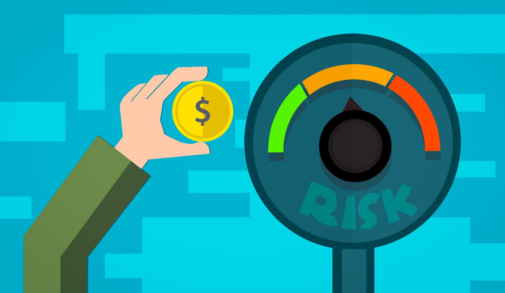

## Table of Contents

## What are psychological traps in investing?

Psychological traps in investing are common mistakes that people make because of their emotions and ways of thinking. These traps can lead to bad investment decisions and losing money. For example, one common trap is called "loss aversion," where people feel the pain of losing money more than the joy of gaining it. This can make them hold onto losing investments for too long, hoping they will recover, instead of selling and moving on.

Another trap is "overconfidence," where investors think they know more than they really do. This can lead them to take bigger risks or trade too often, thinking they can beat the market. But the market is hard to predict, and overconfidence often results in poor performance. It's important for investors to be aware of these traps and try to make decisions based on facts and careful thinking, rather than emotions.

Lastly, "herd mentality" is another psychological trap where investors follow what everyone else is doing without thinking for themselves. If everyone is buying a certain stock, people might jump in too, even if it's overpriced. This can create bubbles that eventually burst, leading to big losses. Being aware of these traps and taking a step back to think critically can help investors make better choices and avoid common pitfalls.

## How can emotions affect investment decisions?

Emotions can really mess up investment decisions. When people feel scared or worried, they might sell their investments too quickly, even if it's not a good time. This is called panic selling. On the other hand, when people feel happy or excited, they might buy things without thinking carefully. This can lead to buying investments that are too risky or overpriced.

Another way emotions affect investing is through something called "loss aversion." This means people feel the pain of losing money much more than the joy of gaining it. So, they might hold onto losing investments for too long, hoping they'll get better, instead of selling and moving on. This can make their losses even bigger. It's important for investors to try to keep their emotions in check and make decisions based on facts and careful thinking, not just how they feel at the moment.

## What is the role of cognitive biases in investing?

Cognitive biases are like mental shortcuts that can trick us into making bad investment choices. One common bias is called "confirmation bias," where people only look for information that supports what they already believe. For example, if someone thinks a certain stock is a good investment, they might only read articles that say good things about it and ignore the bad news. This can lead to making decisions without seeing the full picture.

Another bias is "anchoring," where people rely too much on the first piece of information they get. If an investor hears that a stock is worth $100, they might always think of it as a $100 stock, even if its value changes. This can make them miss out on good opportunities or hold onto a stock too long. Being aware of these biases and trying to think more critically can help investors make better decisions and avoid common mistakes.

## Can you explain the concept of loss aversion in the context of investing?

Loss aversion is a big deal in investing. It means that people feel the pain of losing money much more than the happiness of gaining it. So, when an investment starts to lose value, instead of selling it and moving on, people might hold onto it, hoping it will get better. They're more scared of the loss than excited about possible gains. This can make their losses even bigger because they wait too long to sell.

For example, imagine you bought a stock for $100, and now it's worth $80. You might think, "If I sell now, I'll lose $20, but if I wait, it might go back up to $100." So, you keep the stock, even if it keeps going down. This is loss aversion at work. It's important for investors to recognize this feeling and try to make decisions based on facts, not just fear of losing money.

## How does overconfidence lead to poor investment choices?

Overconfidence can make people think they know more about investing than they really do. When someone feels too sure of themselves, they might take bigger risks or trade more often, thinking they can beat the market. But the market is hard to predict, and most people can't outsmart it. This overconfidence can lead to buying stocks that are too risky or selling good investments too soon, just because they think they know better.

For example, an overconfident investor might think they can time the market perfectly, buying low and selling high. But this rarely works out as planned. They might end up buying stocks at a high price because they believe the price will keep going up, only to see it crash later. Or they might sell a stock too early, missing out on bigger gains because they thought they knew when the peak was coming. Overconfidence often results in poor investment choices because it makes people ignore the real risks and facts.

## What is the endowment effect and how does it influence investors?

The endowment effect is when people value something more just because they own it. It's like thinking a toy you have is way cooler than the same toy your friend has. In investing, this means that investors might think their stocks or other investments are worth more just because they own them, even if the market says otherwise.

This can lead to bad choices. For example, an investor might refuse to sell a stock that's losing value because they feel attached to it. They might think, "I've owned this stock for a long time, it must be worth more than what it's selling for now." This attachment can make them hold onto losing investments too long, hoping the price will go back up, instead of selling and moving on to better opportunities. Recognizing the endowment effect can help investors make more rational decisions and avoid letting their emotions get in the way.

## How can confirmation bias impact an investor's strategy?

Confirmation bias can really mess up an investor's strategy. It's when people only look for information that agrees with what they already think. So, if an investor believes a certain stock is a good buy, they might only read articles that say good things about it and ignore any bad news. This means they don't see the full picture and might make decisions based on a one-sided view. For example, if someone is sure a tech company is going to do well, they might ignore warnings about the company's financial troubles and end up losing money.

This bias can lead investors to stick with their original plan even when it's not working out. They might keep buying more of the same stock because they're convinced it will go up, even if the market is showing signs that it won't. This can make their losses bigger because they're not open to changing their mind based on new information. To avoid this, investors need to try to look at all sides of the story and be ready to change their strategy if the facts show it's needed.

## What is the herd mentality and its effects on the stock market?

Herd mentality is when people do what everyone else is doing without thinking for themselves. In the stock market, this means investors might buy or sell stocks just because everyone else is doing it. They see others making money on a certain stock, so they jump in too, even if they don't really know if it's a good investment. This can create bubbles, where the price of a stock goes way up because so many people are buying it, but it's not really worth that much.

When the bubble bursts, the price of the stock can fall really fast, and a lot of people lose money. This is because everyone starts selling at the same time, trying to get out before the price drops even more. Herd mentality can make the stock market go up and down a lot more than it should, based on what people are feeling rather than what's really happening with the companies. It's important for investors to think for themselves and not just follow the crowd.

## How can anchoring bias skew an investor's perception of value?

Anchoring bias happens when people rely too much on the first piece of information they get. In investing, this means an investor might think a stock is worth a certain amount just because that's the first price they heard. For example, if someone hears a stock is worth $100, they might always see it as a $100 stock, even if its value changes. This can make them miss out on good chances to buy or sell because they're stuck on that first number.

This bias can really mess up how investors see the value of their investments. They might hold onto a stock too long, waiting for it to get back to that first price they heard, even if it's not going to happen. Or they might not buy a stock that's now a good deal because it's lower than the first price they heard. It's important for investors to look at all the facts and not just stick to the first number they come across.

## What strategies can investors use to mitigate the impact of psychological traps?

Investors can use several strategies to avoid falling into psychological traps. One important strategy is to make a clear plan before starting to invest. This means setting goals, deciding how much risk to take, and sticking to the plan even when emotions are high. By following a set plan, investors can avoid making quick decisions based on fear or excitement. Another helpful strategy is to do a lot of research and look at all sides of the story. This helps to avoid confirmation bias, where people only look for information that agrees with what they already think. By looking at all the facts, investors can make more balanced decisions.

Another strategy is to keep emotions in check. This can be hard, but taking a break from watching the market every day can help. It's also good to talk to a financial advisor or someone who can give an outside view. This can help investors see things more clearly and not get caught up in herd mentality, where everyone is doing the same thing without thinking. Lastly, being aware of common psychological traps like loss aversion and overconfidence can help investors recognize when they're falling into these traps and take steps to avoid them. By staying informed and thinking critically, investors can make better choices and avoid common pitfalls.

## How do professional investors manage psychological traps in their decision-making process?

Professional investors often use a structured approach to manage psychological traps. They create detailed investment plans that outline their goals, risk tolerance, and strategies. By sticking to these plans, they can avoid making quick decisions based on emotions like fear or excitement. They also use a lot of data and research to make their decisions, which helps them avoid confirmation bias. By looking at all the facts, they can see the full picture and make more balanced choices.

Another way professional investors manage psychological traps is by keeping their emotions in check. They might take breaks from watching the market every day to avoid getting caught up in short-term ups and downs. They also often work with teams or consult with other experts to get different viewpoints. This helps them avoid herd mentality and overconfidence. By staying aware of common psychological traps like loss aversion and anchoring, they can recognize when these biases might be affecting their decisions and take steps to counteract them.

## Can you discuss advanced behavioral finance theories relevant to expert investors?

One advanced theory in behavioral finance that expert investors pay attention to is called "prospect theory." This theory says that people don't always make decisions based on what's most logical. Instead, they care more about changes in their wealth than the final amount. For example, losing $100 feels much worse than gaining $100 feels good. This is why investors might hold onto losing investments too long, hoping they'll go back up, instead of selling and moving on. Expert investors understand this and try to make decisions based on the overall value of their portfolio, not just the fear of losing money.

Another important theory is "mental accounting." This is when people treat money differently based on where it comes from or what they plan to use it for. For example, an investor might see money they made from a stock as "extra" and be more willing to take risks with it. Expert investors know this can lead to bad choices, so they try to see all their money as one big pool. They also use diversification, spreading their investments across different types of assets, to manage risk better. By understanding these theories, expert investors can make smarter choices and avoid common pitfalls that come from how our minds work.

## What is the relationship between Algorithmic Trading and Psychological Traps?

Algorithmic trading has revolutionized financial markets by utilizing data-driven decisions to minimize human emotional biases. Despite its potential to enhance objectivity, human-operated algorithms can inadvertently reflect cognitive biases if not carefully designed and managed. These latent biases can stem from the developer's own cognitive limitations and the data used in the algorithm's training phase.

To mitigate psychological traps, setting unemotional, data-based rules within the trading algorithms is crucial. This process involves establishing clear parameters that guide decision-making based solely on quantifiable indicators and historical data patterns. For instance, employing statistical models such as moving averages or Bollinger Bands can aid in generating signals for buying or selling assets by focusing solely on numerical data rather than subjective judgments.

Regularly reviewing and tweaking algorithm parameters is essential to maintain objective decision-making. Market conditions evolve, and what might have been an optimal strategy under one set of circumstances can become suboptimal as variables change. This ongoing evaluation involves [backtesting](/wiki/backtesting) algorithms with historical data to ensure robustness and recalibration based on performance metrics. Metrics such as the Sharpe Ratio, which compares the return of an investment relative to its risk, can provide insights into the effectiveness of modifications:

$$
\text{Sharpe Ratio} = \frac{E[R_i - R_f]}{\sigma_i}
$$

Where $E[R_i - R_f]$ is the expected return of the investment minus the risk-free rate, and $\sigma_i$ is the standard deviation of the investment's excess return.

Investors must also develop a balanced approach where they trust the outputs of their algorithms while staying informed about current market dynamics. This approach ensures that they avoid becoming detached from market realities and respond prudently to significant external changes. It involves complementing algorithmic insights with broader market analysis to provide context and validate automated decisions.

By combining unemotional algorithmic strategies with conscious awareness of market conditions, investors can mitigate the impact of psychological traps. This balanced methodology promotes a more disciplined investment strategy, devoid of the emotional pitfalls that can undermine financial performance.

## References & Further Reading

[1]: Barber, B. M., & Odean, T. (2001). ["Boys will be boys: Gender, overconfidence, and common stock investment."](https://academic.oup.com/qje/article-abstract/116/1/261/1939000) The Quarterly Journal of Economics, 116(1), 261-292.

[2]: Kahneman, D., & Tversky, A. (1979). ["Prospect Theory: An Analysis of Decision under Risk."](https://www.jstor.org/stable/1914185) Econometrica, 47(2), 263-291.

[3]: Thaler, R. H. (1985). ["Mental accounting and consumer choice."](https://www.researchgate.net/publication/227356174_Mental_Accounting_and_Consumer_Choice) Marketing Science, 4(3), 199-214.

[4]: Tsai, C. I., & Young, M. J. (2010). ["The role of incidental emotions in consumer moral decision making."](https://psycnet.apa.org/record/2010-18165-003) Journal of Consumer Research, 36(4), 518-530.

[5]: Taleb, N. N. (2007). ["The Black Swan: The Impact of the Highly Improbable."](https://archive.org/details/10.1.1.695.4305) Random House. 

[6]: Shefrin, H. (2000). ["Beyond Greed and Fear: Understanding Behavioral Finance and the Psychology of Investing."](https://academic.oup.com/book/27607) Oxford University Press.

[7]: Montier, J. (2010). ["The Little Book of Behavioral Investing: How Not to Be Your Own Worst Enemy."](https://archive.org/details/littlebookofbeha0000mont) Wiley.

[8]: Fama, E. F. (1998). ["Market efficiency, long-term returns, and behavioral finance."](https://papers.ssrn.com/sol3/papers.cfm?abstract_id=15108) Journal of Financial Economics, 49(3), 283-306.