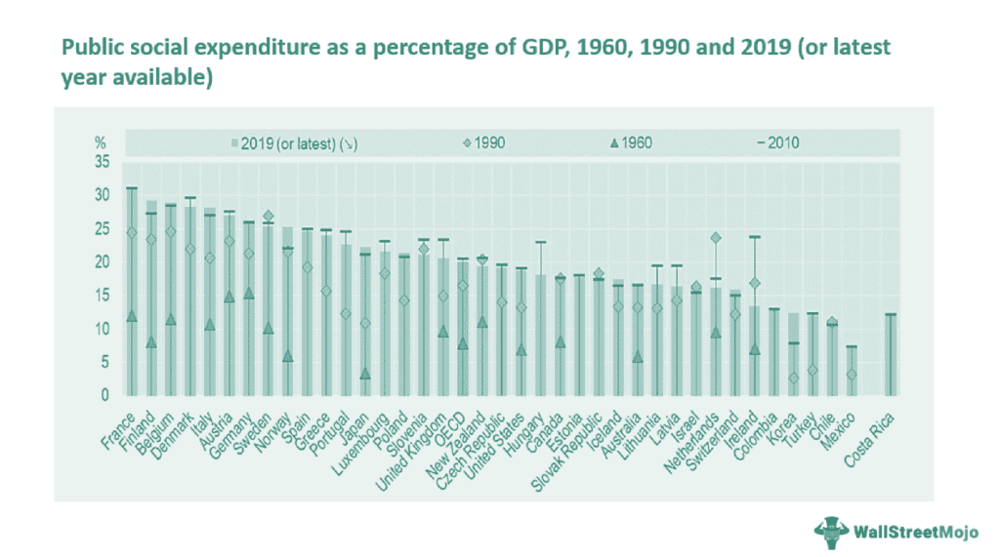

The intersection of government services, public assistance, and algorithmic trading brings about fascinating possibilities in the financial world. Algorithmic trading has revolutionized how trades are executed by leveraging speed and precision combined with sophisticated algorithms to automate processes and enhance decision-making. In recent years, advancements in technology have driven the expansion of algorithmic trading, enabling market participants to capitalize on small market fluctuations with extraordinary accuracy and in reduced time frames, resulting in more efficient market operations.

At the same time, government assistance programs can play a crucial role in supporting individuals and businesses as they enter or expand within the domain of algorithmic trading. By providing financial resources, educational opportunities, and infrastructure development supports, such programs help to lower entry barriers and foster a more inclusive trading environment. These initiatives can aid emerging traders and firms in acquiring necessary technological tools and skills to compete effectively within this evolving landscape.



This article explores the dynamics between government support and the enhancement of algorithmic trading capabilities. Understanding these dynamics is essential for traders who aim to leverage governmental resources to optimize their operations and strategies. By tapping into such opportunities, they can build a strong foundation, enabling them to thrive in an increasingly complex market environment characterized by rapid technological changes and expanding regulatory frameworks.

In summary, the synergy between government support and algorithmic trading presents unique opportunities for market participants to innovate while maintaining compliance and operational efficiency. This cooperation ultimately contributes to increased market stability and enhanced financial market performance.

## Table of Contents

## Understanding Bureau Government Services

Government bureaus are designed to offer a suite of essential services that are fundamental to maintaining economic stability and providing crucial support across various sectors. These services encompass a broad range of programs, including unemployment benefits, food assistance, housing support, and tax relief. Each of these programs plays a central role in sustaining individuals and families, especially during periods of economic uncertainty.

For individuals involved in algorithmic trading, these government programs offer particularly valuable resources. Technology acquisition, for instance, is a critical aspect of algorithmic trading, which relies heavily on sophisticated hardware and software to execute trades with precision and speed. Government programs can provide financial aid aimed at technology enhancement, allowing traders to procure necessary infrastructure without incurring prohibitive costs.

Professional development and training are other areas where government services can significantly impact traders. Many government initiatives focus on upskilling individuals, making them more competitive in their respective fields. Traders can benefit from subsidies or grants for courses in quantitative finance, data analysis, or coding. Such educational opportunities enable traders to enhance their strategic capabilities and refine their trading algorithms.

The utilization of these government services presents a substantial opportunity for enhancing [algorithmic trading](/wiki/algorithmic-trading) capacities. By tapping into the available assistance, traders can improve their operational efficiencies and better manage their resources. This advantage ensures that even those with limited initial capital can participate effectively in the financial markets through algorithmic trading, leveling the playing field to some extent.

Overall, the intersection of government assistance and algorithmic trading underscores the potential for public services to contribute meaningfully to individual and economic progress. By leveraging these resources, traders can better navigate the complexities of financial markets, ultimately fostering a more inclusive and dynamic trading environment.

## Public Assistance Programs for Financial Advancements

Public assistance programs play a pivotal role in maintaining financial stability and fostering growth, particularly in economically vulnerable communities. Such programs are not merely safety nets during economic downturns but also serve as launchpads for financial advancement. Programs like Unemployment Insurance (UI) and Temporary Assistance for Needy Families (TANF) provide essential support during periods of financial upheaval, acting as vital buffers for individuals and families facing temporary setbacks. These initiatives ensure that the financial effects of unemployment and familial disruptions are mitigated, allowing recipients to focus on skills enhancement and securing future opportunities.

Educational grants and subsidies are significant components of public assistance aimed at promoting financial literacy and expertise in strategic fields. By funding access to specialized courses in financial engineering, market analysis, and trading strategies, these programs empower individuals to diversify their skill sets and embrace advanced career opportunities. For aspiring traders interested in algorithmic trading, the burgeoning area of automated financial strategies, educational programs offer an invaluable springboard. Such educational support often covers tuition and materials for courses that teach essential programming languages like Python, which is fundamental for developing trading algorithms. 

Furthermore, public assistance programs equip individuals with the skills necessary to succeed in algorithmic trading, an increasingly influential segment of the financial markets. These programs help bridge the gap between basic financial literacy and a more nuanced understanding of market dynamics and technological tools. By providing foundational and advanced training, these initiatives prepare participants for the complexities of trading environments characterized by rapid decision-making and data-driven strategies. Ultimately, these programs serve dual purposes: aiding those in financial distress and supplying the financial industry with a workforce capable of navigating and optimizing algorithm-driven trading systems.

## Algorithmic Trading and its Evolving Landscape

Algorithmic trading has revolutionized modern financial markets by automating and optimizing trading decisions, leading to significant shifts in how trading is conducted. At its core, algorithmic trading leverages complex algorithms to analyze vast datasets, identify trading opportunities, and execute trades at speeds and efficiencies unattainable by human traders alone.

The strategic advantage of algorithmic trading lies in its ability to capitalize on market efficiencies. By utilizing sophisticated mathematical models and computational techniques, algorithms can detect patterns and predict price movements with high precision. This entails the use of statistical methods to assess historical data, applying [machine learning](/wiki/machine-learning) to refine predictive accuracy, and optimizing execution strategies to minimize market impact. A typical algorithm may consider factors such as [volume](/wiki/volume-trading-strategy)-weighted average price (VWAP) or time-weighted average price (TWAP) to optimize trade execution.

One of the critical benefits of algorithmic trading is its capacity to minimize risks associated with human errors. Human traders may make decisions based on emotions or cognitive biases, whereas algorithms operate based on defined criteria and logic, ensuring a consistent and objective approach to trading. This objectivity reduces the likelihood of errors caused by fatigue, stress, or irrational decision-making.

Furthermore, the execution speed of algorithmic trading is unmatched. Algorithms can process information and place trades in fractions of a second, a necessity in high-frequency trading where timing is paramount. This rapid execution allows traders to take advantage of fleeting market signals and [arbitrage](/wiki/arbitrage) opportunities that require precise timing.

Technological advancements continuously propel the evolution of algorithmic trading. Innovations in hardware, such as faster processors and low-latency networking, enhance the speed at which algorithms operate. Concurrently, advances in [artificial intelligence](/wiki/ai-artificial-intelligence) and machine learning contribute to more sophisticated trading models capable of handling bigger data and adapting to changing market conditions. These developments ensure that algorithmic trading remains an essential tool for modern traders seeking a competitive edge.

Government programs play a significant role in supporting broader participation in algorithmic trading by facilitating access to technology and education. Initiatives that provide grants for technology acquisition help mitigate the high initial costs of setting up trading infrastructure, making it more accessible to a wider range of traders. Educational programs support the development of skills in data science, financial engineering, and programming, equipping traders with the expertise needed to design and implement effective trading algorithms. By fostering an environment conducive to technological and educational growth, government interventions contribute significantly to the inclusive evolution of algorithmic trading in financial markets.

## Grant Programs and Educational Opportunities

Grants and educational programs play a crucial role in equipping traders with the resources necessary to succeed in algorithmic trading. Government initiatives often provide financial assistance to cover costs associated with technology acquisition, such as high-performance computing infrastructure and essential software tools. These tools are indispensable for processing large datasets and performing complex calculations required in algorithmic trading.

Moreover, financial support extends to educational programs and professional certifications. Traders can benefit from funding aimed at [course](/wiki/best-algorithmic-trading-courses) fees and certification costs, which are pivotal in enhancing their expertise in areas such as quantitative analysis, risk management, and algorithm design. For example, certification courses in financial engineering and [quantitative trading](/wiki/quantitative-trading) offer in-depth knowledge of statistical methods and financial markets, which are the foundation of developing robust algorithms.

Programming skills are essential for developing effective trading algorithms. Languages such as Python, known for its versatility and extensive libraries for data manipulation and analysis, are highly regarded in the field. Python libraries like NumPy and pandas allow for efficient data handling, while libraries such as SciPy and scikit-learn provide tools for implementing advanced statistical and machine learning models.

An example of a simple trading strategy implemented in Python might look as follows:

```python
import numpy as np
import pandas as pd
from sklearn.linear_model import LinearRegression

# Sample price data
prices = pd.DataFrame({
    'price': [100, 102, 105, 107, 110, 108, 109, 111, 115, 117]
})

# Calculate returns
prices['returns'] = prices['price'].pct_change()

# Simple moving average strategy
prices['SMA'] = prices['price'].rolling(window=3).mean()
prices['signal'] = np.where(prices['price'] > prices['SMA'], 1, 0)

# Strategy output
print(prices[['price', 'SMA', 'signal']])
```

This basic example demonstrates how traders can use programming to implement a simple moving average strategy. By integrating government-supported educational initiatives, traders can further refine such strategies, learning to optimize parameters and integrate machine learning techniques to enhance performance.

Ultimately, grants and educational opportunities not only reduce financial barriers but also facilitate traders' access to essential knowledge and technologies. This empowerment is key to successfully navigating the ever-evolving landscape of algorithmic trading, ensuring traders remain competitive and well-informed.

## Application Process for Government Assistance

Applying for government assistance in algorithmic trading involves a systematic approach to meet the requirements and gather the necessary documentation. Understanding these processes is critical for optimizing the likelihood of obtaining support.

Firstly, identifying the appropriate programs is essential. This involves researching various government offerings at both the federal and state levels. Resources such as the U.S. Small Business Administration (SBA) and the Department of Labor may provide relevant programs that assist with technology acquisition or educational subsidies relevant to algorithmic trading.

Once suitable programs are identified, the next step is the meticulous preparation of required documents. This usually includes personal identification, business registration (if applicable), and financial statements. These documents serve to verify eligibility and demonstrate the need for assistance.

Filling out application forms accurately is crucial. Applicants should pay attention to detail and ensure that all fields are completed with precise and factual information. Mistakes or omissions can delay the process or result in denial. It is often helpful to use checklists to track the completion of each section of an application form.

Submitting applications through the appropriate channels is the final step. This could involve online submissions through government portals or physical delivery to a relevant office. It's beneficial to submit applications as early as possible to account for processing times and to follow up if the process allows.

Navigating both federal and state systems can pose challenges due to differing requirements and resources. Individuals should familiarize themselves with the specific processes and deadlines of each program. Utilizing governmental websites or seeking advice from financial advisors can simplify this navigation.

Persistence is key in the application process. Staying informed about policy changes and new program offerings can significantly impact the success of securing assistance. Regularly checking government websites and subscribing to updates from relevant agencies can provide valuable information.

Ultimately, the strategic approach to applying for government assistance can lead to enhanced capabilities in algorithmic trading, allowing applicants to leverage these resources effectively.

## Future Perspectives: Algorithmic Trading with Government Support

The future growth of algorithmic trading is closely intertwined with sustained government support and innovative programs. As financial markets continue to evolve, government initiatives such as technology grants, shared data platforms, and educational programming are pivotal in driving innovation within trading practices. These initiatives not only support the integration and development of advanced technologies but also play a critical role in enhancing market efficiency and stability.

Technology grants are one of the primary mechanisms by which governments can encourage innovation in algorithmic trading. These grants often provide crucial funding for the adoption of cutting-edge technologies and infrastructure necessary for sophisticated trading algorithms. By lowering the financial barriers to acquiring advanced computational resources and software, governments enable a wider range of participants to engage in algorithmic trading, fostering a more competitive and innovative trading environment.

In addition to financial support, shared data platforms represent a significant government initiative aimed at boosting trading innovation. By facilitating access to high-quality, anonymized market data, these platforms empower traders to develop and test more effective algorithms. The availability of reliable data is fundamental for the application of machine learning techniques and quantitative analysis, allowing traders to refine their strategies and improve decision-making accuracy.

Educational programming also plays a vital role in sustaining the growth of algorithmic trading. Government-backed educational initiatives can enhance the skills of current and aspiring traders through specialized courses and certifications in areas such as quantitative finance, programming, and data science. These programs ensure that traders are well-equipped to navigate the complexities of modern financial markets and leverage new technologies effectively. For example, proficiency in programming languages like Python is increasingly necessary for designing and optimizing trading algorithms. 

Moreover, government-backed programs are essential for the development of robust monitoring frameworks that ensure ethical and law-abiding trading practices. As algorithmic trading becomes more prevalent, concerns about its potential impact on market stability and fairness have intensified. Governments can play a proactive role in addressing these concerns by supporting research into the ethical implications of algorithmic trading and establishing regulatory frameworks that promote transparency and accountability.

In conclusion, the synergy between government support and algorithmic trading innovation is crucial for the advancement of more efficient and resilient financial markets. By offering technology grants, facilitating access to data, and investing in education, governments can significantly contribute to the evolution of algorithmic trading, ultimately benefiting market participants and enhancing overall economic stability.

## Conclusion

Government assistance programs play a significant role in advancing the field of algorithmic trading by furnishing the necessary resources. These programs provide financial support and educational opportunities that are crucial for acquiring advanced trading skills. Financial backing helps traders access cutting-edge technology and platforms, fostering an environment where traders can develop and refine sophisticated trading algorithms.

By engaging with the available opportunities, traders can strategically position themselves to capitalize on the dynamic nature of the markets and evolving technologies. Access to comprehensive educational programs allows traders to enhance their understanding of quantitative analysis, risk management, and algorithm design, thereby improving their trading strategies.

Remaining informed and proactive about government support enhances trading performance and career success. By identifying and utilizing suitable assistance programs, traders can more effectively manage trading operations, reduce risk exposure, and increase profitability. This proactive engagement also ensures that traders stay abreast of the latest market trends and regulatory developments, positioning them favorably in an increasingly competitive landscape.

## References & Further Reading

Bergstra, J., Bardenet, R., Bengio, Y., & Kégl, B. (2011). 'Algorithms for Hyper-Parameter Optimization.' This paper is essential for understanding the methods involved in optimizing algorithmic functions, which can significantly enhance trading algorithms' efficiency and effectiveness.

'Advances in Financial Machine Learning' by Marcos Lopez de Prado provides a comprehensive guide to applying machine learning techniques in financial markets, focusing on algorithmic trading and risk management. It covers various methods for improving prediction accuracy and minimizing losses, making it a critical resource for those interested in leveraging machine learning in trading.

'Evidence-Based Technical Analysis' by David Aronson challenges traditional technical analysis approaches by introducing a scientific method that includes hypothesis testing and rigorous data analysis, providing traders with tools to validate and refine their trading strategies.

'Machine Learning for Algorithmic Trading' by Stefan Jansen serves as a practical guide for building predictive models to execute trades automatically. It also covers the integration of various machine learning techniques to create robust trading strategies.

'Quantitative Trading: How to Build Your Own Algorithmic Trading Business' by Ernest P. Chan offers insights into creating successful trading algorithms. It covers the practical aspects of setting up an algorithmic trading business, discussing strategy formulation, backtesting, and performance evaluation.

