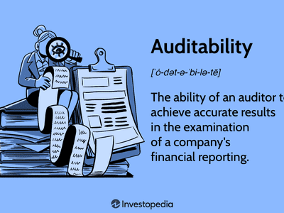

In today's rapidly evolving financial landscape, the roles of auditing and oversight are indispensable in ensuring the transparency and integrity of financial operations. With markets becoming increasingly complex, the need for structured and robust systems to monitor and evaluate financial reporting and transactions has never been greater. Such mechanisms are vital for maintaining the trust of investors and the general public, who rely on accurate and truthful representations of company finances to make informed decisions.

A key institution in this arena is the Public Company Accounting Oversight Board (PCAOB), an organization that plays a significant role in overseeing the audits of public companies. Established in response to several high-profile accounting scandals, the PCAOB serves as a cornerstone of financial oversight, aiming to prevent fraudulent activities and promote accuracy and fairness in corporate financial reporting.

The origin of the PCAOB is closely tied to events of the late 1990s and early 2000s, a period marked by notorious corporate financial misrepresentations. These incidents underscored the pressing need for independent regulatory bodies dedicated to auditing oversight and laid the groundwork for establishing the PCAOB under the Sarbanes-Oxley Act of 2002.

While the PCAOB's primary function is to enhance the reliability of financial audits, its influence extends beyond traditional audit practices. The evolving nature of financial markets has given rise to algorithmic trading, a technological advancement that significantly impacts trading dynamics and company performance. Algorithmic trading introduces complexities that necessitate rigorous auditing standards and proactive oversight to manage associated risks effectively and ensure market stability.

The interconnectedness of auditing oversight and advanced trading technologies highlights the ongoing challenges faced by regulatory bodies like the PCAOB. By adapting to these changes, the PCAOB and similar institutions continue to safeguard investor interests and uphold the integrity of the financial system, fostering an environment conducive to transparency and economic growth.

## Table of Contents

## The Birth of the PCAOB

The establishment of the Public Company Accounting Oversight Board (PCAOB) was a pivotal response to a series of high-profile accounting scandals that emerged in the late 1990s and early 2000s. Notably, the collapses of Enron and WorldCom exposed significant deficiencies in financial reporting and auditing processes, leading to a crisis of confidence among investors and stakeholders.

In response to these events, the United States Congress enacted the Sarbanes-Oxley Act of 2002, known colloquially as SOX. This landmark legislation aimed to restore public trust in the financial markets by implementing comprehensive reforms to enhance corporate governance and accountability. A key provision of SOX was the creation of the PCAOB, an independent organization tasked with overseeing the audits of public companies. Its mission was explicitly defined: to protect investors by improving the accuracy and reliability of corporate disclosures made pursuant to federal securities laws.

The formation of the PCAOB marked a significant departure from previous audit oversight mechanisms. Prior to its inception, the auditing profession had largely been self-regulated, with minimal external checks and balances. The PCAOB introduced a new era of external, independent oversight, establishing itself as the first entity of its kind with the authority to regulate auditors of public companies in the United States.

Operating under the oversight of the U.S. Securities and Exchange Commission (SEC), the PCAOB was endowed with the power to set auditing standards, conduct inspections of registered audit firms, and enforce compliance through disciplinary proceedings. By addressing gaps in the auditing process and ensuring adherence to stringent standards, the PCAOB aimed to minimize audit risk and enhance the quality of financial reporting.

The establishment of the PCAOB has had far-reaching implications for the auditing profession and financial markets. By providing a framework for accountability, the PCAOB has contributed to safeguarding investor interests, reinforcing the integrity of financial statements, and fostering transparency and trust within the financial ecosystem.

## PCAOB's Role and Impact

The Public Company Accounting Oversight Board (PCAOB) plays a critical role in the financial markets by regulating the audits of public companies and SEC-registered brokers and dealers. It aims to minimize audit risk, thereby enhancing the trust and integrity of financial reporting. Established under the Sarbanes-Oxley Act of 2002, the PCAOB was introduced to address the deficiencies highlighted by high-profile accounting scandals, such as those involving Enron and WorldCom. 

The PCAOB sets auditing standards that audit firms must adhere to, ensuring consistency and rigor in the auditing process. These standards cover a wide range of practices, from the planning and execution of audits to the evaluation of audit results. By maintaining these standards, the PCAOB ensures that audits are conducted with a high degree of accuracy and reliability.

Conducting periodic inspections of audit firms is another critical function of the PCAOB. These inspections serve to evaluate the compliance of audit firms with established auditing standards and their own quality control policies. Firms found lacking may face disciplinary actions, which could include fines or revocation of their registration. This rigorous oversight compels audit firms to maintain high-quality practices, thereby minimizing risks associated with financial misreporting.

The decisions and actions of the PCAOB have profound implications for public trust in the financial markets. By enforcing stringent auditing standards and ensuring compliance through inspections, the PCAOB fortifies the reliability of financial information presented to investors. Public companies rely on this trust to secure investment and maintain a positive reputation in the financial markets. Consequently, the PCAOB's role is not merely regulatory but foundational to the health of the financial ecosystem. 

In conclusion, the PCAOB's stringent guidelines and active oversight create a robust framework that protects investor interests and promotes transparency and integrity in the financial markets. As the financial landscape evolves, with new challenges and opportunities, the role of the PCAOB remains essential in safeguarding the accuracy and reliability of financial reporting.

## A Closer Look at PCAOB's Advisory Groups

The Public Company Accounting Oversight Board (PCAOB) operates with the support of two key advisory groups: the Standing Advisory Group (SAG) and the Investor Advisory Group (IAG). These groups play a vital role in providing ongoing advice and perspective to the PCAOB on various audit-related matters, helping to ensure that audit standards and practices remain relevant and efficient in a constantly changing financial environment.

The Standing Advisory Group is composed of experts and stakeholders from different sectors, including auditors, investors, public companies, and academia. Its primary function is to advise the PCAOB on the development and implementation of auditing and related professional practice standards. The SAG offers a breadth of perspectives that enrich the PCAOB's regulatory activities. By engaging with this diverse group, the PCAOB can better understand the implications of potential standards on all aspects of the audit and financial reporting ecosystem.

Similarly, the Investor Advisory Group consists of individuals and organizations with significant experience and expertise in the investment community. The IAG's role is to provide the PCAOB with investor perspectives on the effectiveness of PCAOB's programs and initiatives. The insights offered by the IAG are crucial as they help ensure that the interests of investors, who are the primary beneficiaries of high-quality audits, are prioritized in the PCAOB's regulatory agenda.

Both the SAG and IAG are instrumental in identifying emerging issues and technological advancements that could affect the auditing profession. For example, as new technologies like blockchain and [artificial intelligence](/wiki/ai-artificial-intelligence) become increasingly integrated into business processes, these advisory groups can help the PCAOB assess the impact on audit standards and practices. They can also provide feedback on how these technologies might be used to enhance audit quality and efficiency.

The collaborative efforts of the SAG and IAG help shape the PCAOB's strategic initiatives by ensuring that diverse perspectives are considered in the decision-making process. This collaboration ultimately enhances transparency in auditing practices, fostering greater confidence among stakeholders in the integrity of financial information. Through the support of these advisory groups, the PCAOB is better positioned to adapt to new challenges and continue fulfilling its mission of overseeing the audits of public companies to protect investors and promote the public interest.

## Historical Challenges and Reforms

The Public Company Accounting Oversight Board (PCAOB) has undergone various challenges and reforms since its inception, aimed at enhancing its regulatory framework to meet the evolving demands of the financial landscape. One of the earliest and significant challenges faced by the PCAOB was constitutional scrutiny, questioning its structural composition and the extent of its regulatory authority. This scrutiny stemmed from the 2010 Supreme Court case *Free Enterprise Fund v. Public Company Accounting Oversight Board*, which contested the method of appointment and removal of PCAOB members. The Court ultimately held that the PCAOB's structure violated the separation of powers principle, leading Congress to amend the Sarbanes-Oxley Act to increase presidential accountability over the Board's operations. This clarification reinforced the PCAOB's operational legitimacy while maintaining its fundamental regulatory mission.

The necessity for rigorous audit oversight became evident through historical corporate scandals, notably Enron and WorldCom. These cases underscored the detrimental impact of deficient auditing practices on investor trust and market stability, prompting the legislative establishment of the PCAOB in 2002. The extensive fraudulent activities uncovered in these scandals highlighted the importance of strict auditing standards and robust inspection mechanisms in preventing financial misreporting.

In the face of a dynamic financial environment and accelerating technological advancements, the PCAOB has continually updated its regulations and practices. Recent reforms have included enhancing the Auditor Reporting Model to improve the informational content of audit reports. This model requires auditors to communicate critical audit matters (CAMs), which aids investors in understanding the most significant judgments made during the audit process. Furthermore, the PCAOB has adapted its inspection processes to address the complexities introduced by technological innovations, such as cybersecurity risks and data analytics in auditing. This includes increasing emphasis on the role of technology in auditing and preparing auditors for the challenges posed by digital transformation.

Moreover, the PCAOB's efforts are exemplified by its issuance of guidance on emerging technologies and the integration of data analytics into audit work. This strategic focus ensures that auditors are better equipped to tackle challenges associated with digital audits, thus safeguarding the quality and reliability of financial reporting.

These historical challenges and subsequent reforms underscore the PCAOB's commitment to refining its regulatory strategies to protect investors and uphold the integrity of the financial markets. The agency continues to evolve, balancing the need for stringent oversight while accommodating the rapid technological changes characterizing modern financial ecosystems.

## Impact of Algorithmic Trading on Public Companies

Algorithmic trading, which employs automated and pre-programmed trading instructions, has significantly transformed the landscape of financial markets, offering enhanced speed and accuracy in trade execution. This technologically driven trading practice encompasses a wide array of strategies, ranging from high-frequency trading to complex [arbitrage](/wiki/arbitrage), all designed to exploit market inefficiencies.

The integration of [algorithmic trading](/wiki/algorithmic-trading) in public companies presents both challenges and opportunities, particularly when considering regulatory oversight. The Public Company Accounting Oversight Board (PCAOB) plays a critical role in ensuring that the audits of public companies accurately reflect the complexities introduced by algorithmic trading strategies. One of the primary challenges is ensuring that firms comply with robust auditing standards while navigating the volatile nature of automated trading systems.

Algorithmic trading systems often generate voluminous data due to their rapid transaction capabilities. This data generation necessitates stringent data management and accurate reporting to meet auditing requirements. The PCAOB's oversight ensures that these systems are subject to rigorous audits to verify the integrity and reliability of the financial information reported by companies engaging in algorithmic trading.

Moreover, algorithmic trading strategies often rely on historical data and predictive models to make trading decisions. These models must be regularly validated and tested to avoid significant financial discrepancies that could mislead investors. The PCAOB's role includes scrutinizing these models during audits to ensure they adhere to accounting standards and accurately represent financial positions.

Furthermore, the advent of algorithmic trading has introduced systemic risk considerations, given the technology's ability to move markets swiftly. The PCAOB's influence in this context is critical to maintaining market stability. By enforcing comprehensive audit practices, the PCAOB helps in identifying potential risk exposures and ensures that companies have adequate risk management frameworks in place.

In essence, understanding the intersection of PCAOB oversight and algorithmic trading is pivotal not only for public companies seeking compliance but also for safeguarding investor interests in increasingly automated financial markets. This oversight ensures that algorithmic trading's benefits are realized without compromising the transparency and integrity of financial reporting.

## Conclusion

The Public Company Accounting Oversight Board (PCAOB) plays a crucial role in reinforcing transparency and trust within financial markets. This capacity is particularly important given the rapid evolution of algorithmic trading, which presents both opportunities and complexities in market operations. The swift decision-making and execution capabilities characteristic of algorithmic trading necessitate a robust framework of auditing standards to ensure that these technologies operate fairly and without manipulation, thereby maintaining market integrity.

As algorithmic trading systems continue to advance with emerging technologies such as artificial intelligence and [machine learning](/wiki/machine-learning), the need for comprehensive oversight by entities like the PCAOB becomes increasingly evident. The PCAOB's stringent auditing standards and oversight procedures serve as an essential safeguard against financial inaccuracies and fraudulent activities that could undermine market confidence. By scrutinizing the audits of public companies and their trading strategies, the PCAOB helps ensure that these advancements contribute positively to market mechanisms rather than detract from them.

Ultimately, the harmonious integration of PCAOB's oversight with modern trading practices underpins a secure and efficient financial ecosystem. This equilibrium is vital for investor confidence and the overall stability of financial markets, reinforcing the PCAOB's role as a cornerstone in the architecture of contemporary finance.

## References & Further Reading

[1]: Byrnes, N., & McNamee, M. (2002). [“The Rise and Fall of Enron.”](https://www.journalofaccountancy.com/issues/2002/apr/theriseandfallofenron.html) Bloomberg Businessweek.

[2]: Coffee, Jr., J. C. (2005). ["A Theory of Corporate Scandals: Why the U.S. and Europe Differ."](https://papers.ssrn.com/sol3/papers.cfm?abstract_id=694581) Oxford Review of Economic Policy.

[3]: Lehman, T. (2020). ["The Role of the PCAOB in Auditing Standards and Investor Protection."](https://pcaobus.org/news-events/speeches/speech-detail/a-return-to-roots-the-auditor-s-role-in-uncovering-and-reporting-illegal-acts) U.S. Securities and Exchange Commission.

[4]: Carcello, J. V. (2005). ["Public Company Accounting Oversight Board: Consumer Protection in the Public Interest."](https://scholar.google.com/citations?user=ec7DkZEAAAAJ&hl=en) Accounting Horizons, 19(1), 69-84.

[5]: Kirkpatrick, G., & Laurin, A. (2020). ["Algorithmic Trading in Financial Markets: A Comprehensive Survey."](https://www.researchgate.net/publication/369972325_Kirkpatrick_Model_and_Training_Effectiveness_A_Meta-Analysis_1982_To_2021) OECD Journal: Financial Market Trends.