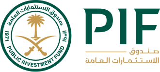

## Table of Contents

## What is the Public Investment Fund of Saudi Arabia?

The Public Investment Fund (PIF) of Saudi Arabia is a big organization that manages money for the country. It was started in 1971 and is owned by the government of Saudi Arabia. The main job of the PIF is to invest money in different things like companies, real estate, and other funds to help grow the country's economy and make more money for the future.

The PIF is very important for Saudi Arabia's plan to change and grow its economy. It helps the country move away from just selling oil and start making money from other things. The PIF invests in many different places around the world, not just in Saudi Arabia. This helps spread the risk and can bring more money back to the country.

## When was the Public Investment Fund established?

The Public Investment Fund (PIF) of Saudi Arabia was set up in 1971. It is owned by the Saudi government and its main job is to manage money for the country.

The PIF helps Saudi Arabia's economy grow by investing in different things like companies and real estate. It is a key part of the country's plan to make money from things other than just oil.

## What is the primary purpose of the Public Investment Fund?

The main goal of the Public Investment Fund (PIF) of Saudi Arabia is to manage the country's money and invest it to make more money. It was started in 1971 and is owned by the Saudi government. The PIF puts money into different things like businesses, real estate, and other funds to help grow Saudi Arabia's economy.

The PIF is very important for Saudi Arabia's plan to change its economy. It helps the country move away from depending only on oil and start [earning](/wiki/earning-announcement) money from other sources. By investing in many different places around the world, the PIF helps spread the risk and can bring more money back to Saudi Arabia.

## How is the Public Investment Fund governed?

The Public Investment Fund (PIF) of Saudi Arabia is governed by a board of directors. This board is made up of important people from the government and other experts. The board makes big decisions about where to invest the money and how to manage it. The Crown Prince of Saudi Arabia, Mohammed bin Salman, is the chairman of the board. This shows how important the PIF is to the country's plans.

The day-to-day work of the PIF is handled by its management team. They follow the rules and plans set by the board of directors. The management team looks after the investments and makes sure they are doing well. They also keep an eye on the world economy to find good opportunities for the PIF to invest in. This helps the PIF grow and help Saudi Arabia's economy.

## What are some of the major sectors the Public Investment Fund invests in?

The Public Investment Fund (PIF) of Saudi Arabia invests in many different areas to help grow the country's economy. Some of the big sectors it focuses on are technology, health care, and real estate. For example, the PIF has put money into companies like Uber and SoftBank's Vision Fund to help with technology. It also invests in health care companies to make sure people can get good medical services. Real estate is another big area, where the PIF buys and develops properties to make money and improve cities.

Another important sector for the PIF is renewable energy. Saudi Arabia wants to move away from just using oil, so the PIF invests in things like solar and wind power. This helps the environment and also creates new jobs. The PIF also looks at sports and entertainment, like when it bought Newcastle United football club. This shows how the PIF is trying to make Saudi Arabia's economy more diverse and strong by investing in many different kinds of businesses.

## Can you list some significant investments made by the Public Investment Fund?

The Public Investment Fund (PIF) of Saudi Arabia has made many big investments to help grow the country's economy. One big investment is in technology. The PIF put money into Uber, which is a company that helps people get rides easily. They also invested in SoftBank's Vision Fund, which focuses on new technology companies. Another big sector is health care. The PIF has invested in companies that help people get good medical services. This shows how the PIF is trying to make Saudi Arabia's economy stronger by investing in different areas.

Real estate is another important area for the PIF. They buy and develop properties to make money and improve cities. For example, the PIF is working on big projects like Neom, a new city in Saudi Arabia that will be powered by renewable energy. Speaking of renewable energy, the PIF also invests in solar and wind power to help the environment and create new jobs. This is part of Saudi Arabia's plan to move away from just using oil.

The PIF also looks at sports and entertainment. They bought Newcastle United football club, which is a big deal in the world of sports. This shows how the PIF is trying to make Saudi Arabia's economy more diverse by investing in many different kinds of businesses. All these investments help the PIF grow and help Saudi Arabia's economy become stronger and more varied.

## How does the Public Investment Fund contribute to Saudi Arabia's Vision 2030?

The Public Investment Fund (PIF) is very important for Saudi Arabia's Vision 2030. Vision 2030 is a big plan to change and grow Saudi Arabia's economy. The PIF helps by investing money in different areas to make the economy stronger and less dependent on oil. For example, the PIF puts money into new technology companies, like Uber and SoftBank's Vision Fund. This helps bring new jobs and ideas to Saudi Arabia. The PIF also invests in health care to make sure people can get good medical services. All these investments help make the economy more diverse and strong.

Another way the PIF helps with Vision 2030 is by investing in big projects like Neom. Neom is a new city that will use renewable energy like solar and wind power. This is part of Saudi Arabia's plan to move away from oil and help the environment. The PIF also looks at sports and entertainment, like when they bought Newcastle United football club. These investments show how the PIF is trying to make Saudi Arabia's economy more varied. By spreading money into different sectors, the PIF helps make Vision 2030 a success and builds a better future for Saudi Arabia.

## What is the financial performance of the Public Investment Fund in recent years?

In recent years, the Public Investment Fund (PIF) of Saudi Arabia has been doing well financially. The PIF has been growing its money by investing in many different things around the world. For example, in 2022, the PIF's assets were worth about $620 billion. This is a big increase from $400 billion in 2020. The PIF makes money from its investments in companies like Uber and SoftBank's Vision Fund, as well as from real estate and renewable energy projects.

The PIF's financial performance is important for Saudi Arabia's Vision 2030 plan. The plan wants to make the country's economy stronger and less dependent on oil. The PIF helps by making smart investments that bring in more money and create new jobs. Even though the PIF's investments can go up and down with the world economy, it has been doing a good job of growing its money and helping Saudi Arabia's economy become more diverse and strong.

## How does the Public Investment Fund manage risk in its investment portfolio?

The Public Investment Fund (PIF) of Saudi Arabia manages risk in its investment portfolio by spreading its money across many different types of investments. This is called diversification. Instead of putting all its money into one thing, the PIF invests in technology, health care, real estate, renewable energy, and even sports and entertainment. By doing this, if one investment does not do well, the PIF can still make money from other investments. This helps protect the PIF's money and makes it less likely to lose a lot if something goes wrong.

The PIF also uses smart strategies to manage risk. They have a team of experts who watch the world economy and look for good opportunities to invest in. These experts also keep an eye on the PIF's investments to make sure they are doing well. If they see a problem, they can make changes to the investments to lower the risk. The PIF's board of directors, led by the Crown Prince, makes big decisions about where to invest and how to manage the money. This careful planning and watching helps the PIF grow its money while keeping risks under control.

## What are the international investment strategies of the Public Investment Fund?

The Public Investment Fund (PIF) of Saudi Arabia has a big plan for investing money in other countries. They want to spread their money around the world to make it safer and to find new ways to grow. The PIF looks for good opportunities in places like the United States, Europe, and Asia. They invest in big companies like Uber and SoftBank's Vision Fund, which helps them learn about new technology and make money from it. By putting money into different countries, the PIF can help Saudi Arabia's economy grow and become less dependent on oil.

The PIF also works with other big investors and governments around the world. They team up to invest in big projects like renewable energy and real estate. This helps the PIF share the risk and learn from other people's experiences. The PIF's experts watch the world economy closely to find the best places to invest. They make sure the PIF's money is safe and growing by always looking for new opportunities and being careful about risks. This way, the PIF can keep making money and help Saudi Arabia's Vision 2030 plan succeed.

## How does the Public Investment Fund impact the global economy?

The Public Investment Fund (PIF) of Saudi Arabia has a big impact on the global economy because it invests a lot of money in different countries and industries. When the PIF puts money into big companies like Uber and SoftBank's Vision Fund, it helps these companies grow and create new jobs. This can make the economies of the countries where these companies are based stronger. The PIF also invests in things like real estate and renewable energy in many parts of the world. By doing this, the PIF helps build new buildings and create clean energy, which can make cities better places to live and work.

The PIF's investments can also change how money moves around the world. When the PIF buys a big company or starts a new project, it can make other investors want to put their money into the same things. This can lead to more money flowing into certain industries or countries. The PIF's focus on making Saudi Arabia's economy less dependent on oil also helps the global economy by pushing for more renewable energy and new technology. This can make the world's economy more diverse and strong, and help fight problems like climate change.

## What future projects or initiatives are planned by the Public Investment Fund?

The Public Investment Fund (PIF) of Saudi Arabia has many exciting plans for the future. One big project is called Neom, which is a new city that will use renewable energy like solar and wind power. Neom will be a place where people can live, work, and enjoy new technology. The PIF is also working on other big projects to help Saudi Arabia's economy grow and become less dependent on oil. They want to invest in more health care and technology companies to make sure people can get good medical services and use new technology.

Another important plan for the PIF is to keep investing in different parts of the world. They want to put money into companies in the United States, Europe, and Asia to find new ways to make money and create jobs. The PIF will also look for more opportunities in sports and entertainment, like when they bought Newcastle United football club. By doing all these things, the PIF hopes to help Saudi Arabia's Vision 2030 plan succeed and make the country's economy stronger and more diverse.

## References & Further Reading

[1]: Kamiya, S., Kelly, P., & Shinomiya, T. (2016). ["Quantitative Trading: Harnessing Technical Indicators."](https://pmc.ncbi.nlm.nih.gov/articles/PMC8389408/) The Journal of Statistical Software, 74, 1–18.

[2]: Bohme, R., & O'Hara, M. (2020). ["Risks and Regulation in the Cryptocurrency Markets."](https://link.springer.com/chapter/10.1007/978-981-97-2671-4_10) National Bureau of Economic Research. doi: 10.3386/w25353

[3]: Kearns, M., & Nevmyvaka, Y. (2013). ["Machine Learning for Market Microstructure and High Frequency Trading."](https://www.cis.upenn.edu/~mkearns/papers/KearnsNevmyvakaHFTRiskBooks.pdf) Algorithmic Trading and DMA. Springer.

[4]: Derman, E. (2004). ["My Life as a Quant: Reflections on Physics and Finance."](https://archive.org/details/mylifeasquantref0000derm) Wiley.

[5]: Alden, E. (2019). ["Saudi Vision 2030 - An Insight into Saudi Arabia’s Vision for a New Era."](https://www.vision2030.gov.sa/en/overview) Council on Foreign Relations.